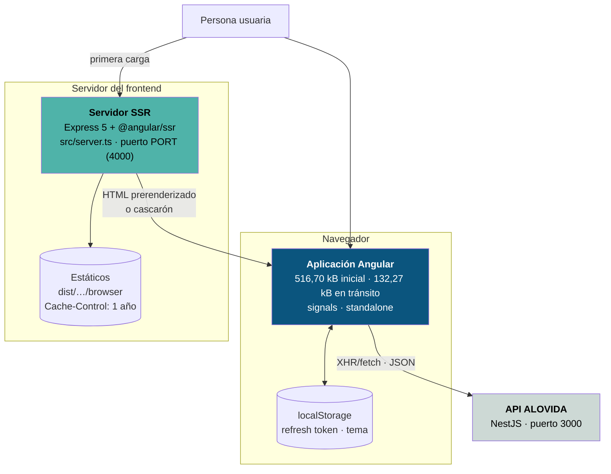

# Contenedores (C4 · nivel 2)

Las piezas desplegables y en ejecución de este repositorio, y cómo se hablan.



## Los contenedores, uno por uno

### 1 · Aplicación Angular (navegador)

| Propiedad | Valor |
|---|---|
| Tecnología | Angular 21.2, TypeScript 5.9 estricto |
| Arranque | `src/main.ts` → `bootstrapApplication(App, appConfig)` |
| Tamaño inicial | 516,70 kB crudo · 132,27 kB estimado en tránsito |
| Fragmentos diferidos | `design-system-sample` (181,73 kB), `toast-dev-panel` (2,98 kB) |
| Estado | Señales en servicios `providedIn: 'root'` |
| Persistencia | `localStorage`: refresh token y preferencia de tema. Nada más |

Sus proveedores (`app.config.ts`) son cinco y cada uno tiene un motivo escrito:

```ts
provideBrowserGlobalErrorListeners()                    // errores globales
provideRouter(routes)
provideClientHydration(withEventReplay())               // reproduce clics previos a hidratar
provideHttpClient(withFetch(), withInterceptors([authInterceptor]))
provideAppInitializer(() => inject(ThemeService))       // el tema no espera a un componente
provideAppInitializer(() => inject(AuthService).restoreSession())
```

`withFetch()` **no es opcional bajo SSR**: sin él el cliente usa XHR, que en el
servidor obliga a un reemplazo y rompe la transferencia de estado.

El segundo `provideAppInitializer` es el que evita un parpadeo real: recupera la
sesión **antes** de que el router evalúe el guard. Sin esa espera, alguien con
sesión válida vería el login mientras el canje del refresh token está en vuelo.

### 2 · Servidor SSR (Node)

| Propiedad | Valor |
|---|---|
| Tecnología | Express 5 + `@angular/ssr/node` |
| Entrada | `src/server.ts` |
| Puerto | `process.env.PORT` o 4000 |
| Orden de ejecución | `yarn serve:ssr:mantra-core-health` |
| Endpoints propios | **Ninguno.** El bloque de ejemplo está comentado |

Hace exactamente dos cosas:

```ts
app.use(express.static(browserDistFolder, { maxAge: '1y', index: false, redirect: false }));
app.use((req, res, next) => angularApp.handle(req).then(…));
```

`index: false` es lo que impide que Express sirva `index.html` por su cuenta y
se salte el motor de Angular.

### 3 · Almacenamiento del navegador

| Clave | Contenido | Sensibilidad |
|---|---|---|
| `mantra.refresh-token` | Refresh token de la sesión | **Alta** |
| `mantra-core-health.theme` | `light` o `dark`. `system` se guarda como ausencia | Nula |

El **access token nunca se persiste**: dura minutos y se vuelve a obtener con el
otro, así que guardarlo sería exponer una credencial de más sin ganar nada.

Las tres clases que tocan el almacenamiento (`RefreshTokenStorage`,
`ThemeService` y el script de `index.html`) degradan sin romper si el navegador
lo bloquea. Ver [almacenamiento del navegador](../security/browser-storage.md).

### 4 · Contenedor de desarrollo

No es de producción. `Dockerfile.dev` + el servicio `dev` del
`docker-compose.yml` levantan el servidor de desarrollo con recargado en
caliente. Va bajo el perfil `dev`, así que hay que pedirlo —
`docker compose --profile dev up dev`—: sin perfil, `docker compose up` levanta
el servicio `web` de producción, que es lo que despliega Coolify.

```text
node:24-bookworm-slim          (Debian, no Alpine: esbuild/rolldown/lightningcss
                                publican binarios contra glibc)
corepack enable → yarn install --immutable   dentro de la imagen
CMD: sed BACKEND_ORIGIN → proxy.generated.json
     node scripts/generate-env.mjs
     ng serve --host 0.0.0.0 --port 4200 --poll 2000
```

Monta **solo** `src/`, `public/` y los `tsconfig`. Montar la raíz taparía el
`.pnp.cjs` de Linux con el del host.

## Lo que no hay

| Contenedor esperable | Estado |
|---|---|
| Imagen de producción | **No existe.** Solo `Dockerfile.dev`. Ver [despliegue](../operations/deployment.md) |
| CDN | No configurado |
| Reverse proxy / balanceador | No definido |
| Service worker | No existe |
| Base de datos propia del frontend | No, ni la necesita |

**La ausencia de una imagen de producción es la brecha operativa más grande del
proyecto.** Hay `yarn build` y hay `yarn serve:ssr:…`, pero no hay artefacto,
ni destino, ni pipeline. Está clasificada como `BLOCKER` en
[el análisis de brechas](../reports/documentation-gap-analysis.md).

## Comunicación entre contenedores

| Origen | Destino | Protocolo | Autenticación |
|---|---|---|---|
| Navegador | Servidor SSR | HTTPS | Ninguna |
| Navegador | API | HTTPS · JSON | `Authorization: Bearer` + `X-Tenant-Id` |
| Servidor SSR | API | — | **No habla con la API.** No tiene sesión que usar |
| Servidor de desarrollo | API | HTTP vía proxy | Pasa la del navegador |

Que el servidor SSR no hable con la API es una consecuencia directa de que la
sesión sea de navegador: no tiene credencial que presentar. Por eso todo lo que
tiene sesión se renderiza en el cliente.
