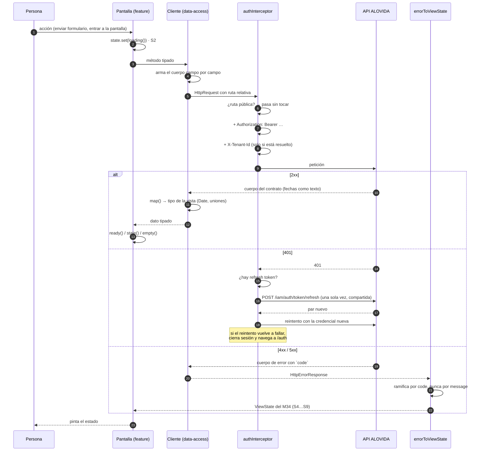
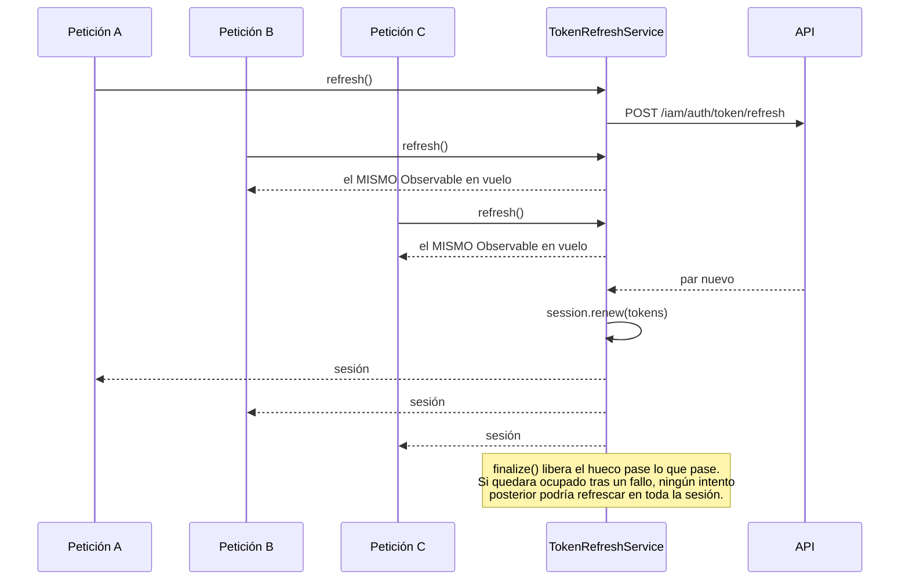

# Flujo de datos

Del clic a la API y de vuelta a la pantalla, con los cinco puntos donde el dato
se transforma.

---

## El camino completo



## Los cinco puntos de transformación

### 1 · La pantalla arma el modelo de la vista

`login.ts` decide si el identificador es correo o documento **por la arroba**,
que es la misma regla que usaría cualquiera al mirarlo:

```ts
return trimmed.includes('@')
  ? { kind: 'email', email: trimmed, password, ...mfa }
  : { kind: 'nationalId', nationalId: trimmed, password, ...mfa };
```

El tipo `LoginCredentials` es una **unión discriminada**, no un objeto con dos
opcionales, porque el backend exige uno u otro y nunca ambos. Con dos opcionales,
mandar los dos compilaría y fallaría recién contra el servidor.

### 2 · El cliente arma el cuerpo campo por campo

```ts
return this.http.post<RegisteredPatient>(this.url('/iam/auth/register-patient'), {
  nationalId: registration.nationalId,
  password: registration.password,
  displayName: registration.displayName,
  ...(registration.email === undefined ? {} : { email: registration.email }),
  …
});
```

Nunca se reenvía el objeto de la vista. **El backend valida con
`forbidNonWhitelisted`: un campo de más devuelve 400.** Y un opcional presente en
`undefined` viaja como clave declarada, así que se omite con el spread
condicional (o con `stripUndefined` en `ProfilesClient`).

### 3 · El interceptor pone las credenciales

```ts
return request.clone({
  setHeaders: {
    Authorization: `Bearer ${accessToken}`,
    ...(tenantId === null ? {} : { 'X-Tenant-Id': tenantId }),
  },
});
```

Antes comprueba si la ruta es pública. La lista está verificada una por una
contra `iam-auth.controller.ts` del backend:

```text
/iam/auth/login                    /iam/auth/verify-email
/iam/auth/token/refresh            /iam/auth/activate
/iam/auth/register-patient         cualquier ruta bajo /public/
/iam/auth/register-organization
/iam/auth/register-practitioner
```

Mandarles un `Authorization` no rompería nada, pero **intentar refrescar cuando
una de ellas responde 401 sí**: el 401 de un login son credenciales inválidas, y
reaccionar con un refresco sería un bucle contra el límite de 10 intentos por
minuto.

### 4 · El cliente traduce la respuesta al tipo de la vista

```ts
function toSession(body: TokenResponseBody): Session {
  return {
    accessToken: body.accessToken,
    refreshToken: body.refreshToken,
    expiresAt: new Date(body.expiresAt),   // ← texto ISO → Date
  };
}
```

Que la API mande una fecha como texto es asunto del transporte, no de la
pantalla. `ProfilesClient` generaliza la idea con un tipo `Wire<T>` que declara
las mismas respuestas con las fechas como texto.

### 5 · El error se traduce a un estado del M34

`errorToViewState` ramifica por `body.code`, **no por el estado HTTP ni por el
mensaje**:

| `code` de la API | Estado | Nota |
|---|---|---|
| `VALIDATION_FAILED` | S4 | Los mensajes por campo salen de `details.messages` |
| `CONFLICT` | S4 | |
| `CONCURRENCY_CONFLICT` | S4 | Mensaje propio: «alguien cambió esto mientras lo editabas» |
| `PRECONDITION_FAILED` | S4 | |
| `PAYLOAD_TOO_LARGE` | S4 | |
| `RATE_LIMITED` | S4 | Lee `Retry-After` y lo pasa como `retryAfterSeconds` |
| `FORBIDDEN` | S5 **sin acción** | El muro: no hay nada que la persona pueda hacer |
| `IDENTITY_VERIFICATION_REQUIRED` | S5 **con acción** | La puerta: lleva a verificar identidad |
| `NOT_FOUND` | S6 | **Descarta `message` y `details`** para no filtrar existencia |
| `DEPENDENCY_UNAVAILABLE` | S9 | Mensaje propio: «un servicio no está disponible» |
| `UNAUTHENTICATED`, `INTERNAL`, cualquier otro | S9 | |
| *(estado HTTP 0)* | S8 | Se resuelve **antes** de leer el cuerpo: no lo trae |
| *(cuerpo sin la forma del contrato)* | S9 | Un proxy, un balanceador, un 502 |

Dos códigos comparten el 403 y hay que separarlos, así que el estado HTTP no
alcanza. Y el mensaje está pensado para humanos: puede cambiar de redacción o de
idioma sin aviso.

## Las dos excepciones al mapeo compartido

### `Login` reinterpreta `UNAUTHENTICATED`

En cualquier otra pantalla significa que la sesión se venció, y el interceptor ya
la cerró. En el login significa que **las credenciales que la persona acaba de
escribir no sirven**, que es un mensaje distinto y accionable:

```ts
if (body?.code === 'UNAUTHENTICATED') {
  return validation([{ message: 'Las credenciales no son válidas.', code: body.code }]);
}
```

### `VerifyEmail` colapsa todos los fallos en uno

```ts
error: () => this.estado.set('invalido'),
```

El token venció, ya se usó o no existe: distinguirlos no le cambia nada a quien
está mirando la pantalla. Y verificar el correo **no desbloquea nada** —la cuenta
ya está activa desde el registro—, así que el mensaje ni siquiera es alarmante.

## El identificador de correlación

S9 exige un `requestId`, y sale del primero que exista:

```ts
body?.correlationId ?? error.headers.get('x-request-id') ?? 'sin-id'
```

Es lo único que conecta el reporte de una persona con los registros del servidor.
La pantalla lo muestra junto al mensaje. Ver
[correlación con el backend](../observability/tracing.md).

## Flujo del refresco de token



Sin esto, tres 401 simultáneos —lo normal al volver de una pestaña en segundo
plano— gastarían tres de los 20 intentos por minuto y rotarían el token unos
sobre otros: la última ganaría y las otras dos dejarían tokens muertos.

El estado vive en un servicio y no en el interceptor porque **las funciones
interceptoras se ejecutan por petición y no tienen dónde recordar nada**.

## Recuperación de sesión al arrancar

```ts
provideAppInitializer(() => inject(AuthService).restoreSession())
```

Corre **antes** de que el router evalúe el guard. Sin esa espera, alguien con
sesión válida vería un parpadeo al login mientras el canje está en vuelo.

En el servidor no hay almacenamiento, así que resuelve de inmediato sin pedir
nada. Y si el canje falla, el token guardado se descarta —para no reintentar en
cada arranque contra el límite de la API— y `restoreSession` devuelve `false`:
un refresh token vencido no es un error que mostrar, es simplemente no haber
iniciado sesión.
