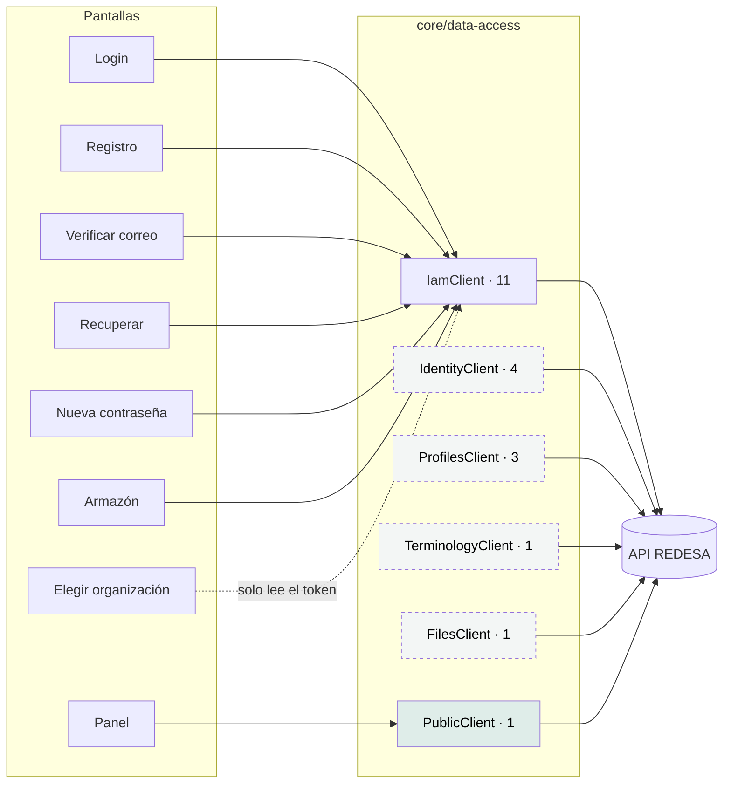

# Mapa de integraciones

Las 20 operaciones HTTP de la aplicación, quién las llama y desde qué pantalla.
El inventario se regenera con `node scripts/generate-inventory.mjs`; la versión
viva está en [el inventario de API](../reports/generated/api-inventory.md).

---

## Panorama



Los cuatro clientes en gris punteado **no tienen ninguna pantalla que los llame
hoy**. Están escritos, probados y listos; les falta la interfaz. Ver §3.

## 1 · Operaciones con consumidor

| Método | Ruta | Cliente | Pantalla | Sesión |
|---|---|---|---|---|
| `POST` | `/iam/auth/login` | `IamClient.login` | Login | Pública |
| `POST` | `/iam/auth/token/refresh` | `IamClient.refresh` | Interceptor + arranque | Pública |
| `POST` | `/iam/auth/register-patient` | `IamClient.registerPatient` | Registro (paciente) | Pública |
| `POST` | `/iam/auth/register-practitioner` | `IamClient.registerPractitioner` | Registro (profesional) | Pública |
| `POST` | `/iam/auth/verify-email` | `IamClient.verifyEmail` | Verificar correo | Pública |
| `POST` | `/iam/auth/forgot-password` | `IamClient.forgotPassword` | Recuperar | Pública |
| `POST` | `/iam/auth/reset-password` | `IamClient.resetPassword` | Nueva contraseña | Pública |
| `POST` | `/iam/auth/logout` | `IamClient.logout` | Armazón (menú de usuario) | **Requiere** |
| `GET` | `/public/directory` | `PublicClient.searchDirectory` | Panel | Pública |

Nueve operaciones vivas. Las cinco de registro y recuperación fueron verificadas
contra la API real por el equipo (`ESTADO-FRONTEND.md` §«El recorrido que se
verificó en un navegador real»).

## 2 · Cómo viaja la credencial

`authInterceptor` añade dos cabeceras a **toda** petición que no sea pública:

```http
Authorization: Bearer <access token>
X-Tenant-Id: <organización activa>     ← solo si está resuelta
```

`X-Tenant-Id` se omite cuando el token trae varias organizaciones y ninguna fue
elegida. Adivinar una podría mostrar datos de la organización equivocada.

### Rutas que el interceptor trata como públicas

Verificadas una por una contra `iam-auth.controller.ts` del backend:

```text
/iam/auth/login                  /iam/auth/verify-email
/iam/auth/token/refresh          /iam/auth/activate
/iam/auth/register-patient       /public/…  (cualquier ruta bajo ese prefijo)
/iam/auth/register-organization
/iam/auth/register-practitioner
```

El motivo no es que mandarles un token rompa algo: es que **reaccionar a su 401
con un refresco sí**. El 401 de un login son credenciales inválidas, y refrescar
sería un bucle contra el límite de 10 intentos por minuto.

> **Deriva registrada.** `/iam/auth/register-organization` está en la lista de
> rutas públicas del interceptor, pero **ningún cliente la llama**: no hay método
> para dar de alta una organización. Es una previsión, no un error, pero la lista
> declara una superficie mayor que la real.

## 3 · Operaciones sin consumidor

Once operaciones escritas, probadas, y sin ninguna pantalla que las llame:

| Cliente | Operaciones | Para qué existen | Prueba |
|---|---|---|---|
| `IdentityClient` | 4 · verificación de identidad de paciente y de profesional, verificación de matrícula, consulta del caso | El flujo de verificación de identidad, al que apunta el estado S5 con acción | Sí |
| `ProfilesClient` | 3 · alta de paciente, alta de profesional, vínculo de cuenta | Altas hechas por personal, no auto-registro | Sí |
| `TerminologyClient` | 1 · expansión de conjunto de valores | Las listas de opciones de cualquier formulario clínico | Sí |
| `FilesClient` | 1 · subida | La evidencia que necesita `IdentityClient` | Sí |
| `IamClient` | 2 · `activate`, `createUser` | Registro asistido y alta por administrador | Sí |

**No es código muerto**: todos tienen prueba y todos son la mitad de un flujo cuya
otra mitad —la pantalla— todavía no se escribió. La forma correcta de leerlo es
«la capa de datos va por delante de la interfaz».

El caso más notable es la cadena de verificación de identidad, que está completa
salvo la pantalla:

```text
FilesClient.upload(evidencia)  →  fileId
      ↓
IdentityClient.requestPatientIdentityVerification({ evidenceFileId })
      ↓
IdentityClient.getVerificationCase(caseId)   ← consulta del estado
```

Y `errorToViewState` ya sabe mandar ahí cuando la API responde
`IDENTITY_VERIFICATION_REQUIRED`:

```ts
return forbidden({
  message: body.message || 'Necesitás verificar tu identidad para continuar.',
  nextAction: { label: 'Verificar identidad', route: IDENTITY_VERIFICATION_ROUTE },
});
```

**Pero `IDENTITY_VERIFICATION_ROUTE` vale `/identity/me`, que es una ruta de la
API y no del router.** Ninguna ruta de Angular coincide, así que el comodín la
mandaría a `/`. Brecha `HIGH`, registrada.

## 4 · Las tres particularidades del transporte

### El `$` de terminología va literal

```ts
this.url(`/terminology/value-sets/${encodeURIComponent(valueSetId)}/$expand`)
```

Con el comentario que lo justifica: *«Express enruta sobre el path sin
decodificar, así que `%24expand` no casa con la ruta `:id/$expand` y vuelve 404 —
verificado contra la API viva.»* El `$` es un sub-delimitador legal en un
segmento de path.

### La subida no fija `Content-Type`

```ts
const form = new FormData();
form.append('file', file);
return this.http.post<UploadedFile>(apiUrl(this.baseUrl, '/common/files/upload'), form);
```

El navegador tiene que ponerlo él para incluir el `boundary`; escribirlo a mano
rompe la petición del lado del servidor.

### El cursor de terminología es opaco

Se reenvía tal cual y no se interpreta. La API no publica su forma justamente
para poder cambiar las columnas de orden sin romper a nadie. Un cursor inventado
vuelve con 400.

## 5 · Integraciones que **no** existen

| Tipo | Estado |
|---|---|
| WebSockets | No |
| Server-Sent Events | No |
| Sondeo periódico | No |
| Descarga de archivos | No. Hay subida, no bajada |
| Proveedores externos (pagos, mapas, chat, correo) | No |
| CDN de terceros | No. Tipografías autoalojadas |
| Analítica | No |
| Captura de errores remota | No |
| OAuth / SSO de terceros | No |

**Cero llamadas de red fuera de `core/data-access/`.** Verificado: no hay ningún
`this.http` en `features/` ni en `shared/`. Es lo que hace que esta página pueda
afirmar que la superficie está completa.

## 6 · Verificación automática

```bash
node scripts/check-api-contract-drift.mjs
```

Compara los endpoints que el código llama con los declarados en
[la API de backend](../integrations/backend-api.md). Detecta que alguien agregue
una llamada sin documentarla.

**Lo que no puede detectar** es que el backend cambie el contrato: eso exige
acceso a su OpenAPI, que no es alcanzable desde este repositorio. Los tipos se
escribieron a mano contra el contrato, con la referencia anotada en comentarios
(«copiados de `src/common/errors/error-codes.ts` del backend»). Es rastreable, no
verificable. Brecha `HIGH`, registrada.
