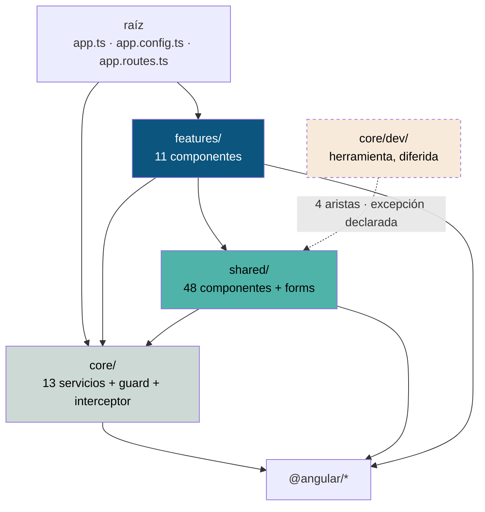

# Dependencias entre módulos

Medido sobre el código, no dibujado a mano. La tabla completa se regenera con
`node scripts/generate-inventory.mjs` y vive en
[el grafo de módulos generado](../reports/generated/module-graph.md).

---

## El grafo en números

| Métrica | Valor |
|---|---:|
| Archivos TypeScript en `src/` | 211 |
| Importaciones internas | 587 |
| Paquetes externos distintos | 10 |
| **Dependencias circulares** | **0** |
| Archivos sin importadores (falsos positivos explicados) | 2 |

## Dependencias externas en ejecución

| Paquete | Importaciones | Dónde |
|---|---:|---|
| `@angular/core` | 185 | Todo |
| `@angular/common` | 51 | `isPlatformBrowser`, `HttpClient` |
| `@angular/router` | 34 | Rutas, guard, `routerLink` |
| `@angular/forms` | 14 | Las seis pantallas con formulario |
| `node:fs` | 12 | **Solo pruebas** — leen `styles.css` para comparar tokens |
| `rxjs` | 10 | Los seis clientes y el refresco de token |
| `@angular/platform-browser` | 4 | Arranque e hidratación |
| `@angular/ssr` | 3 | Servidor y modos de render |
| `express` | 1 | `src/server.ts` |
| `node:path` | 1 | `src/server.ts` |

**Diez paquetes, todos de Angular o de su cadena de arranque.** No hay una sola
biblioteca de interfaz de terceros: los 48 componentes de `shared/` están
escritos en el repositorio. Es una decisión con consecuencias en las dos
direcciones, documentada en [ADR-0004](../adr/ADR-0004-sistema-de-diseno-propio.md).

## Los nodos de mayor centralidad

Cuántos archivos de producción importan a cada uno:

| Archivo | Fan-in | Qué significa que cambie |
|---|---:|---|
| `shared/components/atoms/button/button.ts` | 25 | Cambiar su API toca un tercio de la interfaz |
| `shared/forms/form-control.context.ts` | 19 | Rompe el nombre accesible de **todos** los campos a la vez |
| `core/view-state/view-state.types.ts` | 14 | Cambia el vocabulario de estados de toda la aplicación |
| `core/view-state/view-state.ts` | 12 | Ídem, en los constructores |
| `shared/components/atoms/input/input.ts` | 11 | |
| `shared/components/molecules/form-field/form-field.ts` | 11 | |
| `shared/components/atoms/link/link.ts` | 9 | |
| `shared/components/molecules/toast/toast.types.ts` | 9 | |
| `shared/components/organisms/side-nav/side-nav.types.ts` | 9 | |
| `shared/components/organisms/tenant-switcher/tenant-switcher.types.ts` | 9 | |
| `core/auth/session.store.ts` | 8 | Toda superficie autenticada |
| `core/auth/auth.service.ts` | 7 | |

Los cuatro primeros son los que exigen
[control de cambios](../governance/change-management.md) explícito.

## Dirección de las dependencias entre capas



Todas las aristas van hacia abajo. La única excepción son las cuatro de
`core/dev/`, explicadas en [capas del frontend](frontend-layers.md#la-única-excepción-medida).

## Dependencias circulares

**Ninguna.** Sobre 587 aristas y 211 nodos, el recorrido en profundidad de
`scripts/lib/scan.mjs` no encuentra ningún ciclo.

No es casualidad: la jerarquía es unidireccional por construcción, los tipos
viven junto a su componente (`*.types.ts`) en vez de en un módulo compartido, y
el barril `shared/index.ts` solo reexporta hacia afuera.

## Archivos que nadie importa

Dos, y ninguno es código muerto:

| Archivo | Por qué aparece |
|---|---|
| `src/app/shared/index.ts` | Es el barril público, y **no lo importa nadie**: `from '@shared'` a secas no aparece en ninguna parte del código. Ver abajo |
| `src/environments/environment.development.ts` | Lo inyecta el builder por `fileReplacements` de `angular.json`, no un `import`. Ningún grafo puede verlo |

### El barril está infrautilizado

`shared/index.ts` declara que **es** la API pública de `shared/`:

> *«Todo lo que se exporta acá es reutilizable por cualquier feature. Lo que no
> aparece en este archivo es interno y no debe importarse desde afuera.»*

En la práctica, casi todos los features importan por ruta profunda
(`../../shared/components/atoms/button/button`) y solo `register-patient.ts` usa
`@shared/...`. **El contrato existe y no se está ejerciendo.**

No es un error —las rutas profundas compilan— pero le quita al barril su razón
de ser: hoy nada impide importar algo interno de `shared/`. Registrado como
brecha `MEDIUM` en
[el análisis de brechas](../reports/documentation-gap-analysis.md) y discutido en
[reglas de composición](../components/composition-rules.md#el-barril-y-las-rutas-profundas).

## Acoplamientos que conviene conocer

| Acoplamiento | Dirección | Nota |
|---|---|---|
| `authInterceptor` ↔ `SessionStore` | El interceptor lee e invalida la sesión | Es lo que permite cerrar sesión desde cualquier 401 |
| `authGuard` → `LOGIN_ROUTE` (del interceptor) | El guard importa una constante del módulo HTTP | La ruta de login se declara una sola vez, donde se usa primero |
| `errorToViewState` → `view-state` | La traducción de errores conoce los 9 estados | Es su razón de ser |
| `ShellLayout` → `Breakpoints` | La pantalla mide y le pasa el resultado al organismo | `Shell` no mide: recibe. Ver [responsive](../design-system/responsive-design.md) |
| `Dashboard` → `PublicClient` | Única pantalla que hace una lectura de API | Deliberado: comprobar de punta a punta sin datos clínicos |

## Cómo mantener esto vigente

```bash
node scripts/generate-inventory.mjs --check   # falla si el código cambió y esto no
node scripts/check-architecture.mjs           # ciclos, capas y superficie de red
```

Las dos están en el [pipeline documental](../governance/change-management.md#pipeline).
