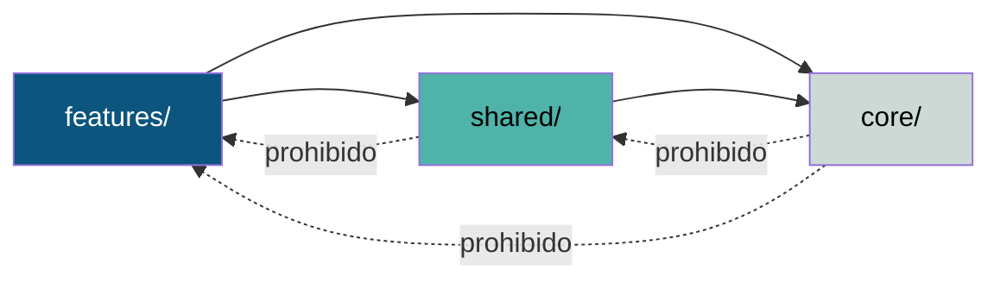
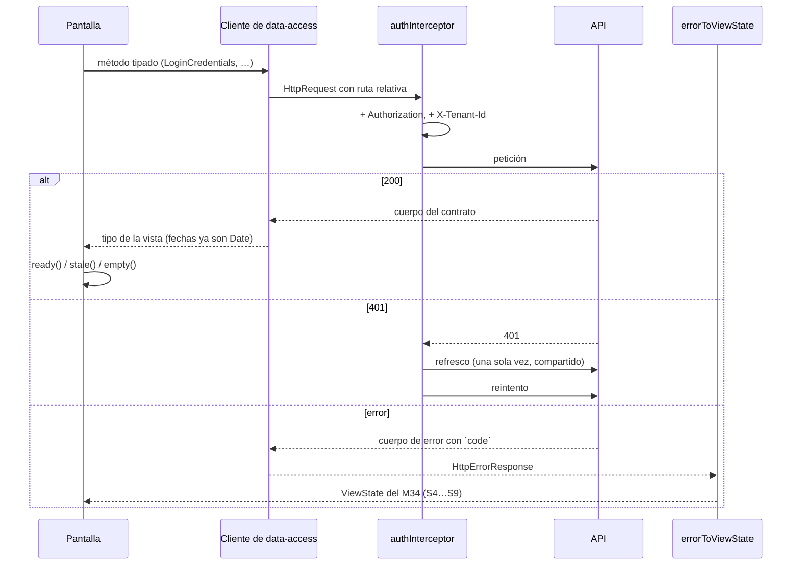

# Arquitectura — visión general

Una aplicación Angular 21 con renderizado en servidor, organizada en tres capas
con fronteras declaradas, sin store global y con un contrato de estados de
interfaz que gobierna cómo se pinta cada pantalla.

---

## En cinco frases

1. **Tres capas con frontera declarada.** `core/` (infraestructura), `shared/`
   (interfaz reutilizable) y `features/` (pantallas). Las fronteras son alias de
   `tsconfig.json`, no una convención de nombres.
2. **Todo standalone, todo señales.** No hay un solo `NgModule`. El estado son
   señales de Angular en servicios `providedIn: 'root'`; no hay store externo.
3. **La sesión vive en memoria y solo el refresh token se persiste.** El access
   token nunca toca `localStorage`.
4. **Nueve estados de interfaz son contrato**, no sugerencia visual. El M34 los
   enumera y `ViewState<T>` los codifica como unión discriminada.
5. **El renderizado es mixto y deliberado**: lo público se prerenderiza, lo que
   tiene sesión se pinta en el cliente.

## El árbol

```text
src/
├── main.ts · main.server.ts · server.ts     arranque (navegador · SSR · Express)
├── index.html                               script anti-parpadeo del tema
├── styles.css                               tokens del sistema REDSAT
└── app/
    ├── app.ts · app.config.ts               raíz y proveedores
    ├── app.routes.ts                        11 entradas de ruta
    ├── app.routes.server.ts                 modo de render por ruta
    ├── core/                                infraestructura, sin interfaz
    │   ├── auth/          sesión, guard, almacenamiento del refresh token
    │   ├── data-access/   6 clientes de API, 20 operaciones
    │   ├── http/          interceptor, modelo de error, refresco único
    │   ├── layout/        medición de la ventana
    │   ├── tokens/        tema y catálogo tipado de tokens de diseño
    │   ├── view-state/    los 9 estados del M34
    │   └── dev/           herramientas de desarrollo (no entra a producción)
    ├── shared/                              interfaz reutilizable
    │   ├── components/atoms|molecules|organisms
    │   ├── forms/         contrato de accesibilidad campo ↔ control
    │   └── index.ts       API pública
    └── features/                            pantallas
        ├── auth/          6 pantallas
        ├── dashboard/     el panel
        ├── shell-layout/  el armazón con sesión
        └── design-system-sample/  la vitrina (diferida)
```

## Las fronteras son código, no costumbre

`tsconfig.json` declara exactamente tres alias, y su comentario dice para qué:

```jsonc
"paths": {
  "@shared":     ["./src/app/shared/index.ts"],   // la API pública (el barril)
  "@shared/*":   ["./src/app/shared/*"],          // lo interno
  "@core/*":     ["./src/app/core/*"],
  "@features/*": ["./src/app/features/*"]
}
```

> *«Lo que no entra en `@core`, `@shared` o `@features` no tiene lugar.»*

Y `src/app/shared/index.ts` fija la regla que sostiene la jerarquía:

> *«Regla inviolable: `shared/` NUNCA importa de `features/`. Si algo en shared
> necesita saber de un dominio, es que no pertenece a shared.»*

**Verificado**: 0 dependencias circulares sobre 587 importaciones internas
([auditoría de estructura §3.2](../reports/graphify-audit.md#32--dependencias-circulares)).
La comprobación está automatizada en `scripts/check-architecture.mjs`.

### Quién puede importar a quién



`core/` es la capa más profunda: no conoce ni la interfaz ni las pantallas.

**Con una excepción medida:** `core/dev/toast-dev-panel/` importa de `shared/`.
Es una herramienta de desarrollo, se carga de forma diferida y no está montada en
ninguna pantalla (`app.html` explica por qué se quitó). No entra al paquete
inicial. Está anotada como excepción consciente en
[reglas de composición](../components/composition-rules.md#la-única-excepción-a-las-fronteras).

## Los dos contratos que gobiernan todo

El grafo de dependencias señala los dos nodos de mayor centralidad, y ninguno es
una pantalla:

| Contrato | Lo importan | Qué garantiza |
|---|---:|---|
| `core/view-state/view-state.types.ts` | 14 | Que toda pantalla exprese carga, vacío, error y permiso con el mismo vocabulario |
| `shared/forms/form-control.context.ts` | 19 | Que todo control de formulario tenga nombre accesible, `aria-describedby` y estado de error correctos |

Que la arquitectura esté organizada alrededor de contratos y no de features es
justamente lo que pide el modelo del proyecto.

## Renderizado

| Superficie | Modo | Por qué |
|---|---|---|
| `/auth`, `/auth/registro`, `/auth/recuperar`, `/design-system` | **Prerender** | Se ven igual para todo el mundo: salen del servidor ya pintadas |
| `/auth/verificar`, `/auth/nueva-clave` | Cliente | Leen un token del query string, que en el build no existe |
| `/auth/organizacion` | Cliente | La lista de organizaciones sale del token de sesión |
| `/` y `/panel` | Cliente | Tienen sesión, y el servidor no la ve |

El detalle está en [estrategia de renderizado](rendering-strategy.md).

## Flujo de datos, en una imagen



Ninguna pantalla escribe una línea sobre manejo de errores HTTP: se lo pide a
`errorToViewState`, que ramifica por `code` y devuelve el estado correspondiente.

## Lo que esta arquitectura **no** tiene

Documentado para que nadie lo dé por sentado:

| Ausente | Consecuencia |
|---|---|
| Store global | Cada pantalla guarda su estado en señales locales. Funciona bien a esta escala; a 81 secciones habrá que revisarlo |
| Capa de caché de estado remoto | No hay invalidación ni deduplicación entre pantallas. Dos pantallas que pidan lo mismo lo piden dos veces |
| Resolvers de ruta | Los datos se piden desde el componente, tras el guard |
| Error boundaries de Angular | Solo `provideBrowserGlobalErrorListeners()`. Un fallo de render deja la pantalla en blanco: ver [error boundaries](error-boundaries.md) |
| Internacionalización | Textos en español, en las plantillas |
| Telemetría | Ninguna. Ni errores ni analítica: ver [observabilidad](../observability/error-reporting.md) |
| Banderas de funcionalidad | Ninguna |

## Dónde seguir

- [Contexto del sistema](system-context.md) y [contenedores](containers.md) — los diagramas C4.
- [Capas del frontend](frontend-layers.md) — qué va en cada carpeta y por qué.
- [Dependencias entre módulos](module-dependencies.md) — el grafo medido.
- [Routing y navegación](routing-and-navigation.md).
- [Gestión de estado](state-management.md) y [flujo de datos](data-flow.md).
- [Mapa de integraciones](integration-map.md).
- [Decisiones (ADR)](../adr/index.md).
