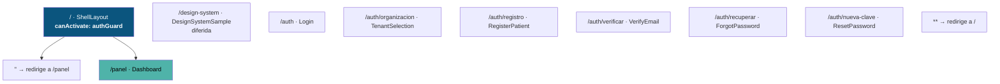
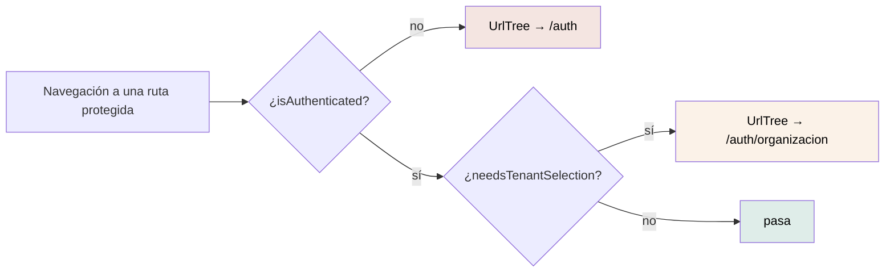

# Routing y navegación

11 entradas en `src/app/app.routes.ts`: un layout, 8 pantallas, una redirección
interna y un comodín. El inventario vivo está en
[el inventario de rutas generado](../reports/generated/route-inventory.md).

---

## El árbol



Las rutas de `auth` **no están anidadas**: se declaran planas
(`path: 'auth/registro'`), no como hijas de un padre `auth`. No hay layout
compartido de autenticación en el router; lo comparten por composición, usando el
organismo `AuthSplit` dentro de cada plantilla.

## El guard está en el padre, no en cada hija

```ts
{
  path: '',
  component: ShellLayout,
  canActivate: [authGuard],
  children: [ … ],
}
```

El comentario del código lo explica: *«El guard corre en el padre — S1 del M34:
autorizar ANTES de pedir datos — y cubre a todas las hijas.»*

Esa es la distinción **S1 ≠ S2** del modelo: autorizar la ruta ocurre antes de
pedir ningún dato sensible. Mostrar un esqueleto de contenido mientras todavía no
se sabe si la persona puede ver la sección ya insinúa que hay algo que ver.

## Los tres caminos del `authGuard`



**Decide solo con lo que hay en memoria** —el token ya decodificado— y no
consulta a la API. Una llamada acá volvería a mezclar autorizar con pedir.

`needsTenantSelection` es `true` cuando el token trae **más de una** organización
y ninguna fue elegida. Con una sola se resuelve sola; con varias manda la
elección de la persona y no se adivina, porque elegir por ella podría mostrarle
datos de la organización equivocada.

## Dónde se declaran las rutas especiales

No hay un archivo de constantes. Cada ruta vive donde primero se necesita:

| Constante | Valor | Archivo |
|---|---|---|
| `LOGIN_ROUTE` | `/auth` | `core/http/auth.interceptor.ts` |
| `TENANT_SELECTION_ROUTE` | `/auth/organizacion` | `core/auth/auth.guard.ts` |
| `IDENTITY_VERIFICATION_ROUTE` | `/identity/me` | `core/http/error-to-view-state.ts` |
| `HOME_ROUTE` | `/` | `features/auth/login/login.ts` |

> **Ojo con `IDENTITY_VERIFICATION_ROUTE`.** Vale `/identity/me`, que es la ruta
> **de la API**, no una ruta de Angular. Ninguna ruta del router coincide, así
> que el comodín la redirigiría a `/`. Se usa como `nextAction.route` del estado
> S5 cuando la API responde `IDENTITY_VERIFICATION_REQUIRED`. Está registrado
> como brecha `HIGH` en
> [el análisis de brechas](../reports/documentation-gap-analysis.md).

## Navegación programática

Seis lugares llaman a `router.navigateByUrl`:

| Origen | Destino | Cuándo |
|---|---|---|
| `authInterceptor` → `endSession` | `/auth` | 401 sin refresh token, o refresco fallido |
| `Login.goAfterLogin` | `/auth/organizacion` o `/` | Tras iniciar sesión, según haga falta elegir |
| `TenantSelection.choose` | `/` | Tras elegir organización |
| `ShellLayout.logout` | `/auth` | Tras cerrar sesión |
| `ShellLayout.changeTenant` | `/panel` | Tras cambiar de organización |
| `VerifyEmail` / `ResetPassword` / `RegisterPatient` `.goToLogin` | `/auth` | Botón «Ir al login» |

### Cambiar de organización vuelve al panel

```ts
protected changeTenant(tenantId: string): void {
  this.auth.selectTenant(tenantId);
  void this.router.navigateByUrl('/panel');
}
```

Deliberado: cambiar de organización es un **cambio de contexto de datos**. Lo que
hubiera en pantalla corresponde a la anterior, y recargar la vista actual podría
ser el detalle de un recurso que en esta organización no existe.

## Redirecciones

| Desde | Hacia | Tipo |
|---|---|---|
| `/` (hija, `pathMatch: 'full'`) | `/panel` | Redirección de router |
| `**` | `/` | Comodín |
| `/` sin sesión | `/auth` | `UrlTree` del guard |
| `/` con varias organizaciones | `/auth/organizacion` | `UrlTree` del guard |

**El comodín redirige a `/`, no a una pantalla 404.** Una URL mal escrita
termina en el panel (o en el login). Es una decisión de producto sin registrar;
anotada como brecha `MEDIUM`.

## Títulos de página

Ocho rutas declaran `title`, con el prefijo «Mantra Core Health - ». Angular los
aplica a `document.title` automáticamente.

Las dos que **no** lo declaran son el layout `/` y el comodín, que nunca se
pintan solos: la hija efectiva aporta el suyo.

## Parámetros de ruta

**Ninguna ruta declara parámetros de path.** Dos leen el query string:

```text
/auth/verificar?token=…       verify-email.ts    route.snapshot.queryParamMap
/auth/nueva-clave?token=…     reset-password.ts  route.snapshot.queryParamMap
```

Las dos usan `snapshot`, que se lee una sola vez al construir el componente. Es
correcto acá porque a esas rutas se llega desde un enlace externo (el correo) y
nunca se navega entre dos instancias distintas.

## Lo que no hay

| Elemento | Estado |
|---|---|
| Resolvers | Ninguno. Los datos se piden desde el componente, tras el guard |
| `canDeactivate` | Ninguno. Nada avisa al salir de un formulario con cambios sin guardar |
| `canMatch` | Ninguno |
| Rutas por rol | Ninguna. El menú se filtra visualmente, pero no hay guard por rol |
| Rutas hijas más allá del primer nivel | Ninguna |
| Animaciones de transición | Ninguna |
| Estrategia de reutilización de rutas | La de por defecto |
| Pantalla 404 | Ninguna: el comodín redirige |

Las tres primeras se vuelven necesarias a medida que crezcan las secciones.
Recogidas en [el análisis de brechas](../reports/documentation-gap-analysis.md).
