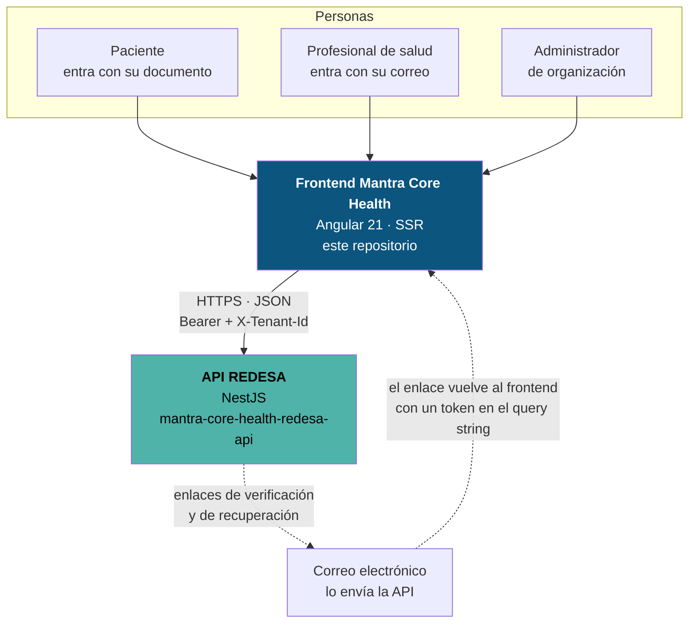
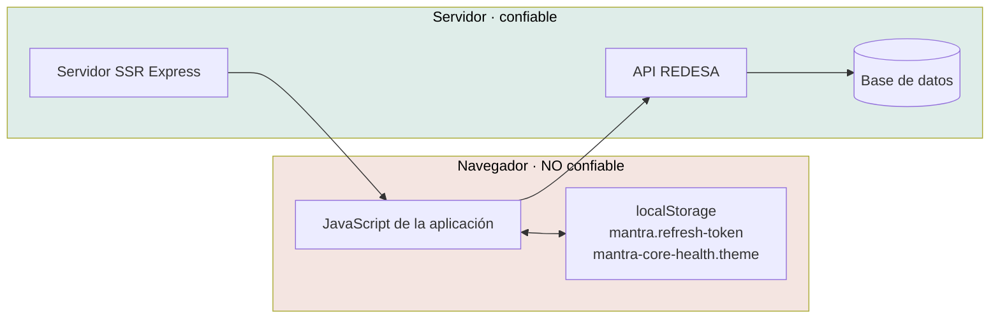

# Contexto del sistema (C4 · nivel 1)

Quién usa el frontend y con qué habla. La fuente oficial del modelo es
[`structurizr/workspace.dsl`](../../structurizr/workspace.dsl); este diagrama es
su lectura.



## Actores

| Actor | Cómo entra | Verificado en |
|---|---|---|
| **Paciente** | Documento de identidad + contraseña. El correo es opcional | `LoginCredentials`, `PatientRegistration` |
| **Profesional de salud** | Correo + contraseña. Necesita matrícula y número de colegio para registrarse | `PractitionerRegistration` |
| **Administrador** | Correo + contraseña. Da de alta usuarios (`POST /iam/users`) | `IamClient.createUser` |

Los roles concretos viajan en el claim `roles[]` del token. La aplicación **no
los interpreta hoy**: los muestra en el panel y arma el menú con ítems fijos. Ver
[actores y roles](../business/actors-and-roles.md).

## Sistemas externos

### API REDESA — la única integración

Es el **único** sistema con el que el frontend habla. 20 operaciones sobre seis
módulos:

| Módulo | Prefijo | Operaciones | Necesita sesión |
|---|---|---:|---|
| IAM | `/iam` | 11 | Solo `logout` y `users` |
| Identity | `/identity` | 4 | Sí |
| Profiles | `/profiles` | 3 | Sí |
| Terminology | `/terminology` | 1 | Sí |
| Files | `/common` | 1 | Sí |
| Public | `/public` | 1 | **No** |

El detalle está en [el mapa de integraciones](integration-map.md) y en
[la API de backend](../integrations/backend-api.md).

### Correo electrónico — integración indirecta

El frontend **no envía correo**. La API lo hace, y el enlace del correo vuelve
al frontend con un token en el query string:

```text
/auth/verificar?token=…      →  POST /iam/auth/verify-email
/auth/nueva-clave?token=…    →  POST /iam/auth/reset-password
```

Las dos rutas se renderizan en el cliente a propósito: prerenderizadas mostrarían
el estado «falta el código», porque en el build no hay query string.

### Lo que **no** hay

Verificado por ausencia de dependencias y de llamadas de red fuera de
`core/data-access/`:

| Servicio | Estado |
|---|---|
| CDN de terceros | No. Las tipografías están autoalojadas (`@fontsource*`) |
| Analítica (GA, Segment, …) | No existe |
| Captura de errores (Sentry, …) | No existe |
| Mapas, pagos, chat | No existe |
| WebSockets / SSE | No existe |
| Almacenamiento de archivos directo (S3 presigned) | No. La subida va a la API (`POST /common/files/upload`) |

**Cero scripts de terceros en el paquete.** Es una propiedad de seguridad y de
rendimiento que conviene no perder sin decisión explícita.

## Fronteras de confianza



**La autoridad es siempre la API.** Lo que el frontend hace con los roles del
token es no ofrecer puertas que van a estar cerradas; no es autorización. Está
escrito en el propio código:

> *«Esconder un ítem no protege nada —la autoridad es la API, que valida en cada
> petición—; es no ofrecer una puerta que va a estar cerrada.»*
> — `features/shell-layout/shell-layout.ts`

El modelo de amenazas completo está en
[el modelo de amenazas](../security/threat-model.md).

## El servidor SSR es parte del sistema

`src/server.ts` es un Express que sirve los estáticos con `maxAge: '1y'` y
delega el resto a `AngularNodeAppEngine`. **No expone ningún endpoint de API** —
el bloque de ejemplo está comentado en el archivo.

No ve la sesión: el refresh token vive en `localStorage` y el access token en
memoria del navegador. La API entrega el refresh token en el cuerpo del login,
no como cookie, así que no hay nada en la petición que le diga al servidor quién
está entrando. De ahí sale toda la estrategia de renderizado.
