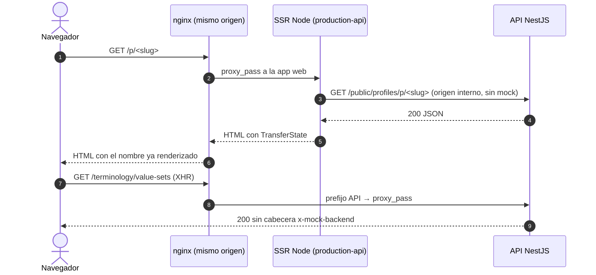

# TASK PROMPT: BR-01 — Build de producción contra la API real (SSR, demos apagadas, cartel y hosts)

> **MODO DE EJECUCIÓN:** este prompt se ejecuta en **Modo Planificación (Planning Mode)**.
> El desarrollador o el agente arranca investigando, sin tocar código fuente. Con eso escribe un
> `implementation_plan.md` detallado y espera la aprobación explícita del usuario. Después
> ejecuta los cambios en commits atómicos, verifica con pruebas unitarias y de integración, y
> **contra el artefacto real levantado**. El resultado queda documentado en `walkthrough.md`.

| Campo | Valor |
|---|---|
| **Cierra** | TX-01, TX-02, TX-03, TX-04, TX-21, TX-22 (anexo D) · CV-04, CV-24 (anexo E) |
| **Severidad máxima** | Bloqueante de salida a producción |
| **Repo(s)** | `mantra-core-health` (front). Infra: `Dockerfile`, `deploy/` |
| **Toca el modelo** | No |
| **Depende de** | Nada para empezar. La prueba final contra la API se apoya en BR-02 (mock honesto) y BR-03 (enrutado) |
| **Decisión previa** | **D-H**: qué rama es la fuente del despliegue real (ver README §8) |

---

## 1. Contexto de negocio y justificación técnica

### A. Por qué importa
Estamos por cerrar el frontend, y hoy **no existe ningún artefacto de producción que hable con la
API**. Lo que se despliega es la maqueta: cuentas `@alovida.mock`, cualquier contraseña sirve y
los datos viven en memoria. Mientras esto no cambie, no se puede demostrar ninguna integración
ni salir a producción.

### B. Estado del frontend (`mantra-core-health`)
- `src/environments/environment.ts:65`: `mockBackend: true` fijo en **producción**. El comentario
  de las líneas 60-64 dice que no lee el entorno a propósito.
- `src/environments/environment.development.ts:63`: también `true`.
- **`origin/dev` también tiene `mockBackend: true`** (`environment.ts:62`) y los 91 archivos de
  `core/mock`. **`dev` no es «la rama con API real».**
- `angular.json`: la única configuración sin mock es `real-api`/`e2e-real`, que es de `ng serve`
  (`optimization:false`, `sourceMap:true`) y **apaga el SSR**
  (`"ssr": false, "outputMode": "static", "server": false`, líneas 107-108 y 121-122).
  `defaultConfiguration: "production"` (l. 131) usa `environment.ts`, o sea, el mock.
- `Dockerfile:82-88`: `yarn build` sin `--configuration`, así que el contenedor sale con el mock.
  Sólo recibe `PUBLIC_API_BASE_URL`; los `PUBLIC_*_DEMO` no llegan al build.
- `src/environments/environment.ts:36,43,51,58`: `demoPresets ?? true`, `paymentDemo ?? true`,
  `loyaltyDemo ?? true` y `campaignsDemo ?? true`, aunque cada comentario dice «apagada por
  defecto». `environment.real-api.ts` apaga sólo `campaignsDemo` y `paymentDemo`: la barra de
  casos demo de la ficha clínica (`diagnosis-block.ts:286`) y la billetera sembrada
  (`loyalty.fixtures.ts`) aparecen **incluso contra la API real**.
- `src/app/app.html:8`: `<app-mock-banner />` sin condición. `mock-banner.ts` no consulta
  `environment` y lista las 5 cuentas demo.
- `angular.json:54-62`: `security.allowedHosts` de build incluye `.devtunnels.ms`,
  `.trycloudflare.com`, `.ngrok-free.app` y `.loca.lt`, y se hornea en el artefacto de producción.
- `src/server.ts:158`: redirige `/public/media/:id` a un SVG de maqueta, también en producción.
- `src/app/app.config.ts:89`: `mockBackendInterceptor` va en la cadena de producción.
  `app.ts:8` mete `MockBanner` y `mock-session` en el paquete inicial.
- `src/environments/environment.real-api.spec.ts` fija como **contrato** que «producción sigue
  con la maqueta encendida». Hay que cambiar ese contrato, no borrar la prueba.
- El SSR con API real **nunca se ejercitó**. `app.routes.server.ts` tiene 11 rutas
  `RenderMode.Server` (`search/*`, `p/:slug`, `o/:slug`, `f/:slug`) que en el servidor van a
  pedir datos a la API, y 8 `Prerender` (auth). `bo-departments.service.ts` documenta que un
  prerender contra la API ya colgó el `yarn build`.
- Diferencia entre `origin/dev` y `origin/mockup`:
  - 550 archivos (453 de `docs/`). En código son ~2 700 líneas: `features/auth`, `core/mock`,
    `features/account`, `symptom-check`, `shell-layout`, `core/messaging`, `proxy.conf.mjs` y
    `environment*.ts`.
  - 80 commits están sólo en `mockup` y 47 sólo en `dev`.

### C. Qué tiene que ver la API
Ningún cambio de la API es obligatorio. Para la prueba de punta a punta:
- **CORS está cerrado** (`origin:false` en HTTP y WS, TX-20): el front **tiene** que servirse
  desde el mismo origen que la API, detrás de nginx.
- Con `NODE_ENV=production` se apagan Swagger y Scalar (`main.ts:173`). Hay que confirmar que el
  compose de producción lo fija.

### D. Aislamiento
El cambio es de build y configuración. **No** cambia pantallas ni contratos. La maqueta tiene que
seguir existiendo como **despliegue aparte**, con su propia configuración y `mockBackend: true`,
porque el equipo y el cliente la usan para probar lo visual.

---

## 2. Flujo de Git y entrega

```bash
cd mantra-core-health
git status                               # árbol limpio
git fetch origin
git checkout -b <dev>/feat-build-produccion-api-real origin/mockup   # ver D-H
```

- **Rama base y destino del PR:** mientras dure la etapa de maqueta, los PR del front van contra
  **`mockup`**. Si la decisión D-H define una rama de lanzamiento, este PR va **contra esa rama**
  y se replica en `mockup`.
- Commits atómicos y convencionales, por ejemplo:
  - `build(env): configuración production-api con SSR y mock apagado`
  - `fix(env): las demos quedan apagadas por defecto en producción`
  - `fix(shell): el cartel de cuentas demo sólo se monta con mockBackend`
  - `fix(ssr): allowedHosts de producción sin dominios de túneles`
  - `build(docker): el Dockerfile recibe la configuración y las PUBLIC_* por ARG`
  - `test(env): check-real-api-config protege production-api`
- El PR se abre con `gh pr create --base mockup --reviewer jsaldias39,PabloArauzCaballero`. El
  cuerpo lleva la evidencia de runtime pegada.
- **El merge exige revisión humana.** El flujo termina en abrir el PR.

---

## 3. Diagrama



---

## 4. Archivos a modificar o crear

- `[CREAR]` `src/environments/environment.production-api.ts`: `mockBackend:false`, todas las demos
  en `false`, `apiBaseUrl` desde `envFromProcess`.
- `[MODIFICAR]` `angular.json`:
  - nueva configuración de **build** `production-api` con optimización, SSR, `outputMode: server`
    y `fileReplacements`;
  - `allowedHosts` de producción **sin** túneles (los túneles se quedan sólo en
    `development`/`mockup`).
- `[MODIFICAR]` `src/environments/environment.ts`: los respaldos de las demos pasan a `false`, y
  el comentario tiene que decir lo mismo que el código.
- `[MODIFICAR]` `src/environments/environment.real-api.ts`: apaga también `demoPresets` y
  `loyaltyDemo`.
- `[MODIFICAR]` `src/app/app.html` y `src/app/app.ts`: `app-mock-banner` sólo con
  `environment.mockBackend`, cargado con `@defer` o import dinámico para que salga del paquete
  inicial.
- `[MODIFICAR]` `src/app/app.config.ts`: con la configuración real, el interceptor del mock
  **no se registra**.
- `[MODIFICAR]` `src/server.ts`: la redirección de `/public/media/:id` al SVG sólo existe con el
  mock.
- `[MODIFICAR]` `Dockerfile`: `ARG BUILD_CONFIGURATION=production-api` y
  `ARG PUBLIC_*` → `ENV` antes de `yarn build --configuration=$BUILD_CONFIGURATION`.
- `[MODIFICAR]` `deploy/docker-compose*.yml`: fija la configuración y las variables. La maqueta
  queda como servicio o despliegue aparte.
- `[MODIFICAR]` `scripts/check-real-api-config.mjs`: tiene que fallar si `production-api` deja el
  mock o alguna demo en `true`, o si `allowedHosts` de producción trae túneles.
- `[MODIFICAR]` `src/environments/environment.real-api.spec.ts`: el contrato nuevo es
  «`production-api` apaga la maqueta».
- `[DOCUMENTAR]` `docs/operations/` o `deploy/README`: cómo se construye cada artefacto (maqueta
  y real) y qué variables necesita cada uno.

---

## 5. Reglas de implementación

- **Una afirmación visual necesita prueba de navegador** (`NO_EVIDENCE_NO_DONE`). Un build verde
  no prueba que la app hable con la API.
- **No debilitar pruebas** (`NO_TEST_WEAKENING`). Si una prueba fija el comportamiento viejo, se
  reescribe su contrato y se explica en el PR.
- **Sin secretos en el front.** Todo lo que entra por `environment` es público.
  `scripts/generate-env.mjs` rechaza secretos: no lo esquives.
- **SSR:** decidí y documentá con qué origen habla el servidor Node con la API: red interna
  (`http://api:3000`) o el dominio público. Si es la red interna, el cliente del navegador sigue
  usando rutas relativas. Las páginas públicas tienen que pasar el estado por `TransferState`
  para no pedir dos veces.
- **Prerender:** las rutas `Prerender` **no** pueden depender de la API en tiempo de build. Si la
  API no está, el build termina igual.
- **Si la API está caída, el SSR no puede tirar un 500:** responde 200 con el estado de error de
  la vista (S8/S9 del contrato M34).
- **La maqueta sigue viva** en su configuración. Nada de este PR puede romper `yarn start` de
  `mockup`.

---

## 6. Criterios de aceptación (Gherkin)

```gherkin
Escenario: El artefacto de producción habla con la API
  Dado el contenedor construido con BUILD_CONFIGURATION=production-api detrás de nginx
  Cuando la aplicación pide "GET /terminology/value-sets"
  Entonces la respuesta llega desde la API y no trae la cabecera "x-mock-backend"

Escenario: El paquete de producción no contiene el simulador
  Dado el build production-api
  Cuando se buscan "alovida.mock" y "crearRouterSimulado" en dist/**/browser
  Entonces no hay coincidencias

Escenario: Perfil público renderizado en servidor con datos reales
  Dado el contenedor web con SSR y la API real con seeds cargados
  Cuando se pide "/p/<slug-existente>" con curl
  Entonces el HTML trae el nombre del profesional sin ejecutar JavaScript

Escenario: La API caída no rompe el SSR
  Dado la API detenida
  Cuando se pide "/search/practitioners" con curl
  Entonces el servidor responde 200 con el estado de error de la vista, no un 500

Escenario: Producción sin variables no muestra demos
  Dado un build production-api sin ninguna variable PUBLIC_*_DEMO
  Cuando una médica abre la ficha clínica de un paciente
  Entonces no aparece la barra de casos de demostración
  Y la billetera de un paciente sin membresía muestra el estado vacío

Escenario: Sin mock no hay cartel de cuentas demo
  Dado el build production-api
  Cuando cualquier persona abre la aplicación
  Entonces no ve "Datos de prueba" ni ninguna dirección "@alovida.mock"

Escenario: Host no permitido
  Dado el SSR de producción
  Cuando llega una petición con Host "algo.trycloudflare.com"
  Entonces el servidor la rechaza

Escenario: La maqueta sigue funcionando
  Dado la configuración de la maqueta
  Cuando se corre "yarn start" y se entra con medica@alovida.mock
  Entonces el cartel lista las cinco cuentas de prueba y la agenda carga
```

---

## 7. Definition of Done

- [ ] `implementation_plan.md` aprobado, con la decisión D-H escrita.
- [ ] Configuración `production-api` creada. `check-real-api-config.mjs` la protege y **falla**
      si se reintroduce el mock, una demo o un túnel. Probado rompiéndola a propósito.
- [ ] Respaldos de las demos en `false`. Los comentarios dicen lo mismo que el código.
- [ ] Cartel, interceptor y redirección de media sólo con `mockBackend`.
- [ ] `Dockerfile` y compose parametrizados. La maqueta tiene su despliegue aparte y documentado.
- [ ] `yarn lint`, `yarn typecheck`, `yarn build --configuration=production-api` y
      `yarn test --watch=false` en verde.
- [ ] **Evidencia de runtime pegada en el PR:**
  - `docker build` + `docker run` (o el compose) contra la API local (`mantra-redesa`);
  - salida de `curl` de `/p/<slug>` con el nombre en el HTML;
  - captura del login real (credenciales de seed) y de una pantalla con datos de la API;
  - `grep` vacío de `alovida.mock` en `dist`.
- [ ] Todos los `check-*.mjs` en verde (corrélos a mano: el CI del front está caído, TX-24).
- [ ] PR abierto con revisores `jsaldias39` y `PabloArauzCaballero`, y `walkthrough.md` con la
      evidencia.

---

## 8. Plan de QA

### A. Pruebas automatizadas
```bash
corepack yarn test --watch=false --include=src/environments/**
corepack yarn test --watch=false --include=src/app/app.spec.ts
node scripts/check-real-api-config.mjs
node scripts/check-route-prefixes.mjs && node scripts/check-client-prefixes.mjs
```
- Una prueba de `app` que monte la raíz con `mockBackend:false` y compruebe que no hay
  `app-mock-banner`.
- Una prueba del entorno de producción que falle si alguna demo vale `true`.

### B. Integración (artefacto real)
1. Levantar la API y los almacenes (`docker compose` de `mantra-core-health-api`, con los seeds
   cargados).
2. Construir el front con `production-api` y servirlo detrás de nginx con
   `deploy/api-locations.conf`.
3. Recorrer: login → inicio del paciente → directorio público (`/p/:slug` con curl y en el
   navegador) → cerrar sesión.
4. Apagar la API y repetir `curl /search/practitioners`: tiene que dar 200 con el estado de error.

### C. Verificación manual y logs
- Log de nginx: ninguna petición de la app a un prefijo de la API contestada por el SSR (HTML con
  200 donde se esperaba JSON). Si aparece, es un prefijo faltante: BR-03.
- Consola del navegador: ningún `[mock]`.
