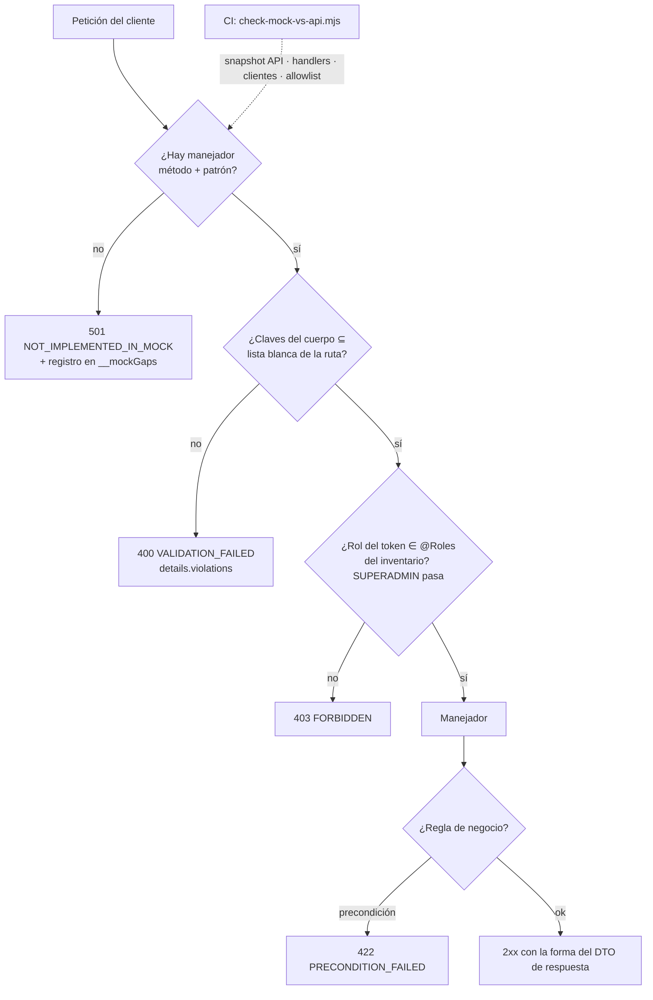

# TASK PROMPT: BR-02 — Mock honesto: 501 ante ruta desconocida, whitelist, roles y errores reales, inventario mock↔API en CI

> **MODO DE EJECUCIÓN:** este prompt se ejecuta en **Modo Planificación (Planning Mode)**.
> El desarrollador o el agente arranca investigando, sin tocar código fuente. Con eso escribe un
> `implementation_plan.md` detallado y espera la aprobación explícita del usuario. Después
> ejecuta los cambios en commits atómicos, verifica con pruebas unitarias y de integración, y
> **contra el artefacto real levantado**. El resultado queda documentado en `walkthrough.md`.

| Campo | Valor |
|---|---|
| **Cierra** | TX-05, TX-06, TX-12, TX-13 (anexo D) · ID-20 (anexo A) · AG-26, AG-33, AG-34 (anexo C) · CL-12, CL-13, CL-21, CL-22, CL-41, CL-52, CL-53, CL-71 (anexo B) · CV-05 (anexo E) |
| **Severidad máxima** | Bloqueante (TX-05: cada operación sin ruta rompe una pantalla con la API real) |
| **Repo(s)** | `mantra-core-health` (front): `src/app/core/mock/`, `src/app/core/http/`, `scripts/`, `.github/workflows/ci.yml` |
| **Toca el modelo** | No |
| **Depende de** | Nada para empezar. **Destapa** el trabajo de BR-07, BR-11, BR-12, BR-18, BR-19 y BR-23 (las rutas que faltan en la API se resuelven allá, no acá) |
| **Decisión previa** | Ninguna del README §8. Decisión interna del plan: **501 ruidoso** o **fallo de prueba** ante una ruta sin manejador (ver §5) |

---

## 1. Contexto de negocio y justificación técnica

### A. Por qué importa
La maqueta (`mockup`) es lo que el equipo y el cliente usan para validar el producto, y hoy
**todo recorrido sale verde aunque la API lo rechace**. El mock inventa éxitos para rutas que no
existen, no aplica la lista blanca de los DTO, no controla roles y responde los errores con otra
forma que la API. Antes de apagarlo (BR-01) hay que **volverlo honesto**, para que la maqueta
muestre las brechas, y dejar un chequeo en CI que impida que el inventario vuelva a divergir.

### B. Estado del frontend (`mantra-core-health`, `mockup` @ `9b3e0101`, verificado)
**Mecanismos que esconden brechas** (rutas bajo `src/app/`):
- `core/mock/mock-backend.interceptor.ts:86-88` → `respuestaGenerica` (`:297-320`): GET 200
  `{items:[],count:0}`, DELETE 204, escrituras = eco del cuerpo con `id: mock-…` y
  `status:'ACTIVE'`. Sólo un `console.warn` (TX-06).
- `core/mock/mock-router.ts:61-69` `preconditionFailed` → **412** (la API: **422**,
  `api/src/common/errors/domain.exception.ts:106-118`); `:84-92` `validation` → **422 + `issues`**
  (la API: **400** + `details.violations`) (TX-12). 26 usos en 8 archivos de `handlers/`.
  `features/clinical-record/request-access/request-access.ts:104` ramifica por `http === 412`.
- `core/http/api-error.ts:10-30`: 12 códigos; faltan `TIMEOUT`, `CIRCUIT_OPEN`,
  `CONCURRENCY_LIMIT` (`api/src/common/errors/error-codes.ts:34,41,48`); `readApiError`
  (`:63-65`) devuelve `null` y se pierden `correlationId` y `message` (TX-13).
- **Hallazgo nuevo:** `core/mock/mock-session.ts:89` firma a `medica@alovida.mock`
  `['PRACTITIONER','CLINICIAN','SCHEDULING_ADMIN']`; la API da al médico autorregistrado sólo
  `['PRACTITIONER']` (`api/…/iam-practitioner-self-registration.service.ts:1016`). Aun con control
  de roles, la médica demo pasaría el check-in (AG-02) y el hold (AG-03). El token es `alg:none`,
  dura **8 h** (API: 15 min), no trae `scopedRoles` y trae `ownTenantId` (TX-11 → BR-04).

**Las 19 operaciones que el front llama y la API no tiene (TX-05) y qué prompt las resuelve.**
`inventarios/client-calls.json` trae 21 llamadas con `api: null` (la cifra de CV-05). TX-05
descarta dos falsos positivos: `POST /identity/verification-cases/:id/checks:plan` (existe como
`checks\:plan`) y `POST /v1/triage/analyze` (otro servicio, BR-03). Quedan 19:

| # | Operación | Cliente | Hallazgo | Resuelve |
|---|---|---|---|---|
| 1-2 | `GET` y `PUT /clinical/me/medical-aspects` | `clinical/clinical.client.ts` | CL-04, CV-01 | **BR-12** (decisión D-B) |
| 3 | `POST /clinical/medication-requests/:id/attachments` | idem | CL-05 | **BR-11** |
| 4 | `POST /clinical/allergy-intolerances/:id/attachments` | idem | CL-05 | **BR-11** |
| 5 | `GET /community/conversations/:id` | `community/community.client.ts:372` | — | **BR-02** (falso positivo, ver abajo) |
| 6 | `PATCH /forms/field-definitions/:id` | `forms/forms.client.ts` | CL-61, CL-69 | **BR-18** |
| 7-8 | `PATCH` y `DELETE /forms/assignments/:id` | idem | CL-61 | **BR-18** |
| 9 | `PUT /forms/assignments/order` | idem | CL-61 | **BR-18** |
| 10 | `PATCH /profiles/practitioners/me/credentials/:id` | `profiles/profiles.client.ts` | ID-06 | **BR-07** (PR #453 la agrega) |
| 11-12 | `PATCH` y `DELETE …/me/specialties/:id` | idem | ID-07 | **BR-07** (#453 no) |
| 13-14 | `PATCH` y `DELETE …/me/jurisdiction-authorizations/:id` | idem | ID-08 | **BR-07** (#453 no) |
| 15 | `GET /public/profiles/f/:slug/branch-availability` | `public-catalog/public-catalog.client.ts` | AG-16, AG-42 (P37) | **BR-23** |
| 16 | `PATCH /surveys/templates/:id` | `surveys/surveys.client.ts:146` | CL-72 | **BR-19** |
| 17-18 | `PATCH` y `DELETE /surveys/templates/:id/questions/:qid` | idem | CL-60 | **BR-19** |
| 19 | `PUT /surveys/templates/:id/questions/order` | idem | CL-60 | **BR-19** |

**Reconciliación de cifras (verificada en código, corrige al anexo D).** La fila 5 es un **falso
positivo**: `community.client.ts:370-374` concatena `` `/community/conversations/${id}` + `/attachments/${fileId}/content` ``
y el extractor leyó sólo el primer literal; esa ruta **existe** en la API y lo que falta es el
manejador del mock (AG-26). A la vez, el cruce **no vio tres llamadas reales** que pasan por
`getPage(` (`public-catalog.client.ts:61,72,87`): `GET /public/profiles/o/:slug/services` (P30),
`…/f/:slug/products` (P31) y `…/f/:slug/branches` (P37) → **BR-23**; la API sólo tiene
`/public/profiles/:prefijo/:slug` y `…/reviews`. Cifra real: **18 + 3 = 21 operaciones** sin ruta,
más el triage externo: el mismo número que CV-05, con otra composición.

**Las 34 entradas de `mock-missing.json`:** 18 son operaciones de la tabla de arriba, 3 son las de
`getPage`, 1 es el falso positivo `checks:plan` y **12 son alias muertos** que ningún cliente
llama (el README dice 13; la diferencia sería `checks:plan`, sin confirmar):

Alias muertos (ruta del mock → ruta real): `PUT …/identity-providers/:id/protocol-configs` → `POST`;
`POST /charts/notes/:id/versions` → `PUT` (CL-22); `POST /community/reactions` → `PUT` (AG-26);
`DELETE /diagnostic-results/me/:id/shares/:shareId` → `POST …/revoke` (CL-53);
`GET /identity/verification-types` → `GET /identity/me/verification-types`;
`PATCH /notifications/preferences/me` → `PUT` (AG-26); `POST /pharmacy/orders/:id/mark-ready` y
`…/keep-original` → `ready`, `prefer-original` (AG-33); `POST …/team-members/:memberId/decline` →
`respond` (CL-52); `GET /public/posts/:id/comments/:commentId/replies` → `GET /public/comments/:commentId/replies`,
que no tiene manejador (AG-26); `POST /surveys/templates/:id/publish` → no existe (CL-71);
`POST /scheduling/bookings/:id/payment-state` → `PUT`, **fuera de alcance (pago)**.

**Las «mentiras del mock» que este prompt corrige** (README §9.6 dice «al menos 12»):
1. Éxito inventado para cualquier ruta sin manejador (TX-06).
2. Precondición en 412 y validación en 422 + `issues` (TX-12).
3. Sin lista blanca: `register-*` acepta cualquier cuerpo (`auth.handlers.ts:93-120`, ID-20) y
   `PUT …/versions` deja mover la nota de paciente (`clinical.handlers.ts:627-644`, CL-21).
4. `PATCH /profiles/patients/me` ignora `sexAtBirth`, `occupationFreeText`, `taxId`,
   `taxHolderName` (`profiles.handlers.ts:641-671`); el NIT del médico es `nationalId + "011"` (ID-20).
5. Sin roles: check-in (`scheduling.handlers.ts:323-329`), hold (`:177-222`), `/procedure-cases`
   (CL-54); `puedeLeer` (`clinical.handlers.ts:43-51`) deja leer cualquier historia, la API exige
   atención en curso, turno hoy o relación asistencial (CL-13, `clinical-read.service.ts:186-230`).
6. Roles de la médica demo inflados (hallazgo nuevo, arriba).
7. Receta firmada = ACTIVE y emisión sin firma (la API: DRAFT y 422 por D-05); condición sin
   transiciones; encuentro sin 409/422; estados literales en vez de uuid (CL-12).
8. `GET …/me/:id/shares` devuelve un arreglo pelado (`diagnostics.handlers.ts:663`) → el panel
   «Compartido con» falla siempre (CL-41).
9. Disponibilidad de farmacia lee `productIds` (`pharmacy.handlers.ts:288`); el cliente manda
   `products` (AG-34).
10. `POST /community/reports` devuelve `{id, queued}` (`community.handlers.ts:863`), no
    `{id, moderationQueueId}` (AG-26).
11. `respond` del integrante quirúrgico siempre `RECHAZADO` (`procedures.handlers.ts:151-162`, CL-52).
12. Encuestas: lee `appointmentBookingIds[]` (`surveys-forms.handlers.ts:320-324`), ignora la
    vigencia y devuelve campos de más (CL-71).

### C. Qué tiene que ver la API
**Ningún cambio en la API.** Es la referencia del contrato:
- `ValidationPipe` global `whitelist + forbidNonWhitelisted + transform` (`src/main.ts:158-165`).
- Filtro de errores: **`src/common/filters/all-exceptions.filter.ts`** (el anexo D lo ubica en
  `common/errors/`, la ruta real es `common/filters/`): `details.violations` en `:395`,
  `PRECONDITION_FAILED` en `:417`, `TIMEOUT` para 408/504 en `:424-426`.
- `@Roles` y el comodín `SUPERADMIN` en `src/common/auth/roles.guard.ts:37-52`.

### D. Aislamiento
Sólo cambia el **simulador**, el contrato de error del cliente y el CI. **No** se implementa
ninguna ruta que falte: eso es de los prompts de la tabla. **No** se reescriben clientes salvo la
rama 412 de `request-access.ts` y `API_ERROR_CODES`. Con el mock honesto, algunas pantallas de
la maqueta van a mostrar 501, 400 o 403: **es el resultado buscado** y cada una queda anotada con
su prompt. Pago y delivery quedan fuera: `payment-state` se lista como excluido, no se toca.

---

## 2. Flujo de Git y entrega

```bash
cd mantra-core-health
git status                               # árbol limpio
git fetch origin
git checkout -b <dev>/fix-mock-honesto-e-inventario origin/mockup
```

- **Rama base y destino del PR:** `mockup`.
- Commits atómicos y convencionales, por ejemplo:
  - `fix(mock): 501 NOT_IMPLEMENTED_IN_MOCK ante ruta sin manejador`
  - `fix(mock): precondición 422 y validación 400 con details.violations`
  - `fix(http): API_ERROR_CODES completo y request-access ramifica por code`
  - `feat(mock): lista blanca y @Roles desde el inventario; roles demo = los de la API`
  - `fix(mock): estados de receta, condición, encuentro y nota; formas de shares, reports, respond`
  - `chore(mock): borrar los 12 alias muertos` · `ci: check-mock-vs-api obligatorio`
- PR con `gh pr create --base mockup --reviewer jsaldias39,PabloArauzCaballero`, con la salida del
  script antes y después y la lista de pantallas que ahora muestran el error real.
- **El merge exige revisión humana.** El flujo termina en abrir el PR.

---

## 3. Diagrama



---

## 4. Archivos a modificar o crear

- `[CREAR]` `scripts/check-mock-vs-api.mjs`: el chequeo de CI (diseño abajo).
- `[CREAR]` `scripts/sync-api-inventory.mjs`: regenera el snapshot desde un clon de la API
  (`node scripts/sync-api-inventory.mjs ../mantra-core-health-redesa-api`). Parte de
  `inventarios/extraer-rutas-api.js` y agrega, por ruta, los `@Roles` efectivos (clase + método)
  y el nombre del DTO del `@Body()`.
- `[CREAR]` `scripts/api-inventory/api-routes.json` (snapshot con fecha y commit de la API) y
  `scripts/api-inventory/mock-vs-api.allowlist.json`; `scripts/check-mock-vs-api.test.mjs` (`node:test`).
- `[CREAR]` `src/app/core/mock/mock-contract.ts`: `permitirSolo(request, claves)` → 400 con
  `details.violations`; `exigirRol(request, roles)` → 403.
- `[MODIFICAR]` `core/mock/mock-backend.interceptor.ts` (501 + ruta en `window.__mockGaps`),
  `mock-router.ts` (422 / 400 + `details.violations`), `mock-session.ts` (roles de la API, 15 min).
- `[MODIFICAR]` handlers: `auth`, `profiles` (ID-20); `clinical` (CL-12, CL-13, CL-21, CL-22);
  `diagnostics` (CL-41, CL-53); `pharmacy` (AG-33, AG-34); `community`, `public`, `notifications`
  (AG-26); `procedures` (CL-52); `surveys-forms` (CL-71); `scheduling`; `admin-modules`, `identity`.
- `[CREAR]` `pharmacy.handlers.spec.ts`, `procedures.handlers.spec.ts`, `surveys-forms.handlers.spec.ts`;
  ampliar `clinical.handlers.spec.ts` y `diagnostics.handlers.spec.ts`.
- `[MODIFICAR]` `core/http/api-error.ts` y `error-to-view-state.ts` (3 códigos, estado reintentable);
  `features/clinical-record/request-access/request-access.ts:104` (por `code`).
- `[MODIFICAR]` `.github/workflows/ci.yml` (paso junto a `check-api-prefixes`, l. 114) y
  `core/mock/README.md` (qué es honesto y cómo leer un 501).

**Diseño de `scripts/check-mock-vs-api.mjs`:**
1. **Entradas.** El snapshot de rutas de la API; los manejadores (`router.(get|post|put|patch|delete)`
   en `core/mock/handlers/*.ts`); las llamadas de `core/data-access/**` y `features/**`.
2. **Extracción del cliente con el compilador de TypeScript** (`typescript` ya es dependencia),
   no con regex de una línea: recorre `CallExpression` de `http.<verbo>` y de envoltorios
   conocidos (`getPage`, `this.url`, `apiUrl`); resuelve literales, plantillas y
   concatenaciones con `+`; normaliza `${…}` y `:param` a `:x`; desescapa `\:`. Los orígenes
   externos (`AI_BASE_URL`) se clasifican aparte.
3. **Tres listas:** (a) llamadas del cliente sin ruta en la API; (b) manejadores del mock sin
   ruta en la API; (c) llamadas del cliente sin manejador (hoy caerían en 501).
4. **Allowlist con trinquete.** Cada excepción lleva `{m, p, lista, prompt, motivo}`. Falla si
   aparece algo que no está en la allowlist, y **también** si una entrada ya no hace falta, para
   que al cerrarse BR-12 la excepción se borre en el mismo PR.
5. **Salida:** tabla legible y `--json`; exit 1 con el nombre de cada ruta. Nada escribe en disco
   salvo `--write-report <archivo>`.

---

## 5. Reglas de implementación

- **El mock imita, no mejora.** Si la API rechaza, el mock rechaza igual (código, status y forma);
  si la API tiene un defecto, el mock lo reproduce y el defecto va a su prompt.
- **501 por defecto.** Si el plan elige «fallo de prueba», el 501 sigue existiendo en ejecución:
  la maqueta se recorre a mano.
- **Lista blanca y roles salen del inventario de la API**, no a mano. Sin DTO en el snapshot: TODO
  explícito, no se adivina.
- **Ramificar por `code`, nunca por status.** **Sin enums inventados:** estados como uuid de
  concepto (`core/mock/fixtures/conceptos.ts`).
- **No debilitar pruebas** (`NO_TEST_WEAKENING`): si un spec fijaba 412 o `issues`, se reescribe su
  contrato y se explica en el PR.
- **La maqueta sigue viva:** `yarn start` arranca y las cinco cuentas entran; lo que fingía éxito
  muestra el estado M34 (S5, S9 con ID, o el 501). Pago y delivery: sólo se listan como excluidos.

---

## 6. Criterios de aceptación (Gherkin)

```gherkin
Escenario: Una ruta sin manejador no finge éxito
  Dado la maqueta encendida
  Cuando la aplicación hace POST a una ruta que ningún manejador cubre
  Entonces recibe 501 con code "NOT_IMPLEMENTED_IN_MOCK"
  Y la pantalla muestra el estado de error con el ID de la petición

Escenario: Precondición fallida igual en mock y en API
  Dado un profesional sin perfil propio
  Cuando pide un vínculo de acceso a un paciente en la maqueta
  Entonces recibe 422 PRECONDITION_FAILED
  Y ve "Tu cuenta no tiene un perfil profesional propio…", igual que contra la API

Escenario: Clave no declarada en el DTO
  Dado la maqueta encendida
  Cuando el alta de médico manda "workEmail"
  Entonces recibe 400 VALIDATION_FAILED con details.violations, igual que la API

Escenario: El check-in respeta los roles que emite la API
  Dado la médica demo con los roles que la API le da a un médico autorregistrado
  Cuando pulsa "Llegó" en Mi agenda
  Entonces recibe 403 FORBIDDEN hasta que BR-06 habilite PRACTITIONER

Escenario: Receta sin firmar
  Dada una receta en DRAFT sin firma y una política D-05 activa
  Cuando se emite en la maqueta
  Entonces recibe 422 PRECONDITION_FAILED y la pantalla ofrece "Firmar"

Escenario: El inventario no crece
  Dado un PR que agrega un manejador de mock sin ruta en la API
  Cuando corre check-mock-vs-api
  Entonces falla nombrando el método y la ruta

Escenario: La allowlist no se pudre
  Dado que BR-12 agregó GET /clinical/me/medical-aspects a la API y al snapshot
  Cuando corre check-mock-vs-api con la excepción todavía en la allowlist
  Entonces falla pidiendo borrar la entrada

Escenario: Llamadas a través de envoltorios
  Dado public-catalog.client.ts que llama getPage con "/public/profiles/o/:slug/services"
  Cuando corre check-mock-vs-api
  Entonces la llamada aparece en la lista de operaciones sin ruta
```

---

## 7. Definition of Done

- [ ] `implementation_plan.md` aprobado, con la elección 501 / fallo de prueba escrita.
- [ ] 501 en vez de `respuestaGenerica`; 12 alias muertos borrados; manejadores de
      `/public/comments/:commentId/replies` y de adjuntos de conversación agregados.
- [ ] Errores alineados (422 / 400 + `details.violations`), `request-access.ts` por `code`,
      `API_ERROR_CODES` completo; lista blanca y `@Roles` desde el snapshot; roles demo de la API.
- [ ] CL-12, CL-13, CL-21, CL-41, CL-52, CL-71, AG-26, AG-34 corregidos, cada uno con su spec.
- [ ] `check-mock-vs-api.mjs` en el CI, **probado rompiéndolo a propósito**; su allowlist lista las
      21 operaciones con su prompt.
- [ ] `corepack yarn lint`, `typecheck`, `build` y `test --watch=false` en verde.
- [ ] **Evidencia de runtime en el PR:** alta de médico con `workEmail`, receta sin firmar y acceso
      sin perfil propio, en la maqueta y contra la API viva (`real-api` + `mantra-redesa`): status,
      `code` y cuerpo **idénticos** (UI → request → response → recarga → UI). Más la lista de
      pantallas que ahora muestran 501/403, cada una con su prompt.
- [ ] PR abierto con revisores `jsaldias39` y `PabloArauzCaballero`, y `walkthrough.md`.

---

## 8. Plan de QA

### A. Pruebas automatizadas
```bash
corepack yarn test --watch=false --include=src/app/core/mock/**
corepack yarn test --watch=false --include=src/app/core/http/**
corepack yarn test --watch=false --include=src/app/features/clinical-record/request-access/**
node --test scripts/check-mock-vs-api.test.mjs
node scripts/check-mock-vs-api.mjs
node scripts/check-client-prefixes.mjs && node scripts/check-api-prefixes.mjs
```
- `mock-backend.spec.ts`: barrido de `router.rutas()` contra el snapshot y la allowlist; cada
  `validation(`/`preconditionFailed(` con un spec que fija status y forma.

### B. Integración (contra la API real)
1. `mantra-redesa` con seeds + `corepack yarn start --configuration real-api`; repetir los 3 casos
   del DoD en `real-api` y en la maqueta y comparar en la pestaña Red.
2. Regenerar el snapshot con `scripts/sync-api-inventory.mjs`: el diff sólo trae rutas reales nuevas.

### C. Verificación manual y logs
- Recorrer la maqueta con las cinco cuentas y juntar `window.__mockGaps`: cada entrada está en la
  tabla de §1.B con su prompt. Ningún `[mock] sin manejador` silencioso.
