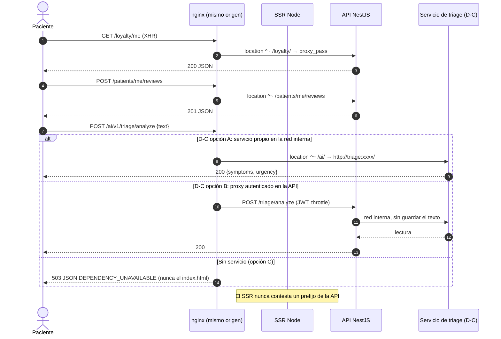

# TASK PROMPT: BR-03 — Enrutado de producción (nginx y proxy) y servicio de triage IA

> **MODO DE EJECUCIÓN:** este prompt se ejecuta en **Modo Planificación (Planning Mode)**.
> El desarrollador o el agente arranca investigando, sin tocar código fuente. Con eso escribe un
> `implementation_plan.md` detallado y espera la aprobación explícita del usuario. Después
> ejecuta los cambios en commits atómicos, verifica con pruebas unitarias y de integración, y
> **contra el artefacto real levantado**. El resultado queda documentado en `walkthrough.md`.

| Campo | Valor |
|---|---|
| **Cierra** | TX-07, TX-08 (anexo D) · CL-73, CL-74, CL-75, CL-76 (anexo B) |
| **Severidad máxima** | Bloqueante de salida a producción (TX-07, TX-08) |
| **Repo(s)** | `mantra-core-health` (front): `proxy.conf*.json`, `proxy.conf.mjs`, `deploy/`, `features/symptom-check`, `core/data-access/triage-ia`. Infra: nginx del despliegue. API sólo si D-C elige la opción B |
| **Toca el modelo** | No. CL-76 (persistir el chequeo) queda como TODO de modelo, no se implementa acá |
| **Depende de** | Nada para el enrutado. El triage depende de la decisión D-C. La prueba final se apoya en BR-01 (artefacto de producción) |
| **Decisión previa** | **D-C**: qué servicio atiende `/v1/triage/analyze`, con qué base legal y dónde corre (README §8) |

---

## 1. Contexto de negocio y justificación técnica

### A. Por qué importa
En producción el front vive detrás de nginx y **cualquier prefijo que nginx no conozca lo
contesta el SSR con el `index.html` y un 200**. El cliente recibe HTML donde espera JSON y lo
muestra como «error inesperado», o peor, lo trata como vacío en silencio. Hoy pasa con la
billetera (`/loyalty`), con las reseñas del paciente (`/patients/me/reviews`) y con el triage IA
(`/ai`). El triage además manda **texto clínico del paciente, sin autenticar, a una IP pública
con DNS de terceros**, y el dictado manda la voz a Google. Eso choca con la regla de la casa:
PHI «nunca a servicios de terceros no acordados» (`AGENTS.md` §1.4, regla 90.2.4).

### B. Estado del frontend (`mantra-core-health`, `mockup` @ `9b3e0101`, verificado)
**Prefijos (TX-07):**
- `node scripts/check-api-prefixes.mjs` (corrido hoy) → ✗: «`proxy.conf.docker.json` no declara
  `/loyalty`» y «`deploy/api-locations.conf` + `nginx.conf` no declara `/loyalty`». Está sólo en
  `proxy.conf.json:81`.
- `node scripts/check-client-prefixes.mjs` → ✗: `CommunityClient (1) POST /patients/me/reviews`
  (`community.client.ts:802`) no está en **ningún** proxy. La API sí la tiene
  (`community/controllers/patient-reviews.controller.ts`). Las rutas `GET /loyalty/me`,
  `/loyalty/me/points`, `POST /loyalty/me/points/redeem` existen en
  `promotions/controllers/loyalty.controller.ts`.
- `deploy/api-locations.conf` es el único archivo de prefijos y lo incluyen `deploy/nginx.conf:123`
  y `deploy/nginx.coolify.conf:74`; lo que no está ahí cae en `location /` (SSR). `/socket.io/`
  sí está (l. 166).
- **El CI del front no corre `check-client-prefixes`:** `.github/workflows/ci.yml` corre
  `check-api-prefixes` (l. 114) y `check-route-prefixes` (l. 120), pero no éste. Por eso
  `/patients/me/reviews` entró sin que nadie lo viera.
- Ninguna ruta del router de Angular empieza con `loyalty`, `patients` o `ai` (grep en
  `*.routes.ts`): agregar los prefijos no se come una pantalla.

**Triage IA (TX-08, CL-73, CL-74, CL-75):**
- `core/data-access/triage-ia/triage-ia.client.ts:52-63`: `HttpClient` sobre `HttpBackend`, **sin
  interceptores ni mock**, `POST {aiBaseUrl}/v1/triage/analyze` con `{ text }`, timeout 4 s y
  `catchError(() => of(null))`: cualquier error, incluido un HTML del SSR, se traga en silencio.
- `src/environments/environment.ts:29`: `aiBaseUrl: envFromProcess.aiBaseUrl ?? '/ai'`.
  `scripts/generate-env.mjs:77` acepta `PUBLIC_AI_BASE_URL`.
- `proxy.conf.mjs:30-45`: `/ai/` va a `ALOVIDA_AI_TARGET ?? 'https://ai.173.249.39.237.sslip.io'`
  con `pathRewrite`. El comentario dice que «en el despliegue lo enruta Traefik», pero **ni
  `deploy/` ni el `docker-compose*.yml` del front tienen una regla de Traefik ni un
  `location /ai`** (grep: 0).
- Ningún repo del workspace contiene `AlovidaAIService` ni `triage/analyze`. **Sin confirmar**
  dónde vive, quién lo opera, qué modelo usa y si registra el texto.
- `triage-ia.client.ts:66-90` (CL-74): exige `urgency ∈ {urgente, prioritaria, programada}` en
  castellano, `kind ∈ {curated, anatomy}`, zonas con los ids de `ZONAS_DEL_CUERPO` y
  **especialidades por nombre**, no por `concept_id`. `symptom-check.ts:524-540` las mapea por
  nombre normalizado contra una sola página de profesionales.
- `features/symptom-check/dictado.ts:32` (CL-75): `SpeechRecognition ?? webkitSpeechRecognition`;
  en Chrome el audio se procesa en servidores de Google. `src/server/security-headers.ts:271`
  pasó a `microphone=(self)`. No hay aviso previo ni registro de base legal
  (`consent.processing_legal_bases` existe en el módulo 07 y no se usa).
- `security-headers.ts:235`: `connect-src 'self'` más el origen de la API. **Un `aiBaseUrl`
  absoluto a otro dominio lo bloquearía la CSP**: el triage tiene que ser mismo origen.
- CL-76: el resultado del chequeo no se persiste; la pantalla navega con query params
  (`symptom-check.ts:507-510`). No hay entidad de triage en ningún `.puml`.
- `symptom-check` y `triage-ia` existen sólo en `mockup`; `origin/dev` no tiene `aiBaseUrl`.

### C. Qué tiene que ver la API
- **Enrutado:** ningún cambio; las rutas existen.
- **Triage:** `mantra-core-health-redesa-api` no tiene nada de triage. Sólo cambia si D-C elige la
  opción B (proxy autenticado en la API). En ese caso: rama desde `origin/dev`, módulo nuevo sin
  tablas (no persiste), controlador registrado en `controllers` del módulo, `@Throttle` propio,
  `@Roles('PATIENT', …)` y auditoría de la llamada **sin el texto**.
- CORS cerrado (`main.ts:143-145`, `origin:false`): todo va por el mismo origen.

### D. Aislamiento
El enrutado toca sólo configuración de proxies y el CI. El triage toca un cliente, una pantalla
y el despliegue. **No** se crea ninguna tabla (CL-76 queda como TODO de modelo). Si D-C no está
resuelta al ejecutar, el PR sale igual con el enrutado y con el triage **apagado de forma
explícita** (opción C), sin la IP en el repo.

---

## 2. Flujo de Git y entrega

```bash
cd mantra-core-health
git status                               # árbol limpio
git fetch origin
git checkout -b <dev>/fix-enrutado-produccion-y-triage-ia origin/mockup
```

- **Rama base y destino del PR:** `mockup`. Si D-C elige la opción B, un segundo PR en la API:
  `git checkout -b <dev>/feat-proxy-triage-ia origin/dev`, `gh pr create --base dev`.
- Commits atómicos y convencionales, por ejemplo:
  - `fix(proxy): /loyalty en proxy.conf.docker.json y api-locations.conf`
  - `fix(proxy): /patients/me/reviews en las tres declaraciones`
  - `ci: check-client-prefixes obligatorio`
  - `fix(proxy): /ai sin destino por defecto; la IP sale del repo`
  - `fix(nginx): /ai responde JSON 503 cuando el servicio no está desplegado`
  - `feat(symptom-check): aviso y aceptación antes de dictar o enviar a la IA`
  - `feat(triage-ia): telemetría ia-no-disponible y respuesta no-JSON detectada`
  - `docs(ops): runbook del servicio de triage (dueño, contrato, base legal)`
- PR con `gh pr create --base mockup --reviewer jsaldias39,PabloArauzCaballero`, con la salida de
  los `check-*-prefixes` y los `curl` contra nginx pegados.
- **El merge exige revisión humana.** El flujo termina en abrir el PR.

---

## 3. Diagrama



---

## 4. Archivos a modificar o crear

- `[MODIFICAR]` `deploy/api-locations.conf`: `location ^~ /loyalty/`, `location ^~ /patients/me/reviews`
  (prefijo largo, la regla de `check-route-prefixes`) y el bloque `/ai/` según D-C. Sin servicio:
  `location ^~ /ai/ { default_type application/json; return 503 '{"code":"DEPENDENCY_UNAVAILABLE",…}'; }`.
- `[MODIFICAR]` `proxy.conf.json` (+ `/patients/me/reviews`) y `proxy.conf.docker.json`
  (+ `/loyalty`, `/patients/me/reviews`).
- `[MODIFICAR]` `proxy.conf.mjs`: sin `ALOVIDA_AI_TARGET` no se declara el contexto `/ai/`; la
  IP `173.249.39.237` sale del repo.
- `[MODIFICAR]` `scripts/check-api-prefixes.mjs`: también exige que, si `aiBaseUrl` es relativo,
  exista un `location` para él en `api-locations.conf`.
- `[MODIFICAR]` `.github/workflows/ci.yml`: paso `node scripts/check-client-prefixes.mjs`.
- `[MODIFICAR]` `core/data-access/triage-ia/triage-ia.client.ts`: distinguir «servicio no
  disponible» (status 0, 5xx, `content-type` no JSON) de «lectura vacía»; emitir el evento de
  telemetría `ia-no-disponible`; aceptar `especialidades[].code` de `VS_MEDICAL_SPECIALTY`
  (CL-74) y preferirlo sobre el nombre.
- `[MODIFICAR]` `features/symptom-check/symptom-check.ts` y `dictado.ts`: aviso previo que dice
  qué servicio procesa el texto y la voz, con aceptación explícita antes del primer envío o
  dictado (CL-75); un flag de entorno para apagar el dictado en producción.
- `[CREAR]` `core/data-access/triage-ia/triage-ia.contract.spec.ts`: fija la forma del contrato con
  un fixture copiado del OpenAPI del servicio (cuando D-C diga cuál es).
- `[CREAR]` `docs/operations/triage-ia.md`: dueño, repositorio, dónde corre, modelo, retención del
  texto, base legal, cómo se apaga.
- `[DOCUMENTAR]` CL-76 como **TODO de modelo** en ese runbook: si el producto quiere «llevar lo que
  conté al médico», hace falta una entidad nueva en `mantra-core-health-model`
  (`.puml` → `gen_ddl.py` → `SQL/` → `yarn db:vendor`). No se inventa acá.
- **Sólo con D-C = B (API):** `[CREAR]` `src/modules/triage_proxy/{triage-proxy.module.ts,
  controllers/triage-proxy.controller.ts, dto/analyze.dto.ts, triage-proxy.module.spec.ts}` y el
  registro en `app.module.ts`.

---

## 5. Reglas de implementación

- **Paso 1 del plan: pedir la decisión D-C.** Opciones:

  | Opción | Qué es | A favor | En contra |
  |---|---|---|---|
  | **A** Servicio propio en la red interna | `AlovidaAIService` se despliega junto al stack; nginx `location ^~ /ai/` → contenedor interno | Sin cambios en la API; latencia mínima; el servicio mantiene su contrato | Sigue sin autenticación ni límite por usuario; exige ubicar el repo y un dueño; la auditoría queda del lado del servicio |
  | **B** Proxy autenticado en la API | `POST /triage/analyze` en NestJS reenvía por red interna | JWT, `@Throttle`, auditoría y contrato OpenAPI propios; el servicio queda privado | Código nuevo en la API (sin tablas); un salto más; hay que versionar el contrato |
  | **C** Apagado hasta decidir | `aiBaseUrl` vacío en producción y nginx con 503 JSON | Cero PHI a terceros ya mismo; la pantalla sigue con el motor local | La demo no muestra la lectura IA |

  Cualquiera sea la opción: base legal escrita, texto **no** guardado salvo acuerdo, y **ningún
  destino fuera del mismo origen**.
- **Ningún prefijo de la API puede caer en el SSR.** Si falta un servicio, nginx responde JSON con
  el contrato de error (`code`), nunca HTML.
- **Prefijo largo cuando el corto se come el router** (regla de `check-route-prefixes`):
  `/patients/me/reviews`, no `/patients`.
- **Las tres declaraciones dicen lo mismo** (`proxy.conf.json`, `proxy.conf.docker.json`,
  `api-locations.conf`); los scripts lo hacen cumplir.
- **Sin IPs ni hosts de terceros en el repo.** El destino del triage entra por variable del
  despliegue.
- **El dictado no graba sin aviso.** La primera vez se explica quién procesa la voz y hay que
  aceptarlo; la aceptación no se guarda en `localStorage` como sustituto de un consentimiento.
- **Sin enums inventados:** las especialidades se resuelven por `concept_id`; el nombre es
  sólo un respaldo.
- Si D-C = B: `whitelist + forbidNonWhitelisted` aplica al DTO (`text` y nada más), y el log
  **nunca** incluye el texto (la redacción de `pino-options.ts` lo tiene que cubrir).

---

## 6. Criterios de aceptación (Gherkin)

```gherkin
Escenario: Todo prefijo de cliente llega a la API
  Dado deploy/api-locations.conf
  Cuando se corren check-client-prefixes y check-api-prefixes
  Entonces ambos salen en verde

Escenario: Billetera en producción
  Dado un paciente en el despliegue con nginx
  Cuando pide GET /loyalty/me
  Entonces recibe JSON de la API con Content-Type application/json, no el index.html

Escenario: Reseña del paciente en producción
  Dado un paciente con una cita atendida
  Cuando publica una reseña
  Entonces POST /patients/me/reviews llega a la API y responde 201 o un error JSON con code

Escenario: El triage llega al servicio acordado
  Dado producción detrás de nginx y D-C resuelta con la opción A o B
  Cuando un paciente describe "dolor de pecho"
  Entonces POST /ai/v1/triage/analyze (o /triage/analyze) responde JSON del servicio acordado

Escenario: Sin servicio, sin fuga y sin silencio
  Dado el servicio de IA apagado
  Cuando el paciente analiza sus síntomas
  Entonces nginx responde 503 JSON, la pantalla sigue con el motor local
  Y queda registrado el evento "ia-no-disponible"
  Y el texto no sale a ningún otro destino

Escenario: Dictado con aviso
  Dado un paciente que pulsa "Dictar" por primera vez
  Cuando aparece el aviso
  Entonces ve qué servicio procesa su voz y tiene que aceptarlo antes de grabar

Escenario: Especialidad por concepto
  Dado una lectura IA con una especialidad del catálogo
  Cuando el paciente pulsa "Ver profesionales"
  Entonces navega con especialidad=<conceptId>, no con el nombre

Escenario: Un prefijo nuevo sin rutear no se fusiona
  Dado un PR que agrega una llamada a un prefijo que ningún proxy declara
  Cuando corre el CI
  Entonces check-client-prefixes falla y nombra la ruta
```

---

## 7. Definition of Done

- [ ] `implementation_plan.md` aprobado, con **D-C escrita** (opción, dueño del servicio, base
      legal y dónde corre).
- [ ] `/loyalty` y `/patients/me/reviews` en las tres declaraciones; `check-client-prefixes`,
      `check-api-prefixes` y `check-route-prefixes` en verde y **los tres en el CI**.
- [ ] La IP `173.249.39.237` no aparece en el repo (`git grep` vacío).
- [ ] `/ai/` resuelto según D-C; sin servicio, 503 JSON desde nginx.
- [ ] Aviso previo al dictado y al envío; telemetría `ia-no-disponible`; especialidades por
      `concept_id`; spec de contrato del triage.
- [ ] Runbook `docs/operations/triage-ia.md` y TODO de modelo de CL-76 escritos.
- [ ] `corepack yarn lint`, `corepack yarn typecheck`, `corepack yarn build` y
      `corepack yarn test --watch=false` en verde.
- [ ] **Evidencia de runtime pegada en el PR**, con el artefacto de BR-01 detrás de nginx
      (`deploy/nginx.conf` + `api-locations.conf`) y la API local `mantra-redesa`:
  - `curl -si /loyalty/me` y `curl -si -X POST /patients/me/reviews` con token: cabecera
    `content-type: application/json` y cuerpo de la API;
  - `curl -si -X POST /ai/v1/triage/analyze`: JSON del servicio o 503 JSON, nunca HTML;
  - captura de la pantalla de síntomas con el aviso y con el servicio apagado.
- [ ] Si D-C = B: `corepack yarn build` de la API, `node dist/src/main.js` y el log con
      `Mapped {/triage/analyze, POST}`; `triage-proxy.module.spec.ts` exige el controlador en
      `controllers`; PR `--base dev` en la API.
- [ ] PR abierto con revisores `jsaldias39` y `PabloArauzCaballero`, y `walkthrough.md`.

---

## 8. Plan de QA

### A. Pruebas automatizadas
```bash
node scripts/check-client-prefixes.mjs
node scripts/check-api-prefixes.mjs
node scripts/check-route-prefixes.mjs
corepack yarn test --watch=false --include=src/app/core/data-access/triage-ia/**
corepack yarn test --watch=false --include=src/app/features/symptom-check/**
```
- Spec del cliente: HTML con 200, status 0 y 503 dan «no disponible» (con evento), no «vacío».
- Spec de `check-api-prefixes` con una copia de `api-locations.conf` sin `/loyalty`: tiene que
  fallar.

### B. Integración (artefacto real)
1. API y almacenes arriba (`mantra-redesa`, seeds cargados).
2. Front `production-api` (BR-01) detrás de nginx con el `api-locations.conf` nuevo.
3. Login de paciente → billetera → reseña → chequeo de síntomas, con la pestaña Red abierta:
   cada petición a un prefijo de la API trae JSON.
4. Apagar el servicio de triage (o no desplegarlo) y repetir el chequeo.

### C. Verificación manual y logs
- `access.log` de nginx: ninguna petición a `/loyalty`, `/patients` o `/ai` servida por el
  upstream del SSR.
- Log del servicio de triage (o de la API en la opción B): ninguna línea con el texto del
  paciente.
- Consola del navegador: ninguna petición a `sslip.io` ni a otro origen.
