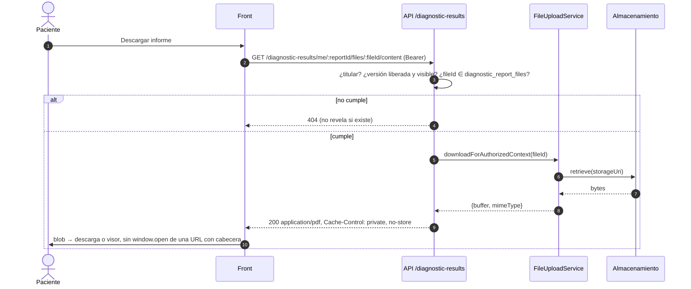

# TASK PROMPT: BR-05 — Archivos: descarga autenticada, acceso del paciente a lo suyo, escaneo y almacenamiento

> **MODO DE EJECUCIÓN:** este prompt se ejecuta en **Modo Planificación (Planning Mode)**.
> El desarrollador o el agente arranca investigando, sin tocar código fuente. Con eso escribe un
> `implementation_plan.md` detallado y espera la aprobación explícita del usuario. Después
> ejecuta los cambios en commits atómicos, verifica con pruebas unitarias y de integración, y
> **contra el artefacto real levantado**. El resultado queda documentado en `walkthrough.md`.

| Campo | Valor |
|---|---|
| **Cierra** | CL-40, CL-27, CL-28 (anexo B) · TX-09, TX-33, TX-34 (anexo D) |
| **Severidad máxima** | Bloqueante de la demo (CL-40: el paciente no puede bajar el PDF de su resultado) |
| **Repo(s)** | `mantra-core-health-api` (clon `mantra-core-health-redesa-api`): `modules/common`, `modules/diagnostics`, `docker-compose*.yml`. `mantra-core-health` (front): `core/data-access/{files,diagnostics,chart-documents,clinical}`, `features/account/diagnostic-results`, `features/clinical-record/patient-chart` |
| **Toca el modelo** | No. `common.files`, `common.file_versions`, `diagnostics.diagnostic_report_files`, `chart.document_record_files` ya existen |
| **Depende de** | Nada para empezar. BR-17 (liberación de resultados) usa esta descarga; BR-15 (historia del paciente) también |
| **Decisión previa** | Ninguna del README §8. Decisiones internas del plan: qué se hace con la URL firmada (§5) y qué adaptador de almacenamiento y escaneo va a producción |

---

## 1. Contexto de negocio y justificación técnica

### A. Por qué importa
El propósito del producto es que **el paciente sea dueño de su historia**. Hoy el paciente abre
«Mis resultados», ve su informe liberado y al pulsar «Descargar» recibe un error: la API le niega
el archivo porque **no lo subió él** (lo subió el laboratorio) y, aunque lo dejara, la pestaña que
abre el front sale **sin token**. Del lado del médico, los documentos que sube al expediente no se
pueden volver a abrir. Y en el despliegue de Coolify los archivos viven en un volumen del
contenedor y nadie los escanea, así que toda URL firmada da 422.

### B. Estado del frontend (`mantra-core-health`, `mockup` @ `9b3e0101`, verificado)
- `features/account/diagnostic-results/diagnostic-results.ts:270-291` (CL-40, TX-09): `descargar()`
  pide `FilesClient.downloadUrl()` (`core/data-access/files/files.client.ts:140`) y hace
  `window.open(url, '_blank', 'noopener')` (l. 278). La pestaña nueva **no lleva `Authorization`**.
- El propio `files.client.ts:152` advierte que `downloadUrl()` no sirve para pintar; ya existen
  descargas por `HttpClient` con `responseType: 'blob'` (l. 209, 247) y `blobToDataUrl`.
- `core/data-access/clinical/clinical.types.ts:328-337` (CL-27): `ChartDocument` no tiene `files`;
  `toDocument` lo descarta. El mock (`core/mock/fixtures/clinica.ts:430-438`) tampoco lo devuelve.
- `features/clinical-record/patient-chart/document-block/document-block.ts:263-283` (CL-28): sube
  cada archivo con `POST /common/files/upload` (un archivo por petición, l. 276) y después
  `createDocument` (l. 222). Si el último paso falla, los archivos quedan subidos y sin vínculo, y
  el reintento vuelve a subirlos.
- `core/data-access/chart-documents/chart-documents.client.ts` existe; ninguna pantalla usa la
  descarga de documentos del expediente.
- La maqueta no simula ni la titularidad del archivo ni el escaneo: en `mockup` todo baja.

### C. Estado de la API (`dev` @ `7541797c`, verificado)
- **Quién puede leer un archivo por la vía genérica** (CL-40):
  `modules/common/services/file-access.ts:47-55` `canActorReadOwnFile` → sólo quien lo subió
  (`createdByUserId`) o `FILE_REVIEWER_ROLES = ['SECURITY_ADMIN','SUPERADMIN']` (l. 27).
- **URL firmada** (TX-09): `modules/common/services/files.service.ts:609` exige
  `canActorReadOwnFile` → **403 para el paciente**; `:631-635` exige `SCAN_CLEAN` → **422**;
  `:637-645` firma con HMAC `/common/files/:id/content?versionId&expires&signature`.
- **La descarga no valida la firma:** `modules/common/controllers/common-files.controller.ts:115-123`
  `GET :id/content` exige `@CurrentUser()` e ignora `signature` y `expires`; delega en
  `file-upload.service.ts:496-517` `download()`, que vuelve a exigir `canActorReadOwnFile`.
  Resultado: la URL firmada **no sirve para nadie sin bearer** (401) ni para el paciente con
  bearer (403).
- **Detalle que el anexo no tenía:** `download()` **sí sirve** una versión `SCAN_PENDING` (sólo
  registra un aviso, `file-upload.service.ts:602-607`); lo que exige `SCAN_CLEAN` es la emisión
  de la URL firmada (`files.service.ts:631`) y `downloadPublicMedia()` (`file-upload.service.ts:~615-680`,
  `:672`). Una descarga por blob contra una ruta de contexto no queda bloqueada por el escaneo.
- **El patrón correcto ya existe:** `file-upload.service.ts:549` `downloadForAuthorizedContext()`
  entrega los bytes **después** de que el módulo dueño autorizó. Lo usan
  `chart/services/chart-documents.service.ts:174`, `community-messaging-read.service.ts:175` e
  `insurance-portability.service.ts:346,362`.
- **Documentos del expediente** (CL-27): `chart/controllers/chart-documents.controller.ts:68`
  `GET /charts/documents/:documentId/files/:fileId/content`, autoriza por lectura de historia
  (`assertPuedeLeerHistoria`), no por autoría. `ChartDocumentItemDto.files!` es obligatorio
  (`dto/chart-read.dto.ts:258`).
- **Resultados del paciente:** `diagnostics/controllers/diagnostics-patient-results.controller.ts:59-60`
  (`@Roles('PATIENT')`, `@Controller('diagnostic-results')`): `me`, `me/orders`, `me/:reportId`,
  `me/:reportId/shares`, `…/revoke`. **No hay ruta de contenido.** El Swagger de `me/:reportId`
  (l. 139-142) promete «Cada `fileId` se descarga por `GET /common/files/{id}/content`»: falso para
  el titular.
- **Escaneo** (TX-33): `modules/common/malware-scan.env.ts`: `MALWARE_SCAN_ENABLED` default
  **false**; el worker es `src/worker-files.ts`. En `docker-compose.coolify.yml:641-655` sólo
  corren 4 workers (`messaging`, `scheduling`, `workflow`, `read_models`); los demás están
  «apagados en Coolify, a propósito» (l. 657-682). **Confirmado en código:** en Coolify ninguna
  versión pasa a `SCAN_CLEAN` y toda URL firmada responde 422. El 422 no trae `details.reason`,
  así que el front no puede distinguir «en análisis» de «borrado».
- **Almacenamiento** (TX-34): `docker-compose.coolify.yml:140-147` `FILE_STORAGE_ADAPTER:-local`,
  `FILE_STORAGE_S3_ENDPOINT: http://minio:9000` (host interno), `FILE_STORAGE_S3_PREFIX:-audio-assets`
  (prefijo del módulo de audio usado para todo), volumen `api_storage:/app/storage` (l. 602, 695).
  Tope 10 MB (`FILE_STORAGE_MAX_SIZE_BYTES`), JSON 1 MB (`main.ts:140`).

### D. Aislamiento
El cambio es de autorización y transporte de archivos. **No** cambia qué se libera al paciente
(eso es BR-17), ni el PDF de la historia (BR-15). **No** se afloja `canActorReadOwnFile`: la vía
genérica sigue siendo «lo tuyo o revisor»; lo clínico se lee por la ruta del contexto que sabe
autorizarlo. Nada del modelo cambia.

---

## 2. Flujo de Git y entrega

```bash
cd mantra-core-health-redesa-api && git status && git fetch origin && git checkout -b <dev>/feat-descarga-archivos-por-contexto origin/dev
cd ../mantra-core-health && git status && git fetch origin && git checkout -b <dev>/fix-descarga-autenticada origin/mockup
```

- **Dos PR independientes.** API `gh pr create --base dev`; front `gh pr create --base mockup`.
  Revisores `jsaldias39,PabloArauzCaballero`. El front trabaja contra el contrato acordado en el
  plan y el mock lo simula, así que no espera a la API.
- Commits atómicos, por ejemplo:
  - API: `feat(diagnostics): contenido del resultado propio, por titularidad`,
    `fix(files): la URL firmada se valida o se retira`, `feat(files): details.reason SCAN_PENDING`,
    `build(compose): escaneo y almacenamiento de producción`
  - Front: `fix(diagnostic-results): descarga por blob`, `feat(patient-chart): archivos de un
    documento`, `fix(document-block): reintento sin re-subir`, `fix(mock): titularidad y escaneo`
- **El merge exige revisión humana.** El flujo termina en abrir los PR.

---

## 3. Diagrama



---

## 4. Archivos a modificar o crear

**API**
- `[MODIFICAR]` `src/modules/diagnostics/controllers/diagnostics-patient-results.controller.ts`:
  `@Get('me/:reportId/files/:fileId/content')` con `@Header('Cache-Control','private, no-store')`
  y `ParseUUIDPipe`. Swagger corregido en `me/:reportId`.
- `[MODIFICAR]` `src/modules/diagnostics/services/diagnostics-patient-results.service.ts`: autoriza
  por titularidad y versión liberada y visible (reusar la proyección de resultados liberados) y
  por pertenencia del `fileId` a `diagnostic_report_files`; después `downloadForAuthorizedContext`.
- `[MODIFICAR]` `src/modules/common/services/files.service.ts` y
  `controllers/common-files.controller.ts`: según la decisión de §5 (validar la firma sin bearer,
  o retirar `downloadUrl` de los flujos de lectura). En cualquier caso, `details.reason:
  'SCAN_PENDING'` en el 422 de `:631`.
- `[CREAR]` specs: servicio (titular, no liberado, fileId ajeno, otro paciente) e int-spec
  `diagnostics-patient-file-content.int-spec.ts`; `diagnostics.module.spec.ts` exige el
  controlador en `controllers`.
- `[MODIFICAR]` `docker-compose.coolify.yml` y `docker-compose.yml`: decisión de escaneo
  (`worker-files` + `clamav` con `MALWARE_SCAN_ENABLED=true`, o apagado documentado) y de
  almacenamiento (`FILE_STORAGE_ADAPTER`, respaldo del volumen, `FILE_STORAGE_S3_PREFIX` propio
  de archivos, no `audio-assets`).
- `[DOCUMENTAR]` `src/modules/common/README.md` y el runbook de despliegue: qué ruta usa cada
  contexto para descargar y qué pasa con `SCAN_PENDING`.

**Front**
- `[MODIFICAR]` `src/app/core/data-access/diagnostics/diagnostics.client.ts`:
  `downloadOwnResultFile(reportId, fileId)` con `responseType: 'blob'`.
- `[MODIFICAR]` `src/app/features/account/diagnostic-results/diagnostic-results.ts`: descarga por
  blob (`URL.createObjectURL` + `<a download>` y `revokeObjectURL`), estados de carga y error M34;
  sin `window.open`.
- `[MODIFICAR]` `src/app/core/data-access/clinical/clinical.types.ts` y `clinical.client.ts`:
  `ChartDocument.files` (`fileId`, `contentRoleConceptId`, `ordinal`, como el DTO).
- `[MODIFICAR]` `src/app/core/data-access/chart-documents/chart-documents.client.ts`:
  `downloadFile(documentId, fileId)` contra `/charts/documents/:id/files/:fileId/content`.
- `[MODIFICAR]` pestaña Documentos de `features/clinical-record/patient-chart/patient-chart.ts/html`:
  un botón «Ver/descargar» por archivo.
- `[MODIFICAR]` `features/clinical-record/patient-chart/document-block/document-block.ts`: si
  `createDocument` falla, «Reintentar» reenvía los mismos `fileId` sin volver a subir (CL-28).
- `[MODIFICAR]` `src/app/core/data-access/files/files.client.ts`: `downloadUrl()` marcado como no
  apto para lectura en pestaña nueva; mapeo de `SCAN_PENDING` a «en análisis».
- `[MODIFICAR]` `core/mock/handlers/diagnostics.handlers.ts`, `clinical.handlers.ts`,
  `files.handlers.ts` y `core/mock/fixtures/clinica.ts`: la ruta de contenido nueva, `files` en los
  documentos, 403 por titularidad en `/common/files/:id/content` y 422 `SCAN_PENDING` simulable.

---

## 5. Reglas de implementación

- **Decisión interna 1 — la URL firmada.** El plan elige una y la escribe:

  | Opción | A favor | En contra |
  |---|---|---|
  | **A** `GET /common/files/:id/content` acepta la firma HMAC **sin** bearer (`@Public` sólo con `signature` válida y `expires` futuro; 403/410 si vence) | `window.open` y enlaces directos funcionan; sirve para compartir por un rato | Un enlace filtrado da acceso hasta que vence; la firma no dice **quién** lee, así que la auditoría pierde el actor |
  | **B** Retirar la URL firmada de los flujos de lectura; todo baja por blob con bearer por la ruta de contexto (recomendada) | Cada lectura queda auditada con actor; no hay enlaces sueltos | El front arma el blob; archivos grandes pasan por memoria del navegador (tope 10 MB, aceptable) |

  Con cualquiera, **la firma se valida o se deja de emitir**: hoy se emite y se ignora.
- **Decisión interna 2 — escaneo y almacenamiento en producción.** Con clamd + `worker-files`
  (recomendado para PHI) o apagado **explícito** con la UI diciendo «sin análisis antimalware».
  Almacenamiento: MinIO/S3 con prefijo propio, o volumen local **con respaldo** documentado. El
  endpoint S3 interno (`http://minio:9000`) nunca se entrega al navegador (la CSP `connect-src
  'self'` lo bloquearía).
- **No aflojar `canActorReadOwnFile`.** La lectura clínica va por la ruta del contexto, que llama
  `downloadForAuthorizedContext` **después** de autorizar. Invocarla sin autorizar es publicar el
  archivo.
- **404, no 403, cuando el paciente pide algo que no es suyo o no está liberado:** no se revela si
  el archivo existe.
- **`Cache-Control: private, no-store`** en toda respuesta con bytes clínicos.
- **Un caso de uso = una transacción:** la subida y el vínculo son dos casos de uso por diseño de
  `common/files` (CL-28); lo que se corrige es el reintento. Si hay purga de huérfanos, se
  documenta; si no, queda **TODO explícito** («sin confirmar» que exista).
- Mock honesto (BR-02): simula el 403 de titularidad y el 422 del escaneo; no regala la descarga.

---

## 6. Criterios de aceptación (Gherkin)

```gherkin
Escenario: Paciente descarga su resultado de laboratorio
  Dado un informe liberado y visible para el paciente, con un PDF subido por el laboratorio
  Cuando el paciente pulsa "Descargar"
  Entonces la API responde 200 con Content-Type application/pdf
  Y el PDF se abre o se descarga, sin 401 ni 403

Escenario: Informe no liberado
  Dado un informe en borrador del laboratorio
  Cuando el paciente pide su archivo por id
  Entonces la API responde 404 y no revela si el archivo existe

Escenario: Archivo de otro paciente
  Dado el paciente A y un archivo de un informe del paciente B
  Cuando A pide /diagnostic-results/me/<informe de B>/files/<archivo>/content
  Entonces la API responde 404

Escenario: Enlace firmado vencido
  Dado una URL firmada con expires en el pasado (si se elige la opción A)
  Cuando se abre
  Entonces la API responde 403 o 410 sin entregar el contenido

Escenario: Archivo recién subido
  Dado un archivo subido hace 1 segundo y el escaneo pendiente
  Cuando se intenta obtener su URL firmada
  Entonces la API responde 422 con details.reason SCAN_PENDING
  Y la UI muestra "en análisis", no un error genérico

Escenario: Documento del expediente
  Dado un documento con un PDF adjunto
  Cuando el médico abre la pestaña Documentos
  Entonces ve un enlace por archivo y al pulsarlo se descarga desde /charts/documents/:id/files/:fileId/content

Escenario: Profesional sin vínculo asistencial
  Dado un profesional sin relación con el paciente
  Cuando pide el contenido de un documento de su expediente
  Entonces recibe 403

Escenario: Reintento sin duplicar
  Dado que la subida de 2 archivos salió bien y POST /charts/documents falló
  Cuando el usuario pulsa "Reintentar"
  Entonces se reenvían los mismos fileId sin subirlos de nuevo

Escenario: Redepliegue no pierde archivos
  Dado una foto de perfil subida
  Cuando se redepliega la API
  Entonces la foto sigue disponible
```

---

## 7. Definition of Done

- [ ] `implementation_plan.md` aprobado con las decisiones 1 (URL firmada) y 2 (escaneo y
      almacenamiento) escritas.
- [ ] API: ruta de contenido del resultado propio, `SCAN_PENDING` distinguible, Swagger corregido,
      compose con la decisión de escaneo y almacenamiento. `corepack yarn build`,
      `corepack yarn typecheck`, `corepack yarn lint --max-warnings=0`, `corepack yarn test` e
      int-spec nuevo en verde.
- [ ] Ruta nueva: `node dist/src/main.js` y el log con
      `Mapped {/diagnostic-results/me/:reportId/files/:fileId/content, GET}`;
      `diagnostics.module.spec.ts` exige el controlador en `controllers`.
- [ ] Front: descarga por blob, archivos del expediente visibles, reintento sin re-subir, estado
      «en análisis», mock alineado. `corepack yarn lint`, `typecheck`, `build`,
      `test --watch=false` en verde.
- [ ] **Evidencia de runtime pegada en los PR**, contra la API viva (`mantra-redesa`, seeds con un
      informe liberado):
  - `curl -si` con el token del paciente: 200 `application/pdf` en la ruta nueva; 403 en
    `/common/files/:id/content` (la vía genérica sigue cerrada); 404 con el informe de otro;
  - captura del navegador: «Descargar» baja el PDF (pestaña Red con `Authorization`);
  - médico: documento con PDF → recargar → «Ver» → 200 desde `/charts/documents/...`;
  - `docker compose restart api` y la foto de perfil sigue (volumen o MinIO).
- [ ] PR abiertos (`--base dev` y `--base mockup`) con revisores `jsaldias39` y
      `PabloArauzCaballero`, y `walkthrough.md`.

---

## 8. Plan de QA

### A. Pruebas automatizadas
```bash
corepack yarn test src/modules/diagnostics src/modules/common                          # API
corepack yarn test:integration --testPathPatterns=diagnostics-patient-file-content    # API
corepack yarn test --watch=false --include=src/app/features/account/diagnostic-results/**
corepack yarn test --watch=false --include=src/app/core/data-access/diagnostics/**
corepack yarn test --watch=false --include=src/app/features/clinical-record/patient-chart/**
```
- Spec del servicio: titular + liberado → bytes; no liberado → 404; `fileId` que no pertenece al
  informe → 404; share vencido (si se cubre al profesional) → 403.
- Spec del front: `descargar()` nunca llama `window.open`; `SCAN_PENDING` → «en análisis».

### B. Integración (artefacto real)
1. `mantra-redesa` con seeds; subir un PDF como laboratorio y liberarlo (camino que decida
   BR-17; mientras tanto, el informe sembrado).
2. Front `real-api` (o el `production-api` de BR-01): paciente → Mis resultados → Descargar.
3. Médico → ficha → Documentos → subir 2 archivos → forzar fallo del `POST /charts/documents` →
   Reintentar.
4. Con `MALWARE_SCAN_ENABLED=true` y clamd arriba: subir, esperar el escaneo, pedir URL firmada.

### C. Verificación manual y logs
- Log de la API: la descarga del paciente queda con operación y actor; ningún
  `Serving a version whose malware scan is still pending` si el escaneo está encendido.
- Consola del navegador: ninguna pestaña abierta con una URL de `/common/files/...`.
