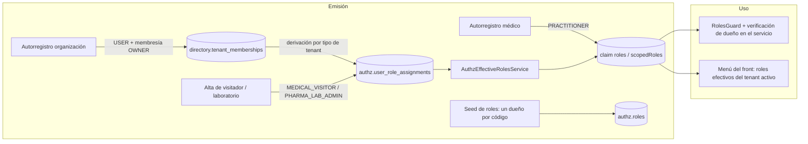

# TASK PROMPT: BR-06 — Roles sembrados y `@Roles` alineados al actor real

> **MODO DE EJECUCIÓN:** este prompt se ejecuta en **Modo Planificación (Planning Mode)**.
> El desarrollador o el agente arranca investigando, sin tocar código fuente. Con eso escribe un
> `implementation_plan.md` detallado y espera la aprobación explícita del usuario. Después
> ejecuta los cambios en commits atómicos, verifica con pruebas unitarias y de integración, y
> **contra el artefacto real levantado**. El resultado queda documentado en `walkthrough.md`.

| Campo | Valor |
|---|---|
| **Cierra** | ID-18, ID-15 (anexo A) · AG-02, AG-03, AG-31, AG-32, AG-37, AG-39 (anexo C) · CL-44, CL-49, CL-54 (anexo B) · CV-16 (anexo E) |
| **Severidad máxima** | Alta (AG-37 es fuga de datos entre pacientes y profesionales) |
| **Repo(s)** | `mantra-core-health-api` (clon `mantra-core-health-redesa-api`): `modules/authz`, `common/seed`, `modules/{scheduling,profiles,pharmacy_inventory,quotations,accounting,diagnostic_units,health_context,procedures_perioperative,pharma_lab,iam}`. Front: `core/navigation`, `features/accounting`, `core/mock` |
| **Toca el modelo** | **Seeds**: filas de `authz.roles` y asignaciones. Sin DDL. Hay **dos dueños** de `authz.roles` (seed de arranque de la API y paquete `seedsGenerales` del modelo): el plan fija uno por código |
| **Depende de** | Nada para empezar. BR-09 (altas de laboratorio y hospital) y BR-26 (`pharma_lab`) consumen los roles que salen de acá |
| **Decisión previa** | **D-G**: el mostrador del médico, ¿reserva por la vía hold (sumar `PRACTITIONER`) o por `appointments/direct`? (README §8) |

---

## 1. Contexto de negocio y justificación técnica

### A. Por qué importa
Muchos 403 del producto no son lógica: son **roles que nadie emite**. El menú y los `@Roles`
nombran ~25 códigos que no existen en `authz.roles` ni se asignan en ningún flujo, así que sólo
`SUPERADMIN` los atraviesa por comodín. El médico autorregistrado recibe únicamente
`PRACTITIONER` y con eso no puede registrar la llegada del paciente, reservar desde el mostrador,
ver el nombre del paciente que atiende ni leer sus intervenciones. El personal de farmacia
necesita `SECURITY_ADMIN` para su bandeja. Y en sentido contrario, las cotizaciones se leen **sin
ningún rol ni control de dueño**. Un solo frente de roles destraba media docena de pantallas y
cierra una fuga.

### B. Estado de la API (`dev` @ `7541797c`, verificado)
- **Roles globales del token:** `modules/iam/services/role-mapping.ts:13-37` mapea **6** códigos
  (`USER`, `SECURITY_ADMIN`, `SUPERADMIN`, `PATIENT`, `PRACTITIONER`, `CLINICIAN`); el anexo A decía 4.
- **Roles de negocio sembrados en `authz.roles` por la API:** `modules/authz/authz.seed.ts` (10
  clínicos: `CLINICIAN`, `PRACTITIONER`, `SURGEON`, `ANESTHESIOLOGIST`, `PERIOP_NURSE`,
  `PERIOP_ADMIN`, `SURGERY_SCHEDULER`, `CLINICAL_APPROVER`, `CLINICAL_INFORMATICIAN`,
  `PRINCIPAL_INVESTIGATOR`) + `modules/pharma_lab/pharma_lab.roles.ts` (4: `PHARMA_LAB_ADMIN`,
  `MEDICAL_VISITOR`, `PHARMACOVIGILANCE_OFFICER`, `REGULATORY_AFFAIRS`), ambos cargados por
  `common/seed/authz-clinical-roles-seed.service.ts:7`. `data_catalog/data-catalog.roles.ts` sólo
  declara listas de `@Roles`, no siembra.
- **El paquete del modelo también siembra `authz.roles`** (`mantra-core-health-model/seedsGenerales/modules/06_authz.seeds.json`,
  generado por `salud-db/gen_seeds.py`, que en `align_role_states` corrige el estado ACTIVE de
  esas filas): boot `PLATFORM_SUPER_ADMIN`, `TENANT_ADMIN`, `CLINICAL_ADMIN`, `PRACTITIONER`,
  `NURSE`, `LAB_TECHNICIAN`, `RADIOLOGIST`, **`PHARMACIST`**, `ACCOUNTANT`, `BILLING_OPERATOR`,
  `INSURANCE_OPERATOR`, `SUPPORT_AGENT`, `AUDITOR`, `PATIENT`, `DELEGATE`; mock (nunca en
  producción) `PLATFORM_ADMIN`, `PHARMACY_OPERATOR`, etc. **Sin confirmar** que sea exactamente
  el paquete que carga `load_seeds.py` hoy. Casi ninguno de esos códigos aparece en un `@Roles`.
- **Uso en `@Roles` (conteo por código, script sobre `src/**`):** `SECURITY_ADMIN` 351,
  `PLATFORM_ADMIN` 187, `SCHEDULING_ADMIN` 53, `SCHEDULING_AGENT` 30, `PHARMA_LAB_ADMIN` 30,
  `IDENTITY_ADMIN` 12, `MEDICAL_VISITOR` 12, `ACCOUNTING_APPROVER` 16, `CONTEXT_CURATOR` 7…
- **Cómo llega un rol de negocio al token:** `modules/authz/services/authz-effective-roles.service.ts`
  une los códigos de `authz.user_role_assignments` al claim `roles` y los indexa por tenant en
  `scopedRoles`. `common/auth/roles.guard.ts:37-52`: `SUPERADMIN` comodín; un código en
  `scopedRoles` sólo vale en ese tenant.
- **Cada hallazgo:**
  - AG-02: `scheduling/controllers/scheduling-bookings.controller.ts:344-345` check-in
    `@Roles('SCHEDULING_ADMIN','SCHEDULING_AGENT')`; el médico autorregistrado nace con
    `roles: ['PRACTITIONER']` (`iam/services/iam-practitioner-self-registration.service.ts:1016`).
    El patrón de dueño del recurso ya existe: `assertRecursoDelActor`
    (`scheduling-catalog.service.ts:359,471,713…`).
  - AG-03: `scheduling.controller.ts:590-591`, `607-608`, `631-632` (holds, confirm, request)
    sin `PRACTITIONER`; `appointments/direct` (`:545-548`) y `walk-in` (`:574-575`) sí lo admiten.
  - ID-15: `profiles/controllers/profiles-patients.controller.ts:342-343`
    `GET patients/:profileId` sólo `SECURITY_ADMIN`.
  - AG-31: las filas `MEDICAL_VISITOR`/`PHARMA_LAB_ADMIN` **existen** (el anexo C decía que nadie las
    siembra; el grep no vio el import de `authz-clinical-roles-seed.service.ts`), pero **ningún flujo
    las asigna**: `grep role-assign modules/pharma_lab` → 0. Sólo `SECURITY_ADMIN` puede asignarlas
    a mano (`POST /authz/users/:id/role-assignments`).
  - AG-32: `pharmacy_inventory/controllers/pharmacy-orders.controller.ts:60,162,178,233,254,274`
    `@Roles('SECURITY_ADMIN')` «provisional» (JSDoc l. 53-57).
  - AG-37: `quotations/controllers/quotations.controller.ts:67` `GET /` y `:87` `GET /:id` **sin
    `@Roles`** (sólo el POST, l. 51, lo tiene); `services/quotations.service.ts:165-191` no filtra
    por práctica, paciente ni tenant.
  - AG-39: `accounting-asset.controller.ts:38`, `accounting-accrual.controller.ts:38`,
    `accounting-subledger.controller.ts:26,38`, `accounting-fiscal.controller.ts:46`,
    `accounting-ledger.controller.ts` → `SECURITY_ADMIN` (`approve`: o `ACCOUNTING_APPROVER`).
  - CL-44: `diagnostic_units/controllers/diagnostic-units.controller.ts`: 11
    `@Roles('SECURITY_ADMIN')`. El dueño autorregistrado nace con `USER` + membresía
    `DIR.ROLE_OWNER` (`iam-organization-self-registration.service.ts:69-73,276`).
  - CL-49: `health_context/controllers/health-context.controller.ts:65,92,108,138,154,187,251` usa
    `SOURCE_ADMIN`, `CONTEXT_CURATOR`, `QUALITY_REVIEWER`, `CONTEXT_CONSUMER`, `PLATFORM_ADMIN`,
    `SYSTEM`: ninguno sembrado.
  - CL-54: `procedures_perioperative/controllers/periop.controller.ts:103-130,263-272` lecturas sólo
    con roles quirúrgicos. `ClinicalRecordAccessGuard` existe (`clinical/guards/clinical-record-access.guard.ts:97`)
    y ya lo usa `chart-documents.controller.ts:50`.

### C. Estado del frontend (`mantra-core-health`, `mockup` @ `9b3e0101`, verificado)
- `core/navigation/navigation.map.ts` usa 35 códigos. **23 no se siembran en ningún lado de la
  API**: `ACCOUNTING_APPROVER`, `BILLING`, `BILLING_OPERATOR`, `BUSINESS_ADMIN`, `CASHIER`,
  `CONTEXT_CONSUMER`, `CONTEXT_CURATOR`, `DATA_PLATFORM_ADMIN`, `DPO`, `FINANCE`, `GOVERNANCE_ADMIN`,
  `IDENTITY_ADMIN`, `MARKETING_MANAGER`, `PAYMENTS_ADMIN`, `PLATFORM_ADMIN`, `QA_ADMIN`,
  `QA_ENGINEER`, `QUALITY_REVIEWER`, `RELEASE_MANAGER`, `SCHEDULING_ADMIN`, `SCHEDULING_AGENT`,
  `SOURCE_ADMIN`, `SRE` (ID-18).
- `navigation.map.ts:1474-1532` (CV-16): `pharmacy-orders|pharmacy-campaigns|pharmacy-profile` con
  `roles: [ANY_ROLE]`, `requiresTenant: true`, `hiddenFor: ['PATIENT']`, sin filtro por tipo de
  organización. `:1009` `medical-laboratory` con `['SECURITY_ADMIN']` (CL-44). `:921`
  `health-context` (CL-49). `:475` `interventions` (CL-54).
- `features/accounting/cockpit/cockpit.ts` no filtra acciones por rol (l. 312, 335, 361, 388, 411);
  `accounting.ts:217-221` sí (AG-39).
- Pantallas que degradan el 403 en silencio con `catchError(() => of(null))` al pedir el paciente:
  `consultation.ts:761`, `patient-chart.ts:1568`, `request-access.ts:67`, `quotation-form.ts:587`
  (ID-15): el médico ve «Paciente» sin nombre.
- El mock no controla roles (lo corrige BR-02) y la médica demo firma
  `['PRACTITIONER','CLINICIAN','SCHEDULING_ADMIN']` (`core/mock/mock-session.ts:89`).

### D. Aislamiento
Se cambian decoradores, verificaciones de dueño en servicios y seeds de roles. **No** se cambia
el modelo físico. **No** se inventan códigos: cada rol nuevo sale de `docs/business/actors-and-roles.md`,
del paquete del modelo o de una decisión escrita. Pago (`PAYMENTS_ADMIN`) y delivery
(`COURIER`, `LOGISTICS_OPERATOR`, `TRACKING_ADMIN`) quedan **fuera de alcance**: no se siembran.

---

## 2. Flujo de Git y entrega

```bash
cd mantra-core-health-redesa-api && git status && git fetch origin && git checkout -b <dev>/fix-roles-sembrados-y-autorizacion origin/dev
cd ../mantra-core-health && git status && git fetch origin && git checkout -b <dev>/fix-menus-por-rol-efectivo origin/mockup
```

- API `gh pr create --base dev`; front `gh pr create --base mockup`; revisores
  `jsaldias39,PabloArauzCaballero`. Si el plan elige sembrar desde el paquete del modelo, un PR en
  `mantra-core-health-model` revisado por quien lo mantiene.
- Commits atómicos, por ejemplo:
  - `fix(quotations): @Roles y filtro por dueño` · `fix(scheduling): check-in del dueño y mostrador según D-G`
  - `feat(profiles): lectura mínima del paciente con acceso clínico` · `feat(authz): roles sembrados`
  - `feat(pharma_lab): las altas asignan su rol` · `fix(pharmacy|diagnostic_units|periop): rol real`
  - front: `fix(nav): farmacia por tipo de tenant`, `fix(accounting): cockpit por rol`, `fix(mock): roles demo`
- **El merge exige revisión humana.** El flujo termina en abrir los PR.

---

## 3. Diagrama



---

## 4. Archivos a modificar o crear

**Tabla rol → quién lo emite hoy → pantallas afectadas → qué hacer**

| Rol | Quién lo emite hoy | Pantallas afectadas | Qué hacer |
|---|---|---|---|
| `PRACTITIONER` | Autorregistro del médico; seed clínico | Mi agenda «Llegó» (AG-02), mostrador `/schedule/book/:slotId` (AG-03), nombre del paciente en consulta/ficha/cotización (ID-15), intervenciones (CL-54), cockpit (AG-39) | Sumarlo a check-in con `assertRecursoDelActor`; D-G para el mostrador; lectura mínima del paciente con acceso clínico; lectura periop por paciente con `ClinicalRecordAccessGuard`; `clearing-documents` acotado a su práctica si el plan lo aprueba |
| `CLINICIAN` | Mapeo global; seed clínico; asignación manual | ID-15, CL-54 | Igual que `PRACTITIONER` en las lecturas clínicas |
| `PATIENT` | Autorregistro | Cotizaciones propias (AG-37) | `@Roles` + filtro por `patientProfileId` propio; 404 si no es suyo |
| `SCHEDULING_ADMIN` / `SCHEDULING_AGENT` | **Nadie** (no sembrados) | Recepción, check-in, holds (`navigation.map.ts:70,398`) | Sembrar como roles de tenant y asignarlos por membresía de recepción, o retirarlos del menú si no hay recepción en el lanzamiento |
| `SECURITY_ADMIN` | Mapeo global; asignación manual | Bandeja de farmacia (AG-32), admin de laboratorio (CL-44), cockpit (AG-39) | Dejar de usarlo como rol de negocio provisional; queda para seguridad |
| Rol de farmacia (código a decidir) | **No existe en runtime**; el paquete del modelo ya siembra `PHARMACIST` (boot) y `PHARMACY_OPERATOR` (sólo mock) | Bandeja y pedido de farmacia (AG-32), menú de farmacia (CV-16) | Usar un código ya declarado (`PHARMACIST`) antes de inventar otro; asignarlo por membresía en tenant farmacia; reemplazar `SECURITY_ADMIN` en las 6 rutas |
| `PHARMA_LAB_ADMIN` / `MEDICAL_VISITOR` | Filas sembradas; **ningún flujo las asigna** | Portal del laboratorio farmacéutico y del visitador (AG-31) | El alta de laboratorio asigna `PHARMA_LAB_ADMIN` y el alta de visitador `MEDICAL_VISITOR`, ambos con `scope TENANT`. El DDL de `pharma_lab` es BR-26 |
| Dueño de laboratorio clínico | Membresía `DIR.ROLE_OWNER` sin rol | «Laboratorio médico» (CL-44) | Rol de tenant derivado de la membresía owner en tenants `DIAGNOSTIC_CENTER` (o `LAB_TECHNICIAN`/`TENANT_ADMIN` del paquete, a decidir) + `requireTenantId()` en las 11 rutas |
| `SOURCE_ADMIN`, `CONTEXT_CURATOR`, `QUALITY_REVIEWER`, `CONTEXT_CONSUMER` | **Nadie** | Contexto de salud (CL-49) | Sembrar si el módulo entra al lanzamiento; si no, el menú lo muestra sólo a `SUPERADMIN` y lo dice |
| `PLATFORM_ADMIN`, `IDENTITY_ADMIN`, `DPO`, `GOVERNANCE_ADMIN`, `DATA_PLATFORM_ADMIN`, `QA_*`, `SRE`, `RELEASE_MANAGER` | **Nadie** en boot (`PLATFORM_ADMIN` sólo en el paquete mock) | Portal admin, verificación de identidad, catálogo de datos | Sembrar como roles de plataforma asignables por `SUPERADMIN`, o documentar que el portal es sólo `SUPERADMIN` |
| `ACCOUNTING_APPROVER`, `FINANCE`, `CASHIER`, `BILLING`, `BUSINESS_ADMIN`, `MARKETING_MANAGER` | **Nadie** (`BILLING_OPERATOR` y `ACCOUNTANT` sí en el paquete boot) | Cockpit contable, facturación, marketing | Sembrar los que el lanzamiento usa; el cockpit oculta lo que el rol no permite |
| `PAYMENTS_ADMIN`, `COURIER`, `LOGISTICS_OPERATOR`, `TRACKING_ADMIN` | — | Pago y delivery | **Fuera de alcance**: no se siembran |

**API**
- `[CREAR]` `src/modules/<módulo>/<módulo>.roles.ts` por módulo que siembre roles (patrón de
  `pharma_lab.roles.ts`) y registrarlos en `common/seed/authz-clinical-roles-seed.service.ts`.
- `[MODIFICAR]` los controladores citados en §1.B y sus servicios (verificación de dueño).
- `[MODIFICAR]` `modules/authz/services/authz-effective-roles.service.ts` si el rol del dueño se
  deriva de la membresía.
- `[MODIFICAR]` `modules/pharma_lab/services/medical-visitors.service.ts` y el alta del laboratorio
  (asignación en la **misma transacción** que el alta).
- `[CREAR]` int-specs: `quotations-ownership`, `scheduling-check-in-practitioner`,
  `pharmacy-orders-staff`, `diagnostic-units-owner`, `authz-seeded-roles` (todo código de `@Roles`
  que no sea técnico existe en `authz.roles` o está en una lista de exclusión con motivo).
- `[CREAR]` `scripts/check-roles-seeded.mjs` (o spec): falla si aparece un `@Roles` con un código sin
  semilla ni exclusión.

**Front**
- `[MODIFICAR]` `core/navigation/navigation.map.ts` y `navigation.types.ts`: farmacia filtrada por
  tipo de tenant o rol de farmacia (CV-16); laboratorio con el rol del dueño (CL-44); contexto de
  salud según la decisión (CL-49).
- `[MODIFICAR]` `features/accounting/cockpit/cockpit.ts/.html` y `resumen/resumen.ts` (AG-39).
- `[MODIFICAR]` `consultation.ts`, `patient-chart.ts`, `request-access.ts`, `quotation-form.ts`:
  usar la lectura mínima nueva y mostrar el estado S5 en vez de «Paciente» vacío (ID-15).
- `[MODIFICAR]` `core/mock/mock-session.ts` y handlers: roles demo iguales a los que emite la API.

---

## 5. Reglas de implementación

- **Paso 1 del plan: pedir la decisión D-G.**

  | Opción | A favor | En contra |
  |---|---|---|
  | **A** Sumar `PRACTITIONER` a `holds`, `confirm` y `request`, con `assertRecursoDelActor` | La pantalla `booking-new.ts:448` no cambia; misma vía que el paciente, con reserva temporal que evita doble reserva | Tres endpoints más abiertos; hay que probar que el médico sólo reserva en sus recursos |
  | **B** El mostrador del médico usa `POST /scheduling/appointments/direct` (ya admite `PRACTITIONER`) | Sin tocar la autorización; es el caso de uso «alta directa» | Cambia la pantalla y pierde el hold; revisar que `direct` valide el cupo igual |

- **Un código, un dueño.** Antes de sembrar, el plan dice si cada rol lo siembra la API
  (`deterministicId('seed:authz-role:<code>')`) o el paquete del modelo (uuid5). Dos dueños dan dos
  ids para el mismo código y la clave única choca (mismo problema que `audio_assets`).
- **Rol + dueño del dato.** Abrir un `@Roles` sin verificar el recurso en el servicio es peor que el
  403. Toda ruta abierta a `PRACTITIONER`/`PATIENT` filtra por práctica, recurso o titularidad y
  responde 404 cuando el dato no es suyo.
- **No inventar códigos ni enums.** Si un rol no está en `actors-and-roles.md` ni en el paquete, es
  una decisión escrita, no una suposición.
- **Asignación en la misma transacción que el alta** (regla 11 del modelo: un caso de uso = una
  transacción).
- **El menú no autoriza.** Ocultar es comodidad; la prueba es el 403 de la API.
- `SUPERADMIN` sigue siendo comodín; no se agregan comodines nuevos.

---

## 6. Criterios de aceptación (Gherkin)

```gherkin
Escenario: El médico registra la llegada
  Dado un médico PRACTITIONER dueño del recurso y una cita CONFIRMED
  Cuando hace POST /scheduling/bookings/:id/check-in
  Entonces recibe 200 con checkedInAt, y un médico de OTRO recurso recibe 403

Escenario: Mostrador del médico
  Dado un médico en /schedule/book/:slotId
  Cuando confirma la reserva de un paciente por el camino que fijó D-G
  Entonces la API responde 201 y la cita aparece en Mi agenda

Escenario: Cotización ajena
  Dado el paciente A
  Cuando pide GET /quotations?patientProfileId=<B>
  Entonces recibe 403 o una lista vacía
  Y el médico M de la práctica P recibe 404 al pedir una cotización de otra práctica

Escenario: Nombre del paciente en la consulta
  Dado un médico con acceso clínico vigente al paciente
  Cuando abre la consulta
  Entonces ve el nombre y el código del paciente, y nada más de su perfil

Escenario: Personal de farmacia
  Dado un empleado con el rol de farmacia en la farmacia F y sin SECURITY_ADMIN
  Cuando hace GET /pharmacy/orders
  Entonces recibe 200 sólo con los pedidos de F

Escenario: Visitador recién dado de alta
  Dado un usuario dado de alta como visitador de un laboratorio
  Cuando inicia sesión
  Entonces su token trae MEDICAL_VISITOR en scopedRoles del tenant del laboratorio

Escenario: Dueño del laboratorio
  Dado el dueño de un laboratorio verificado
  Cuando abre "Laboratorio médico"
  Entonces ve sólo sus unidades y puede cargar un estudio
  Y al pedir la administración de otro laboratorio recibe 403 o 404

Escenario: Intervenciones del paciente propio
  Dado un médico tratante con acceso a la ficha
  Cuando abre el bloque de intervenciones
  Entonces ve los casos del paciente

Escenario: Menú de farmacia
  Dado el administrador de una aseguradora
  Cuando abre el menú lateral
  Entonces no ve "Pedidos de farmacia", "Promociones" ni "Ficha de la farmacia"

Escenario: Todo rol usado existe
  Dado un SECURITY_ADMIN
  Cuando pide GET /authz/roles
  Entonces aparece cada código de @Roles que no esté en la lista de exclusión documentada
```

---

## 7. Definition of Done

- [ ] `implementation_plan.md` aprobado con **D-G**, el dueño de cada código y los nombres de rol de
      farmacia y de laboratorio escritos.
- [ ] AG-37 cerrado primero (es la fuga) con int-spec.
- [ ] Roles sembrados con un solo dueño; `check-roles-seeded` en verde y probado rompiéndolo.
- [ ] Rutas abiertas con verificación de dueño; int-specs nuevos en verde.
- [ ] API: `corepack yarn build`, `typecheck`, `lint --max-warnings=0`, `test`, `test:integration`
      (nuevos); front: `lint`, `typecheck`, `build`, `test --watch=false`. Todo en verde.
- [ ] Si se crea una ruta (lectura mínima del paciente): `node dist/src/main.js` y el log con
      `Mapped {<ruta>, GET}`; el `*.module.spec.ts` exige el controlador en `controllers`.
- [ ] **Evidencia de runtime en los PR**, contra la API viva con seeds: un médico **autorregistrado de
      verdad** (no la demo) pulsa «Llegó» → 200 → recarga → la cita en curso; `curl` de
      `GET /quotations?patientProfileId=<otro>` con token de paciente → 403/vacía; empleado de
      farmacia sin `SECURITY_ADMIN` → su bandeja; token de visitador con `MEDICAL_VISITOR` en `scopedRoles`.
- [ ] PR abiertos con revisores `jsaldias39` y `PabloArauzCaballero`, y `walkthrough.md`.

---

## 8. Plan de QA

### A. Pruebas automatizadas
```bash
corepack yarn test src/modules/{quotations,scheduling,authz,pharmacy_inventory}          # API
corepack yarn test:integration --testPathPatterns="quotations-ownership|scheduling-check-in|pharmacy-orders-staff|diagnostic-units-owner|authz-seeded-roles"
node scripts/check-roles-seeded.mjs                                                       # API
corepack yarn test --watch=false --include=src/app/{core/navigation,features/accounting}/**   # front
```

### B. Integración (contra la API viva)
1. `mantra-redesa` limpio + seeds; registrar un médico, una farmacia y un laboratorio **por la UI**.
2. Asignar roles sólo por los flujos (a mano, sólo los de plataforma).
3. Recorrer: agenda → llegó → atender; mostrador; cotización; bandeja de farmacia; laboratorio.

### C. Verificación manual y logs
- Log de la API: ningún 403 de rol en esos recorridos (cada 403 que quede, en la tabla con su motivo);
  `GET /authz/roles` antes y después: el diff son exactamente los códigos del plan.
