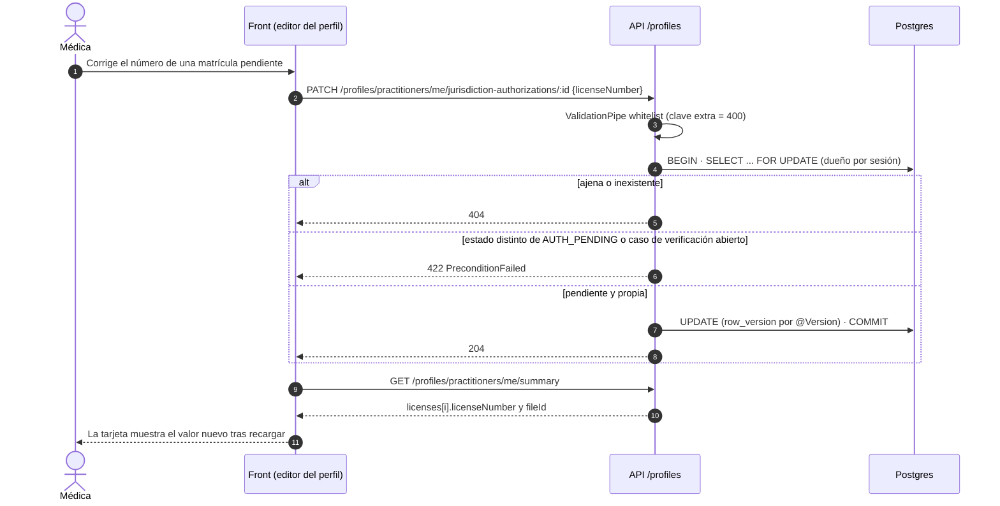

# TASK PROMPT: BR-07 — Alta y perfil del médico (cerrar el PR #453 y completar lo que le falta)

> **MODO DE EJECUCIÓN:** este prompt se ejecuta en **Modo Planificación (Planning Mode)**.
> El desarrollador o el agente arranca investigando, sin tocar código fuente. Con eso escribe un
> `implementation_plan.md` detallado y espera la aprobación explícita del usuario. Después
> ejecuta los cambios en commits atómicos, verifica con pruebas unitarias y de integración, y
> **contra la API viva**. El resultado queda documentado en `walkthrough.md`.

| Campo | Valor |
|---|---|
| **Cierra** | ID-01, ID-02, ID-03, ID-04, ID-05, ID-06 (vía #453) · ID-07, ID-08, ID-09, ID-12, ID-13, ID-14 (anexo A) |
| **Severidad máxima** | Bloqueante de demo (ID-01, ID-02, ID-03) |
| **Repo(s)** | `mantra-core-health-api` (clon `mantra-core-health-redesa-api`) y `mantra-core-health` (front) |
| **Toca el modelo** | **No en lo que se verificó.** P28 (ID-13) usa columnas que ya existen. Sólo tocaría el modelo si la decisión D-BR07-3 pide un trámite de corrección de CI con tabla propia |
| **Depende de** | Nada para empezar. La Parte 1 es mergear #453; la Parte 2 sale de `dev` **después** de ese merge |
| **Decisión previa** | Ninguna de README §8. Tiene **cuatro decisiones propias** (D-BR07-1…4, sección 5), que se piden en el paso 1 |

---

## 1. Contexto de negocio y justificación técnica

### A. Por qué importa
El alta del médico es la puerta de entrada del lado profesional. Hoy, contra la API real,
**cualquier médico que cargue su correo institucional, su dirección laboral o el PDF de su
título recibe un 400 y no se crea la cuenta** (bloqueantes 1–3 del README §5). En `mockup` no se
ve porque el mock acepta cualquier cuerpo (ID-20). Después del alta, el editor del perfil ofrece
corregir especialidades y matrículas por rutas que no existen (404), y la vista del perfil
dibuja métricas de calidad que sólo el mock inventa.

### B. Estado del frontend (`mantra-core-health`, `origin/mockup` @ `95472903`)
- **Alta** (`features/auth/register-practitioner/register-practitioner.ts`):
  - `:2387-2388`: `correoPersonal = raw.personalEmail`, `correoTrabajo = raw.email`.
    `:2409` manda `email: correoPersonal`; `:2452` manda `workEmail` sólo si no está vacío.
    **Nunca manda `personalEmail`** (origen de ID-12).
  - `:2434-2440`: manda `workAddressLines`, `workLatitude`, `workLongitude` (ID-02).
  - `:2418-2423`: manda `nationalId` e `issuerAdministrativeAreaConceptId` sólo si hay CI; el
    control `nationalId` ya es `Validators.required` (`:770-773`). Compatible con el `nationalId!`
    obligatorio que introduce #453 (commit `09af2caf`).
  - `:96`: `MAX_ADDITIONAL_SPECIALTIES = 3` → 4 especialidades en total (ID-04).
  - `:2456-2462`: manda `credentials[]` con `fileId` precargado por
    `POST /iam/auth/upload-registration-document` (ID-03).
- **Editor del perfil** (`features/account/my-profile/practitioner-profile-edit/practitioner-profile-edit.ts`):
  - `:881-898`: CI y departamento emisor en **solo lectura**; el `PATCH` no los manda (ID-13, P28).
  - Usa `updateOwnSpecialty`/`removeOwnSpecialty` y `updateOwnLicense`/`removeOwnLicense`
    (anexo: `:1689`, `:1699`, `:1808`, `:1816`).
- **Cliente** (`core/data-access/profiles/profiles.client.ts`):
  - `:844-859`: `PATCH|DELETE /profiles/practitioners/me/specialties/:id`. El cuerpo es
    `OwnSpecialtyChanges { specialtyConceptId?, boardCertified? }` (`profiles.types.ts:262-265`);
    `isPrimary` no viaja a propósito (tiene su propia ruta `/primary`).
  - `:861-885`: `PATCH|DELETE /profiles/practitioners/me/jurisdiction-authorizations/:id`. El
    cuerpo es `OwnLicenseChanges { licenseNumber?, regulatoryAuthority?, validFrom?, fileId? }`
    (`profiles.types.ts:271-277`).
- **Mock que esconde las brechas** (`core/mock/handlers/profiles.handlers.ts`): simula las rutas
  faltantes (anexo: `:1024`, `:1045`, `:1054`, `:1069`, `:1078`) y fabrica
  `monthlyEncounters`/`quality` con `serieMensualDemo()` (`:349`) y `CALIDAD_DEMO` (`:364`), que
  se devuelven en `:457-458`. La vista los dibuja en
  `features/account/my-profile/practitioner-profile/practitioner-profile.ts:436-437` (ID-14).
- **PR abiertos del front que tocan el mismo editor** (conflicto probable, coordinar antes de
  tocar): #624 (buscador y paginación en Trayectoria y Credenciales), #625 y #627 (Cancelar
  edición y especialidades en Datos personales). Todos contra `mockup`.

### C. Estado de la API (`origin/dev` @ `7541797c`) y qué trae el PR #453
**PR #453** — `justin/medical-module-execution-20260924` → `dev`, abierto, `MERGEABLE`,
`REVIEW_REQUIRED`. **18 commits por delante de `dev` y 0 por detrás** (no necesita rebase).
69 archivos, +4 399 / −227. Lo que se verificó en la rama (`git show origin/justin/...:<archivo>`):

| Hallazgo | Qué hace #453 | Evidencia en la rama |
|---|---|---|
| ID-01 | `workEmail?` con `@IsEmail`; `email` pasa a ser el correo de acceso | `register-practitioner.dto.ts:100`; service `:146-177` |
| ID-02 | `workAddressLines`/`workLatitude`/`workLongitude` en el alta, persistidos con uso WORK | DTO `:397-419`; commits `aa609a86`, `982ed2b9` |
| ID-03 | `RegisterPractitionerCredentialDto.fileId?`; reclama la precarga anónima dentro de la transacción; reutilizar un archivo reclamado → 422 | DTO `:684-736`; commit `6cc04818` |
| ID-04 | `@ArrayMaxSize(4)` en el alta y `MAX_SPECIALTIES_PER_PRACTITIONER = 4` | DTO `:281`; `medical-specialty-catalog.service.ts`; commit `5ff4bfe8` |
| ID-05 | `taxId`, `taxHolderName`, `work*` en `UpdateOwnPractitionerProfileDto`; `taxId`, `taxHolderName`, `workAddress`, `workEmail`, `personalEmail` en la lectura | `update-practitioner-profile.dto.ts:214-303`; `read-practitioner-profile.dto.ts:250-325` |
| ID-06 | `PATCH /profiles/practitioners/me/credentials/:credentialId` → 204, sólo PENDIENTE, dueño por sesión, ajeno = 404 | controller `:472`; `update-own-credential.dto.ts` (tipo, número, institución, fecha, `fileId`) |
| ID-09 (mitad) | `fileId` en `PractitionerCredentialDto` (sólo resumen propio; el público lo oculta) | `read-practitioner-profile.dto.ts:94`; commit `5db7a3b4` |
| ID-12 (parcial) | Con `workEmail`, `email` = personal. **Sin `workEmail`, `email` se sigue guardando como TRABAJO** | service `:176-177`: `personal = dto.personalEmail ?? (dto.workEmail ? dto.email : undefined)`, `trabajo = dto.workEmail ?? dto.email` |

**#453 trae además trabajo que no es de este prompt** (no rehacerlo en los prompts dueños y
mencionarlo en su revisión):
- `09af2caf`: `nationalId` e `issuerAdministrativeAreaConceptId` pasan a **obligatorios** en el
  alta del médico. Es un cambio de contrato: cualquier cliente que omita la CI recibe 400.
- `15e0d9b4`, `05e808cc`: advisory lock por profesional al reservar (carreras entre sedes) → toca
  el frente de BR-21.
- `3efaba98`: walk-ins aislados por tenant → BR-21.
- `c8217ce2`: autorización de participantes de teleconsulta → BR-29.
- `c76a7fc3`: siembra `SCHEDULING_ADMIN` y `SCHEDULING_AGENT` (`scheduling.roles.ts`) → cierra
  una parte de ID-18, que es de BR-06.

**Lo que #453 NO cierra** (verificado en la rama):
- **ID-07:** en el controlador sólo existe `@Patch('practitioners/me/specialties/:specialtyId/primary')`
  (`:562`). No hay `PATCH` ni `DELETE` de la especialidad propia.
- **ID-08:** no hay `PATCH` ni `DELETE` de `me/jurisdiction-authorizations/:id`. Sólo
  `POST practitioners/:profileId/jurisdiction-authorizations` (`:311`).
- **ID-09 (matrícula):** `PractitionerLicenseDto` (`read-practitioner-profile.dto.ts:127`) sigue
  sin `fileId`, y el mapeo del servicio en `dev` (`profiles-practitioners.service.ts:1043-1051`)
  no lo copia, aunque `CreateJurisdictionAuthorizationDto` lo acepta y la columna existe.
- **ID-13:** `UpdateOwnPractitionerProfileDto` no tiene `sexAtBirth` ni
  `issuerAdministrativeAreaConceptId` ni `nationalId`, y la lectura no devuelve `sexAtBirth`.
- **ID-14:** `PractitionerActivityDto` sólo tiene `encounters`, `medicationRequests`,
  `clinicalNotes` y `documents`.

**Advertencia sobre la evidencia de #453.** Su `REPORTE.md` corrió las integraciones invocando
jest a mano con **`ORM_SCHEMA_SYNC=safe`** sobre una base temporal. Con `safe` el ORM **crea lo
que falta** al arrancar, que es justo la dirección de cambio prohibida. El script oficial
`yarn test:integration` fija `ORM_SCHEMA_SYNC=off`. La Parte 1 **repite** esas integraciones con
`off` sobre el esquema de `database/SQL`. El propio reporte declara pendiente el recorrido de
navegador contra la API real (MED-E01).

**Modelo** (`mantra-core-health-model/SQL/05_profiles/02_tables.sql`, verificado):
- `professional_credentials` (`:134-156`): `file_id`, `issuing_country_concept_id`,
  `state_concept_id`, `row_version`.
- `practitioner_specialties` (`:157-176`): `is_primary`, `board_certified`,
  `verification_status_concept_id`, `valid_from`, `valid_to`, `row_version`.
- `jurisdiction_authorizations` (`:191-209`): `license_number`, `regulatory_authority`,
  `state_concept_id`, `valid_from`, `valid_to`, `file_id`, `row_version`.
- `persons.sex_at_birth_concept_id` (`:17`) y `common.identifiers.issuer_administrative_area_concept_id`
  (`02_common/02_tables.sql:14`). **P28 no necesita columnas nuevas.**
- `audit.jurisdiction_authorizations_history` tiene una FK a `jurisdiction_authorizations.id`
  sin `ON DELETE` (`10_audit/90_fk_deferred.sql:278-283`). **Borrar físicamente una matrícula con
  historia falla con `23503`.** No se encontró quién escribe esa historia en `src/` (sin
  confirmar si la escribe un trigger).
- La matrícula se activa por un caso de `identity_assurance`
  (`identity-verification-effects.service.ts:188`, `AUTH_PENDING` → `AUTH_ACTIVE`). Si se borra
  una matrícula con un caso abierto, el efecto encuentra la fila ausente y sólo loguea un warning.

### D. Aislamiento
- **Parte 1** no escribe código nuevo salvo correcciones de la revisión: se revisa, se verifica
  en runtime y se mergea #453.
- **Parte 2** agrega rutas en `profiles` y campos opcionales a DTO de lectura y actualización.
  No cambia rutas existentes ni el contrato del alta. En el front, cambia el editor y la vista del
  perfil del médico, y los handlers del mock de esas rutas.
- No tocar el alta del paciente (BR-08), ni el historial laboral (BR-08), ni la verificación
  de credenciales por la plataforma (BR-28, CV-20).

---

## 2. Flujo de Git y entrega

### Parte 1 — revisar y mergear #453 (API)
```bash
cd mantra-core-health-redesa-api
git status                                   # árbol limpio
git fetch origin dev justin/medical-module-execution-20260924
git rev-list --count origin/justin/medical-module-execution-20260924..origin/dev   # tiene que dar 0
git diff --stat origin/dev...origin/justin/medical-module-execution-20260924
gh pr view 453 -R mdavila-2001/mantra-core-health-api --json files,body,reviews
git switch --detach origin/justin/medical-module-execution-20260924     # sólo para verificar
```
- Si `dev` avanzó y aparece conflicto, **no reescribir la rama de otro**: pedirle al autor el
  rebase o abrir `<dev>/fix-rebase-pr-453` con merge de `dev` y avisar en el PR.
- La revisión se deja en el PR con la evidencia de runtime (sección 8.B). **El merge exige
  revisión humana** de `jsaldias39` o `PabloArauzCaballero`.

### Parte 2 — lo que falta (API y front, dos PR)
```bash
# API, después del merge de #453
git fetch origin && git switch -c <dev>/feat-perfil-medico-especialidades-matriculas origin/dev
# Front
cd ../mantra-core-health && git fetch origin
git switch -c <dev>/feat-perfil-medico-contra-api origin/mockup
```
- Commits sugeridos (API):
  - `feat(profiles): corregir y retirar una especialidad propia`
  - `feat(profiles): corregir y retirar una matrícula propia pendiente`
  - `fix(profiles): la lectura devuelve el fileId de la matrícula`
  - `feat(profiles): el médico corrige sexo al nacer y departamento emisor (P28)`
  - `docs(openapi): contrato del perfil médico`
- Commits sugeridos (front):
  - `fix(auth): el alta del médico manda el correo personal según el contrato acordado`
  - `fix(perfil): sin métricas de la API la sección de calidad muestra el estado vacío`
  - `feat(perfil): editar sexo al nacer y departamento emisor`
  - `test(mock): los handlers del perfil médico validan el cuerpo como la API`
- PR API: `gh pr create --base dev --reviewer jsaldias39,PabloArauzCaballero`.
- PR front: `gh pr create --base mockup --reviewer jsaldias39,PabloArauzCaballero`.
- Los dos cuerpos llevan la evidencia de runtime pegada. **El flujo termina en abrir los PR.**

---

## 3. Diagrama



---

## 4. Archivos a modificar o crear

**Parte 1 (sólo si la revisión lo pide):** los 69 archivos de #453. No se crean archivos.

**Parte 2 — API (`mantra-core-health-api`):**
- `[MODIFICAR]` `src/modules/profiles/controllers/profiles-practitioners.controller.ts`:
  - `@Patch('practitioners/me/specialties/:specialtyId')` → 204;
  - `@Delete('practitioners/me/specialties/:specialtyId')` → 204;
  - `@Patch('practitioners/me/jurisdiction-authorizations/:licenseId')` → 204;
  - `@Delete('practitioners/me/jurisdiction-authorizations/:licenseId')` → 204.
  - **Declararlas antes** de `.../specialties/:specialtyId/primary` no es necesario (son rutas
    de distinta longitud), pero sí comprobar en el log de arranque que no se pisan.
- `[CREAR]` `src/modules/profiles/dto/update-own-specialty.dto.ts`: `specialtyConceptId?`
  (`@IsUUID`), `boardCertified?` (`@IsBoolean`, según D-BR07-2). **Sin `isPrimary`.**
- `[CREAR]` `src/modules/profiles/dto/update-own-license.dto.ts`: `licenseNumber?`,
  `regulatoryAuthority?`, `validFrom?` (`@IsISO8601`), `fileId?` (`@IsUUID`).
- `[MODIFICAR]` `src/modules/profiles/dto/index.ts`: exporta los dos DTO.
- `[MODIFICAR]` `src/modules/profiles/services/profiles-practitioners.service.ts`: cuatro casos
  de uso, cada uno en **una** transacción, con `requireOwnPractitionerProfileId` y bloqueo de
  fila, igual que `updateOwnCredential` de #453. Reutilizar `AttachableFileService.assertUsableBy`
  para `fileId`. Validar `specialtyConceptId` contra el catálogo de especialidades y el tope de 4
  como hace `addSpecialty` (`:1812`).
- `[MODIFICAR]` `src/modules/profiles/dto/read-practitioner-profile.dto.ts`: `fileId?` en
  `PractitionerLicenseDto` (sólo en el resumen propio, como la credencial); `sexAtBirth?` en
  `PractitionerProfileSummaryDto`; y, si D-BR07-4 = calcular, los campos opcionales de actividad.
- `[MODIFICAR]` `src/modules/profiles/dto/update-practitioner-profile.dto.ts`: `sexAtBirth?` e
  `issuerAdministrativeAreaConceptId?` con los mismos validadores que
  `UpdateOwnPatientProfileDto` (`:159` y `:332`). `nationalId` según D-BR07-3.
- `[MODIFICAR]` `src/modules/iam/services/iam-practitioner-self-registration.service.ts:176-177`
  sólo si D-BR07-1 = opción B.
- `[CREAR]` `src/modules/profiles/profiles.module.spec.ts`: exige
  `ProfilesPractitionersController` en `controllers` (la trampa de «existe pero da 404»).
- `[CREAR]` `test/integration/practitioner-own-specialty-license.int-spec.ts`: HTTP real contra
  Postgres, con `yarn test:integration` (`ORM_SCHEMA_SYNC=off`).
- `[MODIFICAR]` specs de controlador, servicio y DTO de `profiles`.
- `[MODIFICAR]` `openapi/openapi.json` y `openapi.yaml` (sólo las operaciones tocadas, como hizo #453).

**Parte 2 — front (`mantra-core-health`):**
- `[MODIFICAR]` `features/auth/register-practitioner/register-practitioner.ts:2384-2462` según
  D-BR07-1.
- `[MODIFICAR]` `features/account/my-profile/practitioner-profile-edit/practitioner-profile-edit.ts`
  (y `.html`): `sexAtBirth` y departamento emisor editables (`:881-898`, `:1090-1105`); quitar
  el toggle de certificación si D-BR07-2 lo descarta.
- `[MODIFICAR]` `features/account/my-profile/practitioner-profile/practitioner-profile.ts:436-437`:
  sin datos de la API, estado vacío explícito (ID-14).
- `[MODIFICAR]` `core/data-access/profiles/profiles.types.ts`: `PractitionerActivity` con
  `monthlyEncounters?`/`quality?` opcionales y documentados como «sólo si la API los envía»;
  `sexAtBirth` en el resumen.
- `[MODIFICAR]` `core/mock/handlers/profiles.handlers.ts`: quitar `serieMensualDemo()` y
  `CALIDAD_DEMO` de la respuesta (o dejarlos detrás de una demo apagada por defecto, ver BR-01);
  las rutas de especialidad y matrícula validan el cuerpo como el DTO (400 ante clave extra,
  422 si no está pendiente, 404 si es ajena).
- `[MODIFICAR]` specs de los tres componentes y del handler.

---

## 5. Reglas de implementación

**Decisiones del paso 1 (pedirlas con opciones antes de escribir código):**

| # | Decisión | Opciones | Pros / contras |
|---|---|---|---|
| D-BR07-1 | Correo sin institucional (ID-12) | **A.** El front manda `personalEmail = email` y la API, cuando `personalEmail === email` y no hay `workEmail`, no crea contacto WORK. **B.** La API trata `email` siempre como personal (HOME) y sólo crea WORK desde `workEmail` | A: no cambia la semántica para otros clientes, pero agrega una regla implícita. B: contrato limpio, pero cambia lo que ya persiste `POST /iam/users/assisted-practitioner-registration` y el alta administrativa; hay que revisar esos flujos |
| D-BR07-2 | `boardCertified` en la corrección de especialidad | Se acepta · Se omite del DTO | El front quitó el toggle (`55e948a4`, según el anexo). Si se omite, el tipo del front tiene que perder la clave o el `PATCH` dará 400 |
| D-BR07-3 | ¿La CI se corrige desde el perfil? (P28) | **A.** No: se corrigen sexo al nacer y departamento emisor; la CI queda de solo lectura. **B.** Sí, pero invalida la verificación de identidad y abre un caso. **C.** Sí, libre | A no toca el modelo. B necesita definir el efecto en `identity_assurance` (sin confirmar si el modelo lo declara). C rompe la cadena CI → matrícula verificada |
| D-BR07-4 | Métricas de calidad (ID-14) | **A.** El front las oculta sin datos (estado vacío). **B.** La API calcula `monthlyEncounters` y algunas métricas derivables de `scheduling`/`clinical` | A es inmediato. B necesita definir cada fórmula (puntualidad, recurrencia, rating): **no inventar** métricas que el modelo no respalde; lo no derivable queda como TODO |

**Reglas de la API:**
- **Dueño por sesión.** El `profileId` sale de `requireOwnPractitionerProfileId`. Lo ajeno y lo
  inexistente responden **404** idéntico (no filtrar existencia).
- **Estado.** Una especialidad o matrícula que no está pendiente (`verification_status` /
  `AUTH_PENDING`) no se corrige ni se borra: **422** (`PreconditionFailedException`, que en este
  proyecto responde 422, no 412).
- **Borrar una matrícula:** 422 si tiene un caso de verificación de identidad abierto. Si la
  historia de auditoría la referencia, **no** borrar físicamente: retirar con `valid_to` o
  devolver 422 (decidirlo en el plan con la FK a la vista). Nunca capturar un `23503` a ciegas.
- **Borrar la especialidad principal** deja el perfil sin principal (criterio del anexo); no
  promover otra en silencio.
- **Tope de 4** también al cambiar `specialtyConceptId`, y sin duplicar una especialidad vigente.
- `row_version` → `@Version()`, nunca a mano. Un caso de uso = una transacción.
- **Whitelist:** `PATCH` con `isPrimary` → 400. No aflojar `forbidNonWhitelisted`.
- Conceptos por `*_concept_id` validados contra su value set (`VS_BO_DEPARTMENT` → 422 si no es
  miembro). Sin enums inventados.
- No editar la base ni `database/SQL`. Si una decisión termina tocando el modelo, se sigue el
  camino de 4 capas: `.puml` en `mantra-core-health-model` → `salud-db/gen_ddl.py` → `SQL/` →
  `corepack yarn db:vendor` (y `db:vendor:check`) → entidad → DTO.

**Reglas del front:**
- `NO_TEST_WEAKENING`: si un spec fija el mock viejo (métricas inventadas), se reescribe su
  contrato y se explica en el PR.
- Un recorrido verde en `mockup` **no es evidencia**. La evidencia es contra la API viva.
- Coordinar con los PR #624, #625 y #627 antes de tocar `practitioner-profile-edit.ts`.

---

## 6. Criterios de aceptación (Gherkin)

```gherkin
# Parte 1 — #453
Escenario: Alta con correo institucional, dirección laboral y título en PDF
  Dado un PDF subido por "POST /iam/auth/upload-registration-document"
  Cuando el front envía "POST /iam/auth/register-practitioner" con email personal, workEmail,
    workAddressLines con su punto y credentials[0].fileId
  Entonces responde 201
  Y "GET /profiles/practitioners/me/summary" devuelve workEmail, personalEmail, workAddress y
    credentials[0].fileId
  Y el login funciona con el correo personal

Escenario: Cuatro especialidades sí, cinco no
  Cuando el alta trae 4 especialidades distintas del catálogo
  Entonces responde 201 y la primera queda como principal
  Cuando trae 5
  Entonces responde 400

Escenario: Corregir un título pendiente
  Dado un título propio pendiente
  Cuando hace "PATCH /profiles/practitioners/me/credentials/:id" con {"number":"X-2"}
  Entonces responde 204 y la relectura muestra "X-2"
  Y sobre un título verificado responde 422, y sobre uno ajeno 404

# Parte 2
Escenario: Retirar una especialidad propia
  Dado una especialidad propia pendiente
  Cuando hace "DELETE /profiles/practitioners/me/specialties/:id"
  Entonces responde 204 y ya no figura en "me/summary"

Escenario: No se marca la principal por la ruta equivocada
  Cuando hace "PATCH /profiles/practitioners/me/specialties/:id" con {"isPrimary":true}
  Entonces responde 400

Escenario: Corregir una matrícula pendiente
  Dado una matrícula propia en AUTH_PENDING sin caso de verificación abierto
  Cuando hace "PATCH …/me/jurisdiction-authorizations/:id" con {"licenseNumber":"MP-9"}
  Entonces responde 204 y la relectura muestra "MP-9"
  Y sobre una matrícula activa responde 422, y sobre una ajena 404

Escenario: La matrícula devuelve su archivo
  Dado una matrícula creada con fileId
  Cuando pide "GET /profiles/practitioners/me/summary"
  Entonces licenses[i].fileId es ese id
  Y "GET /common/files/:id/content" como dueño responde 200 con el PDF

Escenario: Sexo al nacer y departamento emisor (P28)
  Cuando hace "PATCH /profiles/practitioners/me" con {"sexAtBirth":"FEMALE"}
  Entonces responde 200 y la relectura lo devuelve
  Y con un departamento fuera de VS_BO_DEPARTMENT responde 422

Escenario: Sin métricas inventadas
  Dado la API real, que no envía monthlyEncounters ni quality
  Cuando la médica abre su perfil
  Entonces la sección de calidad muestra el estado vacío, sin cifras
```

---

## 7. Definition of Done

- [ ] `implementation_plan.md` aprobado con D-BR07-1…4 resueltas por escrito.
- [ ] **Parte 1:** revisión de #453 dejada en el PR, con las integraciones repetidas con
      `corepack yarn test:integration` (`ORM_SCHEMA_SYNC=off`) y el recorrido de navegador del
      alta contra la API viva. #453 mergeado por un revisor humano.
- [ ] Las cuatro rutas nuevas responden en runtime: se arrancó `node dist/src/main.js` y el log
      muestra `Mapped {/profiles/practitioners/me/specialties/:specialtyId, PATCH}`,
      `…, DELETE}` y las dos de `jurisdiction-authorizations`. Salida del `grep` pegada.
- [ ] `profiles.module.spec.ts` exige el controlador en `controllers`.
- [ ] `fileId` de la matrícula y `sexAtBirth` en la lectura; `sexAtBirth` e
      `issuerAdministrativeAreaConceptId` en el `PATCH`.
- [ ] El mock deja de fabricar métricas y valida los cuerpos de las rutas nuevas.
- [ ] API: `corepack yarn typecheck`, `lint`, `test` y `build` en verde; integraciones nuevas en
      verde con `off`. Front: `corepack yarn typecheck`, `build` y `test --watch=false` en verde.
- [ ] **Evidencia de runtime pegada en los PR** (UI → request → response → persistencia →
      recarga → UI): alta completa del médico con PDF; corrección y retiro de especialidad;
      corrección de matrícula; `SELECT` de la fila antes y después; captura del editor tras
      recargar.
- [ ] PR de API contra `dev` y PR de front contra `mockup`, con revisores `jsaldias39` y
      `PabloArauzCaballero`, y `walkthrough.md` con la evidencia.

---

## 8. Plan de QA

### A. Pruebas automatizadas
```bash
# API
corepack yarn test src/modules/profiles src/modules/iam --runInBand
corepack yarn test:integration test/integration/practitioner-registration.int-spec.ts \
  test/integration/practitioner-credential-registration-files.int-spec.ts \
  test/integration/practitioner-own-credential.int-spec.ts \
  test/integration/practitioner-own-profile.int-spec.ts \
  test/integration/practitioner-own-specialty-license.int-spec.ts --runInBand
corepack yarn typecheck && corepack yarn lint && corepack yarn build
# Front
corepack yarn test --watch=false --include=src/app/features/account/my-profile/**
corepack yarn test --watch=false --include=src/app/features/auth/register-practitioner/**
corepack yarn test --watch=false --include=src/app/core/mock/handlers/profiles.handlers.spec.ts
```
- Specs de servicio: dueño, ajeno (404), estado (422), caso abierto (422), tope de 4,
  duplicado, principal borrada.
- Spec de DTO: `isPrimary` y cualquier clave extra rechazadas.

### B. Integración (API viva)
1. Levantar el stack de la API con los seeds (`docker compose` del repo API) y arrancar
   `node dist/src/main.js` con `ORM_SCHEMA_SYNC=off`. Guardar el log de `Mapped {`.
2. Front con la configuración `real-api` (o `production-api` si BR-01 ya está).
3. Recorrido: alta del médico con correo institucional, dirección laboral y dos títulos con PDF
   → verificar el correo → login → editor → corregir un título, una especialidad y una
   matrícula → retirar una especialidad → recargar.
4. `curl` de los casos negativos (clave extra, ajeno, no pendiente) con el token del médico.

### C. Verificación manual y logs
- `psql`: `SELECT id, license_number, file_id, state_concept_id, row_version FROM
  profiles.jurisdiction_authorizations WHERE practitioner_profile_id = '<id>';` antes y después.
- `psql`: `contact_points` del médico por uso (HOME/WORK) según D-BR07-1.
- Consola del navegador sin `[mock]` y sin 400/404 en las llamadas del perfil.
