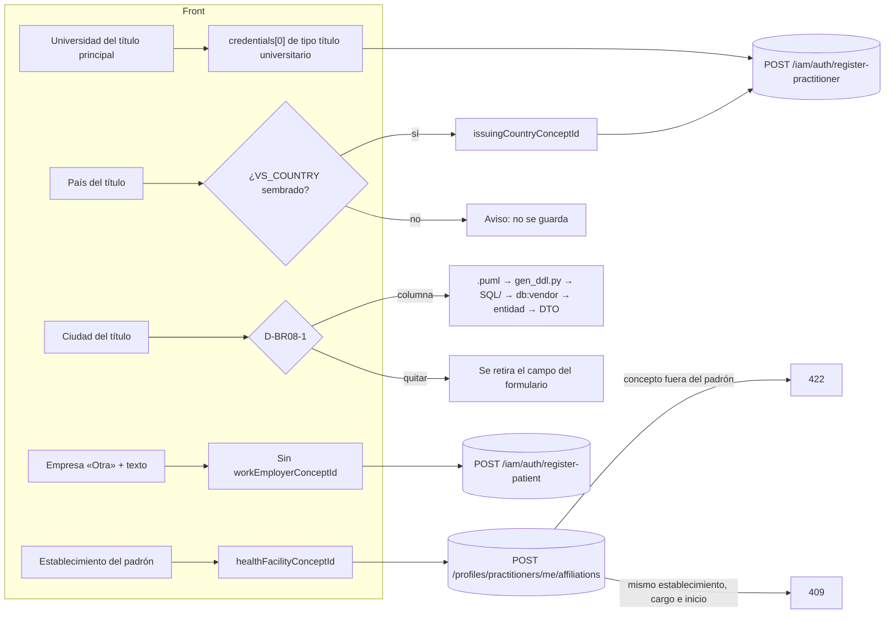

# TASK PROMPT: BR-08 — Título (universidad, país y ciudad), historial laboral del padrón y alta del paciente

> **MODO DE EJECUCIÓN:** este prompt se ejecuta en **Modo Planificación (Planning Mode)**.
> El desarrollador o el agente arranca investigando, sin tocar código fuente. Con eso escribe un
> `implementation_plan.md` detallado y espera la aprobación explícita del usuario. Después
> ejecuta los cambios en commits atómicos, verifica con pruebas unitarias y de integración, y
> **contra la API viva**. El resultado queda documentado en `walkthrough.md`.

| Campo | Valor |
|---|---|
| **Cierra** | ID-10, ID-11, ID-16, ID-21, ID-22, ID-23 (anexo A) · subtarea 1.6 (lo que queda) |
| **Severidad máxima** | Media |
| **Repo(s)** | `mantra-core-health-api` (clon `mantra-core-health-redesa-api`), `mantra-core-health` (front) y, si D-BR08-1 lo pide, `mantra-core-health-model` |
| **Toca el modelo** | **Sólo por la ciudad del título** (ID-10): no hay columna. Todo lo demás usa columnas existentes |
| **Depende de** | **BR-07 Parte 1** (merge de #453), que ya agrega `credentials[].fileId` al alta. Este prompt sale de `dev` después de ese merge. El PR abierto #454 de la API toca `iam-patient-self-registration.service.ts`: coordinar si ID-11 se resuelve en la API |
| **Decisión previa** | Ninguna de README §8. Tiene **tres decisiones propias** (D-BR08-1…3, sección 5), que se piden en el paso 1 |

---

## 1. Contexto de negocio y justificación técnica

### A. Por qué importa
El dueño pidió que el médico declare **dónde estudió** (universidad, país y ciudad) y **todos sus
títulos** (MÓDULO MÉDICO §1.4 y §1.15–§1.20). El formulario lo pregunta, pero **la mitad se tira
en silencio**: la universidad del título principal, el país y la ciudad no llegan a la API. Del
lado del paciente, la empresa escrita a mano se pierde, y el historial laboral «sólo del padrón»
es una regla que únicamente hace cumplir la pantalla. Son datos que el usuario cree haber
guardado y no guardó.

### B. Estado del frontend (`mantra-core-health`, `origin/mockup` @ `95472903`)
- **Título principal del médico** (`features/auth/register-practitioner/register-practitioner.ts`):
  - `:796-798`: controles `professionalTitleUniversity`, `professionalTitleCountry`,
    `professionalTitleCity`, mostrados en `:1264-1276`.
  - `datosProfesional()` (`:2384-2462`) **no los manda**. El comentario de `:2457-2459` lo admite:
    «Nombre, país y ciudad permanecen locales porque este contrato no los recibe».
  - `:309-332` documenta el porqué: no hay padrón de universidades en ninguna capa; `VS_COUNTRY`
    no tiene miembros (sólo existen conceptos sueltos de país); **la ciudad no tiene columna**.
- **Títulos adicionales (paso 10)**: `credencialesDeclaradas()` (`:671-689`) manda tipo, número,
  `issuingInstitutionText` y `fileId`. **País y ciudad de cada título se descartan**, y **una fila
  sin número se descarta entera sin aviso** (`numero === '' → []`).
- **Alta del paciente** (`features/auth/register-patient/register-patient.ts`):
  - `:2489`: manda `workEmployerConceptId: empresa` **aunque la opción sea
    `employer:bo:OTRA`**, y `:2497-2498` manda además `workEmployerFreeText` (ID-11).
  - La ocupación hace lo correcto: `:2479` omite el concepto cuando `ocupacionEsOtra()`.
- **Historial laboral** (`features/account/my-profile/work-history/work-history.ts`, sólo en
  `origin/mockup`, commit `170e571f`):
  - `:729-737` manda `organizationName` (el nombre canónico del padrón), `roleTitle`, fechas y
    `practiceSiteId`. **El id del establecimiento elegido (`establecimiento()`) no viaja** (ID-16).
  - `:1073` tiene un segundo camino (`addAffiliation({ organizationName: lugar.label, … })`) que
    tampoco manda el concepto.
- **Tipos** (`core/data-access/iam/iam.types.ts`, `core/data-access/profiles/profiles.types.ts`):
  - `iam.types.ts:42-198`: `PatientRegistration` declara opcionales `email`, `birthDate`,
    `phone`, `sexAtBirth`, `issuerAdministrativeAreaConceptId`, que la API exige (ID-21).
  - `profiles.types.ts:939-958` (`OwnPatientProfileChanges`) no tiene
    `issuerAdministrativeAreaConceptId`, `workEmployer*`, `workMunicipalityConceptId` ni
    `guardian*`; `OwnPatientProfile` (`:864-938`) no lee `workEmployer*` (ID-22).
  - `profiles.types.ts:26-59` (`NewPatientProfile`) declara campos que `CreatePatientDto` no
    tiene; `UpdatePractitionerAffiliation.departmentText` (`:673`) no está en
    `UpdateAffiliationDto` (ID-23).

### C. Estado de la API (`origin/dev` @ `7541797c`) y del modelo
- **Credenciales:**
  - `AddOwnCredentialDto` (`src/modules/profiles/dto/own-credential.dto.ts:22-75`): tipo, número,
    `issuingInstitutionText`, `issueDate`, `fileId`. **Sin `issuingCountryConceptId`.**
  - `RegisterPractitionerCredentialDto` (en `dev`: tipo, número, institución; #453 agrega
    `fileId`). **Sin país.**
  - Modelo (`mantra-core-health-model/SQL/05_profiles/02_tables.sql:134-156`):
    `issuing_institution_text` e `issuing_country_concept_id` existen; **no hay columna de ciudad**.
  - `VS_COUNTRY`: no aparece en `src/` de la API ni en `SQL/` del modelo (búsqueda textual). Hay
    conceptos de país en `src/common/constants/concepts.ts:433-444` (`COUNTRY_PE`, `_BO`, `_BR`,
    `_US`, `_AR`); **sin confirmar** si están sembrados como miembros de algún value set en la
    base viva. `VS_BO_DEPARTMENT` se siembra en `src/common/seed/bo-geography-seed.service.ts`:
    es el patrón a seguir.
  - La subtarea 1.6 (`PROMPT_SUBTAREA_1_6_UNIVERSIDAD_TITULOS.md`, raíz de ambos repos) pedía
    `university`, `degreeCountryConceptId`, `degreeCityText`, `diplomaFileId`,
    `academicTitles[]` e `issuingCityText`. **Quedó superada en parte:** `credentials[]` ya cumple
    el rol de `academicTitles[]`, y #453 agrega `fileId` por fila. **`issuingCityText` no tiene
    columna: agregarlo al DTO sin columna sería guardar nada o inventar dónde.** No ejecutar esa
    subtarea tal como está escrita.
- **Alta del paciente:** `src/modules/iam/services/iam-patient-self-registration.service.ts:282-284`
  hace `workEmployerFreeText: dto.workEmployerConceptId ? undefined : dto.workEmployerFreeText`.
  Con el concepto OTRA presente, el texto se descarta (ID-11). `RegisterPatientDto` declara
  `email!`, `birthDate!`, `phone!`, `sexAtBirth!`, `issuerAdministrativeAreaConceptId!` (ID-21,
  cerrado del lado API por `ee60a8d2`).
- **Perfil del paciente:** `UpdateOwnPatientProfileDto` acepta `issuerAdministrativeAreaConceptId`
  (`:332`), `workEmployer*` (`:369`) y `guardian*` (`:410-474`); la respuesta devuelve
  `workEmployerConceptId` y `workEmployerFreeText` (ID-22: el hueco es sólo del front).
- **Historial laboral:** `CreateAffiliationDto` (`src/modules/profiles/dto/affiliation.dto.ts:22-92`)
  tiene `organizationName`, `roleTitle`, `practiceSiteId`, `affiliationTypeConceptId`,
  `startDate`, `endDate`. **Sin `healthFacilityConceptId` ni `departmentText`**, aunque la
  entidad sí (`entities/practitioner_affiliations.entity.ts:62-80`) y el modelo también
  (`02_tables.sql:210-230`). El padrón es `VS_BO_HEALTH_FACILITY`
  (`src/common/seed/bolivia-facilities.catalog.ts:21`, 503 establecimientos).
- **Índice de unicidad**: `ux_practitioner_affiliations_same_health_facility` es
  `(practitioner_profile_id, health_facility_concept_id, role_title, start_date) WHERE
  health_facility_concept_id IS NOT NULL` (`database/SQL/05_profiles/04_indexes.sql:205`).
  **Discrepancia con el anexo:** no impide «fechas superpuestas», sólo el mismo cargo con la
  misma fecha de inicio. El 409 se prueba con ese caso exacto.

### D. Aislamiento
- API: campos **opcionales** nuevos en tres DTO (`AddOwnCredentialDto`,
  `RegisterPractitionerCredentialDto`, `CreateAffiliationDto`/`UpdateAffiliationDto`) y, según
  D-BR08-2, una regla en el alta del paciente. Nada se vuelve obligatorio.
- Modelo: sólo si D-BR08-1 = agregar columna.
- Front: alta del médico, alta del paciente, editor del paciente, historial laboral y tipos.
- No toca el perfil del médico (BR-07) ni la aprobación de afiliaciones por la organización
  (BR-28).

---

## 2. Flujo de Git y entrega

```bash
# Modelo (sólo si D-BR08-1 = columna)
cd mantra-core-health-model && git fetch origin
git switch -c <dev>/feat-ciudad-del-titulo origin/<rama-base-del-modelo>   # confirmar la base con su dueño
# API (después del merge de #453)
cd ../mantra-core-health-redesa-api && git fetch origin
git switch -c <dev>/feat-titulo-pais-y-padron-laboral origin/dev
# Front
cd ../mantra-core-health && git fetch origin
git switch -c <dev>/fix-alta-titulo-empresa-y-padron origin/mockup
```
- Commits sugeridos (API):
  - `feat(profiles): país emisor en las credenciales propias y del alta`
  - `feat(profiles): el historial laboral recibe el establecimiento del padrón`
  - `fix(iam): la empresa «Otra» conserva el texto libre` (sólo si D-BR08-2 = API)
  - `feat(seed): miembros de VS_COUNTRY` (si D-BR08-3 lo aprueba)
- Commits sugeridos (front):
  - `fix(alta-medico): la universidad del título principal viaja como credencial`
  - `fix(alta-medico): no se descarta una fila de título sin avisar`
  - `fix(alta-paciente): con empresa «Otra» no viaja el concepto`
  - `feat(perfil-paciente): corregir departamento emisor y empresa`
  - `fix(historial): el alta del padrón manda healthFacilityConceptId`
  - `refactor(tipos): alinear PatientRegistration y NewPatientProfile con los DTO`
- PR API: `gh pr create --base dev --reviewer jsaldias39,PabloArauzCaballero`.
- PR front: `gh pr create --base mockup --reviewer jsaldias39,PabloArauzCaballero`.
- PR modelo (si aplica): revisores `jsaldias39,PabloArauzCaballero` más quien mantiene el modelo.
- **El flujo termina en abrir los PR.** El merge exige revisión humana.

---

## 3. Diagrama



---

## 4. Archivos a modificar o crear

**Modelo (sólo si D-BR08-1 = columna):**
- `[MODIFICAR]` `mantra-core-health-model/Mantra Core Health Context/modules/diagram_05_profiles.puml`:
  `issuing_city_text : varchar` en `professional_credentials`.
- `[REGENERAR]` `SQL/05_profiles/02_tables.sql` con `salud-db/gen_ddl.py` (nunca a mano).
- `[CREAR]` el patch incremental en `SQL/patches/` para bases vivas, si la política del modelo lo
  exige.

**API (`mantra-core-health-api`):**
- `[MODIFICAR]` `database/SQL/**` **sólo con** `corepack yarn db:vendor`; verificar con
  `corepack yarn db:vendor:check`.
- `[MODIFICAR]` `src/modules/profiles/entities/professional_credentials.entity.ts`: la columna
  nueva, si existe.
- `[MODIFICAR]` `src/modules/profiles/dto/own-credential.dto.ts`: `issuingCountryConceptId?`
  (`@IsUUID`) y, si hay columna, `issuingCityText?` (`@MaxLength` acorde al DDL). También en
  `OwnCredentialResponseDto`.
- `[MODIFICAR]` `src/modules/iam/dto/register-practitioner.dto.ts`
  (`RegisterPractitionerCredentialDto`): los mismos campos opcionales.
- `[MODIFICAR]` `src/modules/iam/services/iam-practitioner-self-registration.service.ts` y
  `src/modules/profiles/services/profiles-practitioners.service.ts` (`addOwnCredential`,
  `updateOwnCredential` de #453): validar el país contra su value set (422 si no es miembro) y
  persistirlo; devolverlo en `me/summary` (`PractitionerCredentialDto`).
- `[MODIFICAR]` `src/modules/profiles/dto/affiliation.dto.ts`: `healthFacilityConceptId?` y
  `departmentText?` en `CreateAffiliationDto`; en `UpdateAffiliationDto`, según el plan; y en
  `AffiliationResponseDto`.
- `[MODIFICAR]` el servicio de afiliaciones: validar el concepto contra `VS_BO_HEALTH_FACILITY`
  (422) y traducir la violación de `ux_practitioner_affiliations_same_health_facility` a 409.
- `[MODIFICAR]` `src/modules/iam/services/iam-patient-self-registration.service.ts:282-284`
  sólo si D-BR08-2 = API (coordinar con el PR #454, que toca este archivo).
- `[CREAR o MODIFICAR]` seed de `VS_COUNTRY` siguiendo `bo-geography-seed.service.ts`, si
  D-BR08-3 = sembrar. **Sin inventar la lista:** la fuente de los países tiene que estar citada
  (ISO 3166 u otra que apruebe el dueño).
- `[MODIFICAR]` specs de DTO y servicio; `test/integration/*` para el país y el padrón.
- `[MODIFICAR]` `openapi/openapi.json|yaml` en las operaciones tocadas.

**Front (`mantra-core-health`):**
- `[MODIFICAR]` `features/auth/register-practitioner/register-practitioner.ts`:
  - la universidad del título principal viaja como `issuingInstitutionText` de una credencial de
    título universitario (o se une a la fila del paso 10 si ya existe esa credencial);
  - país (y ciudad si hay columna) por fila; si no hay value set, el campo avisa que no se guarda
    o se quita;
  - una fila de título incompleta **frena con mensaje**, no se descarta.
- `[MODIFICAR]` `features/auth/register-patient/register-patient.ts:2489`: con `empresaEsOtra()`
  no viaja `workEmployerConceptId` (misma regla que `:2479`).
- `[MODIFICAR]` el editor del paciente (`features/account/my-profile/…`, componente que usa
  `OwnPatientProfileChanges`): departamento emisor en «Datos personales» y empresa en «Contacto».
- `[MODIFICAR]` `features/account/my-profile/work-history/work-history.ts:729-737` y `:1073`:
  mandar `healthFacilityConceptId` del establecimiento elegido.
- `[MODIFICAR]` `core/data-access/iam/iam.types.ts` (ID-21) y
  `core/data-access/profiles/profiles.types.ts` (ID-22, ID-23; `departmentText` sólo si la API lo
  acepta).
- `[MODIFICAR]` `core/mock/handlers/auth.handlers.ts` y `profiles.handlers.ts`: guardar lo que
  la API guarda y rechazar con 400 lo que no declara (alineado con BR-02).

---

## 5. Reglas de implementación

**Decisiones del paso 1 (pedirlas con opciones antes de escribir código):**

| # | Decisión | Opciones | Pros / contras |
|---|---|---|---|
| D-BR08-1 | Ciudad del título | **A.** Columna `issuing_city_text` en `professional_credentials` (4 capas). **B.** Quitar la pregunta del formulario. **C.** Dejarla visible con aviso de que no se guarda | A cumple el pedido del dueño, pero es cambio de modelo con revisión de su dueño. B es honesto e inmediato, pero contradice el pedido. C es la peor: se pregunta algo que se tira |
| D-BR08-2 | Empresa «Otra» (ID-11) | **A.** Lo corrige el front (no manda el concepto con OTRA). **B.** La API trata el concepto OTRA como «usar el texto» | A es una línea y replica la regla de la ocupación. B protege a cualquier cliente, pero agrega un caso especial por código de concepto y choca con el PR #454 |
| D-BR08-3 | País | **A.** Sembrar `VS_COUNTRY` con una fuente citada y exponer `issuingCountryConceptId`. **B.** Exponer el campo pero dejar el país fuera del formulario hasta tener value set | A cierra el pedido. B evita sembrar una lista sin fuente aprobada |

**Reglas de la API:**
- Conceptos por `*_concept_id`, validados contra su value set → 422 si no es miembro. **Sin
  enums inventados ni listas hardcodeadas** de países o universidades.
- **No existe padrón de universidades en ninguna capa.** La universidad es texto
  (`issuing_institution_text`). No crear un catálogo sin dataset ni estrategia de importación.
- No agregar `issuingCityText` a ningún DTO **sin** columna (sería un campo que se acepta y se
  tira).
- Un caso de uso = una transacción. El alta del médico sigue siendo atómica (registro CTI:
  `persons → person_profiles → health_practitioner_profiles → professional_credentials`).
- `row_version` → `@Version()`. Whitelist + `forbidNonWhitelisted` intactos.
- Cambios de modelo sólo por el camino de 4 capas. No editar la base ni `database/SQL` a mano.
  El `SQL/` de la raíz del workspace está viejo: no usarlo como referencia.

**Reglas del front:**
- **Ningún campo que el formulario muestra se descarta sin aviso.** Si algo no se guarda, o se
  quita o se dice.
- Los tipos tienen que impedir construir un cuerpo que la API rechaza (ID-21, ID-23): un
  `PatientRegistration` sin `phone` no compila.
- `NO_TEST_WEAKENING`: los specs que fijan el comportamiento viejo se reescriben con el
  contrato nuevo y se explica en el PR.

---

## 6. Criterios de aceptación (Gherkin)

```gherkin
Escenario: La universidad del título principal se guarda
  Dado un alta de médico con universidad "Universidad Mayor de San Andrés"
  Cuando se envía "POST /iam/auth/register-practitioner"
  Entonces responde 201
  Y existe una credencial de título universitario con issuing_institution_text igual a esa universidad

Escenario: País emisor del título
  Dado VS_COUNTRY con miembros sembrados
  Cuando un médico agrega un título con issuingCountryConceptId de Argentina
  Entonces responde 201 y "me/summary" devuelve ese país en la credencial
  Y con un concepto que no es país responde 422

Escenario: Ninguna fila de título se pierde en silencio
  Dado un título del paso 10 con universidad pero sin número
  Cuando el médico intenta avanzar
  Entonces el formulario marca la fila como incompleta y no envía el alta

Escenario: Empresa escrita a mano en el alta del paciente
  Dado un alta de paciente con empresa «Otra» y el texto "Consultores S.R.L."
  Cuando se registra
  Entonces persons.work_employer_free_text es "Consultores S.R.L."
  Y persons.work_employer_concept_id es NULL

Escenario: Empresa del catálogo
  Dado un alta con una empresa del catálogo
  Entonces work_employer_free_text es NULL

Escenario: El paciente corrige su departamento emisor
  Dado un paciente logueado
  Cuando cambia el departamento emisor y guarda
  Entonces "PATCH /profiles/patients/me" responde 200 y la relectura lo muestra

Escenario: Historial laboral sólo del padrón
  Dado un médico que elige un establecimiento de VS_BO_HEALTH_FACILITY
  Cuando da de alta el vínculo
  Entonces practitioner_affiliations.health_facility_concept_id es el concepto elegido
  Y con un concepto fuera del padrón responde 422
  Y un segundo alta con el mismo establecimiento, cargo y fecha de inicio responde 409

Escenario: Los tipos impiden el cuerpo inválido
  Dado un PatientRegistration sin phone
  Cuando se compila el front
  Entonces falla con error de tipos
```

---

## 7. Definition of Done

- [ ] `implementation_plan.md` aprobado con D-BR08-1…3 resueltas por escrito.
- [ ] Si hubo cambio de modelo: `.puml` → `gen_ddl.py` → `SQL/` en `mantra-core-health-model`
      (PR propio), `corepack yarn db:vendor` en la API y `corepack yarn db:vendor:check` en
      verde; la base reconstruida desde `database/SQL` tiene la columna (salida de `\d` pegada).
- [ ] País (y ciudad si aplica) en `AddOwnCredentialDto`, `RegisterPractitionerCredentialDto`
      y la lectura. Validación contra value set con 422.
- [ ] `healthFacilityConceptId` aceptado, validado contra el padrón y usado por el front.
- [ ] ID-11 resuelto según D-BR08-2; ID-21, ID-22 e ID-23 en el front.
- [ ] API: `corepack yarn typecheck`, `lint`, `test`, `build`, y las integraciones tocadas con
      `corepack yarn test:integration` (`ORM_SCHEMA_SYNC=off`). Front: `typecheck`, `build` y
      `test --watch=false` en verde.
- [ ] **Evidencia de runtime pegada en los PR** (UI → request → response → persistencia →
      recarga → UI): alta del médico con universidad y país; alta de paciente con empresa
      «Otra»; vínculo laboral del padrón; `SELECT` de cada fila.
- [ ] `PROMPT_SUBTAREA_1_6_UNIVERSIDAD_TITULOS.md` anotado como superado (en la PR, no se borra).
- [ ] PR abiertos con revisores `jsaldias39` y `PabloArauzCaballero`, y `walkthrough.md`.

---

## 8. Plan de QA

### A. Pruebas automatizadas
```bash
# API
corepack yarn test src/modules/profiles src/modules/iam --runInBand
corepack yarn test:integration test/integration/practitioner-registration.int-spec.ts --runInBand
corepack yarn db:vendor:check          # si hubo cambio de modelo
corepack yarn typecheck && corepack yarn lint && corepack yarn build
# Front
corepack yarn test --watch=false --include=src/app/features/auth/register-practitioner/**
corepack yarn test --watch=false --include=src/app/features/auth/register-patient/**
corepack yarn test --watch=false --include=src/app/features/account/my-profile/**
corepack yarn typecheck
```
- Spec de DTO: `issuingCountryConceptId` aceptado; `issuingCityText` rechazado si no hay columna.
- Spec del servicio de afiliaciones: 422 fuera del padrón, 409 por el índice.
- Spec del alta del paciente (front): con OTRA no viaja el concepto.

### B. Integración (API viva)
1. Stack de la API con seeds; `node dist/src/main.js` con `ORM_SCHEMA_SYNC=off`.
2. Front en `real-api` (o `production-api` si BR-01 está hecho).
3. Recorridos: alta de médico con dos títulos (uno sin número para ver el aviso) → login →
   «Mis credenciales» muestra universidad y país; alta de paciente con empresa «Otra» → login →
   editor muestra la empresa; historial laboral con un establecimiento del padrón.

### C. Verificación manual y logs
- `psql`: `SELECT credential_type_concept_id, issuing_institution_text, issuing_country_concept_id
  FROM profiles.professional_credentials WHERE practitioner_profile_id = '<id>';`
- `psql`: `SELECT work_employer_concept_id, work_employer_free_text FROM profiles.persons WHERE id = '<id>';`
- `psql`: `SELECT organization_name, health_facility_concept_id FROM profiles.practitioner_affiliations WHERE practitioner_profile_id = '<id>';`
- Consola del navegador sin `[mock]` y sin 400 en las llamadas del alta.
