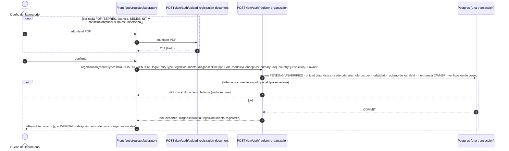

# TASK PROMPT: BR-09 — Altas de laboratorio, imagenología y hospital conectadas a la API

> **MODO DE EJECUCIÓN:** este prompt se ejecuta en **Modo Planificación (Planning Mode)**.
> El desarrollador o el agente arranca investigando, sin tocar código fuente. Con eso escribe un
> `implementation_plan.md` detallado y espera la aprobación explícita del usuario. Después
> ejecuta los cambios en commits atómicos, verifica con pruebas unitarias y de integración, y
> **contra la API viva**. El resultado queda documentado en `walkthrough.md`.

| Campo | Valor |
|---|---|
| **Cierra** | ID-17 (anexo A) · CL-42, CL-43 (anexo B) · CV-03 (anexo E) |
| **Severidad máxima** | Alta |
| **Repo(s)** | `mantra-core-health` (front) y `mantra-core-health-api` (clon `mantra-core-health-redesa-api`) |
| **Toca el modelo** | No en lo verificado. Las modalidades que el front creía faltantes ya existen como conceptos en la API. Sólo lo tocaría una decisión de aceptar sucursales en el alta con tablas nuevas (no hace falta: `diagnostic_unit_sites` existe) |
| **Depende de** | **BR-06** para que el dueño del laboratorio pueda administrar su unidad (CL-44: hoy todo `diagnostic_units` es `SECURITY_ADMIN`). Este prompt puede cerrar las altas sin BR-06; la prueba de «entra a su consola» queda para cuando BR-06 esté mergeado |
| **Decisión previa** | Ninguna de README §8. Tiene **tres decisiones propias** (D-BR09-1…3, sección 5), que se piden en el paso 1 |

---

## 1. Contexto de negocio y justificación técnica

### A. Por qué importa
El propósito central dice que el paciente ve los resultados de **sus laboratorios y hospitales**.
Para eso esos actores tienen que existir en la plataforma. Hoy **ninguno se puede dar de alta**:
las pantallas públicas de laboratorio y de imagenología cierran «con una solicitud» que no sale a
la red, y el hospital no tiene ni alta ni consola. La API ya tiene resuelta el alta de un centro
diagnóstico (subtarea 1.5 cerrada del lado API): falta cablear el front, corregir el contrato de
documentos para las unipersonales y definir el camino del hospital.

### B. Estado del frontend (`mantra-core-health`, `origin/mockup` @ `95472903`)
- **Laboratorio** (`features/auth/register-laboratory/register-laboratory.ts`, 868 líneas):
  - `:51`: «Es la MAQUETA: nada sale a la red. Ver `submit()`».
  - `:850-863`: `submit()` sólo hace `this.enviada.set(true)`; el JSDoc dice «hoy **no existe**
    un endpoint de alta de laboratorio». **Es falso desde la subtarea 1.5:** existe
    `register-organization` con `DIAGNOSTIC_CENTER`.
  - `:70`: ofrece `UNIPERSONAL` como tipo societario, y `:259-264` documenta que para una
    unipersonal **no se exigen** constitución ni poder (CL-43).
  - `:90`, `:170-175`, `:519-525`, `:771-783`: declara **sucursales** con su propio punto en el
    mapa (punto 4.1.18 del proceso). El DTO de la API no tiene dónde ponerlas (CL-42).
- **Imagenología** (`features/auth/register-imaging-center/register-imaging-center.ts`, 1 014
  líneas):
  - `:53`: «Es la MAQUETA: nada sale a la red»; `:1003-1009` igual que el laboratorio.
  - `:575-632`: **7 adjuntos**: `seprecFile`, `licenciaFile`, `sedesFile`, `nitFile`,
    `constitucionFile`, `poderFile`, `radioproteccionFile`.
  - `:99-124` (`MODALIDADES`): guarda la **etiqueta** («Rayos X», «Resonancia magnética»…), no un
    concepto, porque su JSDoc afirma que sólo existen `MODALITY_XRAY` y `MODALITY_ULTRASOUND`.
    **Desactualizado:** ver C.
- **Cliente** (`core/data-access/iam/iam.client.ts`): `registerOrganization` (`:309-330`) fija
  `tenantType: 'PAYER'` y siempre arma el bloque `payer`. El tipo `OrganizationRegistration`
  (`iam.types.ts:436-470`) sólo modela aseguradoras.
- **Rutas** (`src/app/app.routes.ts:1978` y `:1998`): `auth/register/laboratory` y
  `auth/register/imaging-center`, con el comentario «Todavía sin endpoint —cierra con una
  solicitud, no con una cuenta» (`:1974-2006`).
- **Hospital:** no hay pantalla de alta ni consola. Una búsqueda de `orgext` y de
  `register/hospital` en `src/app` no devuelve nada.
- **Consola del laboratorio:** `core/navigation/navigation.map.ts:1009-1017` publica
  `administration/medical-laboratory` sólo para `SECURITY_ADMIN` (CL-44 → BR-06).

### C. Estado de la API (`origin/dev` @ `7541797c`)
- **`POST /iam/auth/register-organization`** (`src/modules/iam/dto/register-organization.dto.ts`):
  - `tenantType` con `@IsIn(TENANT_TYPE_CODES)` (`:433-434`), que incluye `DIAGNOSTIC_CENTER` y
    `HOSPITAL` (`src/modules/directory/directory.concepts.ts:139-165`). Los dos están en
    `TERRITORIAL_TENANT_TYPES` (`:185-195`): exigen `countryConceptId` y
    `jurisdictionConceptId` (422 `missing` si faltan).
  - `diagnosticUnit?: DiagnosticUnitProfileDto` (`:530`), definido en
    `src/modules/directory/dto/tenant-type-profile.dto.ts:213-289`: `code?`, `name?`,
    `diagnosticUnitTypeConceptId?`, `modalityConceptIds?` (UUID, únicos, máx. 20),
    `walkInAvailable?`, `homeCollectionAvailable?`, `primarySite?{name, timeZone, address}`.
    **No hay `sites[]`**: sólo la sede primaria.
  - La respuesta trae `diagnosticUnitId?` (`:743`), `legalDocumentsRegistered?` y
    `representativesRegistered?`.
  - `RegisterOrganizationLegalDocumentsDto` (`:46-93`): **cinco** claves **todas obligatorias**
    dentro del bloque: `constitutionFileId!`, `taxIdentifierFileId!`,
    `commerceRegistryFileId!`, `operatingLicenseFileId!`, `healthAuthorityCertificateFileId!`.
    `legalRepresentative.powerOfAttorneyFileId!` (`:338`) también es obligatorio. Una
    unipersonal que no tiene constitución ni poder recibe **400**, o tiene que omitir el bloque
    entero y perder NIT, SEPREC, licencia y SEDES (CL-43).
  - `legalEntityType` con `@IsIn(LEGAL_ENTITY_TYPE_CODES)` (`:453`); `UNIPERSONAL` es uno de los
    valores (`src/common/constants/concepts.ts:623`).
- **Provisión de la unidad**
  (`src/modules/diagnostic_units/services/diagnostic-unit-provisioning.service.ts`):
  - `:138`: el tipo por defecto es `DUNIT.UNIT_TYPE_IMAGING`; existe `UNIT_TYPE_LABORATORY`
    (`diagnostic_units.concepts.ts:19`).
  - `:248-251`: por cada `modalityConceptId` crea una oferta genérica; **si el concepto no es una
    modalidad conocida, hace `continue` y lo ignora en silencio**.
  - Modalidades declaradas en `diagnostic_units.concepts.ts:90-118`: `LABORATORY`, `XRAY`,
    `ULTRASOUND`, **`CT`, `MRI`, `MAMMOGRAPHY`, `BONE_DENSITOMETRY`**. Las seis del formulario de
    imagenología tienen concepto (sin confirmar que estén sembradas en la base viva).
- **Precarga de PDF:** `POST /iam/auth/upload-registration-document` (sólo PDF, 30/min, anónimo;
  el alta lo reclama por `fileId` dentro de su transacción).
- **Hospital** (`src/modules/organization_extensions/controllers/orgext-hospitals.controller.ts`):
  `POST /orgext/hospitals`, `POST :id/activate`, `POST|DELETE :id/service-lines(/:lineId)`,
  **todas `@Roles('SECURITY_ADMIN')`** y **sin ningún `GET`**. `CreateHospitalDto` exige
  `tenantId` y `practiceId` (`dto/create-hospital.dto.ts:14-24`); la activación exige licencia
  verificada (`README.md:12`, UC-22-02). `register-organization` con `HOSPITAL` crea el tenant pero
  **no** materializa nada de `orgext` (la materialización por tipo sólo cubre `payer`, `broker` y
  `diagnosticUnit`).
- **El dueño que se autorregistra** nace con rol global `USER` y membresía `DIR.ROLE_OWNER`; no
  recibe `SECURITY_ADMIN` (`iam-organization-self-registration.service.ts:69-73`, según CL-44).

### D. Aislamiento
- Front: dos formularios de alta, el cliente de iam y sus tipos. La aseguradora (`PAYER`) **no
  puede cambiar de comportamiento**: su alta ya funciona.
- API: el DTO de documentos legales pasa de «todo o nada» a una regla por tipo societario. Es un
  aflojamiento controlado, no un cambio de rutas.
- Hospital: en este prompt se decide el camino (D-BR09-3) y se entrega el **alta**. La consola
  completa del hospital (líneas de servicio, licencias, afiliaciones) queda fuera si la decisión
  la difiere; se deja escrita como tarjeta.
- Fuera de alcance: la consola operativa del laboratorio (muestras, resultados, liberación) es
  BR-17; los roles del dueño son BR-06.

---

## 2. Flujo de Git y entrega

```bash
# API (contrato de documentos por tipo societario; sucursales si D-BR09-2 = alta)
cd mantra-core-health-redesa-api && git status && git fetch origin
git switch -c <dev>/fix-documentos-legales-unipersonal origin/dev
# Front
cd ../mantra-core-health && git status && git fetch origin
git switch -c <dev>/feat-altas-diagnostico-contra-api origin/mockup
```
- Commits sugeridos (API):
  - `fix(iam): constitución y poder condicionales según el tipo societario`
  - `test(iam): alta unipersonal sin constitución ni poder`
  - `feat(iam): sucursales en el alta del centro diagnóstico` (sólo si D-BR09-2 = alta)
  - `fix(diagnostic-units): una modalidad desconocida responde 422 en vez de ignorarse`
- Commits sugeridos (front):
  - `refactor(iam): registerOrganization parametrizado por tipo de tenant`
  - `feat(alta-laboratorio): envía a register-organization con DIAGNOSTIC_CENTER`
  - `feat(alta-imagenologia): envía modalidades como conceptos y los PDF precargados`
  - `feat(alta-hospital): …` (según D-BR09-3)
  - `test(mock): los handlers del alta de organización validan el cuerpo como la API`
- PR API: `gh pr create --base dev --reviewer jsaldias39,PabloArauzCaballero`.
- PR front: `gh pr create --base mockup --reviewer jsaldias39,PabloArauzCaballero`.
- **El flujo termina en abrir los PR.** El merge exige revisión humana.

---

## 3. Diagrama



---

## 4. Archivos a modificar o crear

**API (`mantra-core-health-api`):**
- `[MODIFICAR]` `src/modules/iam/dto/register-organization.dto.ts`:
  `constitutionFileId` y `legalRepresentative.powerOfAttorneyFileId` pasan a opcionales en el
  DTO, y la regla por tipo societario se hace en el servicio (422 con el documento faltante). No
  usar `@ValidateIf` que dependa de un campo de otro nivel del árbol sin probarlo: el bloque
  `legalDocuments` no ve `legalEntityType` directamente.
- `[MODIFICAR]` `src/modules/iam/services/iam-organization-self-registration.service.ts`: la
  regla «SRL, S.A. y demás exigen constitución y poder; UNIPERSONAL no» antes de crear nada.
  **La aseguradora sigue exigiendo lo que exige hoy**: probarlo.
- `[MODIFICAR]` `src/modules/diagnostic_units/services/diagnostic-unit-provisioning.service.ts:248-251`:
  una modalidad que no es de la lista responde 422, no se ignora.
- `[MODIFICAR]` `src/modules/directory/dto/tenant-type-profile.dto.ts` y la provisión: `sites[]`
  **sólo** si D-BR09-2 = en el alta (`diagnostic_unit_sites` ya existe; no hace falta modelo).
- `[MODIFICAR]` specs de DTO y servicio; `test/integration/` con un alta unipersonal y un alta SRL
  sin constitución.
- `[MODIFICAR]` `openapi/openapi.json|yaml` en la operación tocada.

**Front (`mantra-core-health`):**
- `[MODIFICAR]` `core/data-access/iam/iam.client.ts:309-330` y `iam.types.ts:436-470`:
  `registerOrganization` recibe una **unión discriminada por `tenantType`** (`PAYER` con `payer`,
  `DIAGNOSTIC_CENTER` con `diagnosticUnit`, y `HOSPITAL` si D-BR09-3 lo decide). Sin `any`.
- `[MODIFICAR]` `features/auth/register-laboratory/register-laboratory.ts`: `submit()` sube los
  PDF, arma el cuerpo y llama a la API; el JSDoc de «no existe endpoint» se corrige.
  `diagnosticUnitTypeConceptId` = `UNIT_TYPE_LABORATORY` (resuelto por terminología, no
  hardcodeado como UUID); modalidad `MODALITY_LABORATORY`.
- `[MODIFICAR]` `features/auth/register-imaging-center/register-imaging-center.ts`:
  `MODALIDADES` pasa a conceptos resueltos desde terminología (`CT`, `MRI`, `MAMMOGRAPHY`,
  `BONE_DENSITOMETRY`, `XRAY`, `ULTRASOUND`). La opción «otro» libre **no tiene dónde guardarse**:
  se quita o se avisa (sin inventar un concepto). El PDF de radioprotección no tiene clave en el
  DTO: ver D-BR09-1.
- `[MODIFICAR]` `src/app/app.routes.ts:1974-2006`: comentarios al día.
- `[CREAR o MODIFICAR]` alta de hospital según D-BR09-3.
- `[MODIFICAR]` `core/mock/handlers/auth.handlers.ts` (alta de organización y precarga):
  valida el cuerpo como la API y devuelve `diagnosticUnitId`.
- `[MODIFICAR]` specs de los dos formularios y del cliente.

---

## 5. Reglas de implementación

**Decisiones del paso 1 (pedirlas con opciones antes de escribir código):**

| # | Decisión | Opciones | Pros / contras |
|---|---|---|---|
| D-BR09-1 | Adjuntos sin lugar en el DTO (radioprotección en imagenología; cualquier otro que no mapee a las 5+1 claves) | **A.** Agregar la clave al DTO y su rol de documento. **B.** Cargarlo después de la verificación, desde la consola. **C.** Quitarlo del alta | A necesita confirmar que `AffiliationDocumentRole` tiene ese rol (sin confirmar si el `.puml` lo declara; si no, es cambio de modelo). B no bloquea. C contradice el proceso del dueño |
| D-BR09-2 | Sucursales declaradas en el alta (CL-42) | **A.** `sites[]` en `diagnosticUnit` y se crean en la misma transacción. **B.** El front avisa que se cargan tras la verificación y las guarda como borrador local | A cumple el formulario, pero hoy `POST /diagnostic-units/:id/sites` es `SECURITY_ADMIN`: el alta pública crearía algo que el dueño no puede administrar hasta BR-06. B es más chico y honesto |
| D-BR09-3 | Alta del hospital (CV-03) | **A.** Alta pública con `register-organization` `tenantType: "HOSPITAL"` (crea tenant + OWNER); la especialización `orgext` y la activación las hace la plataforma. **B.** Sólo alta administrativa (plataforma) sobre `/orgext/hospitals`. **C.** Diferir el hospital y dejarlo como tarjeta | A es simétrico con los demás, pero el hospital queda sin `orgext` hasta que la plataforma actúe, y `orgext` no tiene lecturas. B necesita un `practiceId` previo. C deja el propósito central incompleto |

**Reglas de la API:**
- **Una transacción:** tenant, unidad, sede, ofertas, reclamo de archivos, membresía y
  verificación de correo. Si algo falla, no queda nada (probarlo con un documento faltante).
- La regla por tipo societario vive en el servicio y responde **422** (`PreconditionFailedException`,
  que acá es 422) nombrando el documento faltante. El DTO sigue con whitelist estricta.
- Conceptos por `*_concept_id`. **Nada se ignora en silencio**: modalidad desconocida = 422.
- No inventar roles para el dueño: eso es BR-06.
- No editar la base ni `database/SQL`. Si D-BR09-1 = A necesita un rol de documento que el modelo
  no tiene, se va por las 4 capas (`.puml` en `mantra-core-health-model` → `gen_ddl.py` → `SQL/` →
  `corepack yarn db:vendor` → entidad → DTO) o queda como TODO explícito.

**Reglas del front:**
- Los PDF se suben **antes** del alta y en serie; si una subida falla, el alta no se envía y las
  subidas completas se conservan al reintentar (mismo patrón que el alta del médico en #453).
- El punto del mapa viaja en `primarySite.address.latitude/longitude` sólo si se confirmó.
- La aseguradora no cambia: su spec sigue verde sin tocarlo.
- `NO_TEST_WEAKENING`. Un recorrido verde en `mockup` **no es evidencia**.

---

## 6. Criterios de aceptación (Gherkin)

```gherkin
Escenario: Alta de centro de imagenología completa
  Dado los PDF precargados y las modalidades Tomografía y Resonancia
  Cuando se envía el alta con tenantType "DIAGNOSTIC_CENTER"
  Entonces responde 201 con diagnosticUnitId
  Y existen el tenant PENDING/UNVERIFIED, su unidad diagnóstica de tipo imagen, su sede primaria
    y una oferta por modalidad

Escenario: Alta de laboratorio
  Dado un laboratorio con su central geolocalizada
  Cuando envía el alta
  Entonces la unidad diagnóstica es de tipo laboratorio y la sede guarda las coordenadas

Escenario: Unipersonal sin constitución ni poder
  Dada una organización UNIPERSONAL con NIT, SEPREC, licencia y SEDES
  Cuando se registra sin constitución ni poder
  Entonces responde 201 y quedan registrados los cuatro documentos

Escenario: SRL sin constitución
  Dada una SRL sin constitución
  Cuando se registra
  Entonces responde 422 con el documento faltante y no se crea ninguna cuenta

Escenario: Modalidad desconocida
  Cuando el alta trae un modalityConceptId que no es una modalidad
  Entonces responde 422 y no se crea nada

Escenario: Territorio obligatorio
  Dado un alta DIAGNOSTIC_CENTER sin país ni jurisdicción
  Entonces responde 422 "missing"

Escenario: Las sucursales no se pierden en silencio
  Dado un alta con dos sucursales
  Cuando se envía
  Entonces las sucursales se crean, o el front avisa que se cargan tras la verificación

Escenario: La aseguradora sigue igual
  Dado el alta de aseguradora con todos sus documentos
  Cuando se envía
  Entonces responde 201 como antes de este cambio

Escenario: El dueño entra a su consola (requiere BR-06)
  Dado el dueño de un laboratorio verificado
  Cuando abre «Laboratorio médico»
  Entonces ve sólo su unidad
```

---

## 7. Definition of Done

- [ ] `implementation_plan.md` aprobado con D-BR09-1…3 resueltas por escrito.
- [ ] La regla de documentos por tipo societario vive en el servicio, con 422, y la aseguradora
      no cambia (spec de regresión).
- [ ] Modalidad desconocida → 422.
- [ ] Laboratorio e imagenología llaman a la API; `submit()` ya no es un `set(true)`.
- [ ] Hospital según D-BR09-3 (alta entregada o tarjeta escrita con el camino decidido).
- [ ] Mock del alta de organización fiel al DTO.
- [ ] API: `corepack yarn typecheck`, `lint`, `test`, `build`, e integración con
      `corepack yarn test:integration` (`ORM_SCHEMA_SYNC=off`). Front: `typecheck`, `build`,
      `test --watch=false`.
- [ ] Si se agregó alguna ruta: arrancar `node dist/src/main.js`, `grep` de `Mapped {<ruta>`
      pegado, y `*.module.spec.ts` que exija el controlador en `controllers`.
- [ ] **Evidencia de runtime pegada en los PR** (UI → request → response → persistencia →
      recarga → UI): alta de imagenología y de laboratorio unipersonal contra la API viva;
      `SELECT` de `directory.tenants`, `diagnostic_units.diagnostic_units`,
      `diagnostic_unit_sites` y ofertas; verificación del correo y login del dueño.
- [ ] PR abiertos con revisores `jsaldias39` y `PabloArauzCaballero`, y `walkthrough.md`.

---

## 8. Plan de QA

### A. Pruebas automatizadas
```bash
# API
corepack yarn test src/modules/iam src/modules/diagnostic_units src/modules/directory --runInBand
corepack yarn test:integration --testPathPatterns=organization --runInBand
corepack yarn typecheck && corepack yarn lint && corepack yarn build
# Front
corepack yarn test --watch=false --include=src/app/features/auth/register-laboratory/**
corepack yarn test --watch=false --include=src/app/features/auth/register-imaging-center/**
corepack yarn test --watch=false --include=src/app/core/data-access/iam/**
corepack yarn typecheck
```
- Spec del servicio: UNIPERSONAL sin constitución (ok), SRL sin constitución (422), aseguradora
  sin cambios, rollback completo ante un documento faltante.
- Spec del cliente del front: el cuerpo de `DIAGNOSTIC_CENTER` no lleva `payer`, y el de `PAYER`
  no lleva `diagnosticUnit`.

### B. Integración (API viva)
1. Stack de la API con seeds; `node dist/src/main.js` con `ORM_SCHEMA_SYNC=off`.
2. Confirmar en la base que los conceptos de modalidad están sembrados:
   `SELECT code FROM terminology.concepts WHERE code LIKE 'DU_MODALITY_%';` (ajustar la tabla a
   la real; sin confirmar el nombre exacto).
3. Front en `real-api` (o `production-api` si BR-01 está hecho). Recorrer las dos altas.
4. Verificar el correo del dueño y entrar. Con BR-06 mergeado, abrir la consola del laboratorio.

### C. Verificación manual y logs
- Log de la API: una sola transacción por alta; ningún `continue` silencioso de modalidades.
- `psql`: que los `fileId` precargados tengan dueño después del alta
  (`common.files.created_by_user_id` no nulo).
- Consola del navegador sin `[mock]`.
