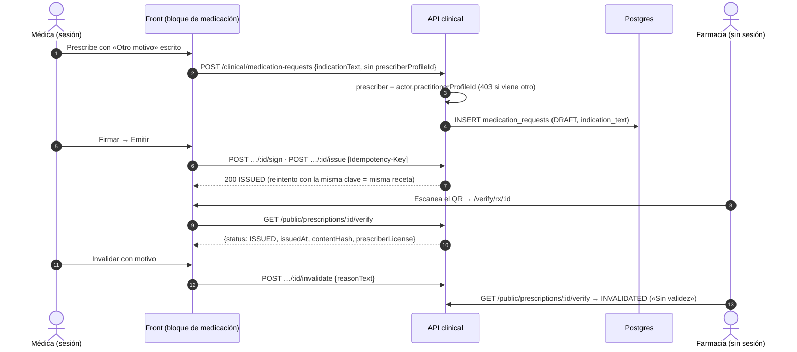

# TASK PROMPT: BR-10 — Receta completa: prescriptor por sesión, motivo libre, QR público, corrección, favoritas y políticas D-05

> **MODO DE EJECUCIÓN:** este prompt se ejecuta en **Modo Planificación (Planning Mode)**.
> El desarrollador o el agente arranca investigando, sin tocar código fuente. Con eso escribe un
> `implementation_plan.md` detallado y espera la aprobación explícita del usuario. Después
> ejecuta los cambios en commits atómicos, verifica con pruebas unitarias y de integración, y
> **contra la API viva levantada**. El resultado queda documentado en `walkthrough.md`.

| Campo | Valor |
|---|---|
| **Cierra** | CL-02, CL-03, CL-06, CL-14, CL-15, CL-17, CL-19 (anexo B) · CV-09 (anexo E) · pendiente **P24** |
| **Severidad máxima** | Alta |
| **Repo(s)** | `mantra-core-health-redesa-api` (API, rama `dev`) · `mantra-core-health` (front, rama `mockup`) · `mantra-core-health-model` (sólo CL-03) |
| **Toca el modelo** | **Sí, una columna** (`clinical.medication_requests.indication_text`, P24). El README §6 dice «no»: la tabla del README está mal en ese punto, CL-03 no se cierra sin la columna |
| **Depende de** | Nada para empezar. BR-02 (mock honesto) replica en el mock las guardas D-05 (CL-12); BR-06 si la pantalla de políticas la usa un admin de organización sin `SECURITY_ADMIN` |
| **Decisión previa** | Ninguna del README §8. Hay dos preguntas de producto chicas que el plan deja escritas (ver §5): quién administra las políticas D-05 y si el prescriptor puede ser «en nombre de» otro |

---

## 1. Contexto de negocio y justificación técnica

### A. Por qué importa
La receta es el documento clínico con más consecuencias legales del producto: la lee una farmacia
por QR, la firma el médico y la descarga el paciente. Hoy, contra la API real, **sale sin médico
ni matrícula**, el «otro motivo» escrito a mano la hace fallar con 400, el QR del PDF lleva a una
página que no existe y el médico no tiene cómo corregir una receta emitida. En la maqueta todo se
ve bien porque el mock rellena el prescriptor, acepta cualquier campo y emite sin firma.

### B. Estado del frontend (`mantra-core-health`, `mockup` @ `9b3e0101`)
- `features/clinical-record/patient-chart/medication-block/medication-block.ts:917-941`: arma el
  cuerpo de `createMedicationRequest` **sin `prescriberProfileId`** (0 apariciones en el archivo,
  también en `origin/dev`). El mock lo completa con la sesión (`core/mock/handlers/clinical.handlers.ts:306`).
- `medication-block.ts:66` (`OTRO_MOTIVO`), `:391` (opción «Otro motivo — escribirlo») y
  `:936-941`: manda `indicationText`. `clinical.types.ts:438` ya advierte que la API no lo tiene.
  El mock lo inventa (`clinical.handlers.ts:319-321`).
- `app.routes.ts`: sólo existe `verify/portability/:manifestHash` (`:1910`). **No hay
  `verify/rx/:id`** ni cliente para `GET /public/prescriptions/:id/verify`. El mock sirve la ruta
  (`clinical.handlers.ts:375-389`) sin consumidor, con `status: 'ISSUED'|'DRAFT'`.
- `medication-block.ts:1011`: el diálogo dice «para corregirla hay que invalidarla o
  reemplazarla», pero `ClinicalClient` no tiene `edit`, `invalidate`, `replace`, `renew` ni
  `medication-records`.
- `clinical.client.ts:310-336`: `issue` sale **sin cabecera `Idempotency-Key`**.
- Favoritas y políticas D-05: sin cliente ni pantalla. El mock de favoritas
  (`misc.handlers.ts:384-418`) muestra a cualquier practicante las de la médica del fixture (`:388`).
- Patrón a copiar para la página pública: `features/insurance/portability-verify/*` (fuera del
  armazón, sin sesión, sin menú) y `core/data-access/public/public.client.ts`. En
  `app.routes.server.ts` el comodín `**` es `RenderMode.Client`.

### C. Estado de la API (`mantra-core-health-redesa-api`, `dev` @ `7541797c`)
- `clinical/services/medications.service.ts:233`: `prescriberProfileId: dto.prescriberProfileId`,
  sin default al actor ni control de que sea el actor. `assertFirmaElPrescriptor` (`:171-184`)
  cae a `createdByUserId` cuando no hay prescriptor. Consecuencia: `prescription-pdf.service.ts`
  no resuelve prescriptor ni matrícula → PDF sin firma profesional y verify con
  `prescriberLicense: null`.
- `clinical/dto/medication.dto.ts`: `CreateMedicationRequestDto` y `EditMedicationRequestDraftDto`
  **no declaran `indicationText`** (sí `indicationConditionId`, `:154` y `:354`). `git grep
  indication_text -- src database` = **0**. Con `forbidNonWhitelisted` → 400.
- `clinical/controllers/clinical-records.controller.ts` (todas `@Roles('CLINICIAN','PRACTITIONER')`):
  `medication-records` `:144`, `:id/edit` `:156`, `:id/sign` `:168`, `:id/issue` `:179`
  (`@Headers('idempotency-key')` `:185`), `:id/invalidate` `:191`, `:id/replace` `:203`,
  `:id/renew` `:217`. El versionado de corrección ya es inmutable
  (`replaces_request_id`/`replaced_by_request_id`/`renewed_from_request_id`).
- `medications.service.ts:379-424`: sin clave de idempotencia, un reintento de `issue` da 422
  «Solo un borrador puede emitirse». Columna `issue_idempotency_key` con UNIQUE parcial (v4.0.9).
- Verify público: `clinical-prescriptions-public.controller.ts:45-46` (`@Public`,
  `GET public/prescriptions/:id/verify`). Devuelve `PrescriptionVerificationResult`
  (`prescription-pdf.service.ts:174-180`: `id, status, issuedAt, contentHash, prescriberLicense`)
  con `status` ∈ `'DRAFT'|'ISSUED'|'COMPLETED'|'INVALIDATED'|'REPLACED'` (`:140-141`). El QR apunta
  a `${webAppBaseUrl}/verify/rx/${id}` (`:535`).
- Favoritas: `clinical_ext/controllers/prescription-favorites.controller.ts:43,57,68`
  (`GET/POST/DELETE`, sin `@Roles`, filtra por el perfil del vínculo; patch `2026-08-21_v417`).
- Políticas D-05: `clinical-prescription-policies.controller.ts:27-77` (`POST`, `GET`,
  `POST :id/deactivate`; `@Roles('CLINICIAN','SECURITY_ADMIN')`). Hoy la regla depende de las 27
  políticas comodín sembradas. Recordar: **issue sin firmar con política vigente → 422**
  (`PreconditionFailedException` del proyecto es 422, no 412).

### D. Aislamiento
- Todo el trabajo vive en `clinical` (receta) y `clinical_ext` (favoritas). No toca agenda, pagos
  ni farmacia. **Delivery y pasarela de pago quedan fuera** (la «dónde comprar» de la receta no se
  toca).
- La columna nueva es aditiva y nullable: no cambia filas existentes ni rompe clientes viejos.
- El mock se ajusta sólo en lo que este prompt consume. La fidelidad D-05 del mock (CL-12) es de
  BR-02: si BR-02 ya está mergeado, este prompt sólo agrega las rutas nuevas.

---

## 2. Flujo de Git y entrega

```bash
# Modelo (sólo CL-03)
cd mantra-core-health-model && git status && git fetch origin
git checkout -b <dev>/feat-receta-indication-text origin/dev

# API
cd ../mantra-core-health-redesa-api && git status && git fetch origin
git checkout -b <dev>/feat-receta-completa origin/dev

# Front
cd ../mantra-core-health && git status && git fetch origin
git checkout -b <dev>/feat-receta-completa origin/mockup
```

- **Orden:** modelo → API (`yarn db:vendor`) → front. El front puede avanzar en paralelo contra
  el mock con el contrato de §4 acordado.
- Commits atómicos y convencionales, por ejemplo: `feat(clinical): indication_text en
  medication_requests (P24)` (modelo) · `fix(clinical): prescriptor = perfil de la sesión, 403 si
  es ajeno` · `feat(clinical): indicationText en alta, edición, lectura y PDF` · `chore(db): vendor
  del DDL` (API) · `feat(receta): verify/rx/:id` · `feat(receta): corregir receta emitida` ·
  `fix(receta): Idempotency-Key al emitir` · `feat(receta): favoritas` · `feat(admin): políticas
  D-05` (front).
- PRs:
  - `gh pr create --base dev --reviewer jsaldias39,PabloArauzCaballero` (API y modelo).
  - `gh pr create --base mockup --reviewer jsaldias39,PabloArauzCaballero` (front).
  - Cada cuerpo enlaza los otros dos PR y lleva la evidencia de runtime pegada.
- **El merge exige revisión humana.** El flujo termina en abrir los PR.

---

## 3. Diagrama



---

## 4. Archivos a modificar o crear

**Modelo (`mantra-core-health-model`, sólo CL-03)**
- `[MODIFICAR]` `Mantra Core Health Context/modules/diagram_08_clinical.puml` (`entity
  medication_requests`, `:316`): `indication_text : varchar(200)` nullable, con comentario que diga
  que es excluyente con `indication_condition_id` y que gana el concepto (mismo criterio que
  `occupation_free_text` en `persons`).
- `[REGENERAR]` `SQL/08_clinical/02_tables.sql` con `salud-db/gen_ddl.py`, y
  `[CREAR]` `SQL/patches/<fecha>_v42xx_medication_requests_indication_text.sql` para bases vivas.

**API**
- `[MODIFICAR]` `database/SQL/**` sólo vía `corepack yarn db:vendor` (nunca a mano).
- `[MODIFICAR]` `src/modules/clinical/entities/medication_requests.entity.ts`: `indicationText?`.
- `[MODIFICAR]` `src/modules/clinical/dto/medication.dto.ts`: `indicationText?` con `@IsOptional()
  @IsString() @MaxLength(200)` en `CreateMedicationRequestDto` y `EditMedicationRequestDraftDto`.
- `[MODIFICAR]` `src/modules/clinical/dto/clinical-read.dto.ts` (`MedicationRequestItemDto`,
  `:130-207`): `indicationText?`. Aprovechar para `encounterId?` sólo si BR-14 no lo hizo (CL-11).
- `[MODIFICAR]` `src/modules/clinical/services/medications.service.ts`:
  - `prescribe()` (`:233`): `prescriberProfileId = actor.practitionerProfileId`; si el DTO trae
    otro distinto → `ForbiddenException` (salvo `SUPERADMIN`, como en `:175`); si el actor no
    tiene perfil profesional → 403.
  - `indicationText` se guarda sólo si no llega `indicationConditionId`.
  - `edit` (`:285`): la misma regla del prescriptor.
- `[MODIFICAR]` `src/modules/clinical/services/clinical-read.service.ts`: proyecta `indicationText`.
- `[MODIFICAR]` `src/modules/clinical/services/prescription-pdf.service.ts`: bajo «Diagnóstico»
  imprime la condición o el texto.
- `[MODIFICAR]` specs de los tres servicios y `[CREAR]` un int-spec de receta contra Postgres
  (`test/integration/…`) que cubra prescriptor, texto e idempotencia.

**Front**
- `[CREAR]` `src/app/core/data-access/public/prescriptions.client.ts` (`verify(id)`) y su tipo
  calcado de `PrescriptionVerificationResult`.
- `[CREAR]` `src/app/features/public-prescription-verify/*` (`ng generate component`), ruta
  `verify/rx/:id` en `app.routes.ts` junto a la de portabilidad, sin armazón ni menú. Estados:
  válida (`ISSUED`/`COMPLETED`), sin validez (`INVALIDATED`/`REPLACED`), borrador, no encontrada
  (404), error de red.
- `[MODIFICAR]` `src/app/core/data-access/clinical/clinical.client.ts` y `clinical.types.ts`:
  `editDraft`, `invalidate`, `replace`, `renew`, `recordMedicationAdministration` (si la pantalla
  lo usa), `Idempotency-Key` en `issue` e `indicationText?` en la lectura.
- `[MODIFICAR]` `medication-block.ts/html`: acciones «Editar borrador», «Invalidar», «Reemplazar»
  y «Renovar» (los DTO exigen `reasonText`, `medication.dto.ts:369-391`); uuid por intento de
  emisión reusado en reintentos; «Guardar como favorita / Usar favorita». No hace falta mandar
  `prescriberProfileId`: lo pone el servidor.
- `[CREAR]` `src/app/core/data-access/clinical/prescription-favorites.client.ts`.
- `[CREAR]` `src/app/core/data-access/clinical/prescription-signature-policies.client.ts` y una
  pantalla de administración del tenant (`features/admin/…/prescription-signature-policies/*`)
  con listado, alta y desactivación. Entrada de menú sólo para `SECURITY_ADMIN`.
- `[MODIFICAR]` `src/app/core/mock/handlers/clinical.handlers.ts` y `misc.handlers.ts`: verify con
  la forma real, rutas de corrección con sus guardas, favoritas filtradas por el actor, políticas.

---

## 5. Reglas de implementación

- **El prescriptor sale de la sesión, nunca del body.** El DTO puede conservar
  `prescriberProfileId` por compatibilidad, pero si no coincide con el actor es 403. Pregunta para
  el plan: ¿existe el caso «residente prescribe en nombre del titular»? Si producto dice que sí,
  es otro caso de uso con su propio control, no un campo libre.
- **Una receta emitida no se edita.** Corregir = `invalidate` (motivo obligatorio) o `replace`
  (la original queda `REPLACED` con `replacedByRequestId`, la nueva nace `DRAFT` con
  `replacesRequestId`). Nunca un UPDATE sobre contenido emitido.
- **Política D-05:** issue sin firmar con política vigente → **422** (`PRECONDITION_FAILED`). La
  pantalla ofrece «Firmar» ante ese 422. No convertirlo en otro código.
- **Idempotencia:** un uuid por intento de emisión, **el mismo** en cada reintento. Un reintento
  con la misma clave devuelve la misma receta con 200.
- **`indicationText` es excluyente** con `indicationConditionId`; si llegan los dos, gana el
  concepto. Máximo 200 caracteres (201 → 400).
- **Modelo por las 4 capas:** `.puml` en `mantra-core-health-model` → `gen_ddl.py` → `SQL/` del
  modelo → `corepack yarn db:vendor` en la API (`db:vendor:check` en verde) → entidad → DTO. Nada
  de `ALTER TABLE` a mano ni editar `database/SQL`. El `SQL/` de la raíz del workspace está viejo:
  no lo uses de referencia.
- **La página pública no muestra PHI:** sólo estado, fecha de emisión, sello y matrícula. Nada del
  paciente ni del medicamento. `RenderMode.Client` o `Server` decidido y documentado; si es
  `Server`, que un 404 de la API no dé 500 del SSR.
- **Validación de la API:** `whitelist + forbidNonWhitelisted`. Cada campo que el front mande tiene
  que estar en el DTO; si no, es 400. Revisar el cuerpo real con la pestaña Red, no con el tipo TS.
- **En la API rige `.claude/rules/`:** el `implementation_plan.md` vive como
  `docs/trabajo/<fecha>-receta-completa/PLAN.md` (el hook `plan_gate.py` bloquea código sin él) y
  el `walkthrough.md` es su `REPORTE.md`.
- Conceptos siempre por `*_concept_id`; nada de literales `'ISSUED'` en el front salvo en la
  respuesta pública del verify, que ya es etiqueta.

---

## 6. Criterios de aceptación (Gherkin)

```gherkin
Escenario: El prescriptor sale de la sesión
  Dado una médica con perfil profesional y matrícula vigente
  Cuando prescribe sin indicar prescriptor
  Entonces la receta queda con prescriber_profile_id igual a su perfil
  Y el PDF muestra su nombre y su matrícula
  Y GET /public/prescriptions/:id/verify devuelve prescriberLicense no nulo

Escenario: No se prescribe a nombre de otro
  Dado la médica A autenticada
  Cuando manda prescriberProfileId del médico B
  Entonces la API responde 403 y no se crea ninguna fila

Escenario: Otro motivo escrito a mano
  Dado la opción «Otro motivo» con el texto "control de ansiedad"
  Cuando se prescribe
  Entonces la API responde 201 y el resumen devuelve indicationText
  Y el PDF lo imprime bajo «Diagnóstico»

Escenario: Límites del motivo escrito
  Dado un indicationText de 201 caracteres, o indicationConditionId e indicationText juntos
  Cuando se prescribe
  Entonces el primero responde 400 y el segundo guarda sólo la condición

Escenario: El QR abre una verificación pública
  Dada una receta emitida
  Cuando alguien sin sesión abre /verify/rx/:id
  Entonces ve «Receta válida», la fecha de emisión, el sello y la matrícula
  Y no ve ningún dato del paciente

Escenario: Receta invalidada
  Dada una receta emitida que la médica invalida con motivo
  Cuando se abre /verify/rx/:id
  Entonces la página dice «Sin validez»

Escenario: Reemplazar una receta emitida
  Dada una receta emitida
  Cuando la prescriptora la reemplaza con motivo
  Entonces la original queda REPLACED con replacedByRequestId
  Y la nueva nace en DRAFT con replacesRequestId

Escenario: Emitir sin firma con política vigente
  Dada la política D-05 del tenant que exige firma
  Cuando la médica emite un borrador sin firmar
  Entonces la API responde 422 PRECONDITION_FAILED y la pantalla ofrece «Firmar»

Escenario: Reintento de emisión
  Dada una emisión cuya respuesta se perdió
  Cuando el front reintenta con la misma Idempotency-Key
  Entonces la API responde 200 con la misma receta emitida

Escenario: Favoritas propias
  Dado un médico con una favorita guardada
  Cuando elige «Usar favorita»
  Entonces el formulario se completa con medicamento, dosis, vía y frecuencia
  Y otro médico que lista favoritas no la ve

Escenario: Administración de la política D-05
  Dado un administrador de seguridad del tenant
  Cuando desactiva la política vigente
  Entonces emitir sin firmar responde 200
```

---

## 7. Definition of Done

- [ ] `implementation_plan.md` aprobado (en la API: `docs/trabajo/<fecha>-receta-completa/PLAN.md`),
      con las dos preguntas de producto de §5 respondidas o registradas como supuesto.
- [ ] Modelo: `.puml` con `indication_text`, DDL regenerado, patch creado. En la API
      `corepack yarn db:vendor:check` en verde y el verificador de fidelidad sin deriva nueva.
- [ ] API: prescriptor por sesión, 403 ajeno, `indicationText` en alta/edición/lectura/PDF.
      `corepack yarn typecheck`, `corepack yarn lint --max-warnings=0` y
      `corepack yarn test -- clinical` en verde; int-spec de receta en verde contra Postgres.
- [ ] Front: página `verify/rx/:id`, acciones de corrección, `Idempotency-Key`, favoritas y
      pantalla de políticas. `corepack yarn typecheck`, `corepack yarn lint` y
      `corepack yarn test --watch=false` en verde; mock alineado.
- [ ] **Evidencia de runtime contra la API viva** (`real-api` o `production-api` de BR-01),
      pegada en el PR: prescribir con «Otro motivo» → request sin `prescriberProfileId` y con
      `indicationText` → 201 → fila en `clinical.medication_requests` con `prescriber_profile_id`
      e `indication_text` (consulta SQL pegada) → recarga → la tabla y el PDF lo muestran.
- [ ] `curl` sin token a `/public/prescriptions/<id>/verify` antes y después de invalidar.
- [ ] Captura de `/verify/rx/:id` en móvil y escritorio, claro y oscuro, en válida, sin validez y
      no encontrada.
- [ ] 422 D-05 reproducido en runtime y 200 tras desactivar la política (y reactivarla al final).
- [ ] PRs abiertos con revisores `jsaldias39` y `PabloArauzCaballero`, y `walkthrough.md` con la
      evidencia.

---

## 8. Plan de QA

### A. Pruebas automatizadas
```bash
# API
corepack yarn test -- medications.service prescription-pdf clinical-read.service
corepack yarn test -- prescription-favorites clinical-prescription-policies
corepack yarn test:integration --testPathPatterns=medication
corepack yarn db:vendor:check
# Front
corepack yarn test --watch=false --include=src/app/features/public-prescription-verify/**
corepack yarn test --watch=false --include=src/app/features/clinical-record/patient-chart/medication-block/**
corepack yarn test --watch=false --include=src/app/core/mock/handlers/clinical.handlers.spec.ts
```
- Unitarias nuevas: 403 con prescriptor ajeno, default al actor, exclusión condición/texto,
  201 caracteres → 400, reintento idempotente, y el verify público sin ningún campo del paciente.

### B. Integración (API viva)
1. Stack con seeds (`docker compose`); `corepack yarn build` y `node dist/src/main.js`.
2. Login de la médica sembrada → prescribir con «Otro motivo» → firmar → emitir con clave →
   reintentar con la misma clave → 200 idéntico.
3. `SELECT prescriber_profile_id, indication_text, issue_idempotency_key FROM
   clinical.medication_requests WHERE id = '<id>'` → los tres con valor.
4. Invalidar → verify público `INVALIDATED`. Reemplazar otra → vínculos en las dos filas.
5. Con un usuario `PATIENT`: `GET /prescription-favorites` no devuelve nada ajeno.

### C. Verificación manual y logs
- Pestaña Red: ningún 400 por claves no declaradas. Log de la API: sin `indicationText` ni nombre
  del paciente (PHI). Escanear el QR del PDF con un teléfono abre `/verify/rx/:id`.
