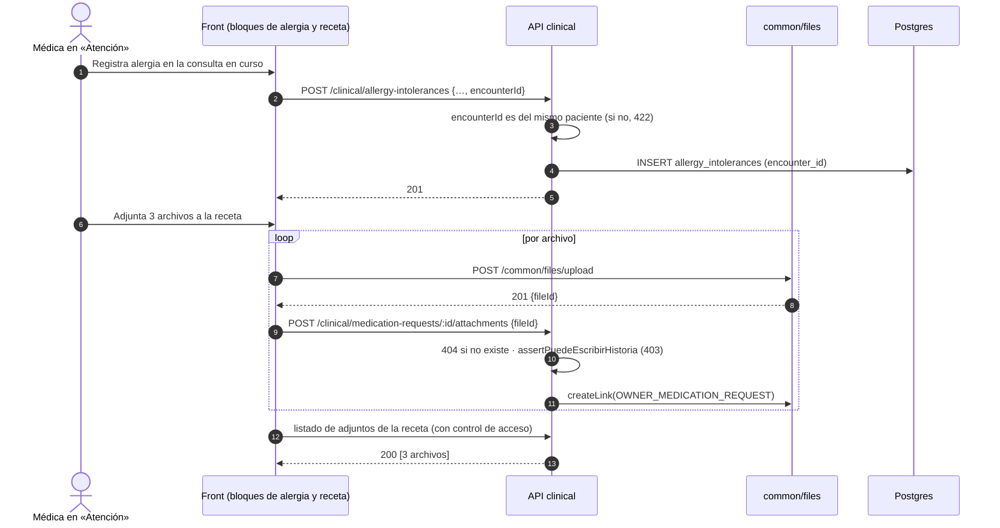

# TASK PROMPT: BR-11 — Alergia desde la consulta (P26) y adjuntos de receta, alergia y encuentro (P25)

> **MODO DE EJECUCIÓN:** este prompt se ejecuta en **Modo Planificación (Planning Mode)**.
> El desarrollador o el agente arranca investigando, sin tocar código fuente. Con eso escribe un
> `implementation_plan.md` detallado y espera la aprobación explícita del usuario. Después
> ejecuta los cambios en commits atómicos, verifica con pruebas unitarias y de integración, y
> **contra la API viva levantada**. El resultado queda documentado en `walkthrough.md`.

| Campo | Valor |
|---|---|
| **Cierra** | CL-01 (P26, parte «encuentro») · CL-05 (P25) — anexo B |
| **Severidad máxima** | **Bloqueante de demo** (CL-01: registrar una alergia desde la consulta da 400) |
| **Repo(s)** | `mantra-core-health-model` (`.puml` + DDL) · `mantra-core-health-redesa-api` (`dev`) · `mantra-core-health` (`mockup`) |
| **Toca el modelo** | **Sí**: `clinical.allergy_intolerances.encounter_id` (CL-01). CL-05 **no** toca el `.puml` (tipos de dueño = conceptos sembrados al arrancar) |
| **Depende de** | Nada para empezar. El front puede trabajar contra el mock con el contrato de §4 |
| **Decisión previa** | Ninguna del README §8. Queda fuera y registrada la **fuente clínica de los 5 catálogos de alergia** (segunda mitad de P26), ver §1.D |

---

## 1. Contexto de negocio y justificación técnica

### A. Por qué importa
El cliente pidió dos cosas textuales el 2026-09-10: que la alergia se ate «a una cita ya existente
y/o finalizada», igual que el diagnóstico, y que **en todos los formularios** se pueda adjuntar
archivos, «incluso en la medicación». Las dos pantallas ya existen y en la maqueta funcionan. Contra
la API real, **registrar una alergia dentro de «Atención» siempre da 400**, adjuntar a una receta o
a una alergia da 404, y adjuntar al encuentro o listar adjuntos de receta/alergia da 400. Es de lo
primero que se ve en una demo de consulta.

### B. Estado del frontend (`mantra-core-health`, `mockup` @ `9b3e0101`)
- `features/clinical-record/patient-chart/allergy-block/allergy-block.ts:102`: `encounterId =
  input<string | null>(null)`; `:243` elige `citaElegida() ?? encounterId()`; `:258` hace
  `...(encuentro === null ? {} : { encounterId: encuentro })`. Dentro de «Atención» el input
  siempre tiene valor, así que **el alta siempre lleva la clave**. El tipo `NewAllergyIntolerance`
  (`clinical.types.ts:531-539`) no la declara: el spread de literal esquiva a TypeScript.
- El mock acepta y guarda `encounterId` (`core/mock/handlers/clinical.handlers.ts:466,485`).
- `core/data-access/clinical/clinical.client.ts:469-494`: `POST /clinical/medication-requests/:id/attachments`
  y `POST /clinical/allergy-intolerances/:id/attachments` (no existen en la API). Condición y
  procedimiento van por sus rutas propias (`:426-462`), que sí existen.
- `medication-block.ts:411`, `allergy-block.ts:198`: disparan esas subidas.
- `patient-chart.ts:1154-1182`: el encuentro liga por el genérico `POST /common/files/:id/links` con
  `ownerType: 'ENCOUNTER'`, y el listado usa `ownerType` `MEDICATION_REQUEST`,
  `ALLERGY_INTOLERANCE` y `ENCOUNTER`.
- El subidor ya toma tandas de hasta diez, muestra «Adjuntando 3 de 7…» y no cancela la tanda por
  uno que falle (PENDIENTES-BACKEND.md, P25 «Estado del frontend»).

### C. Estado de la API (`mantra-core-health-redesa-api`, `dev` @ `7541797c`)
- `clinical/dto/allergy.dto.ts:41-110`: `CreateAllergyIntoleranceDto` **no declara
  `encounterId`** → 400 por `forbidNonWhitelisted`. La ruta es
  `clinical/controllers/clinical-records.controller.ts:120` (`POST /clinical/allergy-intolerances`).
- DDL vendorizado `database/SQL/08_clinical/02_tables.sql:185-202`: `clinical.allergy_intolerances`
  sin `encounter_id`. En el modelo (`diagram_08_clinical.puml:202`) tampoco. Las hermanas
  (`conditions`, `observations`, `medication_requests`, `service_requests`) sí lo tienen
  (`:102,177,240,268,321`) y la FK se resuelve por convención de nombre; el grafo lleva además la
  flecha `encounters ||--o{ …` (`:283-287`).
- Lectura: `clinical/dto/clinical-read.dto.ts:85-126` (`AllergyItemDto`) sin `encounterId` y sin
  reacciones; mapeo en `clinical-read.service.ts:613-623`.
- Adjuntos: `common/dto/enums.ts:8-16` (`OwnerType` = `USER`, `PATIENT`, `TENANT`, `CONDITION`,
  `PROCEDURE`). `CreateFileLinkDto` (`common/dto/files.dto.ts:199`) y `ListFileLinksQueryDto`
  (`:479-482`) validan `@IsEnum(OwnerType)` → 400 para los otros tres. Sólo existen
  `conditions/:id/attachments` (`clinical-records.controller.ts:108`) y
  `procedures/:id/attachments` (`:248`). El patrón a calcar es `ProceduresService.attachFile`
  (`clinical/services/procedures.service.ts:142-…`): busca → 404 → `assertPuedeEscribirHistoria`
  (MCH-007, el paciente sale de la fila) → `filesService.createLink`.
- Conceptos de dueño: `common/constants/concepts.ts:395-405` (`OWNER_CONDITION`,
  `OWNER_PROCEDURE` con `def('common:owner-type:…')`). `files.service.ts:416,691` resuelve
  `CONCEPTS['OWNER_' + ownerType]`: un valor nuevo de `OwnerType` sin su concepto rompe en runtime.
- **Hallazgo nuevo al verificar (no está en el anexo):** `GET /common/files/links`
  (`common/controllers/common-files.controller.ts:106-111`) **no recibe al actor ni tiene
  `@Roles`/guard** (el controlador, `:49`, tampoco). Hoy cualquier sesión puede listar los
  adjuntos de cualquier condición o procedimiento por id. Sumar tres tipos clínicos más a ese
  listado sin control **amplía el IDOR**.

### D. Aislamiento y lo que queda fuera
- **Dentro:** columna `encounter_id`, DTO de alta y lectura, tres tipos de dueño, tres rutas
  `:id/attachments` (receta, alergia, encuentro) y un listado clínico con control de acceso.
- **Fuera, registrado:** los **5 catálogos de alergia** de P26 (`substance`, `type`, `category`,
  `criticality`, `manifestation`). Verificado: `src/common/seed/dynamic-enum-catalog.ts` no declara
  **ningún** target `clinical.allergy_*`. Los códigos del mock son provisionales y el catálogo real
  necesita fuente con procedencia (subconjunto SNOMED CT o el que apruebe el equipo clínico). No se
  inventa: va en tarjeta aparte. Para la evidencia de este prompt se usa una sustancia del
  vademécum (medicamento), que sí tiene catálogo.
- **Fuera:** ampliar `UPLOAD_MIME_ALLOWLIST` (DICOM, HEIC…). Es otro trabajo (firmas de bytes).
- El genérico `POST /common/files/:id/links` sigue existiendo para contextos no clínicos.

---

## 2. Flujo de Git y entrega

```bash
cd mantra-core-health-model && git status && git fetch origin
git checkout -b <dev>/feat-alergia-encounter-id origin/dev

cd ../mantra-core-health-redesa-api && git status && git fetch origin
git checkout -b <dev>/feat-alergia-y-adjuntos-clinicos origin/dev

cd ../mantra-core-health && git status && git fetch origin
git checkout -b <dev>/fix-alergia-y-adjuntos-clinicos origin/mockup
```

- **Orden:** modelo → API (`corepack yarn db:vendor`) → front. Los adjuntos (CL-05) no dependen del
  modelo y pueden ir en un PR de API aparte si conviene revisar más rápido.
- Commits de ejemplo:
  - modelo: `feat(clinical): encounter_id en allergy_intolerances (P26)`
  - API: `chore(db): vendor del DDL con allergy_intolerances.encounter_id` ·
    `feat(clinical): encounterId en el alta y la lectura de alergias` ·
    `feat(common): tipos de dueño MEDICATION_REQUEST, ALLERGY_INTOLERANCE y ENCOUNTER` ·
    `feat(clinical): adjuntos de receta, alergia y encuentro` ·
    `fix(common): el listado de adjuntos clínicos exige acceso a la historia`
  - front: `fix(alergia): declarar encounterId en el tipo` · `fix(consulta): adjuntar al encuentro
    por su ruta clínica` · `test(mock): adjuntos con las guardas de la API`
- PRs: modelo y API con `gh pr create --base dev --reviewer jsaldias39,PabloArauzCaballero`; front
  con `--base mockup`. Cada PR enlaza a los otros y lleva la evidencia pegada.
- **El merge exige revisión humana.** El flujo termina en abrir los PR.

---

## 3. Diagrama



---

## 4. Archivos a modificar o crear

**Modelo (`mantra-core-health-model`)**
- `[MODIFICAR]` `Mantra Core Health Context/modules/diagram_08_clinical.puml`:
  - `entity allergy_intolerances` (`:202`): `encounter_id : uuid <<FK>>` nullable, con comentario
    «encuentro en que se detectó; nullable: hay alergias declaradas fuera de una atención».
  - relación `encounters ||--o{ allergy_intolerances` junto a las de `:283-287`.
  - índice `IX ix_allergy_intolerances_encounter_id : (encounter_id) BTREE` en su `INDEX_SET`.
- `[REGENERAR]` `SQL/08_clinical/*` con `salud-db/gen_ddl.py` y `[CREAR]`
  `SQL/patches/<fecha>_v42xx_allergy_intolerances_encounter_id.sql` para bases vivas.
- Si la bóveda del modelo documenta FKs como nota (`SALUD/FK/…`), agregar la nota de esta FK.

**API**
- `[MODIFICAR]` `database/SQL/**` sólo con `corepack yarn db:vendor`.
- `[MODIFICAR]` `src/modules/clinical/entities/allergy_intolerances.entity.ts`: `encounterId?`
  (regenerable con `gen_entities.py`; si se regenera, prettier y diff limpio).
- `[MODIFICAR]` `src/modules/clinical/dto/allergy.dto.ts`: `encounterId?` con `@IsOptional()
  @IsUUID()`; y `AllergyIntoleranceResponseDto`.
- `[MODIFICAR]` `src/modules/clinical/services/allergy-intolerances.service.ts`: si llega
  `encounterId`, validar que el encuentro exista y sea del mismo `patientProfileId` (422 si no),
  igual que `indicationConditionId` en recetas.
- `[MODIFICAR]` `src/modules/clinical/dto/clinical-read.dto.ts` (`AllergyItemDto`) y
  `clinical-read.service.ts:613-623`: proyectar `encounterId`.
- `[MODIFICAR]` `src/modules/common/dto/enums.ts`: `MEDICATION_REQUEST`, `ALLERGY_INTOLERANCE`,
  `ENCOUNTER`.
- `[MODIFICAR]` `src/common/constants/concepts.ts`: `OWNER_MEDICATION_REQUEST`,
  `OWNER_ALLERGY_INTOLERANCE`, `OWNER_ENCOUNTER` con el mismo `def('common:owner-type:…')`.
- `[MODIFICAR]` `src/modules/clinical/controllers/clinical-records.controller.ts`:
  `POST medication-requests/:id/attachments` y `POST allergy-intolerances/:id/attachments`.
- `[MODIFICAR]` `src/modules/clinical/controllers/clinical-encounters.controller.ts`:
  `POST encounters/:id/attachments`.
- `[MODIFICAR]` `medications.service.ts`, `allergy-intolerances.service.ts`,
  `encounters.service.ts`: `attachFile()` calcado de `procedures.service.ts:142`.
- `[CREAR]` DTO `AttachFileTo{MedicationRequest,AllergyIntolerance,Encounter}Dto` siguiendo
  `AttachFileToProcedureDto`.
- `[MODIFICAR]` listado: o bien `GET /common/files/links` recibe `@CurrentUser()` y, para los 5
  tipos clínicos (`CONDITION`, `PROCEDURE` y los tres nuevos; `PATIENT` lo decide el plan), resuelve el paciente del dueño y llama `assertPuedeLeerHistoria`; o bien se
  agregan `GET …/:id/attachments` clínicos y el genérico rechaza tipos clínicos. El plan elige y
  documenta; lo que no vale es dejar el listado clínico sin control.
- `[CREAR]` specs de cada `attachFile` (404, 403, 201) y un int-spec contra Postgres.

**Front**
- `[MODIFICAR]` `src/app/core/data-access/clinical/clinical.types.ts`: `encounterId?` en
  `NewAllergyIntolerance` y `Allergy`.
- `[MODIFICAR]` `allergy-block.ts`: construir el cuerpo con el tipo (sin spread que esquive TS).
- `[MODIFICAR]` `clinical.client.ts`: `attachToEncounter` por `POST /clinical/encounters/:id/attachments`
  y el listado según lo que elija la API.
- `[MODIFICAR]` `patient-chart.ts:1154-1182`: dejar el genérico para el encuentro.
- `[MODIFICAR]` `core/mock/handlers/clinical.handlers.ts`: 404 si el recurso no existe, 403 sin
  acceso, y el listado con la misma regla. Sus specs.

---

## 5. Reglas de implementación

- **Modelo por las 4 capas:** `.puml` en `mantra-core-health-model` → `gen_ddl.py` → `SQL/` del
  modelo → `corepack yarn db:vendor` en la API (`db:vendor:check` en verde) → entidad → DTO.
  Prohibido `ALTER TABLE` a mano, editar `database/SQL` o usar el `SQL/` viejo de la raíz.
- **No inventar FKs ni columnas:** sólo `encounter_id`. Los catálogos de alergia quedan fuera.
- **El `encounterId` tiene que ser del mismo paciente.** Un encuentro de otro paciente → 422 y no
  se crea nada. Un caso de uso = una transacción (alergia + reacciones juntas).
- **Adjuntar es escribir en la historia:** `assertPuedeEscribirHistoria` con el paciente sacado
  de la fila, nunca del body (MCH-007). Receta o alergia inexistente → 404 antes de autorizar.
- **Listar adjuntos clínicos es leer la historia:** exige relación asistencial o ser el titular.
  Cerrar el IDOR de `GET /common/files/links` para los tipos clínicos entra en este prompt.
- **No reabrir la inmutabilidad:** adjuntar a una receta emitida no cambia su contenido ni su
  `content_hash`; el vínculo vive en `common.file_links`. Si el encuentro está sellado, anotar el
  cruce con BR-14 (CL-07) y no decidir acá la regla del sello.
- **Validación:** el alta de alergia sigue con `whitelist + forbidNonWhitelisted`; el front manda
  sólo lo que el DTO declara.
- **Tipos de archivo:** se mantiene el sniffing por firma de bytes; la ayuda de la pantalla dice la
  lista real de formatos.
- **En la API rige `.claude/rules/`:** plan en `docs/trabajo/<fecha>-alergia-adjuntos/PLAN.md` y
  reporte en su `REPORTE.md`; el gate de seguridad (regla 90) es obligatorio porque toca historia
  clínica y archivos.

---

## 6. Criterios de aceptación (Gherkin)

```gherkin
Escenario: Alergia registrada en la consulta en curso
  Dado un encuentro en curso de la médica con el paciente
  Cuando registra una alergia a un medicamento con dos reacciones
  Entonces la API responde 201
  Y la fila de clinical.allergy_intolerances tiene encounter_id
  Y el resumen devuelve la alergia con su encounterId

Escenario: Encuentro de otro paciente
  Dado un encounterId que pertenece a otro paciente
  Cuando se registra la alergia
  Entonces la API responde 422 y no se crea ninguna fila

Escenario: Alergia sin encuentro
  Dado el alta de una alergia desde el expediente, fuera de una atención
  Cuando se registra sin encounterId
  Entonces la API responde 201

Escenario: Adjuntar a una receta
  Dada una receta existente y un archivo subido
  Cuando se hace POST /clinical/medication-requests/:id/attachments
  Entonces la API responde 201
  Y el listado de adjuntos de esa receta lo muestra

Escenario: Adjuntar al encuentro por su ruta clínica
  Dado un encuentro del paciente y un archivo subido
  Cuando se hace POST /clinical/encounters/:id/attachments
  Entonces la API responde 201 y el front ya no usa POST /common/files/:id/links

Escenario: Recurso inexistente
  Dada una receta que no existe
  Cuando se adjunta un archivo
  Entonces la API responde 404

Escenario: Sin acceso a la historia
  Dado un médico sin relación asistencial con el paciente
  Cuando adjunta a su alergia o lista sus adjuntos
  Entonces la API responde 403

Escenario: El listado ya no es un IDOR
  Dado un usuario PATIENT
  Cuando lista los adjuntos de una condición de otro paciente
  Entonces la API responde 403 o 404, nunca 200 con los archivos
```

---

## 7. Definition of Done

- [ ] `implementation_plan.md` aprobado, con la elección del listado seguro escrita y la tarjeta
      de los catálogos de alergia abierta (fuente clínica pendiente).
- [ ] Modelo con `encounter_id`, relación e índice; DDL regenerado y patch creado. En la API
      `corepack yarn db:vendor:check` en verde.
- [ ] Fidelidad sin deriva nueva: arranque con `ORM_SCHEMA_SYNC=dry-run` sin `columna-ausente`
      para `allergy_intolerances` (salida pegada).
- [ ] API: `corepack yarn typecheck`, `corepack yarn lint --max-warnings=0`,
      `corepack yarn test -- allergy procedures medications encounters files` e int-spec en verde.
- [ ] Rutas nuevas montadas: `corepack yarn build && node dist/src/main.js` y `grep` de
      `Mapped {/clinical/medication-requests/:id/attachments, POST}`,
      `Mapped {/clinical/allergy-intolerances/:id/attachments, POST}` y
      `Mapped {/clinical/encounters/:id/attachments, POST}` en el log de arranque. Un
      `clinical.module.spec.ts` (patrón `community.module.spec.ts`; BR-12 también lo toca) que falle si el controlador no
      está en el módulo.
- [ ] Front: `corepack yarn typecheck`, `corepack yarn lint`, `corepack yarn test --watch=false`
      en verde; los `check-*.mjs` corridos a mano.
- [ ] **Evidencia de runtime contra la API viva**, pegada en el PR: alergia desde «Atención» →
      request con `encounterId` → 201 → `SELECT encounter_id FROM clinical.allergy_intolerances
      WHERE id = '<id>'` → recarga → la alergia aparece vinculada a la consulta. Tres adjuntos a
      una receta → 201 × 3 → filas en `common.file_links` con `OWNER_MEDICATION_REQUEST` → recarga
      → la lista los muestra.
- [ ] Matriz negativa corrida con `curl`: sin token (401), paciente (403), médico sin relación
      (403), recurso inexistente (404), tipo clínico en el listado sin acceso (403/404).
- [ ] PRs abiertos con revisores `jsaldias39` y `PabloArauzCaballero`, y `walkthrough.md`.

---

## 8. Plan de QA

### A. Pruebas automatizadas
```bash
# API
corepack yarn test -- allergy-intolerances.service clinical-read.service files.service
corepack yarn test -- medications.service encounters.service procedures.service
corepack yarn test:integration --testPathPatterns=clinical
corepack yarn db:vendor:check
# Front
corepack yarn test --watch=false --include=src/app/features/clinical-record/patient-chart/allergy-block/**
corepack yarn test --watch=false --include=src/app/features/clinical-record/patient-chart/patient-chart.spec.ts
corepack yarn test --watch=false --include=src/app/core/mock/handlers/clinical.handlers.spec.ts
```
- Unitarias: 422 por encuentro ajeno; 404 antes que 403; el listado clínico llama a la política
  de lectura; `CONCEPTS['OWNER_' + tipo]` definido para los ocho valores de `OwnerType`.

### B. Integración (API viva)
1. Stack `mantra-redesa` con seeds; `corepack yarn build` y `node dist/src/main.js`.
2. Login de la médica sembrada, abrir una atención de hoy, registrar alergia (sustancia del
   vademécum) con reacciones.
3. Subir un PDF por `POST /common/files/upload` y ligarlo a receta, alergia y encuentro.
4. Consultas: `SELECT owner_type_concept_id, owner_id FROM common.file_links ORDER BY created_at
   DESC LIMIT 3` y la de `encounter_id`.
5. Repetir con un médico sin relación y con un paciente: 403.

### C. Verificación manual y logs
- Pestaña Red del front: ningún 400 en el alta de alergia ni 404 en los adjuntos.
- Log de la API: `common.fileLink.list` y `create` sin nombres de archivo con PHI; sólo ids.
- Capturas de «Atención» con la alergia vinculada y la lista de adjuntos, en móvil y escritorio.
