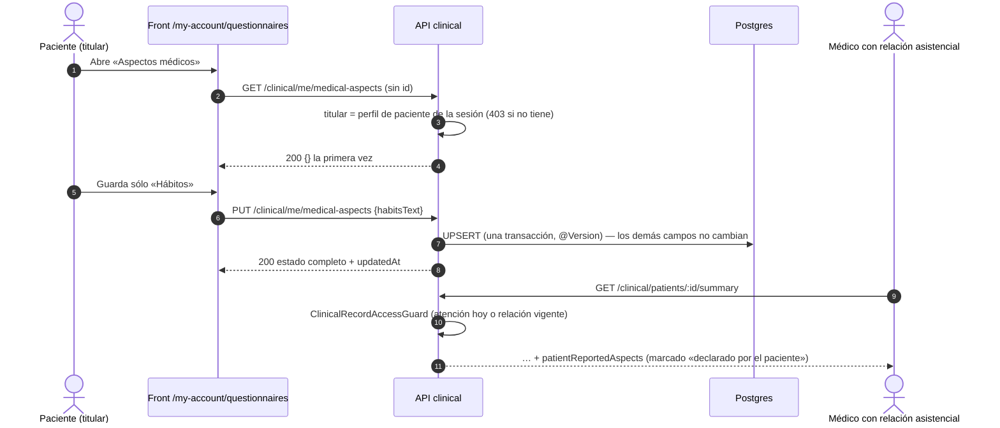

# TASK PROMPT: BR-12 — «Aspectos médicos» que declara el paciente

> **MODO DE EJECUCIÓN:** este prompt se ejecuta en **Modo Planificación (Planning Mode)**.
> El desarrollador o el agente arranca investigando, sin tocar código fuente. Con eso escribe un
> `implementation_plan.md` detallado y espera la aprobación explícita del usuario. Después
> ejecuta los cambios en commits atómicos, verifica con pruebas unitarias y de integración, y
> **contra la API viva levantada**. El resultado queda documentado en `walkthrough.md`.

| Campo | Valor |
|---|---|
| **Cierra** | CL-04 (anexo B) · CV-01 (anexo E) — son el mismo defecto visto desde el contrato y desde la cobertura |
| **Severidad máxima** | **Bloqueante de demo** (CV-01) |
| **Repo(s)** | `mantra-core-health-model` · `mantra-core-health-redesa-api` (`dev`) · `mantra-core-health` (`mockup`) |
| **Toca el modelo** | **Sí** si se elige la opción A (tabla nueva) o C (conceptos y plantilla de `forms`). Ver D-B |
| **Depende de** | Nada para empezar. Si se elige C, choca con BR-18 (formularios dinámicos) |
| **Decisión previa** | **D-B**: dónde se guarda la declaración — tabla propia, `health_context` o `forms` (README §8). Este prompt la investigó y trae propuesta (§1.C) |

---

## 1. Contexto de negocio y justificación técnica

### A. Por qué importa
El propósito del producto es que **el paciente sea dueño de su historia: verla, descargarla y
actualizarla** (anexo E, TAREA D). «Actualizar» del lado del paciente es exactamente esta pantalla:
grupo sanguíneo, alergias que conoce, enfermedades crónicas, medicación actual, cirugías,
antecedentes familiares y hábitos. Hoy, contra la API real, la pestaña «Aspectos médicos» de
`/my-account/questionnaires` da **404 al abrir y 404 al guardar**: la ruta no existe y el modelo no
tiene dónde guardarlo. En la maqueta funciona porque el mock lo guarda en `localStorage`. El paso 3b
de TAREA D queda **roto**.

### B. Estado del frontend (`mantra-core-health`, `mockup` @ `9b3e0101`)
- Pantalla: `features/account/questionnaires/medical-aspects/medical-aspects.ts` (`:162`
  `getOwnMedicalAspects`, `:200` `saveOwnMedicalAspects`), montada en
  `questionnaires.ts:25,92`.
- Cliente: `core/data-access/clinical/clinical.client.ts:133-160` — `GET` y `PUT
  /clinical/me/medical-aspects`, **sin id de paciente** (el servidor resuelve al titular por el
  vínculo de la cuenta). Un titular sin declaración recibe `{}`, no 404.
- Tipos: `clinical.types.ts:745-770` — `bloodType`, `allergiesText`, `chronicConditionsText`,
  `currentMedicationsText`, `surgeriesText`, `familyHistoryText`, `habitsText`, `updatedAt`
  (sólo lectura). Contrato del `PUT`: **campo ausente = no tocar, `''` = borrar**; responde el
  estado completo resultante.
- Mock: `core/mock/handlers/clinical.handlers.ts:144-220` (registro plano en `localStorage`).
- **El médico no lo ve en ningún lado:** ningún archivo fuera de `questionnaires`, el cliente y el
  mock usa `MedicalAspects`. CV-01 pide que «su médico los vea en `/medical-records/:profileId`».

### C. Qué hay en el modelo (investigado para D-B)
DDL vendorizado de la API (`database/SQL/`), mismo contenido que el modelo:

| Opción | Qué hay | Encaje |
|---|---|---|
| **A. Tabla propia** | Nada. `grep medical-aspects src` = 0 | Se crea por `.puml` |
| **B. Tablas clínicas existentes** | `clinical.social_history` (`category_concept_id NOT NULL`, `value_text`), `clinical.family_member_history` (`relationship_concept_id NOT NULL`, `note_text`), `clinical.allergy_intolerances` (`substance_concept_id NOT NULL`), `clinical.observations` (grupo sanguíneo), `clinical.procedures` (cirugías). `social_history` y `family_member_history` tienen entidad (`clinical/entities/*.entity.ts`) pero **ningún servicio ni ruta** | Malo para texto libre: cada una exige un concepto `NOT NULL` que la declaración no trae |
| **C. `forms`** | `forms.form_instances` (`resource_type_concept_id`, `resource_id`), `forms.field_values` (`value_text`, `data_source_concept_id`, `value_version`, `supersedes_value_id`) y `field_value_audit`. `GET /forms/me/instances` existe pero **es sólo lectura y exige que la instancia cuelgue de un encuentro** (`forms/controllers/forms-me.controller.ts:20-36`) | Posible, con ruta de escritura nueva y otro ancla; hereda los defectos abiertos de BR-18 (CL-66 tres transacciones, CL-68 cualquiera declara campos) |
| **D. `health_context`** | Esquema 44: `country_health_contexts`, `context_agents`, `health_context_facts`… | **No sirve:** es contexto sanitario **por país**, no del paciente. Descartada |

**Propuesta para D-B (a confirmar por producto y por quien mantiene el modelo): opción A**, una
tabla `clinical.patient_reported_health_statements` (nombre a validar), **una fila por titular**:

- Pros: calca 1:1 el contrato que el front ya tiene; un `PUT` = una transacción; deja claro que es
  **declarado por el paciente y no verificado**, sin mezclarlo con lo que registra el médico; no
  depende de arreglar `forms`.
- Contras: una tabla más; texto libre sin codificar (no alimenta CDS ni alertas); hay que decidir
  el historial (columna `row_version` + historia de auditoría, o versiones append-only).
- Opción C si producto prefiere reutilizar `forms`: sin DDL nuevo, historial gratis por
  `supersedes_value_id`; pero exige ruta de escritura del paciente, ancla `PATIENT` en vez de
  encuentro, un concepto de fuente «declarado por el paciente» (hoy sólo `FORMS.SOURCE_INTERNAL`
  y `SOURCE_EXTERNAL`, `forms-values.service.ts:84,140,212`) y esperar a BR-18.
- Opción B **no se recomienda**: obligaría a inventar conceptos para texto libre.

### D. Estado de la API (`dev` @ `7541797c`) y aislamiento
- No hay ruta, servicio, DTO ni entidad (`git grep medical-aspects -- src` = 0).
- Patrón a calcar para «el titular sin id en la ruta»: `forms-me.controller.ts` (sin `@Roles`, el
  paciente sale del claim) y `assertOwnRecord` en `clinical-read.service.ts:510-545` (D-3).
- **Pregunta de modelo que el plan tiene que responder:** las tablas clínicas llevan
  `custodian_tenant_id NOT NULL` y el patch `2026-09-19_v4219_custodian_tenant_rls.sql` les aplica
  RLS fail-closed por ese GUC. Una declaración del paciente **no es custodia de ningún tenant**:
  o la tabla no lleva esa columna (y se declara la excepción), o se define qué tenant la custodia.
  Sin confirmar cómo resuelve hoy el GUC una sesión de paciente sin tenant: verificarlo con
  `test/integration/rls.int-spec.ts` antes de elegir.
- Aislamiento: no toca las alergias, condiciones ni observaciones registradas por el médico. La
  declaración **no reemplaza** a ninguna de ellas y se muestra aparte.

---

## 2. Flujo de Git y entrega

```bash
cd mantra-core-health-model && git status && git fetch origin
git checkout -b <dev>/feat-declaracion-salud-paciente origin/dev

cd ../mantra-core-health-redesa-api && git status && git fetch origin
git checkout -b <dev>/feat-medical-aspects origin/dev

cd ../mantra-core-health && git status && git fetch origin
git checkout -b <dev>/feat-aspectos-medicos-en-la-ficha origin/mockup
```

- **Orden:** decisión D-B escrita → modelo → API (`corepack yarn db:vendor`) → front.
- Commits de ejemplo (opción A): `feat(clinical): patient_reported_health_statements (D-B)` ·
  `chore(db): vendor del DDL` · `feat(clinical): GET|PUT /clinical/me/medical-aspects` ·
  `feat(clinical): la declaración del paciente en el resumen del médico` ·
  `feat(ficha): bloque «Declarado por el paciente»` · `fix(mock): aspectos médicos con las reglas
  de la API`.
- PRs: modelo y API `gh pr create --base dev --reviewer jsaldias39,PabloArauzCaballero`; front
  `--base mockup`. Enlazados entre sí, con la evidencia de runtime pegada.
- **El merge exige revisión humana.** El flujo termina en abrir los PR.

---

## 3. Diagrama



---

## 4. Archivos a modificar o crear (opción A; si D-B elige C, el plan rehace esta lista)

**Modelo (`mantra-core-health-model`)**
- `[MODIFICAR]` `Mantra Core Health Context/modules/diagram_08_clinical.puml`: entidad nueva con
  `id`, `patient_profile_id` (FK a `profiles.patient_profiles.profile_id`, como `allergy_intolerances`; **UNIQUE**), `blood_type_text`,
  `allergies_text`, `chronic_conditions_text`, `current_medications_text`, `surgeries_text`,
  `family_history_text`, `habits_text` (texto nullable; límite de longitud decidido en el plan),
  auditoría estándar (`created_at`, `updated_at`, `created_by_user_id`, `updated_by_user_id`) y
  `row_version`. `custodian_tenant_id` según la respuesta de §1.D. Índice único con nombre
  explícito. Comentario que diga «declarado por el titular, no verificado».
- `[REGENERAR]` `SQL/08_clinical/*` con `salud-db/gen_ddl.py`; `[CREAR]` patch
  `SQL/patches/<fecha>_v42xx_patient_reported_health_statements.sql`.
- `[MODIFICAR]` `salud-db/gen_seeds.py`: la tabla va a `INTENTIONALLY_EMPTY` (la llena el paciente;
  sembrar declaraciones falsas en todo entorno no tiene sentido).

**API**
- `[MODIFICAR]` `database/SQL/**` sólo con `corepack yarn db:vendor`.
- `[CREAR]` `src/modules/clinical/entities/patient_reported_health_statements.entity.ts`
  (`@Version() rowVersion`), su repositorio y su export en el barrel.
- `[CREAR]` `src/modules/clinical/dto/medical-aspects.dto.ts`: `UpdateOwnMedicalAspectsDto` (todos
  opcionales, `@IsString() @MaxLength(n)`, `''` permitido para borrar) y `MedicalAspectsResponseDto`
  con los nombres del front (`bloodType`, `allergiesText`, …, `updatedAt`).
- `[CREAR]` `src/modules/clinical/services/medical-aspects.service.ts`: `getOwn(actor)` y
  `updateOwn(dto, actor)`; titular resuelto por el claim; upsert en una transacción; ausente = no
  tocar, `''` = `null`.
- `[CREAR]` `src/modules/clinical/controllers/clinical-medical-aspects.controller.ts`:
  `@Controller('clinical/me/medical-aspects')`, `@Get()`, `@Put()`. Sin id en la ruta.
- `[MODIFICAR]` `src/modules/clinical/clinical.module.ts`: controlador y servicio registrados.
- `[MODIFICAR]` `clinical/dto/clinical-read.dto.ts` y `clinical-read.service.ts`: bloque aditivo
  `patientReportedAspects` en el resumen del paciente, leído bajo la misma autorización.
- `[CREAR o MODIFICAR]` `src/modules/clinical/clinical.module.spec.ts` (patrón `community.module.spec.ts`;
  BR-11 también lo toca) que
  falle si el controlador nuevo no está en el módulo; specs del servicio y un int-spec contra
  Postgres (upsert, `@Version`, RLS).

**Front**
- `[MODIFICAR]` nada en `medical-aspects.ts` si la API respeta el contrato actual (ausente = no
  tocar, `''` = borrar). Sólo ajustar `toMedicalAspects` si cambia algún nombre.
- `[MODIFICAR]` `clinical.types.ts` y `clinical.client.ts`: `patientReportedAspects?` en la lectura
  del resumen.
- `[CREAR]` un bloque de sólo lectura en la ficha del médico
  (`features/clinical-record/patient-chart/…`), rotulado «Declarado por el paciente», con la fecha
  de `updatedAt` y el estado vacío «El paciente no declaró nada todavía».
- `[MODIFICAR]` `core/mock/handlers/clinical.handlers.ts:144-220`: 403 sin perfil de paciente,
  400 por clave desconocida, y el bloque en el resumen.

---

## 5. Reglas de implementación

- **Paso 1 del plan: pedir D-B** con las cuatro opciones de §1.C, sus pros y contras y la
  propuesta A. Sin decisión escrita no se toca el modelo.
- **No inventar:** ni conceptos para texto libre (opción B), ni columnas fuera de las que se
  aprueben, ni FKs que el `.puml` no declare.
- **Modelo por las 4 capas:** `.puml` → `gen_ddl.py` → `SQL/` del modelo → `corepack yarn db:vendor`
  (`db:vendor:check` en verde) → entidad → DTO. Nada a mano en la base ni en `database/SQL`.
- **El titular sale de la sesión.** Ninguna ruta del paciente acepta un id de paciente. Un usuario
  sin perfil de paciente → 403. Un representante legal (dependientes) queda **fuera** salvo que el
  plan lo incluya explícitamente reutilizando `assertOwnRecord`.
- **Un caso de uso = una transacción**, con `@Version()` en `row_version`: dos pestañas que guardan
  a la vez no se pisan en silencio (409 en la segunda si se manda la versión; si el contrato no la
  manda, documentar que gana la última).
- **Lectura del médico = leer la historia:** misma política que el resumen (atención hoy o relación
  vigente). La declaración se muestra **aparte** de lo registrado, nunca fusionada con alergias o
  condiciones.
- **PHI:** el texto declarado no va a logs, trazas ni mensajes de error. Se loguea el id.
- **Validación:** `whitelist + forbidNonWhitelisted`; un campo desconocido → 400.
- **En la API rige `.claude/rules/`:** plan en `docs/trabajo/<fecha>-medical-aspects/PLAN.md`,
  reporte en `REPORTE.md`, gate de seguridad y de datos (reglas 90 y 97) obligatorio.

---

## 6. Criterios de aceptación (Gherkin)

```gherkin
Escenario: Primera visita
  Dado un paciente sin declaración
  Cuando pide GET /clinical/me/medical-aspects
  Entonces la API responde 200 con {}

Escenario: Guardar una sección sin pisar las otras
  Dado un paciente con alergias y medicación declaradas
  Cuando hace PUT con sólo habitsText
  Entonces los demás campos no cambian
  Y updatedAt se actualiza
  Y al recargar /my-account/questionnaires ve los valores guardados

Escenario: Borrar un campo
  Dado un paciente con surgeriesText declarado
  Cuando manda surgeriesText vacío
  Entonces el campo queda vacío y los demás intactos

Escenario: Sin perfil de paciente
  Dado un usuario sin perfil de paciente
  Cuando llama a la ruta
  Entonces la API responde 403

Escenario: Campo que el contrato no declara
  Dado un PUT con la clave "patientProfileId"
  Cuando llega a la API
  Entonces responde 400 y no guarda nada

Escenario: El médico ve lo declarado
  Dado un médico con turno hoy con ese paciente
  Cuando abre /medical-records/:profileId
  Entonces ve el bloque «Declarado por el paciente» con la fecha de actualización
  Y el bloque no aparece mezclado con las alergias registradas

Escenario: Médico sin relación
  Dado un médico sin atención hoy ni relación asistencial
  Cuando pide el resumen del paciente
  Entonces la API responde 403 y no expone la declaración
```

---

## 7. Definition of Done

- [ ] `implementation_plan.md` aprobado **con D-B decidida por escrito** (opción, quién decidió,
      fecha) y la respuesta sobre `custodian_tenant_id`/RLS.
- [ ] Modelo, DDL, patch y `gen_seeds.py` (`INTENTIONALLY_EMPTY`) actualizados; en la API
      `corepack yarn db:vendor:check` en verde y arranque con `ORM_SCHEMA_SYNC=dry-run` sin
      `tabla-ausente` para la tabla nueva (salida pegada).
- [ ] API: `corepack yarn typecheck`, `corepack yarn lint --max-warnings=0`,
      `corepack yarn test -- medical-aspects clinical-read clinical.module` e int-spec en verde.
- [ ] Ruta montada: `corepack yarn build && node dist/src/main.js` y `grep` de
      `Mapped {/clinical/me/medical-aspects, GET}` y `Mapped {/clinical/me/medical-aspects, PUT}`.
- [ ] Front: `corepack yarn typecheck`, `corepack yarn lint`, `corepack yarn test --watch=false`
      en verde; mock alineado; `check-*.mjs` corridos a mano.
- [ ] **Evidencia de runtime contra la API viva** (UI → request → response → persistencia →
      recarga → UI): el paciente sembrado guarda «Hábitos» → `PUT` con una sola clave → 200 →
      `SELECT habits_text, row_version FROM clinical.<tabla> WHERE patient_profile_id = '<id>'`
      (texto enmascarado en el PR) → recarga → la pantalla lo muestra → el médico con turno lo ve
      en la ficha.
- [ ] Matriz negativa con `curl`: sin token 401, usuario sin perfil de paciente 403, clave extra
      400, médico sin relación 403.
- [ ] Capturas de la pestaña del paciente y del bloque del médico (móvil y escritorio, claro y
      oscuro, con datos y vacío).
- [ ] PRs abiertos con revisores `jsaldias39` y `PabloArauzCaballero`, y `walkthrough.md`.

---

## 8. Plan de QA

### A. Pruebas automatizadas
```bash
# API
corepack yarn test -- medical-aspects.service clinical-medical-aspects.controller clinical.module
corepack yarn test:integration --testPathPatterns=medical-aspects
corepack yarn test:integration --testPathPatterns=rls
corepack yarn db:vendor:check
# Front
corepack yarn test --watch=false --include=src/app/features/account/questionnaires/**
corepack yarn test --watch=false --include=src/app/features/clinical-record/patient-chart/**
corepack yarn test --watch=false --include=src/app/core/mock/handlers/clinical.handlers.spec.ts
```
- Unitarias: ausente vs `''`; titular por claim; 403 sin perfil; `@Version` en conflicto.

### B. Integración (API viva)
1. Stack con seeds; `corepack yarn build` y `node dist/src/main.js`.
2. Front en `real-api` (o `production-api` de BR-01) con el paciente sembrado.
3. Recorrer: abrir pestaña (vacía) → guardar dos secciones por separado → recargar → cerrar
   sesión → entrar como la médica con turno → ver el bloque en la ficha.
4. Dos pestañas del paciente guardando a la vez: comprobar el comportamiento documentado.

### C. Verificación manual y logs
- Pestaña Red: `PUT` con sólo las claves tocadas; ningún 404 ni 400.
- Log de la API: ningún texto declarado; sólo ids y la operación.
- Anexo E, TAREA D, paso 3b: actualizar su estado a «verificado» con el enlace a la evidencia.
