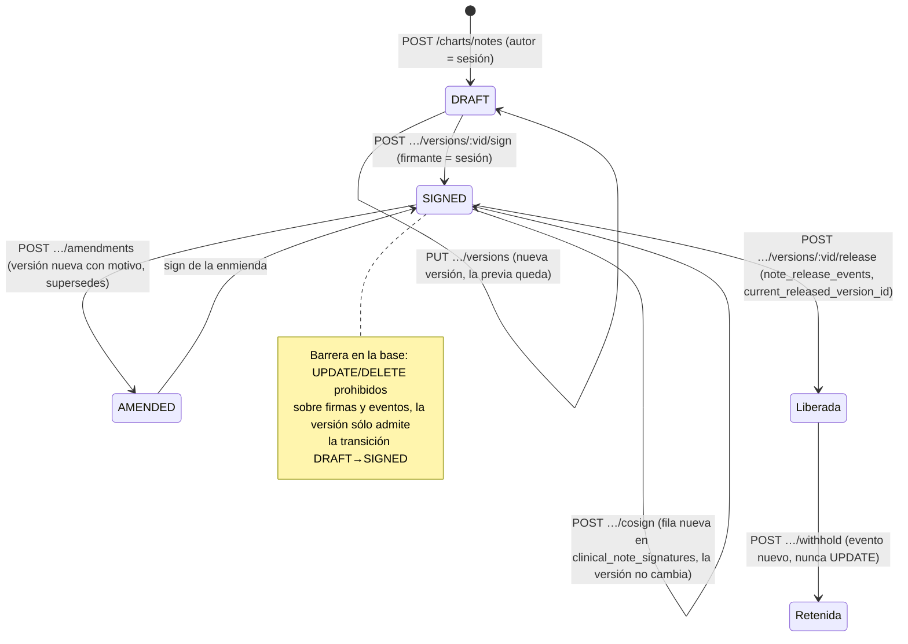

# TASK PROMPT: BR-13 — Notas clínicas: firmar, enmendar, liberar, autor por sesión, versiones e inmutabilidad

> **MODO DE EJECUCIÓN:** este prompt se ejecuta en **Modo Planificación (Planning Mode)**.
> El desarrollador o el agente arranca investigando, sin tocar código fuente. Con eso escribe un
> `implementation_plan.md` detallado y espera la aprobación explícita del usuario. Después
> ejecuta los cambios en commits atómicos, verifica con pruebas unitarias y de integración, y
> **contra la API viva levantada**. El resultado queda documentado en `walkthrough.md`.

| Campo | Valor |
|---|---|
| **Cierra** | CL-18, CL-20, CL-21, CL-23, CL-29, CL-32, CL-33, CL-35 (anexo B) · CV-08 (anexo E) |
| **Severidad máxima** | Alta (Bloqueante de demo si se muestra «nota firmada» o «visible para el paciente» contra la API) |
| **Repo(s)** | `mantra-core-health-redesa-api` (`dev`) · `mantra-core-health` (`mockup`) · `mantra-core-health-model` (sólo la barrera WORM, CL-33) |
| **Toca el modelo** | **Sólo triggers**: la matriz de integridad (`diagram_33_integrity.puml`) para los `<<IMMUTABLE>>`/`<<LOG>>` del módulo 15. Ninguna tabla ni columna nueva |
| **Depende de** | Nada para empezar. **BR-15 lee lo que este prompt libera**; CL-21 y CL-35 también figuran en BR-02 (si BR-02 ya los cerró, acá sólo se verifica) |
| **Decisión previa** | Ninguna del README §8. El plan deja escrita una: qué transición de la versión admite la barrera de la base (ver §5) |

---

## 1. Contexto de negocio y justificación técnica

### A. Por qué importa
Una evolución clínica sólo tiene valor legal si está **firmada y es inmutable**, y sólo le sirve al
paciente si se le **libera**. Hoy, contra la API real, **toda nota queda en borrador para siempre**:
el front no firma, no enmienda y no libera, aunque la API tenga todo. La maqueta muestra «Visible
para la persona» porque el mock siembra una nota ya firmada y liberada. Además el autor de la nota
lo manda el body (se puede escribir «en nombre de» otro médico), la cofirma reescribe una versión
ya firmada, la base no impide editar lo firmado, y Evoluciones sigue adivinando qué nota es de qué
atención por la fecha.

### B. Estado del frontend (`mantra-core-health`, `mockup` @ `9b3e0101`)
- `features/clinical-record/patient-chart/free-note-block/free-note-block.ts:54-57`: «No firma ni
  exporta a PDF». `persistir()` (`:189-205`) sólo llama a `createNote` y `appendVersion`, con
  `authorProfileId` = perfil propio (`:170-205`).
- `core/data-access/chart-notes/chart-notes.client.ts:40-58`: sólo `POST /charts/notes` y
  `PUT /charts/notes/:noteId/versions`. Sin `listNotes`, `sign`, `cosign`, `amend`, `release`,
  `withhold` ni historial.
- `patient-chart.ts:593`: «Visible para la persona» sólo con datos del mock.
- `features/progress-notes/progress-notes.ts:115-128`: dice que «no existe
  `GET /charts/notes?practitionerId&from&to`»; arma la lista con `GET /scheduling/bookings` y
  empareja notas **por día calendario** (`:335`, `:420`, `:498-499`). El PDF de Evoluciones
  (`shared/utils/progress-notes-pdf/progress-notes-pdf.ts:15-21`) sale sin el texto.
- Mock: `core/mock/handlers/clinical.handlers.ts:627-644` — `agregarVersion` pisa la nota con
  cualquier clave del body (incluido `patientProfileId`), no exige DRAFT; `:644` conserva
  `POST /charts/notes/:id/versions`, que la API no tiene. `core/mock/fixtures/clinica.ts:357`
  siembra estados de `VS_RECORD_STATUS` (`ST-COMPLETED`/`ST-DRAFT`) en vez de los de nota.
- Docs desactualizados: `PENDIENTES-BACKEND.md:890-911` (P18 «Abierto») y
  `PLAN-EVOLUCIONES-Y-ATENCION.md:19-22,29-33`.

### C. Estado de la API (`mantra-core-health-redesa-api`, `dev` @ `7541797c`)
- `chart/controllers/chart-notes.controller.ts` (`@Roles('CLINICIAN','PRACTITIONER')`, `:59-60`):
  `GET` `:73` (lista acotada al profesional, commit `f361b42f`), `POST` `:92`
  (`ClinicalRecordAccessGuard`), `PUT :noteId/versions` `:106`, `sign` `:120`, `cosign` `:133`,
  `amendments` `:146`, `versions/:versionId/release` `:158`, `withhold` `:170`, `exam-findings`
  `:182`. **Sin `GET :noteId/versions`** (CL-32).
- `chart/services/chart-notes.service.ts`:
  - `:98` (create), `:160` (addVersion) y `:342` (amend) guardan `dto.authorProfileId` **sin
    compararlo con el actor**; `sign`/`cosign` sí (`assertFirmaConPerfilPropio`, `:194`, `:250`,
    `:546`). `chart-care-plans.service.ts:77` tiene el mismo defecto (CL-29).
  - `:149-154`: `PUT …/versions` sobre una nota no-DRAFT → 422 (`PreconditionFailedException`).
  - `:222-226` (sign): UPDATE de la fila DRAFT → SIGNED con `signedAt` y `contentHash`.
  - `:299-300` (cosign): **vuelve a actualizar** `statusConceptId` y `releaseEligibilityConceptId`
    de una versión **ya firmada** (CL-33).
  - `:387-395` (release): exige SIGNED/COSIGNED y elegible; `:412-424` escribe
    `note_release_events` y pone `current_released_version_id` y `patient_release_status`.
- DTOs (`chart/dto/notes.dto.ts`): `SignVersionDto.signerProfileId` (`:181`),
  `AmendNoteDto.amendmentReasonText` obligatorio (`:254`), `ReleaseVersionDto.policyVersion?`
  (`:311`), `WithholdVersionDto.reasonConceptId?` (`:325`), `ListChartNotesQueryDto`
  (`practitionerId`, `patientProfileId`, `from`, `to`, `cursor`, `limit ≤ 100`, `:469-516`).
- `scheduling/dto/scheduling-read.dto.ts:289-303`: la reserva **ya trae `encounterId`**.
  **CL-18 del anexo B está desactualizado:** dice que no existen `GET /charts/notes` ni el
  `encounterId` de la reserva, y las dos cosas están en `dev`. CL-18 se reduce a CL-23 (adoptarlo en el front).
- Base: `database/SQL/15_chart/` **no tiene `05_constraints.sql`**; los WORM sólo existen en
  `10_audit`, `25_pharmacy_inventory` y `26_insurance`. En el modelo, `diagram_15_chart.puml:48`
  (`clinical_note_versions <<IMMUTABLE>>`), `:70` (`clinical_note_signatures <<IMMUTABLE>>`),
  `:81` (`note_release_events <<LOG>>`). **`gen_integrity.py` no lee esos estereotipos:** lee la
  matriz de `diagram_33_integrity.puml` (`UPDATE_DELETE: forbidden` / `UPDATE : forbidden`).
- Conceptos de nota: `chart.concepts.ts:27-35` (`NOTE_LIFECYCLE_DRAFT|SIGNED|AMENDED`).

### D. Aislamiento
- Dentro: notas (M15) y el autor de planes de cuidado. Fuera: plantillas, catálogos y documentos
  (BR-16), lectura del paciente (BR-15). Este prompt **produce** notas liberadas; BR-15 las
  muestra al paciente.
- La barrera WORM se aplica sólo a las tres tablas del módulo 15 nombradas arriba.

---

## 2. Flujo de Git y entrega

```bash
cd mantra-core-health-redesa-api && git status && git fetch origin
git checkout -b <dev>/feat-notas-firma-y-liberacion origin/dev

cd ../mantra-core-health-model && git status && git fetch origin
git checkout -b <dev>/feat-worm-chart-notas origin/dev

cd ../mantra-core-health && git status && git fetch origin
git checkout -b <dev>/feat-notas-firma-y-liberacion origin/mockup
```

- Commits de ejemplo:
  - API: `fix(chart): el autor de nota, versión y enmienda es el perfil de la sesión` ·
    `fix(chart): el autor del plan de cuidados sale de la sesión` · `fix(chart): la cofirma
    registra una firma y no muta la versión` · `feat(chart): GET /charts/notes/:noteId/versions`
    · `chore(db): vendor de las barreras WORM del módulo 15`
  - modelo: `feat(integrity): WORM de clinical_note_signatures y note_release_events`
  - front: `feat(notas): firmar, enmendar, liberar y retener` · `feat(evoluciones): leer de
    GET /charts/notes por encounterId` · `feat(notas): historial de versiones` ·
    `fix(mock): notas con las guardas y los conceptos de la API` · `docs: P18 resuelto`
- PRs: API y modelo `gh pr create --base dev --reviewer jsaldias39,PabloArauzCaballero`; front
  `--base mockup`. Enlazados, con la evidencia de runtime pegada.
- **El merge exige revisión humana.** El flujo termina en abrir los PR.

---

## 3. Diagrama



---

## 4. Archivos a modificar o crear

**API**
- `[MODIFICAR]` `src/modules/chart/services/chart-notes.service.ts`:
  - create/addVersion/amend: `authorProfileId` = `actor.practitionerProfileId`; si el body trae otro
    → 403 (salvo `SUPERADMIN`, como `assertFirmaConPerfilPropio`). Reusar esa guarda.
  - cosign: insertar en `clinical_note_signatures` (`signer_profile_id`, `signed_content_hash`,
    `signed_at`) y **no** tocar la fila de la versión. El estado «cofirmada» y la elegibilidad se
    derivan de las firmas; `releaseVersion` (`:387-395`) pasa a leer esa derivación.
- `[MODIFICAR]` `src/modules/chart/services/chart-care-plans.service.ts:77`: misma regla de autor.
- `[MODIFICAR]` `src/modules/chart/controllers/chart-notes.controller.ts`: `GET :noteId/versions`
  (autor, número, estado, firma, `amendmentReasonText`, `supersedesVersionId`), autorizado con la
  política de lectura a partir de la cabecera. Declararlo **antes** de rutas con parámetros que
  puedan capturarlo.
- `[MODIFICAR]` `src/modules/chart/services/chart-notes-read.service.ts` y `dto/notes.dto.ts`:
  lectura del historial.
- `[CREAR o MODIFICAR]` `src/modules/chart/chart.module.spec.ts` (patrón
  `community/community.module.spec.ts`; BR-15 también lo toca: si ya existe, sumar el caso).
- `[MODIFICAR]` specs de ambos servicios y del controlador; `[CREAR]` int-spec contra Postgres que
  intente `UPDATE chart.clinical_note_signatures` y reciba el error del trigger.
- `[MODIFICAR]` `database/SQL/**` sólo con `corepack yarn db:vendor`.

**Modelo (`mantra-core-health-model`)**
- `[MODIFICAR]` `Mantra Core Health Context/modules/diagram_33_integrity.puml`: entradas para
  `chart.clinical_note_signatures` y `chart.note_release_events` con `UPDATE_DELETE : forbidden`.
- `[DECIDIR]` `chart.clinical_note_versions`: un `UPDATE_DELETE : forbidden` total **rompe
  `signVersion`**, que actualiza la fila DRAFT. Opciones para el plan: (a) barrera sólo de DELETE
  + trigger condicional «UPDATE permitido sólo si `OLD.status` es DRAFT», que `gen_integrity.py`
  hoy no sabe emitir (capacidad nueva del generador, patrón v4.0.10); (b) dejarla sin barrera y
  abrir tarjeta. No escribir el trigger a mano en `SQL/`.
- `[REGENERAR]` `SQL/15_chart/05_constraints.sql` (nuevo, generado) y `SQL/_integrity/*` con
  `salud-db/gen_integrity.py`; patch para bases vivas.

**Front**
- `[MODIFICAR]` `src/app/core/data-access/chart-notes/chart-notes.client.ts` y `chart-notes.types.ts`:
  `listNotes(query)` con cursor, `signVersion`, `cosignVersion`, `amendNote`, `releaseVersion`,
  `withholdVersion`, `listVersions`.
- `[MODIFICAR]` `features/clinical-record/patient-chart/free-note-block/*`: botón «Firmar»; una
  nota firmada deja de ofrecer «Editar» y ofrece «Enmendar» (motivo obligatorio); «Liberar al
  paciente» / «Retener»; vista «Historial». Actualizar el comentario de `:54-57`.
- `[MODIFICAR]` `features/progress-notes/progress-notes.ts` y
  `shared/utils/progress-notes-pdf/progress-notes-pdf.ts`: leer de `GET /charts/notes?from&to`,
  emparejar por `encounterId` (la reserva ya lo trae), incluir el texto en el PDF, paginar con
  `nextCursor`. Quitar la lectura por fila de `/charts/patients/:id/chart`.
- `[MODIFICAR]` `core/mock/handlers/clinical.handlers.ts`: las 6 rutas nuevas con las guardas de la
  API; `PUT …/versions` sólo con claves de `AddVersionDto` (400 si no) y 422 si no es DRAFT;
  guardar versiones en vez de pisar; borrar `POST /charts/notes/:id/versions` (`:644`).
- `[MODIFICAR]` `core/mock/fixtures/clinica.ts:357` y `fixtures/conceptos.ts`: estados
  DRAFT/SIGNED/AMENDED; la nota sembrada firmada y liberada nace del mismo flujo.
- `[MODIFICAR]` `PENDIENTES-BACKEND.md` (P18 → Resuelto, `f361b42f`) y
  `PLAN-EVOLUCIONES-Y-ATENCION.md`.

---

## 5. Reglas de implementación

- **Nota firmada = inmutable.** Nunca un `PUT …/versions` sobre lo firmado: se **enmienda** con
  `amendmentReasonText` y nace una versión nueva con `supersedes_version_id`. La cofirma y la
  liberación **agregan filas**, no modifican.
- **El autor y el firmante salen de la sesión, nunca del body.** El campo puede quedar en el DTO
  por compatibilidad, pero si difiere del actor es 403.
- **Liberar exige firma** (422 si no). Retener es un evento nuevo en `note_release_events`
  (`<<LOG>>`), no un UPDATE.
- **La barrera se genera, no se escribe:** `diagram_33_integrity.puml` → `gen_integrity.py` →
  `SQL/` del modelo → `corepack yarn db:vendor` (`db:vendor:check` en verde). La decisión sobre
  `clinical_note_versions` queda escrita en el plan con sus consecuencias.
- **Un caso de uso = una transacción** (ya lo son: `em.transactional`); no romperlo al mover la
  cofirma.
- **`PreconditionFailedException` = 422.** El front lo muestra como «la nota ya está firmada: usá
  Enmendar», no como error genérico.
- **Evoluciones por `encounterId`, no por fecha.** Ninguna llamada por fila a
  `/charts/patients/:id/chart`.
- **Mock honesto:** mismo código de estado y misma forma de error que la API; si BR-02 ya dejó el
  mock con 400 por clave desconocida, reutilizarlo.
- **En la API rige `.claude/rules/`:** plan en `docs/trabajo/<fecha>-notas-firma/PLAN.md`, reporte
  en `REPORTE.md`; gate de seguridad obligatorio (historia clínica).

---

## 6. Criterios de aceptación (Gherkin)

```gherkin
Escenario: Firmar una evolución
  Dado un borrador de nota de la médica
  Cuando pulsa «Firmar»
  Entonces se llama POST /charts/notes/:id/versions/:vid/sign con su perfil
  Y la nota pasa a SIGNED y deja de ofrecer «Editar»

Escenario: Enmendar una nota firmada
  Dada una nota firmada
  Cuando la médica intenta editarla
  Entonces el front ofrece «Enmendar», exige un motivo y no hace PUT …/versions
  Y nace una versión nueva que reemplaza a la anterior, que sigue visible en el historial

Escenario: Versionar lo firmado da 422
  Dada una nota firmada
  Cuando llega PUT /charts/notes/:id/versions
  Entonces la API y el mock responden 422

Escenario: Autor ajeno
  Dado el médico A autenticado
  Cuando hace POST /charts/notes con authorProfileId del médico B
  Entonces la API responde 403 y no se crea ninguna fila

Escenario: Liberar al paciente
  Dada una nota firmada
  Cuando la médica la libera
  Entonces existe una fila en chart.note_release_events
  Y al releer el expediente releasedToPatient es true

Escenario: Cofirma sin tocar la versión
  Dada una versión firmada
  Cuando otro profesional la cofirma
  Entonces hay una fila nueva en chart.clinical_note_signatures
  Y el contenido y el content_hash de la versión no cambiaron

Escenario: La base impide reescribir una firma
  Dada una firma registrada
  Cuando se ejecuta UPDATE chart.clinical_note_signatures SET signed_at = now()
  Entonces la base rechaza la sentencia

Escenario: Historial de versiones
  Dada una nota con 3 versiones y una enmienda
  Cuando la médica abre «Historial»
  Entonces ve 4 filas ordenadas con autor, fecha, estado y el motivo de la enmienda
  Y un profesional sin acceso al paciente recibe 403

Escenario: Evoluciones por atención
  Dadas dos atenciones del mismo paciente el mismo día
  Cuando se abre cada fila en Evoluciones
  Entonces cada una muestra sólo las notas de su encounterId
  Y no hay ninguna llamada por fila a /charts/patients/:id/chart
```

---

## 7. Definition of Done

- [ ] `implementation_plan.md` aprobado, con la decisión sobre la barrera de
      `clinical_note_versions` escrita.
- [ ] API: autor por sesión en notas, versiones, enmiendas y planes; cofirma sin UPDATE; historial.
      `corepack yarn typecheck`, `corepack yarn lint --max-warnings=0`,
      `corepack yarn test -- chart-notes chart-care-plans` e int-spec WORM en verde.
- [ ] Ruta nueva montada: `node dist/src/main.js` y `grep` de
      `Mapped {/charts/notes/:noteId/versions, GET}`; `chart.module.spec.ts` que exija el
      controlador.
- [ ] Modelo: matriz de integridad y `SQL/15_chart/05_constraints.sql` generados; en la API
      `corepack yarn db:vendor:check` en verde; `\d+ chart.clinical_note_signatures` muestra el
      trigger (salida pegada).
- [ ] Front: cliente completo, bloque de nota con las 5 acciones, Evoluciones por `encounterId` con
      texto en el PDF, mock alineado. `corepack yarn typecheck`, `corepack yarn lint`,
      `corepack yarn test --watch=false` en verde.
- [ ] **Evidencia de runtime contra la API viva** (UI → request → response → persistencia →
      recarga → UI): borrador → firmar → intentar editar (422 / botón «Enmendar») → enmendar →
      liberar → `SELECT` de `clinical_note_versions`, `clinical_note_signatures`,
      `note_release_events` y `clinical_note_headers.current_released_version_id` → recarga →
      «Visible para la persona» sale de la API.
- [ ] `curl` con `authorProfileId` ajeno → 403; Evoluciones con dos atenciones del mismo día →
      notas separadas (captura y pestaña Red).
- [ ] Docs de pendientes actualizados. PRs abiertos con revisores `jsaldias39` y
      `PabloArauzCaballero`, y `walkthrough.md`.

---

## 8. Plan de QA

### A. Pruebas automatizadas
```bash
# API
corepack yarn test -- chart-notes.service chart-notes-read.service chart-care-plans.service
corepack yarn test -- chart-notes.controller
corepack yarn test:integration --testPathPatterns=chart
corepack yarn db:vendor:check
# Front
corepack yarn test --watch=false --include=src/app/core/data-access/chart-notes/**
corepack yarn test --watch=false --include=src/app/features/clinical-record/patient-chart/free-note-block/**
corepack yarn test --watch=false --include=src/app/features/progress-notes/**
corepack yarn test --watch=false --include=src/app/core/mock/handlers/clinical.handlers.spec.ts
```
- Matriz negativa: sin token, paciente, médico sin relación, autor ajeno, nota ajena.

### B. Integración (API viva)
1. Stack con seeds; `corepack yarn build` y `node dist/src/main.js`.
2. Front en `real-api` con la médica sembrada y un paciente con turno hoy.
3. Recorrer el ciclo completo del diagrama; otra cuenta profesional cofirma.
4. Intentar en `psql` `UPDATE chart.clinical_note_signatures …` y `DELETE FROM
   chart.note_release_events …`: ambos rechazados.
5. Evoluciones: 30 días, dos atenciones el mismo día, paginar con `nextCursor`.

### C. Verificación manual y logs
- Pestaña Red: ninguna llamada a `/charts/patients/:id/chart` desde Evoluciones; ningún 400.
- Log de la API: sin texto de notas (PHI); sólo ids de nota y versión.
- Capturas del bloque de nota en DRAFT, SIGNED, enmendada y liberada, y del historial.
