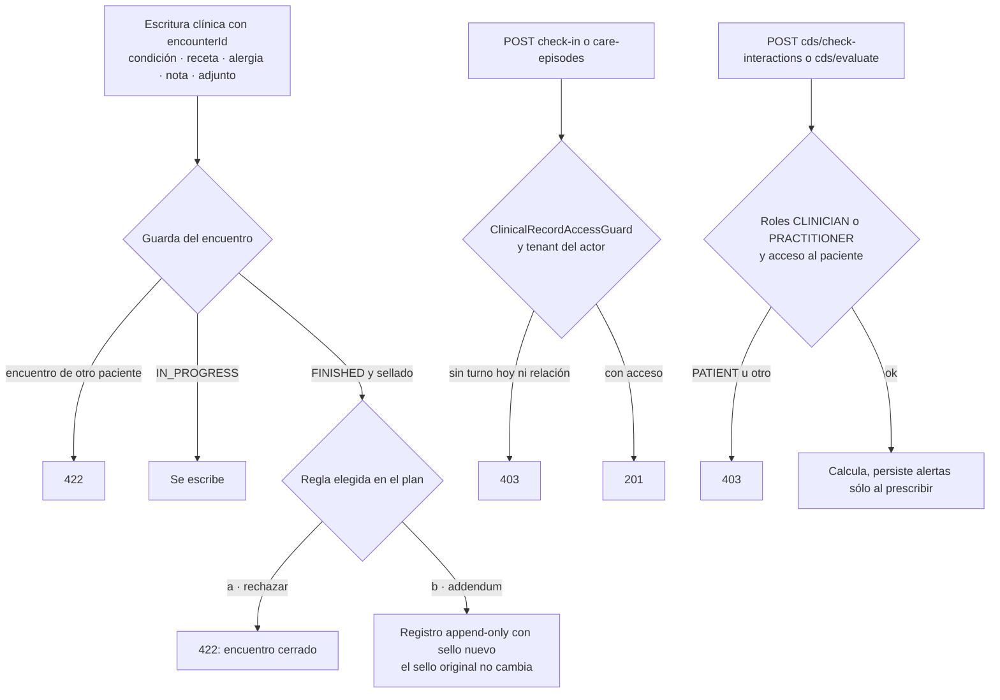

# TASK PROMPT: BR-14 — Encuentros: sello del cierre, acceso por paciente, CDS y lecturas del resumen

> **MODO DE EJECUCIÓN:** este prompt se ejecuta en **Modo Planificación (Planning Mode)**.
> El desarrollador o el agente arranca investigando, sin tocar código fuente. Con eso escribe un
> `implementation_plan.md` detallado y espera la aprobación explícita del usuario. Después
> ejecuta los cambios en commits atómicos, verifica con pruebas unitarias y de integración, y
> **contra la API viva levantada**. El resultado queda documentado en `walkthrough.md`.

| Campo | Valor |
|---|---|
| **Cierra** | CL-07, CL-08, CL-09, CL-10, CL-11, CL-16 (anexo B) |
| **Severidad máxima** | Alta |
| **Repo(s)** | `mantra-core-health-redesa-api` (`dev`), con ajustes chicos en `mantra-core-health` (`mockup`) |
| **Toca el modelo** | **Probablemente sí, una columna** (motivo del cambio de estado de la condición, CL-10) si el plan elige guardarla en `clinical.conditions`. El README §6 dice «no»: vale sólo si CL-10 se resuelve sin columna. CL-07 con «addendum» también podría pedir tabla |
| **Depende de** | Nada. BR-11 agrega escrituras con `encounterId` (alergia, adjuntos) que tienen que respetar la regla de CL-07 |
| **Decisión previa** | Ninguna del README §8. El plan pide dos decisiones de producto: la regla del encuentro sellado (CL-07) y dónde vive el motivo (CL-10) |

---

## 1. Contexto de negocio y justificación técnica

### A. Por qué importa
Son seis defectos de **seguridad clínica y de integridad** que la maqueta no deja ver:
- el sello SHA-256 que se calcula al cerrar una atención **queda desactualizado en silencio**
  cuando se escribe después sobre esa atención;
- **cualquier clínico abre encuentros e internaciones de cualquier paciente**;
- **cualquier sesión, incluso un paciente, genera alertas CDS** sobre otro paciente, y cada
  chequeo previo deja filas aunque la receta se cancele;
- el diálogo promete que «el motivo queda en la historia clínica» y **no se guarda** (y además va
  al log en texto plano);
- la ficha lee datos que el resumen no trae;
- el cierre no usa el bloqueo optimista que la API ya ofrece.

Ninguno cambia lo que se ve en la demo, pero todos cambian lo que vale la historia clínica como
documento.

### B. Estado del frontend (`mantra-core-health`, `mockup` @ `9b3e0101`)
- `features/clinical-record/patient-chart/diagnosis-block/diagnosis-block.ts:252,445,484` y
  `medication-block.ts:570` (y alergia, observación, plan): ofrecen «cita ya existente y/o
  finalizada» como `encounterId`. `patient-chart.ts:1441` cambia el estado de cualquier condición.
- `consultation/consultation.ts:665-671` (check-in) y `admission-block.ts:261-270` (internación).
- `medication-block.ts:1066-1100`: llama a `/cds/check-interactions` antes de prescribir y
  **falla abierto**. El mock (`clinical.handlers.ts:584-591`) inventa la regla `DDI-0042` y alerta
  con **cualquier** par: la demo muestra interacciones que la API real no daría.
- `patient-chart.ts:1418-1441`: el diálogo exige el motivo y dice «queda en la historia clínica».
- `clinical.types.ts:65`: afirma «El backend lo devuelve» para `MedicationRequest.encounterId`;
  `patient-chart.ts:508-517` lo usa para «Receta de». El mock devuelve la fila entera.
- `consultation.ts:706`: cierra sin `expectedRowVersion` (el cliente lo admite,
  `clinical.client.ts:247-257`). No hay cliente para `PATCH /clinical/observations/:id/amend`.

### C. Estado de la API (`mantra-core-health-redesa-api`, `dev` @ `7541797c`)
- **CL-07 · sello:** `clinical/services/encounters.service.ts:293,319-320` pone FINISHED y calcula
  `contentHash`/`sealedAt` sobre condiciones, recetas, planes y documentos
  (`encounter-seal.payload.ts`). Ningún otro servicio rechaza después una escritura con ese
  `encounterId` ni un cambio sobre lo sellado: fuera de `encounters.service.ts` y
  `chart/services/encounter-pdf.service.ts`, `ENCOUNTER_FINISHED`/`sealedAt` sólo aparece en
  `community-reviews.service.ts:127`. Columnas: patch `2026-09-16_v4216_encounters_content_hash.sql`.
- **CL-08 · acceso:** `clinical/controllers/clinical-encounters.controller.ts:49-50`
  (`@Roles('CLINICIAN','PRACTITIONER')`), `care-episodes` `:64`, `encounters/check-in` `:75`,
  `:id/close` `:88`: **sin `ClinicalRecordAccessGuard`**. `encounters.service.ts:61` (checkIn) y
  `care-episodes.service.ts:32` (open) no llaman `assertPuedeEscribirHistoria`; sólo `close` lo hace
  (`:269`). Validación de que el `tenantId` del body sea del actor: sin confirmar.
- **CL-09 · CDS:** `clinical_ext/controllers/cds.controller.ts:89-99` (`check-interactions`) **y
  también `:78-85` (`cds/evaluate`, no citado en el anexo)** sin `@Roles` ni guard de paciente.
  `cds.service.ts:201` y `:263` crean filas en `clinical_ext.clinical_alerts` en cada llamada.
  Vademécum de desarrollo: 5 interacciones, 17 medicamentos (`REGISTRO-DEFECTOS.md` B-13).
- **CL-10 · motivo:** `clinical/dto/condition.dto.ts:140-142` `reasonText` con `@IsString()` a
  secas (acepta `''`, sin tope). `conditions.service.ts:304-343` guarda el estado, escribe
  auditoría y `audit.conditions_history` con `data_snapshot` de la condición (sin el motivo), y
  **loguea `reason: dto.reasonText` en texto plano** (`:338`) — PHI en logs.
  `audit.conditions_history` tiene `change_reason_concept_id` (concepto, no texto).
  `clinical.medication_requests.status_reason_text` es el precedente de columna.
- **CL-11 · lectura:** `clinical/dto/clinical-read.dto.ts` — `MedicationRequestItemDto` (`:130`)
  sin `encounterId` (la columna existe; `encounterId` sí está en `ConditionItemDto` `:45` y
  `ObservationItemDto` `:282`), `AllergyItemDto` (`:85`) sin reacciones, `ConditionItemDto` sin
  `lateralityConceptId` (la columna existe).
- **CL-16 · concurrencia:** `encounters.service.ts:280-286` ya compara `expectedRowVersion`;
  `EncounterItemDto` (`clinical-read.dto.ts:286`) no expone `rowVersion`.
  `clinical-observations.controller.ts:56` (`PATCH :id/amend`, `AmendObservationDto`
  `observation.dto.ts:343-371`) sin cliente.

### D. Aislamiento
- Todo en `clinical`, `clinical_ext` (CDS) y `chart` sólo para la regla del sello. Sin cambios de
  agenda ni de recetas más allá de proyectar `encounterId`.
- La regla del sello afecta a BR-11 (alergia y adjuntos con `encounterId`) y BR-13 (notas): se
  implementa como una guarda compartida que esos servicios llaman, no copiada en cada uno.

---

## 2. Flujo de Git y entrega

```bash
cd mantra-core-health-redesa-api && git status && git fetch origin
git checkout -b <dev>/fix-encuentros-seguridad-clinica origin/dev

cd ../mantra-core-health && git status && git fetch origin
git checkout -b <dev>/fix-encuentros-seguridad-clinica origin/mockup

# sólo si CL-10 elige columna
cd ../mantra-core-health-model && git fetch origin
git checkout -b <dev>/feat-conditions-status-reason-text origin/dev
```

- Commits de ejemplo (API): `fix(clinical): check-in e internación exigen acceso al paciente` ·
  `fix(clinical_ext): CDS sólo para clínicos con acceso al paciente` · `fix(clinical_ext): el
  chequeo previo no persiste alertas` · `fix(clinical): escribir sobre un encuentro sellado`
  · `fix(clinical): el motivo del cambio de estado se guarda y no se loguea` · `feat(clinical):
  encounterId, reacciones, lateralidad y rowVersion en el resumen`.
- Front: `fix(consulta): no ofrecer encuentros sellados como destino` · `feat(consulta): cierre con
  expectedRowVersion y 409` · `feat(observaciones): enmienda con nota` · `fix(mock): CDS con las 5
  interacciones sembradas`.
- PRs: API `gh pr create --base dev --reviewer jsaldias39,PabloArauzCaballero`; front
  `--base mockup`; modelo (si aplica) `--base dev`. Enlazados, con evidencia pegada.
- **El merge exige revisión humana.** El flujo termina en abrir los PR.

---

## 3. Diagrama



---

## 4. Archivos a modificar o crear

**API**
- `[MODIFICAR]` `src/modules/clinical/controllers/clinical-encounters.controller.ts`:
  `@UseGuards(ClinicalRecordAccessGuard)` en `care-episodes` y `encounters/check-in` (el guard ya
  lee `patientProfileId` del cuerpo).
- `[MODIFICAR]` `src/modules/clinical/services/encounters.service.ts` (`checkIn`) y
  `care-episodes.service.ts` (`open`): `assertPuedeEscribirHistoria` y validación de que
  `tenantId` sea un tenant del actor (403 si no).
- `[CREAR]` una guarda compartida (p. ej. `clinical/services/encounter-seal.guard.ts` o método de
  `EncountersService`) que resuelva el encuentro, verifique que sea del mismo paciente y aplique
  la regla del sello. Llamarla desde `conditions.service.ts`, `medications.service.ts`,
  `observations.service.ts`, `allergy-intolerances.service.ts` y los servicios de `chart/`
  (notas, planes, documentos).
- `[MODIFICAR]` `src/modules/clinical_ext/controllers/cds.controller.ts`:
  `@Roles('CLINICIAN','PRACTITIONER')` y guard de paciente en `cds/evaluate` y
  `cds/check-interactions`.
- `[MODIFICAR]` `src/modules/clinical_ext/services/cds.service.ts`: `checkInteractions` calcula y
  **no** persiste (o persiste al prescribir, según el plan); `evaluate` conserva su contrato.
- `[MODIFICAR]` `src/modules/clinical/dto/condition.dto.ts`: `reasonText` con `@IsNotEmpty()
  @MaxLength(500)`.
- `[MODIFICAR]` `src/modules/clinical/services/conditions.service.ts`: guardar el motivo (según la
  decisión) y **sacar `reason` del log** (`:338`).
- `[MODIFICAR]` `src/modules/clinical/dto/clinical-read.dto.ts` y `clinical-read.service.ts`:
  `encounterId` en `MedicationRequestItemDto`, `reactions[]` en `AllergyItemDto`,
  `lateralityConceptId` en `ConditionItemDto`, `rowVersion` en `EncounterItemDto`, y el motivo si
  la pantalla lo muestra.
- `[MODIFICAR]` specs de cada servicio tocado; `[CREAR]` int-spec del sello (cerrar → escribir con
  ese `encounterId` → recalcular el hash y compararlo con `content_hash`).

**Modelo (sólo si CL-10 elige columna)**
- `[MODIFICAR]` `Mantra Core Health Context/modules/diagram_08_clinical.puml` (`entity conditions`,
  `:172`): `status_reason_text : text`, como `medication_requests` (`:361`). DDL con
  `gen_ddl.py`, patch, `corepack yarn db:vendor` y entidad.

**Front**
- `[MODIFICAR]` `diagnosis-block.ts`, `medication-block.ts`, `allergy-block.ts` y los bloques de
  observación y plan: no ofrecer encuentros sellados como destino, o rotularlos «addendum» si se
  elige (b).
- `[MODIFICAR]` `consultation.ts:706` y `clinical.client.ts`: cierre con `expectedRowVersion` leído
  del resumen; ante 409, mensaje «otra sesión modificó la atención» y recarga.
- `[CREAR]` en `clinical.client.ts` `amendObservation(id, dto)` y la acción «Enmendar» con nota
  obligatoria en el bloque de observaciones.
- `[MODIFICAR]` `clinical.types.ts:65`: corregir el comentario; tipar `reactions`,
  `lateralityConceptId`, `rowVersion`.
- `[MODIFICAR]` `core/mock/handlers/clinical.handlers.ts:584-591`: alertar sólo con los pares de un
  fixture calcado de las 5 interacciones sembradas; 403 de check-in sin acceso.

---

## 5. Reglas de implementación

- **Paso 1 del plan: dos decisiones de producto**, con opciones y pros/contras:
  - CL-07: (a) 422 al escribir sobre un encuentro FINISHED/sellado — simple, obliga a abrir otra
    atención para corregir; (b) addendum append-only con sello nuevo — fiel a la práctica clínica,
    pero probablemente exige tabla nueva por `.puml`.
  - CL-10: (a) columna `status_reason_text` en `clinical.conditions` por las 4 capas — simétrico
    con recetas, legible por la pantalla; (b) motivo dentro del registro de historia — sin DDL de
    `clinical`, pero `audit.conditions_history` no tiene columna de texto y meterlo en
    `data_snapshot` mezcla el estado con la justificación.
- **Acceso a la historia exige relación asistencial** (atención en curso, turno hoy o
  `care_relationships` vigente). Rol correcto sobre paciente ajeno sigue siendo 403.
- **El sello no se reescribe nunca.** Ninguna escritura posterior puede dejar un `content_hash`
  que ya no coincida con el contenido sin que quede registrado.
- **Nada clínico en los logs:** ni motivos, ni textos, ni nombres. Sólo ids y conceptos.
- **CDS no inventa:** el mock alerta sólo con interacciones sembradas; los datos del vademécum de
  desarrollo se declaran sintéticos.
- **Modelo por las 4 capas** si se elige columna: `.puml` → `gen_ddl.py` → `SQL/` del modelo →
  `corepack yarn db:vendor` (`db:vendor:check`) → entidad → DTO.
- **`row_version` → `@Version()`**: el 409 del cierre sale del bloqueo optimista, no de un `if` en
  el front.
- **En la API rige `.claude/rules/`:** plan en `docs/trabajo/<fecha>-encuentros-seguridad/PLAN.md`;
  reporte con la sección de seguridad de la regla 90.6 (amenaza, control, test negativo,
  resultado, riesgo residual).

---

## 6. Criterios de aceptación (Gherkin)

```gherkin
Escenario: Escribir sobre un encuentro sellado
  Dado un encuentro cerrado y sellado
  Cuando se registra un diagnóstico con su encounterId
  Entonces la API responde 422 (o crea un addendum, según la regla elegida)
  Y el content_hash original sigue coincidiendo con el contenido sellado

Escenario: Check-in sin relación con el paciente
  Dado un médico sin turno hoy ni relación asistencial con el paciente
  Cuando hace check-in
  Entonces la API responde 403

Escenario: Internación con turno hoy
  Dado un médico con turno hoy con el paciente
  Cuando abre la internación
  Entonces la API responde 201

Escenario: Tenant ajeno
  Dado un tenantId al que el actor no pertenece
  Cuando hace check-in
  Entonces la API responde 403

Escenario: CDS cerrado al paciente
  Dado un usuario PATIENT
  Cuando llama a /cds/check-interactions o a /cds/evaluate
  Entonces la API responde 403

Escenario: El chequeo previo no deja basura
  Dado un par sin interacción registrada
  Cuando se chequea antes de prescribir
  Entonces responde count 0 y no se crea ninguna fila en clinical_ext.clinical_alerts

Escenario: Motivo del cambio de estado
  Dado un cambio ACTIVE a INACTIVE con motivo
  Cuando se aplica
  Entonces el motivo es recuperable en la historia de la condición
  Y no aparece en el log de la API
  Y reasonText vacío responde 400

Escenario: Lo que la ficha muestra viene de la API
  Dada una receta creada en un encuentro y una alergia con dos reacciones
  Cuando se lee el resumen
  Entonces la receta trae encounterId y la alergia trae ambas manifestaciones

Escenario: Cierre concurrente
  Dado un encuentro modificado por otra sesión
  Cuando se cierra con la versión vieja
  Entonces la API responde 409 y la pantalla pide recargar
```

---

## 7. Definition of Done

- [ ] `implementation_plan.md` aprobado con las decisiones de CL-07 y CL-10 escritas.
- [ ] API: guard en check-in y episodios, tenant del actor, CDS con roles y sin persistencia en el
      chequeo, guarda del sello compartida, motivo persistido y fuera del log, DTO de lectura
      completos. `corepack yarn typecheck`, `corepack yarn lint --max-warnings=0`,
      `corepack yarn test -- encounters care-episodes cds conditions clinical-read` e int-spec del
      sello en verde.
- [ ] Si hubo columna: `.puml`, DDL, patch, `corepack yarn db:vendor:check` y arranque en
      `ORM_SCHEMA_SYNC=dry-run` sin deriva (salidas pegadas).
- [ ] Front: destinos sellados, cierre con `expectedRowVersion`, enmienda de observación, mock de
      CDS. `corepack yarn typecheck`, `corepack yarn lint`, `corepack yarn test --watch=false`.
- [ ] **Evidencia de runtime contra la API viva**, pegada en el PR:
  - matriz negativa con `curl` (sin token 401; paciente en CDS 403; médico sin relación en check-in
    403; tenant ajeno 403);
  - cerrar una atención → intentar escribir con su `encounterId` → 422 (o addendum) →
    `SELECT content_hash, sealed_at FROM clinical.encounters WHERE id = '<id>'` antes y después,
    iguales;
  - `SELECT count(*) FROM clinical_ext.clinical_alerts` antes y después de un chequeo sin
    interacción, igual;
  - cambio de estado con motivo → recarga → la ficha lo muestra; `grep` del log sin el texto.
- [ ] PRs abiertos con revisores `jsaldias39` y `PabloArauzCaballero`, y `walkthrough.md`.

---

## 8. Plan de QA

### A. Pruebas automatizadas
```bash
# API
corepack yarn test -- encounters.service care-episodes.service clinical-encounters.controller
corepack yarn test -- cds.service cds.controller conditions.service clinical-read.service
corepack yarn test:integration --testPathPatterns=clinical
# Front
corepack yarn test --watch=false --include=src/app/features/clinical-record/**
corepack yarn test --watch=false --include=src/app/core/mock/handlers/clinical.handlers.spec.ts
```
- Cada ruta tocada con su matriz negativa (otro paciente, otro tenant, rol insuficiente, sin
  token), según `.claude/rules/80-testing.md` §80.2.3.

### B. Integración (API viva)
1. Stack con seeds; `corepack yarn build` y `node dist/src/main.js`.
2. Médica con turno hoy: check-in → diagnóstico → receta → cierre (con `expectedRowVersion`).
3. Otra sesión cambia el encuentro; el cierre con la versión vieja da 409.
4. Médico sin relación: check-in 403. Paciente: CDS 403.
5. Recalcular el hash del encuentro cerrado con el mismo payload y compararlo con `content_hash`.

### C. Verificación manual y logs
- `grep -i "reason" ` sobre el log de la API durante el cambio de estado: ningún texto libre.
- Pestaña Red de la consulta: ningún 400 por claves nuevas; el resumen trae `rowVersion`.
- Captura del selector de encuentro sin atenciones selladas (o con el rótulo «addendum»).
