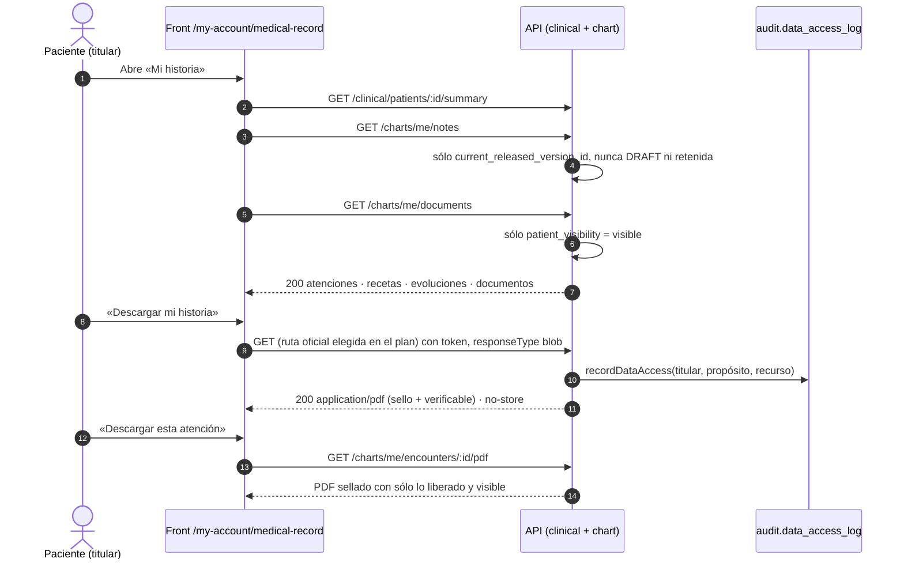

# TASK PROMPT: BR-15 — Historia del paciente: lo liberado visible y PDF oficial desde la API

> **MODO DE EJECUCIÓN:** este prompt se ejecuta en **Modo Planificación (Planning Mode)**.
> El desarrollador o el agente arranca investigando, sin tocar código fuente. Con eso escribe un
> `implementation_plan.md` detallado y espera la aprobación explícita del usuario. Después
> ejecuta los cambios en commits atómicos, verifica con pruebas unitarias y de integración, y
> **contra la API viva levantada**. El resultado queda documentado en `walkthrough.md`.

| Campo | Valor |
|---|---|
| **Cierra** | CL-30, CL-31 (anexo B) · CV-06 (anexo E) · TX-32 (anexo D) — y los pasos 1 y 2 de la TAREA D del anexo E |
| **Severidad máxima** | Alta (es el propósito central del producto) |
| **Repo(s)** | `mantra-core-health-redesa-api` (`dev`) · `mantra-core-health` (`mockup`) |
| **Toca el modelo** | No. Usa `clinical_note_headers.current_released_version_id`, `document_records.patient_visibility_concept_id` y `audit.data_access_log`, que ya existen |
| **Depende de** | **BR-13** (sin firma y liberación no hay notas liberadas que mostrar) · **BR-05** (descarga autenticada: TX-09, `window.open` sin token) · BR-16 (CL-36, para que un documento nazca visible al paciente). Se puede empezar con datos sembrados |
| **Decisión previa** | Ninguna del README §8. CV-06 pide una de producto que el plan deja escrita: qué es «descargar mi historia» (ver §5) |

---

## 1. Contexto de negocio y justificación técnica

### A. Por qué importa
La intención de producto (Justin, 2026-08-17) es que **el paciente sea dueño de su historia: verla,
descargarla, que se le actualice en cada atención y que laboratorios y hospitales aporten**. El
anexo E (TAREA D) concluye que **el flujo no está completo de punta a punta contra la API real**:

| Paso | Estado hoy | Quién lo cierra |
|---|---|---|
| 1. Ver | Probable (D-3 corregido en código, sin confirmar en runtime); **sin evoluciones liberadas, sin documentos, sin planes** | **BR-15** |
| 2. Descargar | Parcial: la receta sí (PDF oficial); la historia y cada atención son **un PDF armado en el navegador**, sin notas ni adjuntos, sin sello y sin rastro de auditoría | **BR-15** |
| 3a. El médico la actualiza | Cubierto, salvo firmar y liberar la nota | BR-13 |
| 3b. El paciente la actualiza | Roto (ruta inexistente) | BR-12 |
| 4. Laboratorios y hospitales | Sin flujo | BR-17, BR-09 |

Este prompt cierra 1 y 2: lo que el médico **liberó** tiene que llegar a «Mi historia», y lo que se
descarga tiene que ser un documento emitido por el sistema, no una impresión del navegador.

### B. Estado del frontend (`mantra-core-health`, `mockup` @ `9b3e0101`)
- `features/account/medical-record/medical-record.ts`:
  - `:384` lee `getSummary` (`GET /clinical/patients/:id/summary`), más órdenes y resultados
    (`GET /diagnostic-results/me(/orders)`) y formularios (`GET /forms/me/instances`).
  - `:428` `downloadVisitPdf(...)` y `:452-467` `downloadHistoryPdf(...)`: **jsPDF en el cliente**
    (`shared/utils/clinical-pdf/clinical-pdf.ts`).
- `shared/utils/clinical-pdf/clinical-pdf.types.ts:204-215` (`DocumentoDeHistoria`): sólo
  `atenciones`, `recetas`, `formularios`, `ordenes`, `resultados`. **Sin evoluciones, sin planes,
  sin documentos.**
- Del lado del médico: `patient-chart.ts:1504` también usa el PDF del cliente; ningún cliente
  llama `GET /charts/encounters/:id/pdf` (CL-31).
- Patrón a copiar para bajar un PDF oficial: `core/data-access/clinical/clinical.client.ts:339-365`
  (`downloadPrescriptionPdf`, `responseType: 'blob', observe: 'response'`, nombre desde
  `Content-Disposition`). Hay prueba real: `playwright/prescription-official-pdf.real.spec.ts`.
- Otros PDF del cliente listados en TX-32: `progress-notes-pdf/`, `quotation-pdf/`, `receipt-pdf/`,
  `form-template-pdf/`, `order-invoice.pdf.ts`. **Sólo** la historia y la atención entran acá.

### C. Estado de la API (`mantra-core-health-redesa-api`, `dev` @ `7541797c`)
- Resumen del paciente: `clinical/controllers/clinical-read.controller.ts:44-62`
  (`@Roles('CLINICIAN','PRACTITIONER','PATIENT')`, `ClinicalRecordAccessGuard`,
  `GET clinical/patients/:patientProfileId/summary`). El titular lee la propia por
  `assertOwnRecord` (`clinical-read.service.ts:510-545`).
- `/charts/*` es sólo `CLINICIAN`/`PRACTITIONER` (`chart-read.controller.ts:33`,
  `chart-notes.controller.ts:59`, `chart-documents.controller.ts:38`,
  `chart-encounters.controller.ts:30`). **No hay `/charts/me/...`.**
- Liberación: `chart-notes.service.ts:412-424` escribe `note_release_events` y pone
  `current_released_version_id` y `patient_release_status_concept_id = RELEASED`. Nadie lo lee del
  lado del paciente.
- Documentos: `chart-documents.service.ts:89-92` los crea con `VISIBILITY_PROVIDER_ONLY` por
  defecto. Descarga de contenido para el médico: `GET /charts/documents/:documentId/files/:fileId/content`
  (`chart-documents.controller.ts:68`, autoriza con `assertPuedeLeerHistoria`).
- PDF oficial del encuentro: `chart-encounters.controller.ts:43-80` (`GET /charts/encounters/:id/pdf`,
  `Cache-Control: private, no-store`, 422 si no está cerrado). `chart/services/encounter-pdf.service.ts:320-347`:
  autoriza con `assertPuedeLeerHistoria` y **arma el papel con `header.currentVersionId` (la
  versión vigente, no la liberada) y con todos los documentos del encuentro** (`:335-341`).
  **Abrir esa ruta al paciente tal cual le mostraría borradores, notas retenidas y documentos
  «sólo para el profesional».**
- `chart.patient_timeline_view <<VIEW>>` existe en `diagram_15_chart.puml:18-30` pero **no se
  genera**: `database/SQL/_generation_report.md:97` («vista (sin SELECT en el .puml)»).
- Exportaciones existentes: `GET /fhir/r5/Patient/:id/$everything` y `POST $export`
  (`health_data/controllers/fhir-r5.controller.ts:46-62`, sólo `PRIVACY_OFFICER`/`HEALTH_DATA_ADMIN`);
  `POST /privacy/dsar` (`audit/controllers/privacy.controller.ts:29`); tablas
  `health_data.health_export_jobs` y `health_export_manifests` (`content_hash`, `file_id`).
- **Auditoría de lectura:** `AuditEventsService.recordDataAccess` (`audit/services/audit-events.service.ts:73`)
  existe, pero **ningún módulo clínico lo llama**; el único que escribe `data_access_log` fuera de
  `audit` es el break-the-glass (`authz/services/authz-clinical.service.ts:198`). Descargar la
  historia hoy **no deja rastro** (TX-32).

### D. Aislamiento
- No toca el modelo ni las escrituras del médico. Sólo agrega **lecturas del titular** y cambia de
  dónde sale el PDF.
- La receta ya tiene su PDF oficial: no se toca.
- Los otros PDF del cliente (cotización, recibo, factura, plantilla) quedan fuera; se documenta
  que son impresiones sin valor legal.

---

## 2. Flujo de Git y entrega

```bash
cd mantra-core-health-redesa-api && git status && git fetch origin
git checkout -b <dev>/feat-historia-del-paciente origin/dev

cd ../mantra-core-health && git status && git fetch origin
git checkout -b <dev>/feat-historia-del-paciente origin/mockup
```

- Commits de ejemplo:
  - API: `feat(chart): GET /charts/me/notes con sólo lo liberado` · `feat(chart): GET
    /charts/me/documents y su contenido, sólo lo visible` · `feat(chart): PDF oficial del encuentro
    para el titular` · `feat(audit): la descarga de la historia deja rastro` · `feat(clinical): PDF
    oficial de la historia completa` (según la decisión de §5).
  - front: `feat(mi-historia): evoluciones liberadas y documentos` · `feat(mi-historia): PDF
    oficial desde la API` · `feat(ficha): PDF sellado del encuentro para el médico` ·
    `fix(mock): lecturas del titular con las reglas de la API`.
- PRs: API `gh pr create --base dev --reviewer jsaldias39,PabloArauzCaballero`; front
  `--base mockup`. Enlazados, con la evidencia pegada.
- **El merge exige revisión humana.** El flujo termina en abrir los PR.

---

## 3. Diagrama



---

## 4. Archivos a modificar o crear

**API**
- `[CREAR]` `src/modules/chart/controllers/chart-me.controller.ts`, `@Controller('charts/me')`,
  sin id de paciente en la ruta (patrón `forms-me.controller.ts`: el titular sale del claim):
  - `GET notes` → notas del titular con **sólo** la versión `current_released_version_id`
    (cursor, `limit ≤ 100`);
  - `GET documents` → documentos con visibilidad al paciente, con `files[]`;
  - `GET documents/:documentId/files/:fileId/content` → contenido, 404 si no es del titular o no
    es visible (mismo 404 para todo, como `forms/me`);
  - `GET encounters/:id/pdf` → PDF del encuentro del titular.
- `[MODIFICAR]` `src/modules/chart/services/chart-read.service.ts` (o un `chart-me-read.service.ts`
  nuevo) y `dto/chart-read.dto.ts`: DTO del titular **sin** campos internos (autor interno,
  estado de borrador, confidencialidad restringida).
- `[MODIFICAR]` `src/modules/chart/services/encounter-pdf.service.ts`: variante del titular que
  usa `currentReleasedVersionId` y filtra documentos por visibilidad; la variante del médico
  queda igual. Sin flag booleano que cambie el comportamiento: dos métodos o una estrategia.
- `[CREAR]` ruta del PDF de la historia completa según la decisión de §5 (p. ej.
  `GET /clinical/me/record/pdf`), armado en el servidor con atenciones, recetas, evoluciones
  liberadas, documentos visibles, órdenes y resultados liberados, con hash del contenido.
- `[MODIFICAR]` las lecturas y descargas del titular: `AuditEventsService.recordDataAccess` en la
  misma transacción de lectura (actor, paciente, recurso, propósito).
- `[MODIFICAR]` `src/modules/chart/chart.module.ts` (y `audit` si hace falta exportar el servicio).
- `[CREAR o MODIFICAR]` `src/modules/chart/chart.module.spec.ts` (BR-13 también lo toca) que exija
  `ChartMeController`; specs del
  servicio (borrador nunca, retenida nunca, `PROVIDER_ONLY` nunca) e int-spec contra Postgres.

**Front**
- `[MODIFICAR]` `src/app/core/data-access/chart-notes/chart-notes.client.ts` y
  `chart-documents/chart-documents.client.ts` (o un `chart-me.client.ts`): `listMyNotes`,
  `listMyDocuments`, `downloadMyDocumentFile`, `downloadMyEncounterPdf`, `downloadMyRecordPdf`,
  todos con `responseType: 'blob'` por `HttpClient` (con token), nunca `window.open`.
- `[MODIFICAR]` `features/account/medical-record/medical-record.ts/html`: secciones «Evoluciones»
  y «Documentos», estados de carga, vacío («Tu médico todavía no liberó ninguna evolución») y
  error; botones de descarga contra la API.
- `[MODIFICAR]` `shared/utils/clinical-pdf/*`: si la historia pasa a salir de la API, el generador
  del cliente deja de usarse para el titular. No borrarlo si otra pantalla lo usa; documentar que
  es una vista sin valor legal.
- `[MODIFICAR]` `features/clinical-record/patient-chart/patient-chart.ts:1504` y
  `clinical.client.ts`: `downloadEncounterPdf` contra `GET /charts/encounters/:id/pdf` (CL-31),
  con el mensaje del 422 si la atención no está cerrada.
- `[MODIFICAR]` `core/mock/handlers/clinical.handlers.ts`: rutas `/charts/me/*` que respeten
  liberación y visibilidad, y un PDF de prueba marcado como tal.

---

## 5. Reglas de implementación

- **Paso 1 del plan: la decisión de producto de CV-06**, con opciones:
  - (a) **documento emitido y verificable**, como la receta: PDF armado en la API con
    `content_hash` y, si se quiere verificar por QR, registro en `health_data.health_export_jobs`/
    `health_export_manifests` (ya existen). Pro: valor legal y rastro. Contra: más trabajo.
  - (b) **exportación FHIR** (`$everything`) o **DSAR** (`/privacy/dsar`). Pro: estándar e
    interoperable. Contra: hoy son roles de privacidad, no del paciente, y el paciente no lee FHIR.
  - (c) **PDF del cliente declarado como vista**. Pro: nada que construir. Contra: no cumple
    CV-06 ni TX-32; sólo aceptable como paso intermedio documentado.
- **El paciente ve sólo lo liberado:** notas por `current_released_version_id` (nunca un borrador,
  nunca una retenida), documentos sólo con visibilidad al paciente. Una prueba por cada exclusión.
- **El titular sale de la sesión.** Ninguna ruta `me` acepta un id de paciente. Cualquier recurso
  ajeno, inexistente o no visible responde el **mismo** 404.
- **Toda lectura y descarga de la historia deja rastro** en `audit.data_access_log` (lecturas
  incluidas, regla 90.2.7). Sin PHI en el log de aplicación.
- **Descargas autenticadas por `HttpClient`**, nunca `window.open` (TX-09). `Cache-Control:
  private, no-store`.
- **Un documento oficial se arma en la API**; el front no fabrica documentos con valor legal.
- **No abrir `GET /charts/encounters/:id/pdf` al rol `PATIENT` tal cual:** hoy imprime la versión
  vigente y todos los documentos.
- **No tocar el modelo.** Si hiciera falta la vista `patient_timeline_view`, es otra tarjeta por
  `.puml` (hoy no se genera).
- **En la API rige `.claude/rules/`:** plan en `docs/trabajo/<fecha>-historia-del-paciente/PLAN.md`,
  `REPORTE.md` con la sección de seguridad y privacidad (reglas 90.2 y 90.6).

---

## 6. Criterios de aceptación (Gherkin)

```gherkin
Escenario: El paciente ve una evolución liberada
  Dada una nota firmada y liberada por su médica
  Cuando el paciente abre «Mi historia»
  Entonces ve la evolución con el texto de la versión liberada
  Y nunca ve un borrador

Escenario: Una versión retenida no aparece
  Dada una versión retenida (withhold)
  Cuando el paciente lista sus evoluciones
  Entonces no aparece

Escenario: Documentos sólo visibles
  Dado un informe marcado «Visible para el paciente» y otro «sólo para el profesional»
  Cuando el paciente lista sus documentos
  Entonces ve sólo el primero y puede descargar su archivo
  Y pedir el segundo por id responde 404

Escenario: Recurso de otro paciente
  Dado el id de un documento de otra persona
  Cuando el paciente lo pide por /charts/me/documents/:id/files/:fileId/content
  Entonces la API responde 404

Escenario: Descargar la historia completa
  Dado un paciente con dos atenciones, una nota liberada y un documento visible
  Cuando descarga su historia completa
  Entonces el archivo proviene de un endpoint de la API
  Y contiene las dos atenciones, la nota liberada y el documento
  Y el documento lleva un sello verificable

Escenario: La descarga deja rastro
  Dado un paciente que descarga su historia
  Cuando se genera el PDF
  Entonces la API registra la lectura en audit.data_access_log

Escenario: PDF sellado del encuentro para el médico
  Dado un encuentro cerrado
  Cuando la médica pulsa «Descargar PDF»
  Entonces se descarga desde /charts/encounters/:id/pdf
  Y si el encuentro está abierto ve el mensaje del 422

Escenario: PDF del encuentro para el paciente
  Dado un encuentro cerrado con una nota en borrador y otra liberada
  Cuando el paciente descarga esa atención
  Entonces el PDF incluye sólo la nota liberada
```

---

## 7. Definition of Done

- [ ] `implementation_plan.md` aprobado con la decisión de CV-06 escrita (opción, quién, fecha).
- [ ] API: `ChartMeController` con 4 rutas (más la de la historia completa si se elige a),
      variante del titular del PDF del encuentro, auditoría de lectura.
      `corepack yarn typecheck`, `corepack yarn lint --max-warnings=0`,
      `corepack yarn test -- chart-me chart-read encounter-pdf audit-events` e int-spec en verde.
- [ ] Rutas montadas: `corepack yarn build && node dist/src/main.js` y `grep` de
      `Mapped {/charts/me/notes, GET}`, `Mapped {/charts/me/documents, GET}`,
      `Mapped {/charts/me/documents/:documentId/files/:fileId/content, GET}` y
      `Mapped {/charts/me/encounters/:id/pdf, GET}`; `chart.module.spec.ts` que exija el controlador.
- [ ] Front: «Mi historia» con evoluciones y documentos, descargas oficiales, PDF sellado en la
      ficha del médico. `corepack yarn typecheck`, `corepack yarn lint`,
      `corepack yarn test --watch=false` en verde; mock alineado.
- [ ] **Evidencia de runtime contra la API viva** (UI → request → response → persistencia →
      recarga → UI): la médica libera una nota (BR-13 o seed) → el paciente recarga «Mi historia»
      y la ve → descarga la historia → `SELECT count(*) FROM audit.data_access_log WHERE …` sube
      en uno → el PDF abre y contiene la nota (captura, datos enmascarados).
- [ ] Matriz negativa con `curl`: sin token 401; médico en `/charts/me/*` 403; documento ajeno
      404; nota en borrador ausente del listado.
- [ ] TAREA D del anexo E: pasos 1 y 2 marcados con enlace a la evidencia en el `walkthrough.md`.
- [ ] PRs abiertos con revisores `jsaldias39` y `PabloArauzCaballero`, y `walkthrough.md`.

---

## 8. Plan de QA

### A. Pruebas automatizadas
```bash
# API
corepack yarn test -- chart-me chart-read.service encounter-pdf.service audit-events.service
corepack yarn test:integration --testPathPatterns=chart
# Front
corepack yarn test --watch=false --include=src/app/features/account/medical-record/**
corepack yarn test --watch=false --include=src/app/core/data-access/chart-notes/**
corepack yarn test --watch=false --include=src/app/features/clinical-record/patient-chart/patient-chart.spec.ts
```
- Por cada lectura del titular: borrador excluido, retenida excluida, `PROVIDER_ONLY` excluido,
  recurso ajeno 404, y el registro en `data_access_log`.

### B. Integración (API viva)
1. Stack con seeds; `corepack yarn build` y `node dist/src/main.js`.
2. Como médica: crear, firmar y liberar una nota; registrar un documento visible y otro no.
3. Como paciente (front en `real-api` o `production-api`): «Mi historia» → evoluciones →
   documentos → descargar un archivo → descargar la atención → descargar la historia completa.
4. Correr `playwright/carril-j5-vertical-p0.spec.ts` y `cypress/e2e/real/02-paciente.cy.ts` contra
   la API y pegar el resultado (confirma D-3 en runtime).

### C. Verificación manual y logs
- Pestaña Red: descargas por XHR con `Authorization`, respuesta `application/pdf` con
  `Cache-Control: private, no-store`; ningún `window.open`.
- Log de la API: sin textos clínicos; `audit.data_access_log` con una fila por descarga.
- Capturas de «Mi historia» con datos, vacía y con error, en móvil y escritorio, claro y oscuro.
