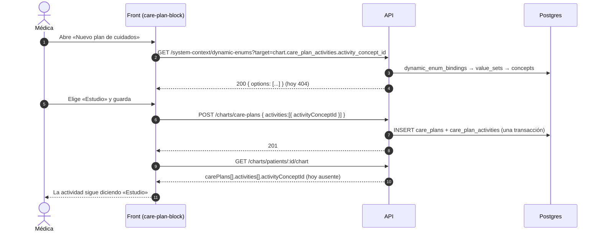

# TASK PROMPT: BR-16 — Plan de cuidados, plantillas de nota y documentos del expediente

> **MODO DE EJECUCIÓN:** este prompt se ejecuta en **Modo Planificación (Planning Mode)**.
> El desarrollador o el agente arranca investigando, sin tocar código fuente. Con eso escribe un
> `implementation_plan.md` detallado y espera la aprobación explícita del usuario. Después
> ejecuta los cambios en commits atómicos, verifica con pruebas unitarias y de integración, y
> **contra la API viva**. El resultado queda documentado en `walkthrough.md`.

| Campo | Valor |
|---|---|
| **Cierra** | CL-24, CL-25, CL-26, CL-34, CL-36 (anexo B, parte B · chart M15) |
| **Severidad máxima** | Alta (CL-24, CL-25) |
| **Repo(s)** | `mantra-core-health-model` (value sets y seeds) · `mantra-core-health-redesa-api` (catálogo de enumeraciones, DTO de lectura) · `mantra-core-health` (front y mock) |
| **Toca el modelo** | Sí, **sólo catálogos**: tres value sets nuevos y sus seeds. Ninguna columna ni FK nueva |
| **Depende de** | Nada para empezar. CL-24 comparte decisión con **BR-18** (D-D, opciones de los campos de elección). CL-36 se luce cuando **BR-15** muestre al paciente lo liberado (CL-30) |
| **Decisión previa** | Ninguna del README §8. Hay una decisión local (ver §5): dónde viven los conceptos de los 3 catálogos |

---

## 1. Contexto de negocio y justificación técnica

### A. Por qué importa
El médico arma un plan de cuidados y registra documentos del expediente desde la consulta. Hoy,
contra la API real, **los tres selectores de catálogo de esas pantallas quedan vacíos** (intención
del plan, clase de actividad y categoría documental): la maqueta los llena con value sets que
inventa el mock. Además, la clase de actividad se guarda y **no se vuelve a leer**, las plantillas
de especialidad esperan metadatos que la API no emite y los documentos nacen siempre «sólo para el
profesional» sin que la pantalla deje elegir. Es la parte del expediente que el paciente va a
terminar viendo (BR-15): si se escribe mal hoy, se lee mal mañana.

### B. Estado del frontend (`mantra-core-health`, `origin/mockup`)
- **Catálogos inventados (CL-25):**
  - `features/clinical-record/patient-chart/care-plan-block/care-plan-block.ts:34`
    (`TARGET_INTENCION = 'chart.care_plans.intent_concept_id'`) y `:37`
    (`TARGET_ACTIVIDAD = 'chart.care_plan_activities.activity_concept_id'`).
  - `features/clinical-record/patient-chart/document-block/document-block.ts:47`
    (`TARGET_CATEGORIA_DOCUMENTAL = 'chart.document_records.category_concept_id'`).
  - `concept-select.ts:142-159` pide `GET /system-context/dynamic-enums?target=…` y, si falla,
    **esconde** las opciones.
  - El mock responde con value sets propios: `core/mock/handlers/misc.handlers.ts:89-91`
    (`VS_CARE_PLAN_INTENT`, `VS_CARE_PLAN_ACTIVITY`, `VS_DOCUMENT_CATEGORY`) y
    `core/mock/fixtures/conceptos.ts:763-785` (códigos `CP-ACT-*`, `DOC-CAT-*`).
- **Clase de actividad perdida (CL-26):** `care-plan-block.ts:251` manda `activityConceptId`;
  `CarePlanActivity` (`core/data-access/clinical/clinical.types.ts:307-313`) no lo tiene y
  `toCarePlan` en `clinical.client.ts` no lo mapea. El mock sí lo devuelve
  (`fixtures/clinica.ts:418-423`): en `mockup` se ve, contra la API se pierde.
- **Plantillas (CL-24):** `core/data-access/chart-templates/chart-templates.types.ts:49`
  (`options`), `:57` (`multiple`), `:72` (`allowOther`), `:100` (`rows`), además de
  `description`, `cardinalityMin/Max`, `requireEachRow` y `oneResponsePerColumn`. El mock los
  fabrica en `clinical.handlers.ts` (`plantilla()`); los consumen `features/form-builder/form-builder.ts`
  y `specialty-form-block.ts`.
- **Filtro por especialidad (CL-34):** el cliente manda `specialtyId`
  (`chart-templates.client.ts:33-39`) y el mock lee `query.get('specialtyConceptId')`
  (`clinical.handlers.ts:699`): siempre devuelve las 43. Hoy nadie filtra (`forms-catalog.ts:179`,
  `form-builder.ts:349`, `specialty-form-block.ts:529`): defecto latente.
- **Visibilidad del documento (CL-36):** `NewChartDocument` (`chart-documents.types.ts`) declara
  `patientVisibilityConceptId` y `confidentialityConceptId`, pero `document-block.ts:222-232` no
  los manda.

### C. Estado de la API (`mantra-core-health-redesa-api`, `origin/dev` @ `7541797c`)
- `src/common/seed/dynamic-enum-catalog.ts` es el amarre declarativo campo → value set que
  `DynamicEnumSeedService` materializa en `system_context.dynamic_enum_bindings`. Para `chart.*`
  sólo tiene los tres ejes de la nota (`:1229`, `:1242`, `:1255`: tipo, estado y liberación). **No
  hay entrada** para `care_plans.intent_concept_id`, `care_plan_activities.activity_concept_id`
  ni `document_records.category_concept_id`. Con un target desconocido el servicio lanza
  `ResourceNotFoundException` (404 **sin confirmar en runtime**).
- La API sí usa conceptos por defecto, sin publicar catálogo (`src/modules/chart/chart.concepts.ts`):
  `CAREPLAN_INTENT_PLAN` (`CP_INTENT_PLAN`, `:105`), `ACTIVITY_DEFAULT` (`CPACT_GENERAL`, `:111`),
  `DOC_CATEGORY_GENERAL` (`DOC_CAT_GENERAL`, `:133`), `DOC_CONFIDENTIALITY_NORMAL` (`:138`),
  `VISIBILITY_PROVIDER_ONLY` (`:84`). Se aplican en `chart-care-plans.service.ts:73,87` y
  `chart-documents.service.ts:86,93,95`.
- `CarePlanActivityItemDto` (`src/modules/chart/dto/chart-read.dto.ts:106-130`) trae sólo
  `id, statusConceptId?, detailText?, scheduledAt?`. En cambio `encounter-pdf.service.ts` sí lee
  `activityConceptId`: el dato existe y la lectura del expediente lo tira.
- `ChartTemplateFieldDto` (`src/modules/chart/dto/templates.dto.ts:223-282`): `assignmentId,
  fieldId, code, name, dataType, valueSetId?, required, ordinal?, own`. Nada de `options`,
  `cardinality*` ni ayuda. `GET /charts/templates` recibe `@Query('specialtyId')` con
  `ParseUUIDPipe` (`chart-templates.controller.ts:83-88`).
- Validación global `whitelist + forbidNonWhitelisted + transform` (`src/main.ts:159-164`).

**Modelo** (`mantra-core-health-model`):
- `Mantra Core Health Context/modules/diagram_15_chart.puml`: `care_plans.intent_concept_id`
  (**opcional**, `:111`), `care_plan_activities.activity_concept_id` (**NOT NULL**, `:126`),
  `document_records.category_concept_id` (**NOT NULL**, `:142`), `confidentiality_concept_id` y
  `patient_visibility_concept_id` (`:149-150`). Las columnas existen: **no se agrega ninguna**.
- Ninguna nota de value set de la bóveda cubre esos tres campos (grep sin resultados en
  `SALUD/Patch v4.*/Value sets/`). Los códigos que el mock usa (`CP-ACT-*`, `DOC-CAT-*`) **no
  son del modelo**: no se copian.
- **Dónde está la bóveda:** `salud-db/paths.py` la busca en
  `<workspace>/Mantra Core Health Vault/SALUD`; en la máquina auditada está en
  `mantra_core_technologies_health_docs/SALUD`. Confirmá la ruta antes de correr `gen_seeds.py`
  (sin confirmar cuál es la vigente).

### D. Aislamiento
- No cambia pantallas fuera del expediente (plan, documentos, bloque de especialidad) ni la
  firma o liberación de notas (eso es BR-13).
- CL-24 **no** decide cómo se modelan las opciones libres de un campo: eso es la decisión D-D de
  BR-18. Acá sólo se hace que la lectura de plantillas devuelva lo que el modelo ya tiene
  (`value_set_id` resuelto, cardinalidad, ayuda) y que el front lo use.
- CL-27 (descarga de archivos del documento) es de BR-05; no se toca acá.

---

## 2. Flujo de Git y entrega

Tres repos, un PR por repo. El del modelo va primero; el de la API puede avanzar en paralelo con
el `dynamic-enum-catalog` apuntando a los códigos acordados.

```bash
cd mantra-core-health-model && git status && git fetch origin          # value sets + seeds
git checkout -b <dev>/feat-catalogos-plan-y-documentos origin/dev
cd mantra-core-health-redesa-api && git status && git fetch origin
git checkout -b <dev>/feat-catalogos-chart-y-lectura-plan origin/dev
cd mantra-core-health && git status && git fetch origin
git checkout -b <dev>/fix-plan-plantillas-documentos origin/mockup
```

- Commits sugeridos: modelo `feat(vault): value sets de plan y categoría documental` ·
  `feat(seeds): gen_seeds siembra los catálogos de chart`; API `feat(chart): catálogos de plan y
  documento en dynamic-enums` · `fix(chart): la lectura del plan devuelve activityConceptId` ·
  `feat(chart): la plantilla expone cardinalidad y ayuda`; front `fix(chart): el plan muestra la
  clase de actividad` · `fix(mock): plantillas por specialtyId y catálogos del modelo` ·
  `feat(chart): el documento elige visibilidad y confidencialidad`.
- PR API `gh pr create --base dev …`, PR front `gh pr create --base mockup …`, ambos con
  `--reviewer jsaldias39,PabloArauzCaballero`; el del modelo suma a quien lo mantiene. Cada cuerpo
  lleva la evidencia de runtime pegada. **El flujo termina en abrir los PR.**

---

## 3. Diagrama



---

## 4. Archivos a modificar o crear

**Modelo (`mantra-core-health-model` + bóveda)**
- `[CREAR]` tres notas de value set en la bóveda (`SALUD/Patch v4.x/Value sets/vs_*.md`, con su
  bloque `## Valores`), una por campo. Los códigos **salen de la decisión de §5**, no del mock.
- `[MODIFICAR]` `salud-db/gen_seeds.py`: entradas en `VS_OWNER` (patch y módulo 15) y, si hace
  falta, el binding a los campos.
- `[REGENERAR]` seeds con `python salud-db/gen_seeds.py` (determinista). **No** tocar `SQL/`: no
  cambia DDL.

**API (`mantra-core-health-redesa-api`)**
- `[MODIFICAR]` `src/common/seed/dynamic-enum-catalog.ts`: tres entradas nuevas en la sección
  `chart.*` con `targets` y `defaultConceptId` (`CP_INTENT_PLAN`, `CPACT_GENERAL`,
  `DOC_CAT_GENERAL`), más la de visibilidad del documento si se decide publicarla (CL-36).
- `[MODIFICAR]` `src/modules/chart/chart.concepts.ts`: sólo si la decisión de §5 agrega conceptos
  del lado de la API.
- `[MODIFICAR]` `src/modules/chart/dto/chart-read.dto.ts`: `activityConceptId!` en
  `CarePlanActivityItemDto`.
- `[MODIFICAR]` `src/modules/chart/services/chart-read.service.ts`: el mapper lo copia.
- `[MODIFICAR]` `src/modules/chart/dto/templates.dto.ts` y `services/chart-templates.service.ts`:
  `cardinalityMin?`, `cardinalityMax?` (ya están en la entidad) y `helpText?` (desde
  `field_definition_localizations` del idioma de la sesión). **Nada de `options`** hasta D-D.
- `[CREAR/MODIFICAR]` specs: `dynamic-enum-catalog` (los tres targets existen y validan contra el
  esquema), `chart-read.service.spec.ts`, `chart-templates.service.spec.ts`.

**Front (`mantra-core-health`)**
- `[MODIFICAR]` `core/data-access/clinical/clinical.types.ts` (`CarePlanActivity.activityConceptId`),
  `clinical.client.ts` (`toCarePlan`) y `patient-chart.ts/html` (etiqueta de la clase).
- `[MODIFICAR]` `core/data-access/chart-templates/chart-templates.types.ts`: separar lo que la API
  emite (`cardinalityMin/Max`, `helpText`, `valueSetId`) de lo que sólo existe en el mock
  (`options`, `allowOther`, `rows`…), marcado como provisional hasta BR-18.
- `[MODIFICAR]` `specialty-form-block.ts` y `form-builder.ts`: un campo con `valueSetId` se dibuja
  como desplegable alimentado por `GET /terminology/value-sets/:id/$expand`, que el front ya
  consume en `core/data-access/terminology/terminology.client.ts:66-95` (ojo con el `$`
  codificado que documenta ese cliente); un campo sin catálogo no ofrece una lista vacía.
- `[MODIFICAR]` `document-block.ts/html`: interruptor «Visible para el paciente» y selector de
  confidencialidad que mandan `patientVisibilityConceptId` y `confidentialityConceptId`.
- `[MODIFICAR]` `core/mock/handlers/clinical.handlers.ts:699`: leer `specialtyId`.
- `[MODIFICAR]` `core/mock/handlers/misc.handlers.ts:89-91` y `core/mock/fixtures/conceptos.ts`:
  los catálogos del mock usan **los mismos códigos** que el modelo.
- `[CREAR/MODIFICAR]` specs de los tres bloques y de los handlers.

---

## 5. Reglas de implementación

- **Decisión local, paso 1 del plan (con opciones):** dónde nacen los conceptos de los tres
  catálogos.
  - (a) **Value sets del modelo** (nota en la bóveda + `VS_OWNER` + `gen_seeds.py`), y la API sólo
    los amarra en `dynamic-enum-catalog.ts`. Pro: camino canónico del proyecto, ids uuid5
    deterministas. Contra: tres repos y quien mantiene el modelo tiene que aprobar.
  - (b) **Conceptos de módulo del lado de la API** (`chart.concepts.ts` + `MODULE_CONCEPT_SEEDS`),
    como ya están hoy `CP_INTENT_PLAN` y los ejes de la nota. Pro: un repo, sigue el patrón de
    `chart.*` existente. Contra: el catálogo no queda en la bóveda, y la regla del proyecto dice
    que un value set nuevo va por nota de value set.
  - Recomendación a validar: (a). Anotá la decisión y quién la tomó.
- **No inventar códigos ni significados.** Si el modelo o un estándar de referencia (FHIR
  `CarePlan.intent`, `DocumentReference.category`) no sustentan un código, queda como TODO y se
  pregunta.
- **Nunca editar la base ni `database/SQL` a mano.** Este prompt no cambia DDL: si alguien siente
  que hace falta una columna, frená y reabrí la decisión.
- Los conceptos van siempre por `*_concept_id`; nada de enums de TypeScript nuevos.
- `forbidNonWhitelisted`: lo que el front mande tiene que estar en el DTO; los campos nuevos del
  documento ya lo están (`NewChartDocument` es subconjunto de `CreateDocumentDto`).
- El valor por defecto documentado **no cambia**: un plan sin intención sigue quedando en
  `CP_INTENT_PLAN`; un documento sin visibilidad sigue «sólo profesional».
- **Valores ya capturados no se reescriben**: los planes y documentos existentes conservan sus
  conceptos; no hay migración de datos.
- Mock honesto: sin catálogo inventado. Si un código todavía no está decidido, el mock lo marca
  provisional (mismo criterio que P26).

---

## 6. Criterios de aceptación (Gherkin)

```gherkin
Escenario: El catálogo de clase de actividad existe en la API
  Dado la API con los seeds cargados
  Cuando pido GET /system-context/dynamic-enums?target=chart.care_plan_activities.activity_concept_id
  Entonces recibo 200 con al menos una opción y la opción por defecto es CPACT_GENERAL

Escenario: Los tres selectores se llenan contra la API real
  Dado el front en configuración real-api y una médica con acceso a la ficha
  Cuando abre «Nuevo plan de cuidados» y «Registrar documento»
  Entonces los selectores de intención, clase de actividad y categoría muestran opciones
  Y ninguno queda escondido por error

Escenario: La clase de actividad se relee
  Dado un plan creado con una actividad de clase «Estudio»
  Cuando se recarga el expediente
  Entonces la actividad sigue mostrando «Estudio»

Escenario: Un plan antiguo sin clase elegida
  Dado un plan cuya actividad quedó con el concepto por defecto
  Cuando se lee el expediente
  Entonces la actividad muestra la etiqueta legible de CPACT_GENERAL

Escenario: El mock filtra plantillas por especialidad
  Dado el mock
  Cuando pido GET /charts/templates?specialtyId=<cardiología>
  Entonces sólo recibo las plantillas de cardiología

Escenario: Campo con catálogo en una plantilla
  Dado un campo de plantilla con valueSetId
  Cuando la médica abre el bloque de especialidad contra la API real
  Entonces el campo se dibuja como desplegable con las opciones del value set

Escenario: Documento visible para el paciente
  Dado una médica que registra un informe marcado «Visible para el paciente»
  Cuando lo guarda
  Entonces el POST /charts/documents lleva patientVisibilityConceptId y responde 201
  Y al recargar el documento conserva esa visibilidad

Escenario: Campo extra rechazado
  Dado el front contra la API real
  Cuando registra un documento
  Entonces la API no responde 400 por una clave no declarada
```

---

## 7. Definition of Done

- [ ] `implementation_plan.md` aprobado, con la decisión (a)/(b) de §5 escrita y los códigos de
      cada catálogo justificados.
- [ ] Modelo: notas de value set creadas, `VS_OWNER` actualizado, `gen_seeds.py` regenerado y
      diffeado (sólo aparecen los conceptos nuevos). Re-correr el generador da 0 diferencias.
- [ ] API: los tres targets publicados; `activityConceptId` en la lectura; plantilla con
      cardinalidad y ayuda. `corepack yarn lint`, `corepack yarn typecheck`, `corepack yarn test`
      en verde.
- [ ] Front: tipos, bloques y mock alineados. `corepack yarn lint`, `corepack yarn typecheck`,
      `corepack yarn test --watch=false` y los `check-*.mjs` en verde (corrélos a mano).
- [ ] **Evidencia de runtime contra la API viva**, pegada en los PR, recorriendo
      `UI → request → response → persistencia → recarga → UI`:
  - `curl` de los tres `GET /system-context/dynamic-enums?target=…` con 200;
  - captura del plan creado con una clase de actividad, `SELECT activity_concept_id FROM
    chart.care_plan_activities WHERE …` y la captura tras recargar;
  - un documento visible para el paciente, con la fila de `chart.document_records` y su
    `patient_visibility_concept_id`.
- [ ] Ningún código inventado por el mock queda en los fixtures.
- [ ] PR abiertos con revisores `jsaldias39` y `PabloArauzCaballero`, y `walkthrough.md`.

---

## 8. Plan de QA

### A. Pruebas automatizadas
```bash
corepack yarn test src/modules/chart src/common/seed && corepack yarn typecheck   # API
corepack yarn test --watch=false --include=src/app/features/clinical-record/patient-chart/**
corepack yarn test --watch=false --include=src/app/core/mock/handlers/**
node scripts/check-client-prefixes.mjs && node scripts/check-api-contract-drift.mjs
```
- Specs: cada target nuevo valida como `esquema.tabla.columna`; `chart-read.service` devuelve
  `activityConceptId`; el handler del mock filtra por `specialtyId`.

### B. Integración (API viva)
1. Modelo: `python salud-db/gen_seeds.py` y cargar con `load_seeds.py` sobre el stack local (o
   el ciclo limpio del stack si el entorno lo exige).
2. API: `corepack yarn build && node dist/src/main.js`; verificar en el log que el seed de
   enumeraciones materializó los targets nuevos.
3. `curl` de los tres targets con un token de médico.
4. Front en `real-api`: crear plan con actividad, recargar, crear documento visible, recargar.

### C. Verificación manual y logs
- Consola sin 404 de `dynamic-enums` ni selector escondido; log de la API sin 400 de
  `forbidNonWhitelisted` en `/charts/*`; `SELECT` de las filas nuevas.
