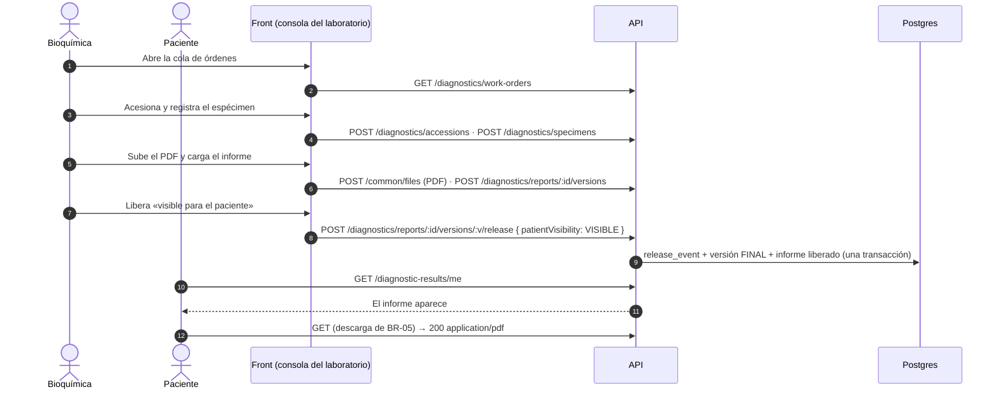

# TASK PROMPT: BR-17 — Diagnósticos: un solo camino de liberación, consola del laboratorio y compartir resultados

> **MODO DE EJECUCIÓN:** este prompt se ejecuta en **Modo Planificación (Planning Mode)**.
> El desarrollador o el agente arranca investigando, sin tocar código fuente. Con eso escribe un
> `implementation_plan.md` detallado y espera la aprobación explícita del usuario. Después
> ejecuta los cambios en commits atómicos, verifica con pruebas unitarias y de integración, y
> **contra la API viva**. El resultado queda documentado en `walkthrough.md`.

| Campo | Valor |
|---|---|
| **Cierra** | CV-02 (anexo E) · CL-45, CL-46, CL-47, CL-48, CL-50, CL-51, CL-55, CL-56 (anexo B, parte C) |
| **Severidad máxima** | **Bloqueante demo** (CV-02: el laboratorio no puede publicar un resultado) |
| **Repo(s)** | `mantra-core-health-redesa-api` (liberación, lecturas del circuito, búsqueda, share) · `mantra-core-health` (consola del laboratorio, compartir, directorio, mock) |
| **Toca el modelo** | No. Todas las tablas existen en `SQL/20_diagnostics` y `23_diagnostic_units`. CL-50 puede pedir modelo **sólo** si se decide persistir el motivo (ver §5) |
| **Depende de** | **BR-05** para que el paciente baje el PDF del informe (CL-40). **BR-06** para el rol del personal del laboratorio. **BR-09** para que exista un laboratorio dado de alta. Todo se puede empezar con seeds y el contrato acordado |
| **Decisión previa** | **D-E**: ¿la liberación canónica es `POST /clinical/diagnostic-reports/:id/release` o `POST /diagnostics/reports/:reportId/versions/:versionId/release`? (README §8) |

---

## 1. Contexto de negocio y justificación técnica

### A. Por qué importa
«Mis resultados» es la mitad del propósito central («el paciente, dueño de su historia»: que los
laboratorios aporten). Hoy **nada en la UI produce lo que esa pantalla lee**: la API sólo le
muestra al paciente versiones liberadas con un evento de liberación visible, y ese evento sólo lo
escribe una ruta que no tiene pantalla. Fuera de los seeds, la lista queda vacía. Además hay dos
caminos de liberación que no coinciden, compartir un resultado exige tipear un UUID, y el
directorio de laboratorios pierde el mapa y la moneda contra la API real.

### B. Estado del frontend (`mantra-core-health`, `origin/mockup`)
- **Sin consola del laboratorio (CV-02, CL-47):** `core/data-access/diagnostics/diagnostics.client.ts:40-60`
  documenta que acesionar, cargar corridas o liberar versiones «tienen endpoint y no están acá»:
  no hay cliente para `specimens`, `accessions`, `analyzer-runs`, `verifications`,
  `reports/:id/versions` ni `…/release`. El mock inventa la cola (`diagnostics.handlers.ts:89`).
- **Liberación clínica sin pantalla (CL-46):** `core/data-access/clinical/clinical.client.ts:560`
  (`createDiagnosticReport`) y `:582` (`releaseDiagnosticReport`): contrato sin vista (sólo los usa
  su spec). El mock (`clinical.handlers.ts:514-519`) no toca la colección `informes` de
  `diagnostics.handlers.ts`: liberar en `mockup` no hace aparecer nada en «Mis resultados».
- **Compartir con UUID (CL-48):** `features/account/diagnostic-results/diagnostic-results.html:149-155`
  (placeholder «Identificador de la cuenta») y `diagnostic-results.ts:321-331` →
  `practitionerUserId`. La lista pinta el UUID crudo (`.html:178`).
- **Descarga del PDF:** `diagnostic-results.ts:270-291` (`window.open` de una URL que exige
  bearer → 401/403) es **CL-40, de BR-05**; acá sólo se consume el endpoint que deje.
- **Directorio (CL-45, CL-51):** `core/data-access/diagnostic-units/diagnostic-units.types.ts:150`
  (`cities?` opcional, «sólo lo sirve la maqueta»); `features/laboratory-directory/laboratory-directory.ts:237-253`
  (sin `cities` no hay mapa) y `:603-622` («La moneda va literal porque la búsqueda no la
  devuelve» → `desde Bs …`). El mock inventa `cities` en `diagnostics.handlers.ts:706`.
- **Mock que inventa imagen (CL-56):** `diagnostics.handlers.ts:609-613` (estudio con
  `studyInstanceUid` fabricado para toda orden ECO/RX/TAC/RMN) y `:648` (preparación literal).
- **CL-55:** `core/data-access/procedures/procedures.types.ts:31-41` tipa `description: string`.

### C. Estado de la API (`mantra-core-health-redesa-api`, `origin/dev` @ `7541797c`)
- **Qué ve el paciente:** `diagnostics/services/diagnostics-patient-results.service.ts:55-75`
  (JSDoc) y `projectReleasedResults` (`:606-640`): sólo versiones **liberadas con visibilidad de
  paciente** según `diagnostic_release_events`. No se infiere visibilidad de ninguna otra señal.
- **Camino A (diagnostics):** `diagnostics-reports.controller.ts:51`
  `POST /diagnostics/reports/:reportId/versions/:versionId/release` →
  `diagnostics-reports.service.ts:131-200`: en **una** transacción registra el evento con
  `patientVisibility` (`VISIBLE` por defecto, `HIDDEN` opcional), pone la versión en `REPORT_FINAL`
  y marca el informe liberado (`markReportReleased`). 409 si ya estaba liberada; 422 si no es
  elegible.
- **Camino B (clinical):** `clinical/services/diagnostic-reports.service.ts:101-160` (UC-08-07):
  cambia `lifecycleStatusConceptId`, `resultReleaseStatusConceptId` y
  `currentReleasedVersionId`, **y no escribe `diagnostic_release_events`**. Leyendo el código,
  lo liberado por acá no llega a `GET /diagnostic-results/me` (**sin confirmar en runtime**).
- **Roles:** `diagnostics-reports.controller.ts:28`, `diagnostics-lab.controller.ts:38` y
  `diagnostics-specimens.controller.ts:30` exigen `CLINICIAN` o `PRACTITIONER` a nivel de clase.
  Qué rol lleva el bioquímico o el técnico del laboratorio **no está definido**: es BR-06.
- **Lecturas del circuito (CL-47):** `diagnostics-specimens.controller.ts:41-89` sólo tiene
  `POST` (`specimens`, `accessions`, `specimens/:id/rejection`, `specimens/:id/containers`,
  `containers/:id/custody-events`). La única lectura operativa es `GET /diagnostics/work-orders`
  (`diagnostics-lab.controller.ts:56`).
- **Versión de informe:** `dto/reports.dto.ts:75-162` (`CreateReportVersionDto`: `results[]` con
  `observationId`, `files[]` con `fileId`, `conclusionText`, `supersedesVersionId`…). Toda versión
  nace `RELEASE_ELIGIBLE` (`diagnostics-reports.service.ts:100`). **Sin confirmar:** de dónde sale
  el `observationId` de un resultado cargado a mano (¿`POST /clinical/observations` o la ingesta
  del analizador?) y cómo el laboratorio obtiene el `reportId` a partir de una orden de trabajo.
- **Share (CL-48, CL-50):** `dto/patient-results.dto.ts` `ShareDiagnosticResultDto`
  (`practitionerUserId` `@IsUUID`, `validUntil`, `reason?`); el servicio crea el grant sin
  `reason` (`diagnostics-patient-results.service.ts:405-416`). El paciente **no puede listar**
  a sus profesionales: `GET /authz/care-relationships` exige `CLINICIAN`/`SECURITY_ADMIN`
  (`authz-care-relationships.controller.ts:91` y su `@Roles`); para `PATIENT` sólo existe
  `GET /authz/care-relationships/requests/mine` (`:112`).
- **Búsqueda (CL-45, CL-51):** `diagnostic_units/dto/catalog.dto.ts` `DiagnosticUnitSearchItemDto`
  = `tenantId, rating, ratingCount, minAmount` + campos del directorio: **ni `cities` ni moneda**.
- **Perioperatorio (CL-55):** `procedures_perioperative/dto/periop.dto.ts:890-905`: el tipo
  TypeScript de `operativeSteps` **sí** declara `description`, pero el `@ApiProperty({ isArray:
  true })` no da `type`, así que el esquema OpenAPI no describe los ítems. El servicio la devuelve
  (`periop-cases.service.ts:1043-1054`).

### D. Aislamiento
- **No** se toca la descarga del archivo (BR-05), el alta del laboratorio (BR-09) ni los roles
  (BR-06). Si al ejecutar el prompt esos frentes no están mergeados, la consola se prueba con un
  usuario sembrado con `CLINICIAN` en el tenant del laboratorio y se anota.
- «Mis resultados» sólo cambia en el panel de compartir. DICOM, dosis y críticos quedan fuera.

---

## 2. Flujo de Git y entrega

```bash
cd mantra-core-health-redesa-api && git status && git fetch origin
git checkout -b <dev>/feat-liberacion-unica-y-lecturas-laboratorio origin/dev
cd mantra-core-health && git status && git fetch origin
git checkout -b <dev>/feat-consola-laboratorio-y-compartir origin/mockup
```

- Commits sugeridos: API `fix(diagnostics): una sola liberación con evento de visibilidad (D-E)` ·
  `feat(diagnostics): GET de acesión y espécimen` · `feat(diagnostic-units): cities y
  minAmountCurrency` · `feat(authz): el paciente lista a sus profesionales` ·
  `fix(diagnostics): reason del share` · `docs(periop): operativeSteps en OpenAPI`; front
  `feat(laboratorio): cola y detalle de la orden` · `feat(laboratorio): cargar y liberar el
  informe` · `feat(resultados): compartir por nombre` · `fix(directorio): mapa y moneda reales` ·
  `fix(mock): liberación única, sin imagen inventada`.
- PR API `gh pr create --base dev …` y PR front `gh pr create --base mockup …`, ambos con
  `--reviewer jsaldias39,PabloArauzCaballero` y la evidencia de runtime pegada. **El flujo termina
  en abrir los PR.**

---

## 3. Diagrama



---

## 4. Archivos a modificar o crear

**API**
- `[MODIFICAR]` `src/modules/clinical/services/diagnostic-reports.service.ts` y/o
  `src/modules/diagnostics/services/diagnostics-reports.service.ts`: según D-E, el camino
  clínico **delega** en `releaseVersion` (misma transacción, mismo evento) o se **depreca** con
  documentación y un 410/422 explícito. Nunca dos lógicas de liberación.
- `[MODIFICAR]` `src/modules/diagnostics/controllers/diagnostics-specimens.controller.ts` +
  `services/diagnostics-specimens.service.ts` (o el que corresponda) + repositorio:
  `GET /diagnostics/accessions/:id` (con especímenes y contenedores) y
  `GET /diagnostics/specimens/:id` (con cadena de custodia). Acotados al tenant del actor.
- `[EVALUAR]` `diagnostics-lab.controller.ts`: `GET /diagnostics/work-orders/:id` sólo si la cola
  no alcanza para abrir el detalle de una orden.
- `[MODIFICAR]` `src/modules/diagnostic_units/dto/catalog.dto.ts` + servicio de búsqueda:
  `cities: string[]` (distintas, de sedes activas) y `minAmountCurrency` (código o concepto de
  `price_schedules.currency_concept_id`).
- `[MODIFICAR]` `src/modules/authz/controllers/authz-care-relationships.controller.ts` (o un
  controlador `me`): lectura para `PATIENT` de sus relaciones asistenciales vigentes con nombre del
  profesional y `userId`; **o** `ShareDiagnosticResultDto` acepta `practitionerProfileId` y el
  servidor resuelve el usuario. Elegir una en el plan.
- `[MODIFICAR]` `dto/patient-results.dto.ts`: `reason` se persiste si el modelo tiene dónde (sin
  confirmar columna en `authz.access_grants`) o se retira del DTO. No se inventa columna.
- `[MODIFICAR]` `src/modules/procedures_perioperative/dto/periop.dto.ts`: `operativeSteps`
  declarado con una clase de ítem (`type: () => [OperativeStepItemDto]`).
- `[CREAR]` int-spec `test/integration/diagnostics-release.int-spec.ts` (liberado visible lo ve el
  titular; `HIDDEN` no) y `diagnostics.module.spec.ts` que exija las rutas nuevas.

**Front**
- `[CREAR]` `core/data-access/diagnostics/diagnostics-lab.client.ts` (`DiagnosticsLabClient`):
  cola, acesión, espécimen, versión de informe, liberación, lecturas nuevas.
- `[CREAR]` feature de laboratorio (por ejemplo `features/diagnostics/lab-console/` con cola y
  detalle de la orden), generado con `ng generate`, registrado en `app.routes.ts` y
  `navigation.map.ts` con el rol que defina BR-06. **Layout**: no hay maqueta HTML de V20 en
  `SALUD/Vistas/HTML`; seguir `SALUD/Vistas/V20 diagnostics — Vistas.md` y
  `docs/components/composition-rules.md` §5 (una tarjeta con pestañas, centrada). No inventar.
- `[MODIFICAR]` `features/account/diagnostic-results/diagnostic-results.ts/html`: selector de
  profesional por nombre; la lista muestra el nombre, no el UUID.
- `[MODIFICAR]` `core/data-access/diagnostic-units/diagnostic-units.types.ts` y
  `features/laboratory-directory/laboratory-directory.ts`: `cities` y la moneda desde la respuesta.
- `[MODIFICAR]` `core/data-access/clinical/clinical.client.ts`: si D-E depreca el camino clínico,
  retirar `releaseDiagnosticReport`; si delega, dejarlo y documentar que libera visible.
- `[MODIFICAR]` `core/mock/handlers/diagnostics.handlers.ts` y `clinical.handlers.ts`: una sola
  liberación que alimenta `informes`; estudios de imagen sólo de órdenes completadas; preparación
  desde la oferta del fixture; `cities` y moneda como la API.
- `[CREAR/MODIFICAR]` specs de cliente, pantalla y handlers.

---

## 5. Reglas de implementación

- **Paso 1 del plan: pedir D-E** con estas opciones:
  - (a) **Canónica `diagnostics/reports/.../release`** y el camino clínico delega en ella. Pro:
    una sola fuente de verdad del evento y la visibilidad; el paciente ve lo que se libera por
    cualquiera de las dos rutas. Contra: el camino clínico tiene que resolver la versión actual del
    informe; si no hay versión, 422.
  - (b) **Canónica `diagnostics/...` y deprecar la clínica.** Pro: menos superficie. Contra: rompe
    el contrato UC-08-07 que hoy tiene spec en el front y en la API; hay que avisar.
  - (c) **Canónica la clínica** y que escriba el evento. Contra: duplica la lógica de versiones y
    visibilidad que ya vive en `diagnostics`. No recomendada.
- **Un caso de uso = una transacción.** Evento de liberación, estado de la versión y marca del
  informe van juntos. Nada de liberar y «después» escribir el evento.
- **`diagnostic_release_events` es un registro:** no se actualiza ni se borra. Retener o corregir
  es un evento nuevo o una versión nueva (`supersedesVersionId`), nunca un UPDATE.
- **Valores ya liberados no se reescriben.** Una corrección de informe es una versión nueva.
- `PreconditionFailedException` = **422** (no 412); 409 si ya estaba liberada.
- `forbidNonWhitelisted`: la consola manda sólo claves de los DTO (`CreateReportVersionDto`,
  `ReleaseReportVersionDto`). Campo extra = 400.
- **Autorización por tenant:** el laboratorio sólo ve y libera lo de su tenant
  (`custodianTenantId`). La lectura nueva de acesión/espécimen no filtra existencia a otro tenant
  (404).
- **Sin datos inventados en el mock:** ni `studyInstanceUid` sin STOW, ni preparación literal.
- Compartir: la lista que ve el paciente sale de sus relaciones asistenciales reales; nunca un
  buscador global de usuarios.
- Rutas nuevas: `node dist/src/main.js` + grep de `Mapped {<ruta>` en el log + el
  `*.module.spec.ts` que exige el controlador.

---

## 6. Criterios de aceptación (Gherkin)

```gherkin
Escenario: El laboratorio publica un resultado y el paciente lo ve
  Dado un laboratorio con una orden de un paciente
  Cuando la bioquímica carga el informe con su PDF y lo libera como visible para el paciente
  Entonces POST /diagnostics/reports/:id/versions/:versionId/release responde 201
  Y el paciente ve el informe en /my-account/diagnostic-results al recargar
  Y puede descargar su archivo (endpoint de BR-05)

Escenario: La liberación clínica también llega al paciente (si D-E elige delegar)
  Dado un médico que libera un reporte con versión desde la consulta
  Cuando el paciente abre /my-account/diagnostic-results
  Entonces el reporte figura en la lista

Escenario: Liberado como oculto
  Dado una versión liberada con patientVisibility HIDDEN
  Cuando el paciente lista sus resultados
  Entonces no la ve

Escenario: Doble liberación
  Dado una versión ya liberada
  Cuando se intenta liberar otra vez
  Entonces la API responde 409 y no se crea un segundo evento

Escenario: Lectura de la acesión
  Dado una orden acesionada con un espécimen
  Cuando la bioquímica abre el detalle
  Entonces GET /diagnostics/accessions/:id devuelve el espécimen con su contenedor y su custodia
  Y el laboratorio B recibe 404 al pedir la misma acesión

Escenario: Compartir por nombre
  Dado un paciente con dos profesionales vinculados
  Cuando abre «Compartir» en un resultado
  Entonces elige a uno de una lista por nombre y no escribe ningún identificador
  Y el share aparece en «Compartido con» con el nombre del profesional
  Y si se mandó un motivo, se lista (o el POST da 400 si reason se retiró del contrato)

Escenario: Directorio con mapa y moneda
  Dado un centro con sedes en La Paz y El Alto y tarifa en USD
  Cuando busco en /laboratory-directory contra la API real
  Entonces el ítem trae cities ["La Paz","El Alto"], el mapa aparece y la tarjeta dice «desde USD …»

Escenario: Mock sin imagen inventada
  Dada una orden de RX pendiente en mockup
  Cuando listo los estudios de imagen del paciente, entonces no aparece ningún estudio
```

---

## 7. Definition of Done

- [ ] `implementation_plan.md` aprobado, con **D-E** decidida y escrita, y el origen de
      `observationId`/`reportId` en el circuito del laboratorio confirmado leyendo el código.
- [ ] API y front con `corepack yarn lint`, `corepack yarn typecheck` y `corepack yarn test`
      (`--watch=false` en el front) en verde, más los `check-*.mjs` del front a mano.
- [ ] `corepack yarn test:integration --testPathPatterns=diagnostics-release` en verde (el CI sólo
      corre `postgres-privileges`: pegá la salida local).
- [ ] Log de `node dist/src/main.js` con `Mapped {/diagnostics/accessions/:id, GET}` y las demás
      rutas nuevas, exigidas por el `*.module.spec.ts`.
- [ ] **Evidencia de runtime contra la API viva** (`UI → request → response → persistencia →
      recarga → UI`), pegada en el PR:
  - la bioquímica acesiona, carga el PDF y libera (capturas + requests);
  - `SELECT` de `diagnostics.diagnostic_release_events` con `patient_visibility_concept_id`;
  - el paciente recarga «Mis resultados» y ve el informe; descarga con el endpoint de BR-05 (o
    se anota BLOCKED si BR-05 no está mergeado);
  - el share creado por nombre y su fila en el grant de `authz`.
- [ ] PR abiertos con revisores `jsaldias39` y `PabloArauzCaballero`, y `walkthrough.md`.

---

## 8. Plan de QA

### A. Pruebas automatizadas
```bash
corepack yarn test src/modules/diagnostics src/modules/clinical src/modules/diagnostic_units src/modules/authz  # API
corepack yarn test --watch=false --include=src/app/core/data-access/diagnostics/**
corepack yarn test --watch=false --include=src/app/features/account/diagnostic-results/**
corepack yarn test --watch=false --include=src/app/features/laboratory-directory/**
corepack yarn test --watch=false --include=src/app/core/mock/handlers/diagnostics.handlers.spec.ts
```
- Specs: el camino clínico produce **el mismo** evento que el de `diagnostics` (o el error
  acordado si se deprecó); en el mock, liberar alimenta `informes`.

### B. Integración (API viva)
1. Stack `mantra-redesa` arriba con seeds; API con `corepack yarn build && node dist/src/main.js`.
2. Con un usuario del laboratorio (rol de BR-06 o, provisoriamente, `CLINICIAN` en su tenant):
   cola → acesión → espécimen → PDF → versión → liberación.
3. Con el paciente titular: `GET /diagnostic-results/me` y la pantalla.
4. Repetir la liberación por el camino clínico (si D-E = delegar) y comprobar el mismo resultado.
5. Paciente B: el informe de A no aparece; `GET …/me/:reportId` de A → 404.

### C. Verificación manual y logs
- Log: un solo `diagnostics.report.release` por liberación y ningún 400 por clave extra; consola
  sin toast de error en «Compartido con»; `SELECT count(*) FROM diagnostics.diagnostic_release_events
  WHERE diagnostic_report_version_id = …` = 1 tras intentar liberar dos veces.
