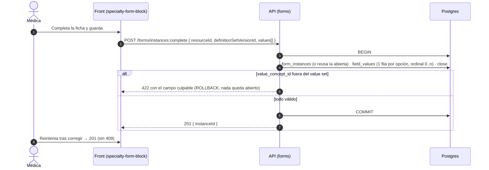

# TASK PROMPT: BR-18 — Formularios dinámicos: opciones en el modelo, editar, quitar y ordenar, una transacción

> **MODO DE EJECUCIÓN:** este prompt se ejecuta en **Modo Planificación (Planning Mode)**.
> El desarrollador o el agente arranca investigando, sin tocar código fuente. Con eso escribe un
> `implementation_plan.md` detallado y espera la aprobación explícita del usuario. Después
> ejecuta los cambios en commits atómicos, verifica con pruebas unitarias y de integración, y
> **contra la API viva**. El resultado queda documentado en `walkthrough.md`.

| Campo | Valor |
|---|---|
| **Cierra** | CL-61, CL-62, CL-63, CL-64, CL-65, CL-66, CL-67, CL-68, CL-69 (anexo B, parte D) |
| **Severidad máxima** | Alta (seis de los nueve) |
| **Repo(s)** | `mantra-core-health-model` (módulo 09, si D-D lo pide) · `mantra-core-health-redesa-api` (`forms`, `chart` templates) · `mantra-core-health` (generador, bloque de especialidad, mock, doc) |
| **Toca el modelo** | **Sí**, según D-D (opciones de los campos de elección). Lo demás (PATCH/DELETE/orden de asignaciones, roles, transacción única) se hace sin tocar el modelo |
| **Depende de** | Nada para empezar: la parte sin modelo (CL-61, CL-66, CL-68, CL-69 y la corrección de CL-62) no espera a D-D. **BR-16** consume la lectura de plantilla que este prompt ensancha (CL-64) |
| **Decisión previa** | **D-D**: opciones de los campos de elección, ¿value sets por campo o una tabla/columna de opciones? (README §8) |

---

## 1. Contexto de negocio y justificación técnica

### A. Por qué importa
El generador de formularios es la herramienta con la que el médico arma sus fichas propias
(anamnesis de especialidad, escalas, consentimientos). Contra la API real **sólo funciona crear un
campo de texto**: cualquier edición posterior da 404, declarar un campo de elección da 400,
capturar una opción rompe y completar la ficha son tres transacciones que, si falla la del medio,
dejan la consulta bloqueada con un 409. Encima, cualquier sesión (incluido un paciente) puede
declarar campos globales y cambiar etiquetas del estándar para toda la plataforma. Es la brecha
más grande del dominio clínico después del editor de encuestas.

### B. Estado del frontend (`mantra-core-health`, `origin/mockup`)
- **Rutas que la API no tiene (CL-61):** `core/data-access/forms/forms.client.ts:158-168`
  (`PATCH /forms/field-definitions/:id`), `:180-190` (`PATCH /forms/assignments/:id`), `:200-204`
  (`DELETE /forms/assignments/:id`), `:216-226` (`PUT /forms/assignments/order`); usadas en
  `features/form-builder/form-builder.ts:710, 714, 783, 827`. Todo campo nace `string` «Pregunta
  sin título» (`form-builder.ts:563-566`) y se «convierte» editándolo: sin PATCH **no se pueden
  crear campos de elección**.
- **Claves que la API rechaza (CL-62):** `forms.types.ts:138-169` suma a
  `CreateFieldDefinitionInput` `options`, `multiple`, `description`, `allowOther`, `rows`,
  `requireEachRow`, `oneResponsePerColumn`; `form-builder.ts:579-611` (`duplicarCampo`) y
  `:1211-1235` (`aCuerpoDeDefinicion`) las mandan.
- **El mito del documento (CL-62, CL-78):** `docs/pendientes-backend-formularios.md:215`
  (§«Mientras tanto») dice que esas claves «viajan y **se ignoran** … No rompe nada». **Es falso:**
  con `forbidNonWhitelisted` la API responde **400** (duplicar un campo con descripción falla).
  Además ubica `value_set_id` en `forms.field_assignments`; en el modelo está en
  `dynamic_field_definitions`.
- **Captura (CL-65):** `features/clinical-record/patient-chart/specialty-form-block/specialty-form-block.ts:1022-1037`
  manda el `value` crudo del control: el texto de la opción («Ex fumador»), un arreglo (casillas) o
  un objeto `{fila: columna}` (cuadrícula); `ordinal` = posición del campo en la plantilla.
- **Tres pasos (CL-66):** `specialty-form-block.ts:993-1000` encadena `POST /forms/instances` →
  `POST …/:id/values` → `POST …/:id/close`.
- **Plantilla sin vínculo (CL-67):** `specialty-form-block.ts:994` abre con `{ resourceId }` sólo;
  la lectura (`:746-755`) repinta por `fieldName`.
- **Mock permisivo (CL-69):** `surveys-forms.handlers.ts:478-489, 515-578` guarda `options`,
  `allowOther`, `rows`… y cambia `dataType` sin mirar si hay valores capturados.

### C. Estado de la API (`mantra-core-health-redesa-api`, `origin/dev` @ `7541797c`)
- `forms-fields.controller.ts`: `POST field-definitions` (`:39`), `POST fields/:id/dependencies`
  (`:52`), `PUT fields/:id/localizations/:lang` (`:64`) **sin `@Roles`**; sólo `access-rules`
  (`:77-78`) exige `SECURITY_ADMIN` (CL-68). `dynamic_field_definitions` es **global** (sin
  `tenant_id`): un paciente autenticado puede crear definiciones y reescribir `label`/`help_text`
  de un campo del estándar.
- `forms-assignments.controller.ts`: sólo `GET /` (`:62`), `GET budget` (`:110`), `POST /` (`:131`).
  **No hay PATCH, DELETE ni orden.**
- `dto/create-field-definition.dto.ts:80-187`: `code, name, dataType, sensitivityConceptId,
  semanticConceptId, valueSetId, unitValueSetId, cardinalityMin/Max, regex, validationRules`.
- `services/value-columns.ts:76`: `code` → `valueConceptId` (uuid con FK a
  `terminology.concepts`); `scalarString` (`:4-20`) lanza **422** «debe ser escalar» ante arreglos
  u objetos. Texto que no es uuid en `value_concept_id` → error de Postgres (22P02/23503; el
  código HTTP devuelto **sin confirmar**, probable 500). En la API `ordinal` es el orden **dentro
  del campo** (cardinalidad), no la posición en el formulario.
- `forms-instances.service.ts`: cada paso en su propia `em.transactional` (`:76`, `:133`;
  `forms-values.service.ts:63`), y `openInstance` responde **409** a una segunda instancia para el
  mismo `resourceId` + `schemaVersion` (`:88-99`). Un encuentro admite **un** formulario por
  versión: anamnesis + consentimiento en la misma consulta → el segundo da 409.
- `OpenInstanceDto.definitionSetVersionId` existe y el front no lo manda. `PATCH /forms/values/:id`
  (corrección, `forms-values.controller.ts:52`) existe sin pantalla.
- `chart/dto/templates.dto.ts:223-282` (`ChartTemplateFieldDto`): sin opciones, cardinalidad ni
  ayuda (CL-64). Las 43 fichas sembradas (`src/common/seed/data/clinical-forms/**`) no traen
  opciones (NYHA se siembra como `integer`).

**Modelo** (`mantra-core-health-model`, `diagram_09_forms.puml`):
- `dynamic_field_definitions`: `code <<UK>>`, `data_type`, `value_set_id`, `cardinality_min/max`,
  `schema_version`, `state_concept_id`, `row_version`. **No** hay `options`, `allow_other`,
  `rows`, `description` ni `tenant_id`.
- `field_assignments`: `required`, `visible`, `editable`, `ordinal`, `valid_from/valid_to`,
  `state_concept_id`, `tenant_id`, `row_version` → PATCH, baja lógica y reorden **son viables sin
  tocar el modelo**.
- `field_values.value_concept_id` (FK a `terminology.concepts`, `SQL/09_forms/90_fk_deferred.sql:257`),
  `instance_group_id` (¿fila de cuadrícula? **sin confirmar** que sea la semántica).
- `field_definition_localizations.help_text` ya sirve para la descripción. `form_instances` sólo
  guarda `schema_version` (no qué plantilla ni set; `field_definition_set_versions` es
  `<<IMMUTABLE>>`). `allowOther` y `oneResponsePerColumn` **no tienen lugar** en el modelo.

### D. Aislamiento
- No toca encuestas (BR-19) ni el consentimiento como registro legal (BR-20, que decide si el
  formulario transversal deja de ser su fuente). Las 43 fichas del estándar sólo ganan
  cardinalidad y ayuda en la lectura.

---

## 2. Flujo de Git y entrega

```bash
cd mantra-core-health-model && git status && git fetch origin          # sólo si D-D lo pide
git checkout -b <dev>/feat-forms-opciones-de-campo origin/dev
cd mantra-core-health-redesa-api && git status && git fetch origin
git checkout -b <dev>/feat-forms-editar-ordenar-y-completar origin/dev
cd mantra-core-health && git status && git fetch origin
git checkout -b <dev>/fix-generador-formularios-api-real origin/mockup
```

- Orden de commits (la API avanza sin esperar a D-D): API `fix(forms): @Roles en declarar,
  dependencias y localizaciones` → `feat(forms): PATCH, baja lógica y orden de asignaciones` →
  `feat(forms): completar en una transacción` → `fix(forms): value_concept_id validado (422)` →
  `feat(forms): PATCH de definición condicionado` → `feat(chart): plantilla con cardinalidad,
  ayuda y opciones`. Modelo (tras D-D): `.puml` → `gen_ddl.py` → `SQL/09_forms`, y en la API
  `chore(db): vendor del DDL` + entidad + DTO. Front: `fix(forms): sin claves fuera del DTO` ·
  `fix(forms): captura por concepto` · `feat(forms): completar en una llamada` ·
  `docs(forms): «se ignoran» → 400`.
- PR API `gh pr create --base dev …` y PR front `gh pr create --base mockup …`, ambos con
  `--reviewer jsaldias39,PabloArauzCaballero`; el del modelo suma a quien lo mantiene.
  **El flujo termina en abrir los PR.**

---

## 3. Diagrama



---

## 4. Archivos a modificar o crear

**API**
- `[MODIFICAR]` `src/modules/forms/controllers/forms-fields.controller.ts`:
  `@Roles('CLINICIAN','PRACTITIONER','SECURITY_ADMIN')` en las tres rutas; localizaciones de campos
  del estándar sólo `SECURITY_ADMIN` (regla en el servicio: 403).
- `[MODIFICAR]` `controllers/forms-assignments.controller.ts`, `services/forms-assignments.service.ts`,
  `repositories/assignments.repository.ts`:
  - `PATCH /forms/assignments/:id` (`required`; `visible`/`editable` si el plan lo justifica);
  - `DELETE /forms/assignments/:id` = **baja lógica** (`valid_to = now`, estado retirado);
  - `PUT /forms/assignments/order { targetResourceConceptId, assignmentIds[] }`;
  - sólo sobre asignaciones con `tenant_id` = tenant del actor (las del estándar: 403).
- `[CREAR]` DTO `update-assignment`, `reorder-assignments`, `complete-instance`, `update-field-definition`.
- `[MODIFICAR]` `controllers/forms-instances.controller.ts` + `services/forms-instances.service.ts`:
  caso de uso atómico (nombre a fijar en el plan, por ejemplo `POST /forms/instances:complete`)
  **o** `openInstance` idempotente que devuelve la abierta. Revisar la clave de unicidad para que
  distinga plantilla/set (CL-67).
- `[MODIFICAR]` `services/forms-values.service.ts` y `value-columns.ts`: un `code` fuera del value
  set del campo → 422 tipificado, nunca 500.
- `[MODIFICAR]` `services/forms-fields.service.ts`: PATCH de definición permitido sólo si no hay
  `field_values` y todas sus asignaciones son del tenant del actor; si no, 409.
- `[MODIFICAR]` `src/modules/chart/dto/templates.dto.ts` y `services/chart-templates.service.ts`:
  `cardinalityMin/Max`, `helpText` y las opciones resueltas (`conceptId` + etiqueta) del value set.
- `[CREAR/MODIFICAR]` specs, `forms.module.spec.ts` (exige las rutas) e int-spec
  `test/integration/forms-complete.int-spec.ts` (reintento sin 409; históricos legibles).

**Modelo (sólo tras D-D)**
- `[MODIFICAR]` `diagram_09_forms.puml` → `salud-db/gen_ddl.py` → `SQL/09_forms/` → en la API
  `corepack yarn db:vendor` + `db:vendor:check` → entidad MikroORM → DTO. Si D-D elige value sets
  por campo: nota de value set en la bóveda y `gen_seeds.py` si hay siembra.

**Front**
- `[MODIFICAR]` `core/data-access/forms/forms.types.ts` y `features/form-builder/form-builder.ts`:
  el cuerpo que viaja a la API contiene **sólo** claves del DTO; las del modelo nuevo entran
  cuando D-D esté materializada. Mientras tanto, un campo de elección muestra un aviso claro, no un
  400 genérico.
- `[MODIFICAR]` `specialty-form-block.ts`: una fila por opción marcada (`ordinal` 0..n, `value` =
  `conceptId`), `ordinal` 0 para campos de un valor; completar en una sola llamada; mandar
  `definitionSetVersionId`.
- `[MODIFICAR]` `core/mock/handlers/surveys-forms.handlers.ts`: rechaza (400) las claves que la API
  rechaza; PATCH de definición con valores → 409; baja lógica en vez de borrado.
- `[MODIFICAR]` `docs/pendientes-backend-formularios.md`: corregir §«Mientras tanto» (400, no «se
  ignoran»), la ubicación de `value_set_id`, y marcar qué quedó cerrado.

---

## 5. Reglas de implementación

- **Paso 1 del plan: pedir D-D** con estas opciones:
  - (a) **Value set local por campo** (el generador crea un value set del tenant con las opciones
    que escribe el médico; la captura guarda `value_concept_id`). Pro: respeta el modelo
    (valores codificados, FK a `terminology.concepts`), las respuestas son analizables. Contra:
    más piezas (alta de conceptos por campo, gobierno de value sets de tenant), más lento de
    construir.
  - (b) **Tabla `dynamic_field_options`** (`field_id`, `ordinal`, `label`, estado) promovida al
    `.puml`. Pro: opciones referenciables por id, retirables sin borrar. Contra: el valor capturado
    deja de ser un concepto (hay que decidir si `field_values` referencia la opción).
  - (c) **Columna `options jsonb`** en `dynamic_field_definitions` (lo que propone el doc). Pro:
    lo más rápido. Contra: texto libre contra la regla del modelo; renombrar una opción deja
    valores huérfanos de significado; `dynamic_field_definitions` es global, así que las opciones
    de un tenant quedarían visibles para todos.
  - Anotar el destino de `allowOther`, cuadrículas y `oneResponsePerColumn` (si no se promueven,
    el front deja de ofrecerlos contra la API).
- **Temperatura 0:** ninguna columna, FK ni enum que el modelo no declare (lo no resuelto, TODO).
  **Nunca editar la base ni `database/SQL` a mano**: el DDL entra por el `.puml` y `yarn db:vendor`.
- **Valores ya capturados no se reescriben.** Cambiar el `dataType` de un campo con valores → 409.
  Retirar una opción = marcarla retirada, nunca borrarla. Quitar un campo = baja lógica de la
  asignación (sus valores siguen legibles en `GET /forms/instances/:id`).
- **Un caso de uso = una transacción:** completar un formulario es una sola.
- `row_version` → `@Version()` (ya mapeado con `version: true` en las entidades de `forms`).
- `forbidNonWhitelisted`: campo extra = 400. `PreconditionFailedException` = 422; `Conflict` = 409.
- Autorización: un paciente nunca declara ni localiza campos; un profesional nunca toca campos del
  estándar ni asignaciones de otro tenant.

---

## 6. Criterios de aceptación (Gherkin)

```gherkin
Escenario: Editar un campo propio
  Dado un campo propio del tenant
  Cuando hago PATCH /forms/assignments/:id {required:true}
  Entonces recibo 200 y GET /charts/templates/:id lo devuelve required:true

Escenario: Campo del estándar protegido
  Dado un campo del formulario estándar (own:false)
  Cuando intento DELETE /forms/assignments/:id
  Entonces recibo 403 y el campo sigue

Escenario: Quitar un campo con valores
  Dado un campo propio con valores capturados
  Cuando lo quito
  Entonces deja de ofrecerse y sus valores históricos siguen legibles en GET /forms/instances/:id

Escenario: Duplicar sin claves fuera del contrato
  Dado la API real
  Cuando duplico un campo con descripción
  Entonces POST /forms/field-definitions no recibe claves fuera del DTO y responde 201

Escenario: Capturar casillas
  Dado un campo de casillas con 2 opciones marcadas
  Cuando guardo
  Entonces se envían 2 valores con ordinal 0 y 1 y la API responde 201

Escenario: Concepto ajeno al campo
  Dado un value de tipo code que no pertenece al value set del campo
  Cuando se captura
  Entonces la API responde 422 con el campo culpable, nunca 500

Escenario: Reintento sin bloqueo
  Dado una captura que falla por un valor inválido
  Cuando reintento con valores válidos
  Entonces el formulario se guarda sin 409

Escenario: Dos formularios en el mismo encuentro
  Dado un encuentro con la anamnesis guardada
  Cuando completo el consentimiento en el mismo encuentro
  Entonces se guarda como otra instancia, sin 409

Escenario: Paciente no declara campos
  Dado una sesión con rol PATIENT
  Cuando hace POST /forms/field-definitions
  Entonces recibe 403
Escenario: No se reescribe la historia
  Dado un campo con valores capturados
  Cuando intento cambiar su dataType
  Entonces recibo 409 y los valores previos siguen legibles
```

---

## 7. Definition of Done

- [ ] `implementation_plan.md` aprobado, con **D-D** decidida por su dueño y escrita, y el destino
      de `allowOther`/cuadrículas anotado.
- [ ] API y front con `corepack yarn lint`, `corepack yarn typecheck` y `corepack yarn test`
      (`--watch=false` en el front) en verde, más los `check-*.mjs` del front a mano.
- [ ] `corepack yarn test:integration --testPathPatterns=forms-complete` en verde (pegá la salida).
- [ ] Log de `node dist/src/main.js` con `Mapped {/forms/assignments/:id, PATCH}`, `DELETE`,
      `{/forms/assignments/order, PUT}` y la de completar; `forms.module.spec.ts` las exige.
- [ ] Si hubo modelo: `.puml` → `gen_ddl.py` → `SQL/09_forms` → `yarn db:vendor:check` limpio →
      entidad → DTO; fidelidad en `dry-run` sin deriva nueva.
- [ ] **Evidencia de runtime contra la API viva** (`UI → request → response → persistencia →
      recarga → UI`): crear, editar, reordenar y quitar un campo; completar la ficha; `SELECT` de
      `field_values` (una fila por opción) y `field_assignments.valid_to`; recarga; un 403 de paciente.
- [ ] PR abiertos con revisores `jsaldias39` y `PabloArauzCaballero`, y `walkthrough.md`.

---

## 8. Plan de QA

### A. Pruebas automatizadas
```bash
corepack yarn test src/modules/forms src/modules/chart            # API
corepack yarn test --watch=false --include=src/app/features/form-builder/**
corepack yarn test --watch=false --include=src/app/features/clinical-record/patient-chart/specialty-form-block/**
corepack yarn test --watch=false --include=src/app/core/mock/handlers/surveys-forms.handlers.spec.ts
node scripts/check-api-contract-drift.mjs
```
- Specs: `aCuerpoDeDefinicion`/`duplicarCampo` sin claves fuera del DTO; el mock da 400 igual.

### B. Integración (API viva)
1. Stack con seeds; API con `corepack yarn build && node dist/src/main.js`.
2. Médica: generador → crear, editar, reordenar, quitar; releer la plantilla. Consulta: valor
   inválido (422, sin instancia colgada), corregir y reintentar (201), segundo formulario en el
   mismo encuentro. Paciente: `POST /forms/field-definitions` → 403.

### C. Verificación manual y logs
- Log sin 400 de `forbidNonWhitelisted` en `/forms/*` ni 500 por `22P02`/`23503`; tras un fallo,
  `SELECT count(*) FROM forms.form_instances WHERE resource_id = … AND closed_at IS NULL` = 0.
