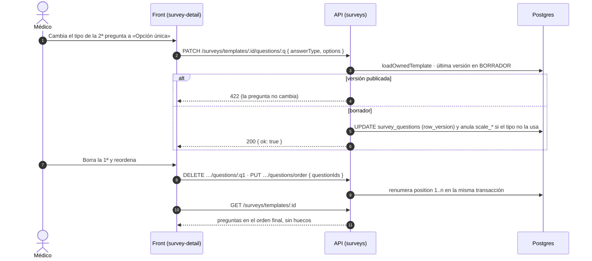

# TASK PROMPT: BR-19 — Editor de encuestas en la API

> **MODO DE EJECUCIÓN:** este prompt se ejecuta en **Modo Planificación (Planning Mode)**.
> El desarrollador o el agente arranca investigando, sin tocar código fuente. Con eso escribe un
> `implementation_plan.md` detallado y espera la aprobación explícita del usuario. Después
> ejecuta los cambios en commits atómicos, verifica con pruebas unitarias y de integración, y
> **contra la API viva**. El resultado queda documentado en `walkthrough.md`.

| Campo | Valor |
|---|---|
| **Cierra** | CL-60, CL-70, CL-72, CL-79 (anexo B, parte D) · actualiza el estado de `docs/pendientes-backend-surveys.md` (CL-78) |
| **Severidad máxima** | **Bloqueante demo** (CL-60: el editor no puede editar nada contra la API real) |
| **Repo(s)** | `mantra-core-health-redesa-api` (casi todo) · `mantra-core-health` (selector de servicio, mock, doc) |
| **Toca el modelo** | No. `surveys.survey_questions` ya tiene `position`, `question_text`, `answer_type_concept_id`, `required`, `options jsonb`, `scale_min`, `scale_max` y `row_version` |
| **Depende de** | Nada. Es de la ola 1 |
| **Decisión previa** | Ninguna del README §8. Decisión local menor: si CL-72 (editar título, consigna y plazo) entra o se retira el método muerto (ver §5) |

---

## 1. Contexto de negocio y justificación técnica

### A. Por qué importa
El médico arma encuestas de satisfacción y seguimiento (PREM/PROM) para sus pacientes. Contra la
API real, el editor sólo sabe **agregar** una pregunta al final, y siempre como «Pregunta nueva /
TEXT»: corregir el texto, cambiar el tipo, borrar o reordenar da 404. Una encuesta mal escrita no
se puede arreglar: hay que publicarla así o abandonarla. Y abrir una versión nueva para corregir
una publicada arranca **vacía**, así que «corregir» es reescribir todo. Con el mock funciona
entero, por eso en la maqueta no se nota.

### B. Estado del frontend (`mantra-core-health`, `origin/mockup`)
- **El editor ya está hecho (CL-60):** `features/questionnaires/survey-detail/survey-detail.ts:305`
  crea `{questionText:'Pregunta nueva', answerType:'TEXT'}` y todo lo demás pasa por
  `updateQuestion` (`:322`), `deleteQuestion` (`:344`) y `reorderQuestions` (`:374`).
- **El cliente ya apunta a las rutas:** `core/data-access/surveys/surveys.client.ts:147`
  (`PATCH /surveys/templates/:id`), `:166` (`PATCH …/questions/:questionId`), `:183-187`
  (`DELETE …/questions/:questionId`), `:203-211` (`PUT …/questions/order` con `{ questionIds }`).
  **No hay que tocar el cliente**: `docs/pendientes-backend-surveys.md` fija el contrato.
- **Contrato del doc** (`docs/pendientes-backend-surveys.md`): todas las rutas operan **sólo sobre
  el borrador** y responden **422** sobre una versión publicada; `options` y escala se reemplazan
  enteras; al cambiar de tipo se descarta lo que el tipo nuevo no usa; `DELETE` renumera; el orden
  se manda **entero** y una lista incompleta manda las no nombradas al final en su orden previo;
  todas responden `200 { ok: true }`.
- **Versión nueva (CL-70):** `survey-detail.ts:444-451` («abre una versión nueva en borrador, para
  corregir el cuestionario»); el mock (`core/mock/handlers/surveys-forms.handlers.ts:185-191`) sólo
  mueve `latestVersionId` y **deja las preguntas**: en el simulador la v2 aparece con todo.
- **Editar la encuesta (CL-72):** `surveys.client.ts:146-148` (`updateSurvey`): **ninguna pantalla
  lo llama** (grep en `features/`).
- **Asignación con UUID (CL-79):** `survey-detail.ts:414-427` manda `targetType:'SERVICE'` y
  `targetId` de un input de texto (`formularioAsignacion.targetId`, `:232`). `SurveyTargetType`
  (`surveys.types.ts:24`) incluye `CARE_TYPE`, que la API rechaza.
- **Deriva del mock (CL-71, lo cierra BR-02):** `appointmentBookingIds[]` vs
  `appointmentBookingId`, ruta muerta `POST /surveys/templates/:id/publish`. Acá sólo se toca el
  mock en lo que cambian estas rutas.

### C. Estado de la API (`mantra-core-health-redesa-api`, `origin/dev` @ `7541797c`)
- `src/modules/surveys/controllers/surveys-templates.controller.ts` (`@Roles('PRACTITIONER',
  'CLINICIAN')` de clase, `:36`) declara sólo `POST /` (`:51`), `GET /` (`:62`), `GET /:id`
  (`:71`), `POST /:id/questions` (`:81`), `POST /:id/versions` (`:93`),
  `POST /:id/versions/:versionNumber/publish` (`:104`), `POST /:id/deactivate` (`:117`),
  `GET /:id/responses` (`:135`). **No hay PATCH, DELETE ni PUT.**
- `services/surveys-templates.service.ts`:
  - `addQuestion` (`:175-225`) ya tiene todo lo reutilizable: `validateQuestionShape`,
    `loadOwnedTemplate` (dueño de la plantilla, `:404`), `findLatestVersion` y la guarda de
    borrador que lanza `PreconditionFailedException` (**422**) si la versión está publicada
    (`:194`).
  - `createNextVersion` (`:127-171`) crea la versión con `responseWindowDays` y **ninguna
    pregunta** (CL-70).
- Entidades: `survey_questions.entity.ts:100` mapea `row_version` con `version: true`
  (concurrencia optimista lista).
- `dto/create-assignment.dto.ts:20-41`: `targetType` `@IsIn(TARGET_TYPE_CODES)` y `targetId`
  `@IsUUID()`; el spec `surveys-assignments.service.spec.ts:164-177` confirma que `CARE_TYPE` se
  rechaza.
- Catálogo de servicios para el selector: `GET /billing/service-catalog`
  (`billing/controllers/billing-service-catalog.controller.ts:72`).
- Validación global `whitelist + forbidNonWhitelisted + transform`.

**Modelo** (`mantra-core-health-model`, `diagram_65_surveys.puml`):
- `survey_questions`: `survey_version_id`, `position` (NOT NULL), `question_text`,
  `answer_type_concept_id`, `required`, `options jsonb`, `scale_min`, `scale_max`, `row_version`.
- `survey_versions`: `version_number`, `publication_status_concept_id`, `response_window_days`
  (por versión), `effective_from/to`, `published_at`.
- Una versión publicada es **inmutable** para que una respuesta dada hace meses se siga pudiendo
  interpretar. Eso es la garantía del módulo, no una restricción a levantar.

### D. Aislamiento
- No cambia la respuesta del paciente (`surveys/me/invitations`) ni la emisión de invitaciones.
- No cambia pantallas salvo el selector de servicio y, si entra CL-72, un formulario de datos
  generales del borrador.

---

## 2. Flujo de Git y entrega

```bash
# API
cd mantra-core-health-redesa-api && git status && git fetch origin
git checkout -b <dev>/feat-editor-encuestas origin/dev

# Front
cd mantra-core-health && git status && git fetch origin
git checkout -b <dev>/fix-encuestas-selector-y-mock origin/mockup
```

- Commits sugeridos:
  - API: `feat(surveys): PATCH de pregunta sobre el borrador` ·
    `feat(surveys): DELETE de pregunta con renumeración` ·
    `feat(surveys): reordenar el cuestionario entero` ·
    `feat(surveys): la versión nueva copia las preguntas de la anterior` ·
    `feat(surveys): PATCH de título, consigna y plazo del borrador` (si entra CL-72) ·
    `test(surveys): int-spec del editor`
  - Front: `feat(encuestas): asignar eligiendo el servicio del catálogo` ·
    `fix(encuestas): sin CARE_TYPE en el tipo` · `fix(mock): versión nueva y edición como la API` ·
    `docs(encuestas): pendientes-backend-surveys cerrado`
- PR de la API: `gh pr create --base dev --reviewer jsaldias39,PabloArauzCaballero`.
- PR del front: `gh pr create --base mockup --reviewer jsaldias39,PabloArauzCaballero`.
- **El flujo termina en abrir los PR.**

---

## 3. Diagrama



---

## 4. Archivos a modificar o crear

**API**
- `[MODIFICAR]` `src/modules/surveys/controllers/surveys-templates.controller.ts`:
  - `@Patch(':id/questions/:questionId')`
  - `@Delete(':id/questions/:questionId')`
  - `@Put(':id/questions/order')` — **declarada antes** de cualquier ruta con `:questionId` que
    pudiera capturar `order`
  - `@Patch(':id')` (si entra CL-72)
  - Todas `@HttpCode(200)` y respuesta `{ ok: true }` (el contrato del doc).
- `[MODIFICAR]` `src/modules/surveys/services/surveys-templates.service.ts`: `updateQuestion`,
  `deleteQuestion`, `reorderQuestions`, `updateTemplate`; extraer la guarda de borrador de
  `addQuestion` a un método privado y reusarla (nada de copiarla cuatro veces).
- `[MODIFICAR]` `createNextVersion`: copiar `survey_questions` de la versión anterior a la nueva en
  la misma transacción (ids nuevos, mismas posiciones); la anterior queda intacta.
- `[CREAR]` `dto/update-question.dto.ts` (todo opcional, mismas validaciones que
  `AddQuestionDto`), `dto/reorder-questions.dto.ts` (`questionIds: uuid[]`, sin duplicados),
  `dto/update-template.dto.ts` (`title?`, `description?`, `responseWindowDays?`); exportarlos en
  `dto/index.ts`.
- `[MODIFICAR]` repositorio de surveys (`repositories/*`): renumeración y copia de preguntas.
- `[CREAR/MODIFICAR]` `surveys-templates.service.spec.ts`, `surveys-templates.controller.spec.ts`,
  `surveys.module.spec.ts` (exige el controlador con las rutas nuevas) y un int-spec
  `test/integration/surveys-editor.int-spec.ts`.

**Front**
- `[MODIFICAR]` `features/questionnaires/survey-detail/survey-detail.ts/html`: el `targetId` sale
  de un selector alimentado por `GET /billing/service-catalog` (nombre legible, no UUID).
- `[MODIFICAR]` `core/data-access/surveys/surveys.types.ts:24`: `SurveyTargetType` sin
  `CARE_TYPE`.
- `[MODIFICAR]` si CL-72 entra: formulario «Datos de la encuesta» en el borrador que usa
  `updateSurvey`; si no entra: **borrar** `updateSurvey` del cliente (método muerto).
- `[MODIFICAR]` `core/mock/handlers/surveys-forms.handlers.ts`: la versión nueva se comporta igual
  que la API (copia, borrador); PATCH/DELETE/orden sobre publicada → 422.
- `[MODIFICAR]` `docs/pendientes-backend-surveys.md`: marcar cada ruta como implementada, con el
  PR de la API, o borrar el doc si queda todo cerrado (dejar el enlace en el PR).

---

## 5. Reglas de implementación

- **Decisión local, paso 1 del plan:** ¿entra CL-72 (editar título, consigna y plazo)?
  - (a) Entra. Pro: cierra el contrato del doc entero; el cliente ya existe. Contra: una pantalla
    más; hay que dejar claro que el plazo es **de la versión en borrador**.
  - (b) No entra. Pro: menos alcance. Contra: hay que borrar `updateSurvey` y la sección del doc.
- **Sólo el borrador se edita.** Toda escritura sobre una versión publicada responde **422**
  (`PreconditionFailedException`), igual que `addQuestion`. La versión publicada es inmutable.
- **`answer_type` cambia → se descarta lo que no usa** (`options` o `scale_min/max`) en el mismo
  UPDATE; el `GET` nunca devuelve restos.
- **`options` y escala se reemplazan enteras**, nunca por índice.
- **Renumerar en la misma transacción** que el DELETE o el reorden: `position` queda 1..n sin
  huecos. Un orden parcial manda las no nombradas al final en su orden previo; un id que no es de
  la versión → 422.
- **Un caso de uso = una transacción.** Copiar preguntas al abrir una versión nueva va dentro de
  `createNextVersion`.
- `row_version` → `@Version()` (ya mapeado). El contrato del doc **no** lleva versión esperada,
  así que entre dos requests HTTP gana la última escritura; el `@Version()` sólo protege la
  carrera dentro del flush. Si el plan quiere 409 entre pestañas, agrega `expectedRowVersion`
  **opcional** al DTO (el cliente actual no lo manda y sigue funcionando) y lo documenta.
- **Autorización:** `loadOwnedTemplate` en todas; un médico no edita la encuesta de otro (403/404
  sin filtrar existencia).
- `forbidNonWhitelisted`: el cuerpo del front ya coincide con el doc; no agregues claves sin DTO.
- Las respuestas ya dadas no se tocan: borrar una pregunta del **borrador** no afecta respuestas,
  porque sólo existen sobre versiones publicadas.
- Rutas nuevas: `node dist/src/main.js` + grep de `Mapped {/surveys/templates/:id/questions/:questionId, PATCH}`
  (y las otras) + `surveys.module.spec.ts`.

---

## 6. Criterios de aceptación (Gherkin)

```gherkin
Escenario: Editar una pregunta del borrador
  Dado una encuesta en borrador con una pregunta «Pregunta nueva» de tipo TEXT
  Cuando el médico cambia el texto y el tipo a SINGLE_CHOICE con tres opciones
  Entonces PATCH …/questions/:id responde 200
  Y al recargar la pregunta tiene el texto, el tipo y las tres opciones en ese orden

Escenario: Cambiar el tipo descarta lo que no se usa
  Dado una pregunta SINGLE_CHOICE con opciones
  Cuando la paso a TEXT
  Entonces el GET la devuelve sin options

Escenario: Borrar renumera
  Dado una encuesta en borrador con 4 preguntas
  Cuando hago DELETE …/questions/{2ª}
  Entonces recibo 200 y el GET devuelve 3 preguntas con position 1, 2, 3

Escenario: Reordenar con lista parcial
  Dado 4 preguntas A, B, C, D
  Cuando mando PUT …/questions/order con [C, A]
  Entonces el orden queda C, A, B, D

Escenario: Versión publicada inmutable
  Dado una versión publicada
  Cuando hago PATCH …/questions/:id
  Entonces recibo 422 y la pregunta no cambia

Escenario: Versión nueva con el cuestionario copiado
  Dado una versión 1 publicada con 5 preguntas
  Cuando creo la versión 2
  Entonces el GET devuelve la v2 en borrador con las 5 preguntas copiadas
  Y la v1 sigue intacta con sus respuestas

Escenario: Encuesta de otro médico
  Dado una encuesta del médico A
  Cuando el médico B hace PATCH sobre una de sus preguntas
  Entonces recibe 403 o 404 y la pregunta no cambia

Escenario: Asignar sin tipear identificadores
  Dado una encuesta publicada
  Cuando el médico la asocia a un servicio
  Entonces elige el servicio de una lista por nombre
  Y POST /surveys/assignments responde 201
```

---

## 7. Definition of Done

- [ ] `implementation_plan.md` aprobado, con la decisión sobre CL-72 escrita.
- [ ] API: las 3 (o 4) rutas nuevas, la copia de preguntas en `createNextVersion` y los DTO.
      `corepack yarn lint`, `corepack yarn typecheck`, `corepack yarn test` en verde.
- [ ] `corepack yarn test:integration --testPathPatterns=surveys-editor` en verde contra
      Postgres (pegá la salida: el CI sólo corre `postgres-privileges`).
- [ ] Log de `node dist/src/main.js` con `Mapped {/surveys/templates/:id/questions/:questionId, PATCH}`,
      `DELETE`, `Mapped {/surveys/templates/:id/questions/order, PUT}` (y `PATCH /:id` si entra),
      y `surveys.module.spec.ts` que las exige.
- [ ] Front: selector de servicio, tipo sin `CARE_TYPE`, mock alineado, doc actualizado.
      `corepack yarn lint`, `corepack yarn typecheck`, `corepack yarn test --watch=false` y los
      `check-*.mjs` en verde.
- [ ] **Evidencia de runtime contra la API viva** (`UI → request → response → persistencia →
      recarga → UI`), pegada en el PR: editar, cambiar tipo, borrar y reordenar en el editor;
      `SELECT position, question_text, options FROM surveys.survey_questions WHERE
      survey_version_id = … ORDER BY position`; recarga que muestra lo mismo; un 422 sobre la
      versión publicada; la v2 con las preguntas copiadas.
- [ ] PR abiertos con revisores `jsaldias39` y `PabloArauzCaballero`, y `walkthrough.md`.

---

## 8. Plan de QA

### A. Pruebas automatizadas
```bash
# API
corepack yarn test src/modules/surveys
corepack yarn test:integration --testPathPatterns=surveys-editor
# Front
corepack yarn test --watch=false --include=src/app/features/questionnaires/**
corepack yarn test --watch=false --include=src/app/core/mock/handlers/surveys-forms.handlers.spec.ts
node scripts/check-api-contract-drift.mjs
```
- Spec del servicio: la guarda de borrador se aplica a las cuatro escrituras; `DELETE` renumera;
  el reorden parcial conserva las no nombradas; `createNextVersion` copia.
- Spec del mock: las mismas reglas (422 sobre publicada, copia en versión nueva).

### B. Integración (API viva)
1. Stack con seeds; API con `corepack yarn build && node dist/src/main.js`.
2. Front en `real-api` con un médico sembrado: crear encuesta → agregar 4 preguntas → editar,
   cambiar tipo, borrar, reordenar → recargar.
3. Publicar la v1, intentar editar (422), abrir la v2 y verificar la copia.
4. Asignar la encuesta a un servicio del catálogo.

### C. Verificación manual y logs
- Log de la API: ningún 404 en `/surveys/templates/*`; ningún 400 por clave extra.
- Consola del navegador: ningún toast de error al editar.
- Si el plan agregó `expectedRowVersion`: con dos pestañas, editar la misma pregunta; la segunda
  recibe 409.
