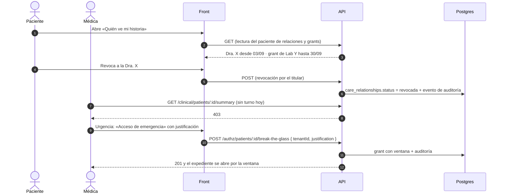

# TASK PROMPT: BR-20 — Consentimiento (M07) y accesos a la historia vistos por el paciente

> **MODO DE EJECUCIÓN:** este prompt se ejecuta en **Modo Planificación (Planning Mode)**.
> El desarrollador o el agente arranca investigando, sin tocar código fuente. Con eso escribe un
> `implementation_plan.md` detallado y espera la aprobación explícita del usuario. Después
> ejecuta los cambios en commits atómicos, verifica con pruebas unitarias y de integración, y
> **contra la API viva**. El resultado queda documentado en `walkthrough.md`.

| Campo | Valor |
|---|---|
| **Cierra** | CL-77, CL-78 (parte consent) (anexo B, parte D) · CV-07, CV-19 (anexo E) |
| **Severidad máxima** | Alta (CL-77 es un tema legal: el consentimiento informado no queda donde el modelo lo espera) |
| **Repo(s)** | `mantra-core-health-redesa-api` (lecturas y roles de `consent` y `authz`) · `mantra-core-health` (cliente, «Mi privacidad», «Quién ve mi historia», acceso de emergencia) |
| **Toca el modelo** | No. `consent.*` y `authz.*` ya declaran todo lo que se usa |
| **Depende de** | **BR-06** para los roles (`CLINICAL_APPROVER` está sembrado en `authz.seed.ts:92`, pero ningún médico autorregistrado lo recibe). **BR-18** si el consentimiento informado deja de ser un formulario de `forms` |
| **Decisión previa** | Ninguna del README §8. Hay dos decisiones locales que el plan pide primero (ver §5): fuente de verdad del consentimiento informado y mecanismo canónico de solicitud de acceso |

---

## 1. Contexto de negocio y justificación técnica

### A. Por qué importa
«El paciente, dueño de su historia» incluye **decidir quién la ve**. Hoy el paciente no tiene
ninguna pantalla para ver sus consentimientos, retirarlos, ni saber qué profesionales acceden a su
historia; tampoco puede revocar un acceso. El médico no tiene un acceso de emergencia auditado y
el consentimiento informado de un tratamiento se guarda como un formulario más, sin firma ni
vínculo al procedimiento, mientras la tabla legal (`consent.treatment_informed_consents`) queda
vacía. Es condición legal para compartir historia (el marco normativo exacto está **sin
confirmar**; no se cita ninguna norma en la UI sin validación legal).

### B. Estado del frontend (`mantra-core-health`, `origin/mockup`)
- **No hay cliente de `consent`:** no existe `core/data-access/consent/`. La única llamada de
  consentimiento es `POST /geo/tracked-subjects/:id/revoke-consent` (`geo.client.ts`, geolocalización).
- **Consentimiento informado como formulario (CL-77):** plantilla transversal de `forms`
  (`features/clinical-record/patient-chart/specialty-form-block/specialty-form-block.ts:170-180`;
  seed de la API `src/common/seed/data/clinical-forms/transversal/consentimiento-informado.json`).
- **Vínculo médico–paciente por `authz`, no por `consent` (CV-07):** `core/data-access/authz/authz.client.ts:35-92`
  usa `GET /authz/care-relationships`, `POST …/request`, `GET …/requests/mine` y
  `POST …/:id/respond`; la pantalla del médico es `features/clinical-record/request-access/` y la
  bandeja del paciente `features/account/access-requests/`. `consent/practitioner-access-requests`
  queda **huérfano**.
- **Accesos (CV-19):** sólo maquetas estáticas en `features/alovida/accesos/`
  (`accesos-clinicos-del-paciente-listado`, `accesos-clinicos-revocar`,
  `acceso-de-emergencia-formulario`, …), sin guard ni datos. Las maquetas HTML de la bóveda para
  este dominio están en `SALUD/Vistas/HTML/V06-authz/` (`clinician/`, `clinical-approver/`,
  `security-admin/`): **son la fuente del diseño**.
- **Sin sección de privacidad** en `my-account/*` (`core/navigation/navigation.map.ts:1109-1376`).
- Especificación de vistas M07: `SALUD/Vistas/V07 consent — Vistas.md` (9 vistas, «0 con listado
  real, 9 pendientes de GET de listado»). No hay maqueta HTML de V07.

### C. Estado de la API (`mantra-core-health-redesa-api`, `origin/dev` @ `7541797c`)
- **`consent` (15 rutas, ninguna con pantalla):**
  - `consents.controller.ts`: `POST /consent/consents` (`:38`), `POST …/:id/withdraw` (`:52`),
    `PATCH …/:id/provisions` (`:68`), **todas `SECURITY_ADMIN`**.
  - `hipaa-authorizations`, `patient-objections`, `privacy-restrictions`,
    `processing-legal-bases`, `consent-evidence`: escrituras `SECURITY_ADMIN`.
  - `treatment-informed-consents.controller.ts:25-26`: `POST` sólo `SECURITY_ADMIN` → **un médico
    no puede registrar el consentimiento de tratamiento** donde el modelo lo espera.
  - `practitioner-access-requests.controller.ts`: `POST` (`PRACTITIONER`/`CLINICIAN`, `:31-32`),
    `GET mine` (`PATIENT`, `:46-47`), `POST :id/decision` (`PATIENT`, `:58-59`).
  - **El anexo dice «cero GET»: no es exacto.** Hay un único `GET` (`practitioner-access-requests/mine`);
    no hay ninguna lectura de consentimientos, autorizaciones ni objeciones.
- **DTO:** `CreateConsentDto` pide `patientProfileId`, `processingPurposeId` y opcionales
  (`processingLegalBasisId`, `categoryConceptId`, `provisions[]`, `validFrom/To`…);
  `CreateTreatmentInformedConsentDto` pide `patientProfileId`, `encounterId`, `decision` y
  opcionales (`procedureCodeConceptId`, `informationVersion`, `interpreterUserId`,
  `witnessUserId`). Si hay propósitos de tratamiento sembrados para `processingPurposeId`: **sin
  confirmar**.
- **`authz`:**
  - `authz-care-relationships.controller.ts`: `GET /authz/care-relationships` (`:91`) y
    `POST …/:id/revoke` (`:73`) exigen `CLINICIAN`/`SECURITY_ADMIN`. **El paciente no puede
    listar ni revocar sus relaciones asistenciales.**
  - `authz-clinical.controller.ts`: clase `@Roles('CLINICAL_APPROVER','SECURITY_ADMIN')` (`:24`);
    `POST /authz/patients/:id/clinical-access-grants` (`:35`), `POST …/break-the-glass` (`:51`,
    `BreakTheGlassDto`: `tenantId`, `justification`, `windowMinutes?`, `encounterId?`),
    `DELETE /authz/clinical-access-grants/:grantId` sólo `SECURITY_ADMIN` (`:63-64`). No hay
    lectura de grants por paciente.
- Validación global `whitelist + forbidNonWhitelisted + transform`.

**Modelo** (`mantra-core-health-model`):
- `diagram_07_consent.puml`: `consents <<FHIR_CONSENT_DIRECTIVE>>` (`patient_profile_id`,
  `processing_purpose_id`, `status_concept_id`, `valid_from/to`…), `treatment_informed_consents
  <<VERSIONED>>` (`patient_profile_id`, `tenant_id`, `encounter_id`, `decision_concept_id`,
  `signed_at`, `withdrawn_at`…). La evidencia es append-only (UC-07-10). UC-07-06: versionar =
  cerrar la vigente (`valid_to=now`, `superseded`) antes de insertar la nueva.
- `diagram_06_authz.puml`: `care_relationships`, grants clínicos con propósito y ventana.

### D. Aislamiento
- No cambia cómo el médico pide acceso hoy (`authz/care-relationships/request`) salvo que la
  decisión de §5 lo cambie.
- No migra los consentimientos ya capturados como formulario: **valores ya capturados no se
  reescriben**. Si se cambia la fuente, los nuevos van a `consent` y los viejos se leen como están.
- DSAR y exportación (`/privacy/dsar`, `$everything`) son de BR-15.

---

## 2. Flujo de Git y entrega

```bash
# API
cd mantra-core-health-redesa-api && git status && git fetch origin
git checkout -b <dev>/feat-consent-lecturas-y-accesos-del-paciente origin/dev

# Front
cd mantra-core-health && git status && git fetch origin
git checkout -b <dev>/feat-mi-privacidad-y-quien-ve-mi-historia origin/mockup
```

- Commits sugeridos:
  - API: `feat(consent): lecturas del paciente (consentimientos, autorizaciones, objeciones)` ·
    `feat(consent): el paciente retira su consentimiento` ·
    `feat(consent): el médico registra el consentimiento informado del encuentro` ·
    `feat(authz): el paciente lista y revoca sus relaciones asistenciales y accesos` ·
    `feat(authz): acceso de emergencia para el médico tratante (rol de BR-06)`
  - Front: `feat(consent): cliente de consent` · `feat(cuenta): Mi privacidad` ·
    `feat(cuenta): Quién ve mi historia` · `feat(consulta): consentimiento informado a consent` ·
    `feat(expediente): acceso de emergencia auditado` · `fix(mock): consent y accesos como la API`
- PR de la API: `gh pr create --base dev --reviewer jsaldias39,PabloArauzCaballero`.
- PR del front: `gh pr create --base mockup --reviewer jsaldias39,PabloArauzCaballero`.
- **El flujo termina en abrir los PR.**

---

## 3. Diagrama



---

## 4. Archivos a modificar o crear

**API**
- `[CREAR]` controlador `me` de consent (p. ej. `consent/controllers/consent-me.controller.ts`,
  `@Roles('PATIENT')`): `GET /consent/me/consents`, `GET /consent/me/hipaa-authorizations`,
  `GET /consent/me/objections` (vigentes y retirados), y
  `POST /consent/me/consents/:id/withdraw` (dueño = titular por `person_account_links`, igual que
  `diagnostic-results/me`).
- `[MODIFICAR]` `treatment-informed-consents.controller.ts`: sumar `CLINICIAN`/`PRACTITIONER`
  con verificación de acceso al paciente (`assertPuedeEscribirHistoria` o el guard clínico); y
  `GET` por encuentro y por paciente.
- `[MODIFICAR]` `authz-care-relationships.controller.ts` (o un `authz-me.controller.ts`):
  lectura del paciente de sus relaciones (con nombre del profesional y vigencia) y revocación por
  el titular.
- `[MODIFICAR]` `authz-clinical.controller.ts`: lectura de grants por paciente para el titular;
  revocación de un grant por el titular (hoy sólo `SECURITY_ADMIN`). Break-the-glass: el rol que
  lo usa lo define BR-06 (hoy `CLINICAL_APPROVER`, sembrado pero no asignado).
- `[CREAR/MODIFICAR]` DTO de respuesta de las lecturas, specs de servicio y controlador,
  `consent.module.spec.ts` / `authz.module.spec.ts` que exijan los controladores, e int-spec
  `test/integration/patient-access-revocation.int-spec.ts`.

**Front**
- `[CREAR]` `core/data-access/consent/consent.client.ts` + `consent.types.ts` (con `ng generate`).
- `[CREAR]` `features/account/privacy/` («Mi privacidad»): consentimientos vigentes y retirados,
  retirar, autorizaciones de divulgación, objeciones. Layout desde `V07 consent — Vistas.md`;
  **una tarjeta con pestañas, centrada y a lo ancho** (`docs/components/composition-rules.md` §5).
- `[CREAR]` `features/account/clinical-access/` («Quién ve mi historia»): relaciones y grants,
  revocar con confirmación. Layout desde `SALUD/Vistas/HTML/V06-authz/`.
- `[MODIFICAR]` consulta: el consentimiento informado genera el registro en `consent` (según §5).
- `[MODIFICAR]` expediente: acción «Acceso de emergencia» (justificación obligatoria, ventana
  visible) cuando la lectura da 403.
- `[MODIFICAR]` `core/navigation/navigation.map.ts` y `app.routes.ts`: las dos secciones nuevas
  para `PATIENT`.
- `[MODIFICAR]` mock (`core/mock/handlers/*`): lecturas y escrituras con las mismas reglas de rol
  y la misma forma que la API.
- `[DECIDIR]` las maquetas de `features/alovida/accesos/`: si la pantalla real las reemplaza, se
  retiran del menú.

---

## 5. Reglas de implementación

- **Paso 1 del plan: dos decisiones locales, con opciones.**
  1. **Fuente de verdad del consentimiento informado.**
     - (a) `consent.treatment_informed_consents` (el formulario transversal pasa a generar ese
       registro, en la misma transacción que la captura). Pro: es lo que el modelo declara, con
       `encounter_id`, `decision`, testigo e intérprete. Contra: toca BR-18 (captura atómica).
     - (b) Seguir en `forms` y leerlo desde ahí. Pro: sin trabajo nuevo. Contra: sin firma ni
       vínculo al procedimiento; la tabla legal queda vacía. No recomendada.
  2. **Mecanismo canónico de solicitud de acceso.**
     - (a) `authz/care-relationships/request` (el que el front ya usa). Retirar o documentar
       `consent/practitioner-access-requests` como no usado. Pro: ya funciona de punta a punta.
     - (b) `consent/practitioner-access-requests`. Contra: rehacer pantallas que andan.
- **Registros inmutables:** la evidencia de consentimiento es append-only; retirar un
  consentimiento es cambiar su estado y cerrar vigencia (UC-07-02/06), nunca borrar la fila.
  Versionar = cerrar la vigente e insertar la nueva, en la misma transacción.
- **Un caso de uso = una transacción**, incluida la re-evaluación de accesos al retirar
  (UC-07-02) si el servicio ya la dispara; si no la dispara, se anota y no se inventa.
- **Aislamiento por titular:** las lecturas `me` resuelven la persona por la cuenta
  (`person_account_links`), nunca por un id del body. Otro paciente → 404.
- **Break-the-glass:** justificación obligatoria, ventana acotada, auditado; nunca un atajo sin
  registro. La UI no «oculta» el 403: ofrece la acción de emergencia sólo a quien tiene el rol.
- **La autoridad es la API:** ocultar un botón no es seguridad; cada ruta nueva tiene su `@Roles`
  y su verificación de titularidad.
- `forbidNonWhitelisted` (campo extra = 400) y `PreconditionFailedException` = 422.
- Conceptos por `*_concept_id`; nada de enums nuevos en TypeScript. Los códigos de `decision` y
  de estado salen de los conceptos que la API ya usa.
- Rutas nuevas: `node dist/src/main.js` + grep de `Mapped {<ruta>` + `*.module.spec.ts`.

---

## 6. Criterios de aceptación (Gherkin)

```gherkin
Escenario: El paciente ve sus consentimientos
  Dado un paciente con un consentimiento vigente y uno retirado
  Cuando abre «Mi privacidad»
  Entonces ve los dos, cada uno con su estado y su propósito

Escenario: Retirar un consentimiento
  Dado un paciente con un consentimiento activo para un propósito
  Cuando lo retira desde «Mi privacidad»
  Entonces la API responde 2xx
  Y al recargar el consentimiento figura como retirado
  Y la fila original no se borró (valid_to cerrado, estado retirado)

Escenario: Consentimientos ajenos
  Dado el paciente B
  Cuando pide los consentimientos por la lectura del paciente
  Entonces nunca recibe los del paciente A

Escenario: Consentimiento informado en la consulta
  Dado una médica en un encuentro con acceso a la ficha
  Cuando registra el consentimiento informado del tratamiento
  Entonces queda una fila en consent.treatment_informed_consents ligada al paciente y al encuentro
  Y el paciente la ve en «Mi privacidad»

Escenario: Quién ve mi historia
  Dado un paciente con una médica vinculada
  Cuando abre «Quién ve mi historia»
  Entonces ve a la médica por nombre, desde cuándo y con qué alcance

Escenario: Revocar un vínculo
  Dado un paciente con una médica vinculada
  Cuando revoca el vínculo
  Entonces la médica recibe 403 al abrir /medical-records/:profileId sin turno de hoy

Escenario: Acceso de emergencia
  Dado un médico con el rol de emergencia y sin vínculo con el paciente
  Cuando pide acceso de emergencia con una justificación
  Entonces la API responde 201, el expediente se abre durante la ventana
  Y el acceso queda auditado y el paciente lo ve en «Quién ve mi historia»

Escenario: Emergencia sin justificación
  Dado el mismo médico
  Cuando pide acceso de emergencia sin justificación
  Entonces la API responde 400 y no se crea ningún grant
```

---

## 7. Definition of Done

- [ ] `implementation_plan.md` aprobado, con las dos decisiones de §5 escritas y el rol de
      emergencia acordado con BR-06.
- [ ] API: lecturas y retiro del paciente en `consent`; consentimiento informado por el médico;
      lectura y revocación de accesos por el titular. `corepack yarn lint`,
      `corepack yarn typecheck`, `corepack yarn test` en verde.
- [ ] `corepack yarn test:integration --testPathPatterns=patient-access-revocation` en verde
      (pegá la salida: el CI no lo corre).
- [ ] Rutas nuevas en el log de `node dist/src/main.js` y exigidas por los `*.module.spec.ts`.
- [ ] Front: cliente, «Mi privacidad», «Quién ve mi historia», consentimiento en la consulta y
      emergencia; estados M34 completos (vacío, sin permiso, error con ID de petición).
      `corepack yarn lint`, `corepack yarn typecheck`, `corepack yarn test --watch=false` y los
      `check-*.mjs` en verde.
- [ ] **Evidencia de runtime contra la API viva** (`UI → request → response → persistencia →
      recarga → UI`), pegada en el PR: retirar un consentimiento y el `SELECT` de su fila;
      revocar un vínculo y el 403 posterior de la médica; un break-the-glass con su registro de
      auditoría; capturas de navegador de las dos secciones.
- [ ] PR abiertos con revisores `jsaldias39` y `PabloArauzCaballero`, y `walkthrough.md`.

---

## 8. Plan de QA

### A. Pruebas automatizadas
```bash
# API
corepack yarn test src/modules/consent src/modules/authz
corepack yarn test:integration --testPathPatterns=patient-access-revocation
# Front
corepack yarn test --watch=false --include=src/app/core/data-access/consent/**
corepack yarn test --watch=false --include=src/app/features/account/**
node scripts/check-client-prefixes.mjs && node scripts/check-route-prefixes.mjs
```
- Spec de titularidad: la lectura `me` nunca devuelve filas de otra persona.
- Spec de retiro: la fila se cierra y no se borra.

### B. Integración (API viva)
1. Stack con seeds; API con `corepack yarn build && node dist/src/main.js`.
2. Paciente: «Mi privacidad» → retirar; «Quién ve mi historia» → revocar a la médica.
3. Médica: abrir el expediente (403), pedir emergencia con justificación (201), abrir dentro de
   la ventana, esperar el vencimiento (o una ventana corta) y comprobar el 403.
4. Consulta: registrar el consentimiento informado y releerlo como paciente.

### C. Verificación manual y logs
- Log de auditoría de la API con el break-the-glass y la revocación.
- Consola del navegador: ninguna llamada a rutas del mock que la API no tenga.
- `SELECT` de `consent.consents`, `consent.treatment_informed_consents` y `authz.care_relationships`
  antes y después.
