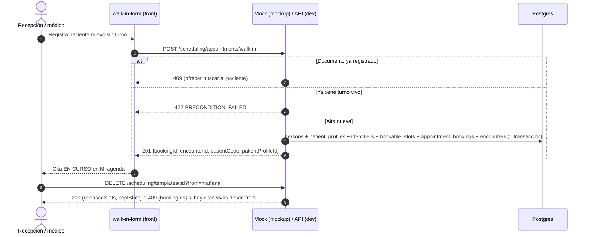

# TASK PROMPT: BR-21 — Agenda: horario flexible, retiro con citas vivas, walk-in, cupos y reprogramación del paciente

> **MODO DE EJECUCIÓN:** este prompt se ejecuta en **Modo Planificación (Planning Mode)**.
> El desarrollador o el agente arranca investigando, sin tocar código fuente. Con eso escribe un
> `implementation_plan.md` detallado y espera la aprobación explícita del usuario. Después
> ejecuta los cambios en commits atómicos, verifica con pruebas unitarias y de integración, y
> **contra la API viva levantada**. El resultado queda documentado en `walkthrough.md`.

| Campo | Valor |
|---|---|
| **Cierra** | AG-01, AG-04, AG-05, AG-08, AG-09, AG-10, AG-11, AG-12 (anexo C) · CV-18 (anexo E) |
| **Severidad máxima** | Bloqueante demo (AG-04, **en `mockup`**). AG-01 pasa a bloqueante si la demo contra la API usa «Horario flexible: Sí» |
| **Repo(s)** | `mantra-core-health` (front y mock) · `mantra-core-health-redesa-api` (API) · `mantra-core-health-model` (sólo si D-A agrega columna) |
| **Toca el modelo** | **Sí, condicionado a D-A** (P36: modo de la plantilla en `scheduling.schedule_templates`, módulo 41). AG-05 y AG-08 no tocan el modelo |
| **Depende de** | Nada para empezar el frente del mock (AG-04). Blandas: BR-02 (el mock responde errores con la forma de la API: 422 y `details.violations`), BR-06 (roles de agenda) |
| **Decisión previa** | **D-A** (horario flexible: bloque con capacidad o pedido de hora que el médico confirma). **D-G** (mostrador del médico, AG-03) la resuelve **BR-06**: acá sólo se consume |

---

## 1. Contexto de negocio y justificación técnica

### A. Por qué importa
La agenda es el corazón de la demo del consultorio: el médico publica su horario, el paciente
reserva, recepción registra al que llega sin turno y el médico atiende. Hoy ese recorrido
**se ve completo en `mockup` y se corta contra la API real** en cuatro puntos: el alta de
mostrador no crea nada en la maqueta, el horario flexible da 400, un médico en ejercicio no
puede cambiar su horario nunca (siempre tiene citas confirmadas) y el paciente no puede mover
su propio turno aunque la API se lo permite. Además el mock inventa ocho reglas que la API no
tiene, así que la demo sólo recorre el camino feliz.

### B. Estado del frontend (`mantra-core-health`, rama `mockup`)
- **AG-04 (bloqueante en `mockup`):** `features/agenda/walk-in/walk-in-form.ts:293-310` y
  `features/agenda/appointment-new/appointment-new.ts:624` llaman `createWalkInAppointment` →
  `POST /scheduling/appointments/walk-in` (`core/data-access/scheduling/scheduling.client.ts:509`)
  y leen `bookingId`, `encounterId`, `patientCode` y `patientProfileId`
  (`WalkInAppointmentCreated`, `scheduling.types.ts:1003-1016`). **No hay handler `walk-in` en
  `core/mock/handlers/`** (verificado). Cae en `respuestaGenerica`
  (`core/mock/mock-backend.interceptor.ts:297`), que devuelve `{id, ...body, createdAt,
  status:'ACTIVE'}`: sin reserva ni encuentro, el paciente no aparece en Mi agenda.
- **AG-01:** `scheduling.client.ts:302` manda `flexibleHours: true`, armado en
  `features/agenda/agenda-create/agenda-create.ts:1126` (y leído en `:724`). El mock
  (`core/mock/handlers/scheduling.handlers.ts:411,421,495-498`) guarda el flag y genera un solo
  bloque con capacidad `Math.max(1, floor(dur/15))`: una regla que no existe en ningún lado.
  El código ya está también en `origin/dev`.
- **AG-05:** el front llama `retireTemplate(templateId)` (`scheduling.client.ts:347`) **sin
  `from`** antes de publicar. El mock (`scheduling.handlers.ts:445-455`) sólo cuenta citas
  con `r.startAt > ahora()` en `BK-CONFIRMED|BK-CHECKED-IN|BK-IN-PROGRESS`: una cita
  confirmada del pasado que nadie cerró no bloquea en la maqueta y sí en la API.
- **AG-09 (el mock inventa):** no-show con `feeAmount:'50.00'` fijo (`:281`); el hold no
  descuenta `remainingCapacity` (`:177-185`); `channel:'PHONE'` traducido a `CH-TELECONSULTA`
  (`:205`); la cita directa nunca da 422 por «regla madre» (`:357-400`); reprogramar y cancelar
  no exigen motivo ni estado vigente (`:294-316`); `generate-slots` usa `setHours` del navegador
  (`:502`) y no devuelve `omittedByCommitments`; shift/close nunca dan 409 (`:526-557`);
  cancelar no promueve la lista de espera.
- **AG-10:** «Mis turnos» (`features/account/appointments/appointments.ts:1395`) sólo ofrece
  `cancelBooking(…, {cancelledBy:'PATIENT'})`. `rescheduleBooking` sólo lo usa el médico
  (`features/agenda/agenda.ts:1779`). Ojo: `appointments.spec.ts:916-979` ya simula un
  `rescheduleBooking`: revisá qué fija esa prueba antes de escribir la acción.
- **AG-11 / CV-18:** sin cliente para `request-info`, `propose-schedule`, `reminders`,
  `GET /scheduling/resources/:resourceId/waitlist`, `PATCH /scheduling/templates/:id`,
  `/scheduling/confirmation-rules*` ni `GET /scheduling/resources/:id/slots`.
- **AG-12:** `core/data-access/directory/directory.types.ts:107` tipa
  `readonly roleTitle: string`; `sinNulos` en `toPractitionerRequest` borra la clave sin
  cambiar el tipo (sin confirmar en la vista si se pinta «undefined»).

### C. Estado de la API (`mantra-core-health-redesa-api`, rama `dev`)
- **Walk-in existe y está alineado** (P22 cerrado en la API):
  `controllers/scheduling.controller.ts:574` + `dto/scheduling-walk-in.dto.ts`, servicio
  `services/scheduling-walk-in.service.ts` en una transacción. Responde **409** si el documento
  ya existe (`ConflictException`) y **422** si el paciente ya tiene turno
  (`PreconditionFailedException`), según su spec. El mock tiene que imitar eso.
- **AG-01:** `dto/scheduling-catalog.dto.ts:342` (`CreateTemplateDto`) declara sólo `name`,
  `rules`, `slotMinutes`, `bookingPolicyId`, `validFrom`, `validTo`. Con
  `forbidNonWhitelisted`, `flexibleHours` da **400** (P36 dice «lo descartaría»: es falso).
  `scheduling.schedule_templates` no tiene columna de modo (`database/SQL/41_scheduling/
  02_tables.sql:61-79`) y `diagram_41_scheduling.puml` no menciona `flex`.
- **AG-05 (P23):** `retireTemplate` (`services/scheduling-catalog.service.ts:963`) busca
  `findBookingsOfTemplate(tx, templateId, ACTIVE_BOOKING_STATES, …)` (`:994`) y lanza
  `ConflictException` si `citas.live > 0`, **sin filtro de fecha**. El controlador
  (`scheduling.controller.ts:291-305`) no recibe `from`. El repositorio
  (`repositories/scheduling-catalog.repository.ts:740`) filtra sólo por plantilla y estado.
  Contradicción documentada en `PENDIENTES-BACKEND.md:534-590` del front: el retiro **ya
  conserva** los cupos con cita (`keptSlots`) y aun así se niega a correr.
- **AG-08:** `ShiftSlotsDto.slotIds` (`dto/scheduling-catalog.dto.ts:1020`) y
  `CloseSlotsDto.slotIds` (`:1081`) usan `@IsUUID('4', {each:true})`. Los cupos sembrados
  derivan ids uuid5: darían 400 (sin confirmar contra la base viva). El resto de la API usa
  `@IsUUID()` a secas.
- **AG-11:** las rutas existen: `scheduling-bookings.controller.ts:167,190,379` (request-info,
  propose-schedule, reminders); `scheduling.controller.ts:116,265,696` (slots del recurso, PATCH
  templates, waitlist del recurso); `scheduling-confirmation.controller.ts:86,104,121`.
- **AG-10:** `scheduling-bookings.controller.ts:311-315` admite `PATIENT` en reschedule;
  `reasonText` obligatorio (`scheduling-bookings.service.ts:1237`). **AG-12:**
  `profiles/dto/affiliation-request.dto.ts:56-57` (`roleTitle: string | null`, patch v4.2.6).
- **AG-02 / AG-03 (no se cierran acá):** check-in (`scheduling-bookings.controller.ts:345`) y los
  holds (`scheduling.controller.ts:590,607,631`) no admiten `PRACTITIONER`: lo resuelve **BR-06**
  con **D-G**. Acá sólo se adapta el botón del mostrador si D-G elige `appointments/direct`.

### D. Aislamiento
- Fuera de alcance: `PUT|GET /scheduling/bookings/:id/payment-state` (**pasarela de pago**) y el
  `POST …/payment-state` del mock (`scheduling.handlers.ts:269`). Los avisos de agenda en la
  campana y el horario liberado son BR-22 (AG-06, AG-07). Las 56 llamadas de agenda verificadas
  OK del anexo C no cambian.

---

## 2. Flujo de Git y entrega

Tres ramas, una por repo, cada una mergeable sola. El PR del mock (AG-04, AG-09) no espera a
nadie.

```bash
# Front (mock + pantallas)
cd mantra-core-health && git status && git fetch origin
git checkout -b <dev>/fix-agenda-mock-y-mostrador origin/mockup

# API
cd ../mantra-core-health-redesa-api && git status && git fetch origin
git checkout -b <dev>/fix-agenda-retiro-y-cupos origin/dev

# Modelo (sólo si D-A agrega columna)
cd ../mantra-core-health-model && git status && git fetch origin
git checkout -b <dev>/feat-agenda-horario-flexible origin/dev   # el clon local del modelo está en dev
```

- Commits atómicos, por ejemplo: `fix(mock): walk-in crea paciente, cupo, reserva y encuentro`,
  `fix(mock): la agenda simulada aplica las reglas de la API`, `feat(agenda): el paciente
  reprograma su turno`, `fix(scheduling): el retiro sólo frena por citas vivas desde from`,
  `fix(scheduling): slotIds acepta cualquier versión de UUID`, `feat(41): modo de horario (P36)`.
- PRs: front `gh pr create --base mockup --reviewer jsaldias39,PabloArauzCaballero`; API
  `gh pr create --base dev --reviewer jsaldias39,PabloArauzCaballero`; el del modelo lo revisa
  quien mantiene `mantra-core-health-model`. **El merge exige revisión humana.** El flujo
  termina en abrir los PR.

---

## 3. Diagrama



---

## 4. Archivos a modificar o crear

**Front (`mantra-core-health`)**
- `[MODIFICAR]` `src/app/core/mock/handlers/scheduling.handlers.ts`: `[CREAR]`
  `router.post('/scheduling/appointments/walk-in', …)` (persona desde `fixtures/personas`,
  cupo, reserva `BK-IN-PROGRESS` y encuentro; responde `WalkInAppointmentCreated` completo; 409
  si `nationalId` existe; 422 si hay choque). Además, las 8 reglas de AG-09, el retiro con la
  regla que quede en la API (AG-05) y la regla de D-A para `flexibleHours`.
- `[CREAR]` `src/app/core/mock/handlers/scheduling.handlers.spec.ts` (o ampliar el existente):
  un caso por regla de AG-09 y por respuesta del walk-in.
- `[MODIFICAR]` `src/app/core/data-access/scheduling/scheduling.client.ts`:
  `retireTemplate(templateId, from?)` y métodos nuevos `listResourceWaitlist`, `proposeSchedule`,
  `requestInfo` (y `updateTemplate`/`confirmation-rules` si producto los prioriza).
- `[MODIFICAR]` `src/app/features/agenda/agenda-create/agenda-create.ts` y `.html`: «Horario
  flexible: Sí» **no se ofrece** con `environment.mockBackend === false` hasta que P36 exista.
- `[MODIFICAR]` `src/app/features/agenda/my-agenda/my-agenda.ts`: `from` al retirar; bloque
  «Lista de espera» (AG-11) y «Proponer otro horario» en la solicitud (CV-18).
- `[MODIFICAR]` `src/app/features/account/appointments/appointments.ts` y `.html`: «Cambiar
  horario» con `listSlots(onlyAvailable)` + `rescheduleBooking(toSlotId, reasonText)`.
- `[MODIFICAR]` `src/app/core/data-access/directory/directory.types.ts:107` y `directory.client.ts`
  (`toPractitionerRequest`): `roleTitle: string | null`; la bandeja rotula «Sin cargo declarado».
- `[MODIFICAR]` `src/app/features/agenda/booking-new/booking-new.ts` **sólo si D-G** (BR-06)
  elige `appointments/direct` para el mostrador del médico.

**API (`mantra-core-health-redesa-api`)**
- `[MODIFICAR]` `src/modules/scheduling/controllers/scheduling.controller.ts` (DELETE templates):
  `@Query('from')` opcional, fecha ISO.
- `[MODIFICAR]` `services/scheduling-catalog.service.ts` (`retireTemplate`) y
  `repositories/scheduling-catalog.repository.ts` (`findBookingsOfTemplate` con `from`): el 409
  sólo cuenta citas vivas con inicio `>= from` (por omisión, ahora).
- `[MODIFICAR]` `dto/scheduling-catalog.dto.ts:1020,1081`: `@IsUUID(undefined, { each: true })`.
- `[MODIFICAR]` tras D-A: `entities/schedule_templates.entity.ts`, `CreateTemplateDto`,
  `UpdateTemplateDto`, `TemplateDetailDto` y `generateSlots`.
- `[CREAR]` `test/integration/scheduling-retire-template.int-spec.ts` (409 en rango, 200 con cita
  anterior a `from`) y un caso de `close-slots` con id uuid5.

**Modelo (`mantra-core-health-model`, sólo si D-A agrega columna)**
- `[MODIFICAR]` `Mantra Core Health Context/modules/diagram_41_scheduling.puml`: columna del modo
  (si es catálogo, `*_concept_id` + value set; nunca un enum de TS).
- `[REGENERAR]` `salud-db/gen_ddl.py` → `SQL/41_scheduling/` → patch → `corepack yarn db:vendor`
  en la API → `corepack yarn db:vendor:check`. `salud-db/gen_seeds.py` si hay conceptos nuevos.

---

## 5. Reglas de implementación

- **Paso 1 del plan: pedir D-A** con estas opciones y dejar la respuesta escrita:
  - *Opción A — bloque con capacidad (orden de llegada):* una franja = un cupo con
    `capacity_per_slot` > 1. Pro: no necesita flujo nuevo, reusa `bookable_slots` y el hold.
    Contra: el paciente no elige hora; hay que definir la capacidad (el `floor(dur/15)` del
    mock es invento) y el modelo igual necesita saber el modo para no generar turnos fijos.
  - *Opción B — pedido de hora que el médico confirma:* el paciente propone una hora dentro de
    la franja y la reserva nace pendiente. Pro: es lo que pidió el propietario (P36). Contra:
    reusa `requestHold` y `propose-schedule`, pero cambia `generateSlots` y el contrato de
    disponibilidad; más superficie de prueba.
  - *Opción C — posponer:* ocultar «Sí» con `mockBackend=false` y dejar P36 abierto. Pro: cero
    modelo. Contra: la pantalla de `mockup` sigue mostrando algo que la API no hace.
- **P23 (AG-05):** el plan elige entre (1) limitar el 409 a citas vivas posteriores a `from`
  (recomendado: la operación ya conserva los cupos con cita) o (2) un endpoint nuevo
  `POST /scheduling/templates/:id/release-free-slots?from=`. Cualquiera de las dos: el mock
  imita exactamente la misma regla.
- **Nunca editar la base ni `database/SQL` a mano**; no auditar contra el `SQL/` de la raíz
  (AG-14). Un caso de uso = una transacción; `row_version` → `@Version()`; estados por
  `*_concept_id`.
- **Paginación:** si la lista de espera necesita paginar, se pide cursor (M34), no página.
- El control de roles del mock es BR-02/BR-06; acá sólo 409/422 con la forma de la API
  (`PreconditionFailedException` = **422**; campo extra = 400). Estados M34 en cada pantalla.

---

## 6. Criterios de aceptación (Gherkin)

```gherkin
Escenario: Walk-in en la maqueta crea la cita
  Dado el mock activo y la médica en "/schedule/appointment/new"
  Cuando registra por walk-in a un paciente con documento nuevo
  Entonces la respuesta trae bookingId, encounterId y patientCode
  Y la cita aparece EN CURSO en Mi agenda
  Pero si el documento ya existe, el mock y la API responden 409 y la pantalla ofrece buscarlo

Escenario: Cambiar el horario con citas vivas
  Dado un horario con una cita confirmada dentro de 3 meses y otra mañana
  Cuando la médica retira la plantilla con from=pasado mañana
  Entonces recibe 200 con keptSlots mayor o igual a 1 y las dos citas siguen intactas
  Pero con from=hoy recibe 409 con details.bookingIds, en la API y en el mock

Escenario: Cerrar un cupo sembrado
  Dado un cupo sembrado con id uuid5
  Cuando la médica lo cierra con close-slots
  Entonces recibe 200 y no 400

Escenario: Horario flexible sin P36
  Dado que D-A no está implementada en la API y la app corre con mockBackend=false
  Entonces la pregunta "Horario flexible" no se ofrece

Escenario: El paciente reprograma su turno
  Dado un paciente con una cita CONFIRMED
  Cuando elige otro cupo libre en "Mis turnos" y escribe el motivo
  Entonces la cita queda en el cupo nuevo, con rescheduledFrom, también al recargar

Escenario: Lista de espera y afiliación sin cargo
  Dado un médico con dos pacientes en la lista de espera y un pedido con roleTitle null
  Cuando abre Mi agenda y la bandeja de afiliaciones
  Entonces ve cuántos esperan y quiénes, y la fila dice "Sin cargo declarado", no "undefined"

Escenario: No-show sin cargo en la maqueta
  Dado un recurso cuya política no define cargo por ausencia
  Cuando se cancela como no-show en mockup
  Entonces la respuesta no trae feeAmount
```

---

## 7. Definition of Done

- [ ] `implementation_plan.md` aprobado, con **D-A**, la opción de **P23** y lo que resolvió
      **D-G** en BR-06 escritos.
- [ ] Mock: walk-in con 201/409/422 y spec; las 8 reglas de AG-09 con una prueba cada una.
- [ ] API: retiro con `from`, `IsUUID()` sin versión, int-spec del retiro en verde.
- [ ] Si D-A agrega columna: `.puml` 41 → `gen_ddl.py` → `SQL/` → `yarn db:vendor` →
      `db:vendor:check` limpio → entidad → DTO; arranque con `ORM_SCHEMA_SYNC=dry-run` sin deriva
      nueva de `schedule_templates`.
- [ ] Front: reprogramar del paciente, lista de espera, `roleTitle` nullable, opción condicionada.
- [ ] API y front: `corepack yarn lint`, `typecheck`, `build`/`test` en verde; en el front, los
      `check-*.mjs` corridos a mano (TX-24).
- [ ] **Evidencia de runtime contra la API viva** (`UI → request → response → persistencia →
      recarga → UI`) pegada en el PR: walk-in con `SELECT` de `appointment_bookings` y
      `clinical.encounters`; retiro 200 con `keptSlots` y 409 en rango; `close-slots` de un cupo
      sembrado 200; reprogramación con la fila en `scheduling.booking_reschedules`
      (`from_slot_id` → `to_slot_id`) y recarga de «Mis turnos».
- [ ] Mismo recorrido en `mockup` con capturas. PRs abiertos con revisores `jsaldias39` y
      `PabloArauzCaballero`, y `walkthrough.md` con la evidencia.

---

## 8. Plan de QA

### A. Pruebas automatizadas
```bash
corepack yarn test --watch=false --include=src/app/core/mock/handlers/scheduling*   # front
corepack yarn test --watch=false --include=src/app/features/agenda/**
corepack yarn test --watch=false --include=src/app/features/account/appointments/**
corepack yarn test --testPathPatterns=scheduling                                    # API
corepack yarn test:integration --testPathPatterns=scheduling-retire-template
```

### B. Integración (API viva)
1. Stack de la API con seeds (`database/SQL` vendorizado); front con `real-api` (o
   `production-api` si BR-01 ya está).
2. Médico: publicar horario → retirar con `from` → cerrar un cupo sembrado → walk-in → atender.
3. Paciente: reservar → reprogramar → recargar. `SELECT` de cada mutación.

### C. Verificación manual y logs
- Log de la API: ningún 400 por `flexibleHours`.
- Consola en `mockup`: ninguna ruta de agenda resuelta por `respuestaGenerica`.
- Un 403 del médico en hold o check-in es AG-02/AG-03: se reporta a BR-06, no se tapa acá.
