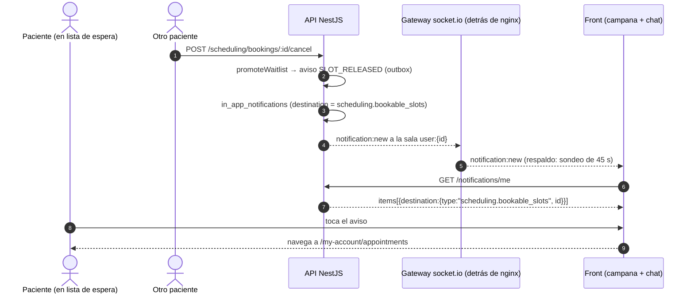

# TASK PROMPT: BR-22 — Notificaciones y tiempo real: destinos de la campana, horario liberado, socket y chat F4

> **MODO DE EJECUCIÓN:** este prompt se ejecuta en **Modo Planificación (Planning Mode)**.
> El desarrollador o el agente arranca investigando, sin tocar código fuente. Con eso escribe un
> `implementation_plan.md` detallado y espera la aprobación explícita del usuario. Después
> ejecuta los cambios en commits atómicos, verifica con pruebas unitarias y de integración, y
> **contra la API viva levantada detrás de nginx**. El resultado queda documentado en
> `walkthrough.md`.

| Campo | Valor |
|---|---|
| **Cierra** | AG-06, AG-07, AG-17, AG-19, AG-20, AG-21, AG-22, AG-29 (anexo C) · TX-17, TX-18 (anexo D) |
| **Severidad máxima** | Alta (AG-06, AG-17, TX-17). AG-17 bloquea la demo del chat si se hace contra la API real |
| **Repo(s)** | `mantra-core-health` (front, mock, `deploy/`) · `mantra-core-health-redesa-api` (API) |
| **Toca el modelo** | No en tablas. **Seeds sí**: el pack de stickers en `common.files` y la revisión de los seeds del canal IN_APP |
| **Depende de** | Nada para empezar. Blandas: BR-01 (artefacto real detrás de nginx para probar el socket), BR-03 (enrutado) y BR-21 (la regla de agenda que emite los avisos) |
| **Decisión previa** | Ninguna de README §8. **Decisión local de producto** que el plan pide igual: la regla de «horario liberado» (AG-07) y el transporte de la campana (AG-22) |

---

## 1. Contexto de negocio y justificación técnica

### A. Por qué importa
Una notificación que no abre nada, un sticker que queda con «Reintentar», un mensaje borrado
que se ve como burbuja vacía y un chat que nunca corrió en tiempo real contra la maqueta: son
los detalles que la demo muestra primero. En `mockup` todo se ve bien porque el mock **inventa
el vocabulario** de destinos (`APPOINTMENT`), sirve los stickers localmente y el socket ni se
conecta. Contra la API real, la campana no navega, el sticker da 404 y el token del socket
vence a los 15 minutos.

### B. Estado del frontend (`mantra-core-health`, rama `mockup`)
- **AG-06 / AG-21 (destinos):** `core/notifications/notification-routes.ts:25-52` conoce
  `PRESCRIPTION`, `ENCOUNTER`, `DIAGNOSTIC_REPORT`, `APPOINTMENT`, `PHARMACY_ORDER`,
  `PHARMACY_RECEIPT`, `CONVERSATION`, `CARE_RELATIONSHIP_REQUEST` y `POST:null`. No conoce
  `SERVICE_REQUEST` ni `scheduling.*`: `rutaDeNotificacion` devuelve `null` y el aviso se pinta
  sin enlace. `PHARMACY_RECEIPT` la API no la emite. La unión
  `NotificationDestinationType` (`core/data-access/notifications/notifications.types.ts:29-35`)
  tiene **6** tipos.
- El mock usa `destination:{type:'APPOINTMENT'}` (`core/mock/handlers/notifications.handlers.ts:
  38,42,52,54`, `scheduling.handlers.ts:116`, `core/mock/horario-liberado.ts:149`): vocabulario
  inventado. Ya existe la ruta `my-account/diagnostic-orders` (`app.routes.ts:201`) para
  `SERVICE_REQUEST`.
- **AG-07 / TX-18:** `features/notifications/aviso-de-hueco-libre.ts:79-80` sondea cada 20 s
  **sólo con `mockBackend`**; la regla del mock (`core/mock/horario-liberado.ts`: «confirmada y
  sin iniciar pasados 10 min = liberada», interesado = quien tiene otra cita con esa médica) no
  existe en la API.
- **AG-22 / TX-18:** `core/notifications/notifications.store.ts:21` `INTERVALO_MS = 45_000`,
  `setTimeout` encadenado (`:231-234`), dos lecturas por tick por pestaña; no pausa con la
  pestaña oculta.
- **AG-17:** `core/messaging/chat.store.ts:929-947` manda `attachmentFileId = sticker.id` con
  `contentType:'MEDIA'`; `core/messaging/sticker-pack.generated.ts:12,33` afirma que «el backend
  siembra el pack en `common.files`» (uuid de muestra `a7c1f0e2-0001-4a00-9000-5713ca110001`).
- **AG-19 (F4 sin adoptar):** `core/messaging/chat-socket.service.ts:140-154` sólo escucha
  `conversation:message`, `:message:updated`, `conversation:read` y `conversation:new`; nunca
  emite `typing` ni `presence:ping`. Favoritos y archivados en `localStorage`
  (`core/messaging/chat-preferencias.ts:99,114`). Sin métodos para borrar, fijar,
  `PATCH …/participant` ni `GET …/presence`; la bandeja no manda `q` ni `cursor`.
  `PLAN-CHAT-WHATSAPP.md:22` dice «F4 ⏳ abierta».
- **AG-20:** `toMessage` (`core/data-access/community/community.client.ts:1846`) no declara
  `deletedAt`; `chat.store.ts:262-276` arma la burbuja con `bodyText`/`attachmentFileId`.
- **TX-17 / AG-29:** `chat-socket.service.ts:117` no conecta con `mockBackend` (la demo de chat
  nunca tuvo tiempo real) y `:133-135` hace `io({ auth: { token } })` con el token **del
  momento**: una reconexión reusa el vencido. `deploy/api-locations.conf:166-187` sí tiene
  `location ^~ /socket.io/` con upgrade y `proxy_read_timeout 3600s`. Existe
  `playwright/carril-chat-realtime.spec.ts` (sin confirmar contra qué corre).

### C. Estado de la API (`mantra-core-health-redesa-api`, rama `dev`)
- **Vocabulario de destinos sin contrato único:** `messaging/services/notifications.service.ts:
  776` devuelve `destination.type = relatedResourceType` tal cual. Conviven
  `scheduling.appointment_bookings`/`scheduling.bookable_slots`
  (`scheduling/notices/agenda-notices.ts:22,25`), `consent.consents`,
  `accounting.journal_transactions`, `profiles.practitioner_affiliations` y minúsculas de
  `pharma_lab` (`visit_request`, `visit_record`, `regulatory_document`…). El enum del contrato
  (`messaging/notifications.contract.ts:80-110`) declara 9 tipos (`PRESCRIPTION` …
  `SERVICE_REQUEST`) y **no incluye los `scheduling.*`**: el propio contrato no describe lo que
  la agenda emite.
- **AG-07:** cancelar promueve la lista de espera (`scheduling-bookings.service.ts:1584-1620`) y
  emite `SLOT_RELEASED` (`scheduling-waitlist.service.ts:336` →
  `scheduling-agenda-notices.service.ts:57-95`, concepto `AGENDA_NOTICE_SLOT_RELEASED` en
  `scheduling.concepts.ts:152`). El interesado es quien está **en lista de espera**. El
  `payloadJson` trae `route`, `slotId`, `resourceId`, `startAt`, sin `kind`. La entrega depende
  de los seeds del canal IN_APP (con el paquete viejo: 0 avisos y ningún error).
- **AG-22:** no hay `@Sse` en `src/` (verificado). El único gateway es
  `community/gateways/community-messaging.gateway.ts` (`cors:{origin:false}`, `:108`).
- **AG-17:** `community-messaging.service.ts` → `assertAttachmentCanBeAssociated` →
  `common/services/attachable-file.service.ts:121` (archivo inexistente → **404**) y `:123`
  (`createdByUserId !== actor.id` → **403**). El uuid del pack no aparece en la API ni en los seeds.
- **AG-19 / AG-20 (F4 cerrado en la API):** `community-messaging.controller.ts:102` (DELETE
  mensaje), `:132` (PATCH participant), `:146/:158` (pin), `:218` (lista con `cursor` y `q`),
  `:251` (presence). Gateway: `typing` (`:255`) → `conversation:typing`, `presence:ping`
  (`:278`), `conversation:message:deleted` (`:323-328`), `profile:presence` (`:412`).
  `dto/read-messaging.dto.ts:30,247` traen `deletedAt`.
- **TX-17:** el gateway autentica sólo en `handleConnection` (`:140-146`): un socket vivo no se
  re-verifica (sin confirmar si eso es un riesgo o sólo un corte a la reconexión).

### D. Aislamiento
- Fuera de alcance: los trips, pings y geocercas de `geo` (**delivery**) y cualquier aviso de
  pago (**pasarela**). No se tocan.
- La regla de agenda que produce los avisos (retiro, cancelar, lista de espera) es de BR-21; acá
  sólo se consume el aviso. Las rutas nuevas de `pharma_lab` son de BR-26: acá sólo se mapean sus
  destinos si ya existen pantallas.

---

## 2. Flujo de Git y entrega

```bash
cd mantra-core-health && git status && git fetch origin
git checkout -b <dev>/feat-notificaciones-y-chat-tiempo-real origin/mockup
cd ../mantra-core-health-redesa-api && git status && git fetch origin
git checkout -b <dev>/feat-notificaciones-socket-y-stickers origin/dev
```

- Commits atómicos, por ejemplo: `fix(notifications): la campana abre los destinos que emite la
  API`, `fix(mock): los avisos usan el vocabulario de la API`, `fix(chat): el socket lee el token
  vigente al reconectar`, `feat(chat): favoritos y archivados en el servidor (F4)`,
  `feat(chat): mensaje eliminado y escribiendo…`, `feat(seed): pack de stickers del producto`,
  `feat(messaging): notification:new por el gateway`.
- PRs: front `gh pr create --base mockup --reviewer jsaldias39,PabloArauzCaballero`; API
  `gh pr create --base dev --reviewer jsaldias39,PabloArauzCaballero`. **El merge exige revisión
  humana.** El flujo termina en abrir los PR.

---

## 3. Diagrama



---

## 4. Archivos a modificar o crear

**Front (`mantra-core-health`)**
- `[MODIFICAR]` `src/app/core/notifications/notification-routes.ts` (+ spec): claves
  `scheduling.appointment_bookings` y `scheduling.bookable_slots` → `/my-account/appointments`;
  `SERVICE_REQUEST` → `/my-account/diagnostic-orders`; `PHARMACY_RECEIPT` marcado «sólo del front»
  o retirado; tipo desconocido → se marca leída y no navega, sin lanzar.
- `[MODIFICAR]` `src/app/core/data-access/notifications/notifications.types.ts`: la unión refleja
  el contrato de la API (los 9 del enum + los `schema.tabla` que la API emite de verdad).
- `[MODIFICAR]` `src/app/core/mock/handlers/notifications.handlers.ts`,
  `scheduling.handlers.ts:116` y `src/app/core/mock/horario-liberado.ts:149`: mismos literales
  que la API.
- `[MODIFICAR]` `src/app/features/notifications/aviso-de-hueco-libre.ts` y
  `core/mock/horario-liberado.ts`: la regla del mock pasa a ser la de la API (lista de espera),
  salvo que producto elija la otra (ver §5).
- `[MODIFICAR]` `src/app/core/notifications/notifications.store.ts`: escucha `notification:new`
  si la API lo emite; el sondeo queda de respaldo y se pausa con `document.hidden`.
- `[MODIFICAR]` `src/app/core/messaging/chat-socket.service.ts`: `auth` como **función** que lee
  `session.accessToken()` en cada (re)conexión; desconecta al cerrar sesión; escucha
  `conversation:message:deleted`, `conversation:typing`, `profile:presence`; emite `typing` y
  `presence:ping`.
- `[MODIFICAR]` `src/app/core/messaging/chat.store.ts` y `chat-preferencias.ts`: favoritos,
  archivados y fijados por `PATCH …/participant`; migración única de lo que haya en
  `localStorage`; ✓✓ con `lastMessageReadByPeer`; «Se eliminó este mensaje» con `deletedAt`.
- `[MODIFICAR]` `src/app/core/data-access/community/community.client.ts` + `community.types.ts`:
  `deletedAt`, `deleteMessage`, `updateParticipant`, `pin`/`unpin`, `presence`, bandeja con `q`
  y `cursor`.
- `[MODIFICAR]` `src/app/core/mock/handlers/community.handlers.ts`: las mismas rutas F4, para no
  divergir.
- `[MODIFICAR]` `PLAN-CHAT-WHATSAPP.md`: F4 adoptada en el front.
- `[DOCUMENTAR]` `deploy/README` o `docs/operations/`: el upgrade de `/socket.io/` en el entorno de
  demo, con la evidencia (AG-29).

**API (`mantra-core-health-redesa-api`)**
- `[CREAR]` `src/common/seed/sticker-pack-seed.service.ts` (patrón de `audio-assets-seed.service.ts`):
  siembra el pack con los uuid fijos del front, dueño de sistema y bytes en el almacenamiento.
- `[MODIFICAR]` `src/modules/community/services/community-messaging.service.ts` y/o
  `src/modules/common/services/attachable-file.service.ts`: un archivo del pack del producto se
  puede asociar sin ser del emisor; cualquier otro ajeno sigue en 403.
- `[MODIFICAR]` `src/modules/messaging/notifications.contract.ts`: el enum declara lo que de
  verdad se emite (o las fuentes se alinean al enum: decidir en el plan, no los dos).
- `[MODIFICAR]` `src/modules/messaging/services/notifications.service.ts` + gateway (el de
  community o uno nuevo): emite `notification:new` a `user:{id}` **después del commit**.
- `[MODIFICAR]` `src/modules/community/gateways/community-messaging.gateway.ts`: si el plan decide
  re-verificar el token en eventos, hacerlo acá.
- `[CREAR]` int-spec del sticker (201 con archivo del pack; 403 con archivo ajeno) y spec del
  `notification:new`.

---

## 5. Reglas de implementación

- **Paso 1 del plan (decisión local, no está en §8):**
  - *Horario liberado (AG-07):* **A)** la regla de la API (sólo lista de espera): cero backend,
    el mock se alinea. **B)** la del mock (desconfirmar a los 10 min): hace falta un job productor
    y escribir en la lista de espera al reservar otra fecha; más valor, más superficie.
  - *Transporte de la campana (AG-22):* **A)** `notification:new` por el socket existente
    (barato: el front ya tiene socket). **B)** SSE (la API no tiene ninguno). **C)** sólo
    sondeo optimizado. Recomendado A con el sondeo de respaldo.
  - *Stickers (AG-17):* sembrar el pack con allowlist (recomendado) o mandarlo como `bodyText`
    con convención (cambia el contrato).
- **Seeds:** los stickers llevan bytes; si van por `gen_seeds.py` hay que resolver el objeto en el
  almacenamiento. El patrón de semilla de la app (`AudioAssetsSeedService`) evita dos dueños:
  elegí uno y dejalo escrito. Nunca editar la base a mano.
- **Outbox y transacciones:** el evento de socket sale después del commit; nunca dentro de un
  lock. Una notificación = una fila de `messaging.in_app_notifications` (no inventar columnas).
- **Autorización:** la allowlist de stickers no puede abrir lectura de archivos ajenos.
- **Mock honesto:** el mock emite los mismos literales que la API; si BR-02 ya cambió la forma de
  errores, respetarla.
- Mobile-first; estados M34 en la bandeja (S8 sin conexión cuando el socket cae).

---

## 6. Criterios de aceptación (Gherkin)

```gherkin
Escenario: Aviso de horario liberado navegable
  Dado un paciente en la lista de espera de un recurso y la API real
  Cuando otro paciente cancela un cupo de ese recurso
  Entonces el primero recibe una notificación in-app con payloadJson.slotId
  Y al tocarla navega a "/my-account/appointments"

Escenario: Orden de estudios
  Dada una notificación con destino SERVICE_REQUEST
  Cuando el paciente la toca
  Entonces navega a "/my-account/diagnostic-orders"

Escenario: Destino desconocido
  Dado un tipo de destino que el front no conoce
  Cuando se toca la notificación
  Entonces se marca leída y no navega, sin error en consola

Escenario: Sticker contra la API real
  Dado un participante activo de una conversación
  Cuando manda un mensaje MEDIA con un attachmentFileId del pack
  Entonces recibe 201 y el otro participante ve el sticker
  Pero con un fileId que no es del pack ni suyo recibe 403

Escenario: Mensaje eliminado
  Dado el hilo abierto
  Cuando el autor borra un mensaje
  Entonces llega conversation:message:deleted y la burbuja dice "Se eliminó este mensaje"

Escenario: Favoritos en el servidor
  Dado que marco una conversación como favorita en un navegador
  Cuando entro desde otro
  Entonces sigue marcada

Escenario: Sesión larga detrás de nginx
  Dado un chat abierto durante 20 minutos detrás de nginx
  Cuando el socket se reconecta
  Entonces usa el access token vigente y un mensaje llega en menos de 2 segundos

Escenario: Campana sin sondeo
  Dado que se emite una in-app para mí con la app abierta
  Entonces el contador sube en menos de 3 segundos
  Y si el socket cae, el sondeo de 45 s sigue funcionando
```

---

## 7. Definition of Done

- [ ] `implementation_plan.md` aprobado, con las tres decisiones locales de §5 escritas.
- [ ] Campana: todos los `destination.type` que emite la API tienen ruta o `null` explícito, con
      una prueba por tipo; el mock usa los mismos literales.
- [ ] Stickers sembrados y asociables; allowlist probada con un archivo ajeno (403).
- [ ] Chat F4 adoptado (favoritos, archivados, fijado, borrado, escribiendo, presencia, ✓✓,
      búsqueda con `q` + `cursor`); `PLAN-CHAT-WHATSAPP.md` al día.
- [ ] Socket con token vigente y desconexión al salir. `notification:new` emitido tras el commit.
- [ ] API: `corepack yarn lint`, `typecheck`, `test` e int-specs nuevos en verde. Front:
      `corepack yarn lint`, `typecheck`, `build`, `test --watch=false` y `check-*.mjs` a mano.
- [ ] **Evidencia de runtime** (API viva **detrás de nginx**, no `ng serve`):
  - dos navegadores (médica y paciente): mensaje en vivo < 2 s, `connected=true`, captura del
    frame `101 Switching Protocols` en `/socket.io/`;
  - cancelación real → fila en `messaging.in_app_notifications` (`related_resource_type`) →
    campana → navegación;
  - sticker: request 201, fila en `community.direct_messages.attachment_file_id`, recarga;
  - borrado: `deleted_at` en la base y burbuja actualizada sin recargar;
  - chat abierto > 15 min y reconexión con el token nuevo (log del gateway).
- [ ] PRs abiertos con revisores `jsaldias39` y `PabloArauzCaballero`, `walkthrough.md` con la
      evidencia.

---

## 8. Plan de QA

### A. Pruebas automatizadas
```bash
corepack yarn test --watch=false --include=src/app/core/notifications/**                 # front
corepack yarn test --watch=false --include=src/app/core/messaging/**
corepack yarn test --watch=false --include=src/app/core/data-access/community/**
corepack yarn test --testPathPatterns="community-messaging|notifications|attachable-file"  # API
corepack yarn test:integration --testPathPatterns=sticker
```
- Spec de `notification-routes`: un caso por cada literal que la API emite (sacado por `grep` de
  `relatedResourceType` en `src/modules`), más el desconocido.
- Spec del socket: la función `auth` devuelve el token nuevo tras renovar la sesión.

### B. Integración (artefacto real)
1. Stack de la API con seeds (IN_APP y stickers); front detrás de nginx con
   `deploy/api-locations.conf` (BR-01/BR-03).
2. Dos sesiones: chat, sticker, borrado, favorito en un navegador y verificación en otro.
3. Lista de espera: paciente A se anota, paciente B cancela, A ve el aviso y navega.
4. `playwright/carril-chat-realtime.spec.ts` contra ese entorno; documentar contra qué corrió.

### C. Verificación manual y logs
- DevTools → Network → WS: el handshake de `/socket.io/` hace upgrade; sin reintentos en bucle.
- Log de la API: ningún 404/403 de `attachable-file` para ids del pack.
- `SELECT count(*) FROM messaging.in_app_notifications` antes y después de la cancelación.
