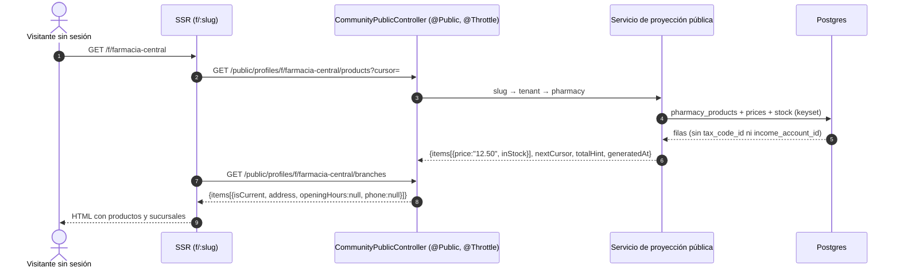

# TASK PROMPT: BR-23 — Directorios públicos: fichas de clínica y farmacia, sucursales, farmacias de turno y tendencias

> **MODO DE EJECUCIÓN:** este prompt se ejecuta en **Modo Planificación (Planning Mode)**.
> El desarrollador o el agente arranca investigando, sin tocar código fuente. Con eso escribe un
> `implementation_plan.md` detallado y espera la aprobación explícita del usuario. Después
> ejecuta los cambios en commits atómicos, verifica con pruebas unitarias y de integración, y
> **contra la API viva levantada**. El resultado queda documentado en `walkthrough.md`.

| Campo | Valor |
|---|---|
| **Cierra** | AG-13, AG-14, AG-15, AG-16, AG-24, AG-25, AG-27, AG-28, AG-41, AG-42 (anexo C). Pendientes P30, P31, P34, P37 y P38 |
| **Severidad máxima** | Alta (AG-15, AG-16: contra la API real, «Servicios», «Productos» y «Sucursales» de las fichas quedan en error) |
| **Repo(s)** | `mantra-core-health-redesa-api` (API, el grueso) · `mantra-core-health` (front y mock) · `mantra-core-health-model` (P34 y, si se decide, horario y teléfono de P37) |
| **Toca el modelo** | **Sí**: P34 (módulo 24, `pharmacy_sites` y turnos) según **D-F**. P30, P31, P37 (sucursales) y P38 se resuelven con tablas que ya existen |
| **Depende de** | Nada para empezar las lecturas (P30, P31, P37 sucursales, P38, `city`, paginación). P34 espera D-F |
| **Decisión previa** | **D-F**: farmacias 24 h y de turno, ¿dato del modelo o calendario externo? (README §8) |

---

## 1. Contexto de negocio y justificación técnica

### A. Por qué importa
El directorio público es la puerta de entrada sin sesión: SSR, SEO y lo primero que ve un
paciente. En `mockup` las fichas de clínica y farmacia muestran servicios, productos, sucursales
y horarios; **contra la API real esas secciones dan 404**, porque las rutas sólo existen en el
simulador. Además hay datos que el mock inventa y el modelo no tiene (horario de farmacia, 24 h,
de turno, teléfono de sucursal, «sin precio publicado»), filtros que la API ignora en silencio y
listas que se cortan en 100.

### B. Estado del frontend (`mantra-core-health`, rama `mockup`)
- **AG-15 (P30/P31):** `core/data-access/public-catalog/public-catalog.client.ts:49-76` pide
  `GET /public/profiles/o/:slug/services` y `/public/profiles/f/:slug/products` con envoltura
  `{items,nextCursor,totalHint,generatedAt}`. Consumen `features/public-directories/clinic-detail`,
  `pharmacy-detail` y `public-catalog-detail.ts`. Mock: `core/mock/handlers/public.handlers.ts:
  452-462`. El mock inventa `therapeuticGroup` y `price: null` («sin precio publicado»).
- **AG-16 ≡ AG-42 (P37):** `public-catalog.client.ts:78-116`: `GET /public/profiles/f/:slug/branches`
  y `/branch-availability?items=a|b&lat&lng` → `{items}`; tipos en `public-catalog.types.ts:94-159`.
  Mock en `public.handlers.ts:470-506` con `openingHours`, `phone` y `locationAccuracy`
  inventados. Es la única llamada del dominio que `client-calls.json` marca sin ruta (`NULL`).
- **AG-25 ≡ AG-41 (P34):** el filtro «24 h / de turno» no se implementó a propósito
  (`PENDIENTES-BACKEND.md:172-235`). El corpus del mock trae `openingHours` libre
  (`core/mock/fixtures/bolivia-eje-central.generated.ts:666-723`), expuesto en
  `public-catalog.types.ts:103`.
- **AG-24 (P38):** la columna de tendencias del muro muestra los grupos con más miembros
  (`GET /community/groups`, `memberCount`); `PENDIENTES-BACKEND.md:1643-1675`.
- **AG-13:** `core/data-access/services-catalog/services-catalog.types.ts:16-36,79-88` no declara
  `descriptionText` ni `imageFileId`: «Mis servicios» sólo edita precio y baja.
- **AG-27:** `public-directory.client.ts:381-396` manda `city` a los cinco verticales y
  `features/public-directories/public-directory-listing.ts:66-76` filtra del lado cliente lo que
  ya está en pantalla.
- **AG-28:** `features/laboratory-directory/laboratory-directory.ts:443` pide
  `limit: TOPE_DEL_DIRECTORIO` y nunca `offset`; `public-marketplace.client.ts:40-53` pide
  `/public/medications` sin cursor.

### C. Estado de la API (`mantra-core-health-redesa-api`, rama `dev`)
- `community/controllers/community-public.controller.ts` (con `@Throttle(PUBLIC_RATE_LIMIT)` de
  60/min, `:63,84`) sirve `public/posts*`, `public/comments/:commentId/replies`, `public/search*`,
  `public/nearby`, `public/profiles/:prefijo/:slug` (`:389`) y `…/reviews` (`:425`),
  `public/media/:id` y los atajos `p|o|f|l|s/:slug`. **No existen** `…/services`, `…/products`,
  `…/branches` ni `…/branch-availability` (verificado).
- **P30:** `billing.service_catalog` (`database/SQL/17_billing/02_tables.sql:5-24`) tiene
  `description_text`, `image_file_id`, `default_price numeric NOT NULL`, `currency_concept_id`,
  `is_active`, y también `tax_code_id` e `income_account_id`, que **no pueden salir al público**.
  Existe además `practice.healthcare_services` (`14_practice/02_tables.sql:115`): **sin confirmar
  cuál de las dos es la oferta publicable**. `price: null` no se puede expresar
  (`default_price NOT NULL`).
- **P31:** `pharmacy.pharmacy_products` (`24_pharmacy/02_tables.sql:65`) + precios +
  `pharmacy_inventory.inventory_stock_positions` (`25_pharmacy_inventory/02_tables.sql:57`).
  `therapeuticGroup` no es columna: habría que derivarlo del ATC del `medication_concept_id`
  (sin confirmar).
- **P37:** `pharmacy.pharmacies` 1-N `pharmacy.pharmacy_sites` (`pharmacy_id`, `practice_site_id`,
  `name`, `home_delivery_available`, `pickup_available`) → `practice.practice_sites.address_id` →
  `common.addresses`. Sin horario ni teléfono. `GET /pharmacy-inventory/availability` existe con
  sesión y por `productId` (`pharmacy_inventory/controllers/pharmacy-inventory-read.controller.ts:
  56-80`); no acepta texto libre.
- **P34:** `pharmacy_sites` (`24_pharmacy/02_tables.sql:25-42`) no tiene `open_24h`, horario ni
  turno. `community/dto/public-search.dto.ts:244` declara `openNow: boolean | null` y **ningún
  servicio lo asigna** (verificado: la única aparición es el DTO).
  `platform_ops.on_call_*` es la guardia de la plataforma, no de una farmacia.
- **P38:** no existe `/community/trends` (grep vacío). `community.hashtags` y
  `community.content_hashtags` existen (`19_community/02_tables.sql:175,206`): falta la agregación.
  `PostListItemDto` no trae `hashtags` (sólo `PostDetailDto`, `dto/read-social.dto.ts:325-332`).
- **AG-13:** `billing/dto/service-catalog.dto.ts`: el alta acepta `descriptionText`/`imageFileId`
  (`:58,69`), `UpdateServiceCatalogItemDto` (`:141`) no (sólo `name`, `defaultPrice`,
  `currencyConceptId`, `isActive`). PATCH permitido a `PRACTITIONER`
  (`billing-service-catalog.controller.ts:150-151`); el alta es sólo `SECURITY_ADMIN` (`:125-126`).
- **AG-27:** sólo `public/search/organizations` lee `@Query('city')` (`:253`);
  `public/search/pharmacies` (`:302-314`) lee `q`, `cursor`, `limit`. Los `/public/*` leen
  `@Query` sueltos: un parámetro de más **se ignora**, no da 400.
- **AG-28:** `diagnostic_units/dto/catalog.dto.ts:25,118-126` (máx. 100, con `offset`);
  `pharmacy/controllers/pharmacy-public.controller.ts:65-108` (`/public/medications`: sólo `limit`,
  devuelve `total`).
- **AG-14:** el `SQL/` de la raíz del workspace no tiene `schedule_rules.gap_minutes` ni
  `community.chat_auto_replies`; la verdad es `mantra-core-health-model/SQL/` y su copia
  `database/SQL/` (con `yarn db:vendor`).

### D. Aislamiento
- **Fuera de alcance:** `home_delivery_available` y los modos `DOMICILIO`/`TRABAJO` (**delivery**)
  no se exponen ni se filtran; el precio en ficha no implica **pasarela de pago**. `geo`
  (tracking) no se toca.
- Las lecturas nuevas son `@Public()` y de sólo lectura: no cambian ningún contrato con sesión.
- Campañas de farmacia en la ficha: son BR-24 (AG-40), no este prompt.

---

## 2. Flujo de Git y entrega

```bash
cd mantra-core-health-redesa-api && git status && git fetch origin
git checkout -b <dev>/feat-directorios-publicos-fichas origin/dev
cd ../mantra-core-health && git status && git fetch origin
git checkout -b <dev>/feat-directorios-publicos-contrato origin/mockup
cd ../mantra-core-health-model && git status && git fetch origin      # sólo P34 / P37
git checkout -b <dev>/feat-farmacias-24h-y-turno origin/dev
```

- Commits atómicos, por ejemplo: `feat(public): catálogo de servicios de una organización (P30)`,
  `feat(public): productos de una farmacia (P31)`, `feat(public): sucursales y disponibilidad de
  receta (P37)`, `feat(community): tendencias del muro (P38)`, `fix(public): city en los cinco
  verticales`, `fix(billing): editar descripción e imagen del servicio`, `feat(24): open_24h y
  turnos de farmacia (P34)`, `fix(directory): paginar laboratorios y medicamentos`.
- PRs: API `gh pr create --base dev --reviewer jsaldias39,PabloArauzCaballero`; front
  `gh pr create --base mockup --reviewer jsaldias39,PabloArauzCaballero`; modelo, quien lo
  mantiene. **El merge exige revisión humana.** El flujo termina en abrir los PR.

---

## 3. Diagrama



---

## 4. Archivos a modificar o crear

**API (`mantra-core-health-redesa-api`)**
- `[MODIFICAR]` `src/modules/community/controllers/community-public.controller.ts`: cuatro
  lecturas `@Public()` con `@Throttle(PUBLIC_RATE_LIMIT)`: `public/profiles/o/:slug/services`,
  `public/profiles/f/:slug/products`, `public/profiles/f/:slug/branches`,
  `public/profiles/f/:slug/branch-availability`. **Declararlas antes** de
  `public/profiles/:prefijo/:slug` para que la ruta genérica no las capture.
- `[CREAR]` `src/modules/community/services/public-catalog.service.ts` (proyección slug → tenant →
  practice/pharmacy, keyset, importes como texto) y `src/modules/community/dto/public-catalog.dto.ts`.
- `[CREAR]` `src/modules/pharmacy/services/pharmacy-public-branches.service.ts`: sedes de la
  farmacia del slug y disponibilidad por texto (genérico/marca) acotada a esas sedes, ordenada
  como `/pharmacy-inventory/availability` (completas primero, luego `distanceKm`).
- `[MODIFICAR]` `community/controllers/community-public.controller.ts` + `public-search.repository.ts`:
  `city` en `pharmacies`, `insurers`, `diagnostic-units` y `medications`; cursor dentro del filtro.
- `[MODIFICAR]` `community/dto/public-search.dto.ts:244`: `openNow` se calcula (tras D-F) o se
  documenta «siempre null» hasta entonces.
- `[CREAR]` `GET /community/trends?days=&limit=` en `community-topics.controller.ts` (o uno nuevo),
  con servicio de lectura y DTO `{items:[{tag, posts}]}`.
- `[MODIFICAR]` `billing/dto/service-catalog.dto.ts` (`UpdateServiceCatalogItemDto`):
  `descriptionText?` e `imageFileId?` (validando que el archivo sea asociable por el actor).
- `[MODIFICAR]` `pharmacy/controllers/pharmacy-public.controller.ts`: `/public/medications` con
  cursor (o al menos `offset`).
- `[MODIFICAR]` `*.module.spec.ts` del módulo que registre cada controlador nuevo, exigiéndolo.
- `[CREAR]` int-specs de las cuatro lecturas públicas y de tendencias.

**Modelo (`mantra-core-health-model`, tras D-F)**
- `[MODIFICAR]` `Mantra Core Health Context/modules/diagram_24_pharmacy.puml`: `pharmacy_sites.open_24h
  boolean NULL` y, si D-F lo pide, `pharmacy_on_call_shifts(pharmacy_site_id, starts_at, ends_at,
  source_concept_id)`. Horario y teléfono de sucursal **sólo si** se decide en el mismo plan.
- `[REGENERAR]` `salud-db/gen_ddl.py` → `SQL/24_pharmacy/` → patch → `corepack yarn db:vendor` →
  `corepack yarn db:vendor:check`; entidad `pharmacy_sites.entity.ts`; value set de la fuente del
  turno por `gen_seeds.py`.

**Front (`mantra-core-health`)**
- `[MODIFICAR]` `core/data-access/public-catalog/public-catalog.types.ts` y el mock
  `core/mock/handlers/public.handlers.ts:452-506`: mismos campos que la API; `therapeuticGroup`,
  `openingHours`, `phone` y `price:null` sólo si el contrato los trae.
- `[MODIFICAR]` `core/data-access/services-catalog/services-catalog.types.ts` y el formulario de
  «Mis servicios»: `descriptionText` e `imageFileId`.
- `[MODIFICAR]` `features/public-directories/public-directory-listing.ts`: quita el filtro local
  de `city` cuando la API lo aplique.
- `[MODIFICAR]` `features/laboratory-directory/laboratory-directory.ts` y
  `public-marketplace.client.ts`: paginan hasta el final.
- `[MODIFICAR]` la columna de tendencias del feed (`features/feed/*`) y su cliente.
- `[MODIFICAR]` `CONTRATO-PUBLICO.md` (si existe en el repo; sin confirmar la ruta) y
  `PENDIENTES-BACKEND.md` (P30, P31, P34, P37, P38).

---

## 5. Reglas de implementación

- **Paso 1 del plan: pedir D-F** con opciones:
  - *A — dato del modelo:* `open_24h` en la sede + tabla de turnos cargada por la farmacia. Pro:
    consultable, auditable, `openNow` calculable. Contra: alguien tiene que cargar los turnos y
    caducan; hay que decidir granularidad y quién carga (las 3 preguntas de P34).
  - *B — calendario externo:* integración con el turno oficial (colegio de farmacéuticos o
    municipio). Pro: dato oficial. Contra: fuente sin confirmar, adapter nuevo, fuera del modelo.
  - *C — sólo `open_24h`:* la parte barata y estable; turnos después. Pro: destraba el filtro «24
    h». Contra: «de turno» sigue sin resolver.
- **P30:** el plan decide si la oferta pública sale de `billing.service_catalog` o de
  `practice.healthcare_services`, y qué significa «sin precio» (`is_active=false` o una marca
  nueva en el modelo). No inventar la columna.
- **Nada interno al público:** ni `income_account_id`, ni `tax_code_id`, ni ids de tenant. Un slug de
  otro tipo responde **el mismo 404** que un slug inexistente.
- **Paginación por cursor (M34)** en todas las lecturas nuevas; importes como texto.
- **Tendencias:** sólo posts `PUBLIC`, respetando bloqueos y visibilidad.
- `@Query` sueltos en `/public/*`: validá cada uno (tipos, rangos) para no aceptar basura en
  silencio.
- **4 capas** para P34; nunca editar la base ni `database/SQL` a mano. **AG-14:** no auditar contra
  el `SQL/` de la raíz del workspace.

---

## 6. Criterios de aceptación (Gherkin)

```gherkin
Escenario: Servicios de una organización
  Dado un slug de organización con 3 servicios activos
  Cuando pido GET /public/profiles/o/{slug}/services sin token
  Entonces recibo 200 con 3 ítems, price como string y sin incomeAccountId

Escenario: Slug de otro tipo
  Dado un slug de farmacia
  Cuando pido /public/profiles/o/{slug}/services
  Entonces recibo 404 con la misma forma que un slug inexistente

Escenario: Producto sin stock
  Dado un producto sin stock en la farmacia del slug
  Cuando pido /public/profiles/f/{slug}/products
  Entonces aparece con inStock=false y no se omite

Escenario: Sucursales y receta
  Dada una cadena con 3 sucursales y la receta "amoxicilina 500|paracetamol"
  Cuando pido /branch-availability con lat y lng
  Entonces primero vienen las complete=true ordenadas por distanceKm
  Y un renglón sin coincidencia aparece en missing

Escenario: Farmacia 24 horas
  Dada una sede con open_24h=true
  Cuando filtro "24 h" en el directorio
  Entonces aparece, y una sede sin dato viaja con null y no se presenta como cerrada

Escenario: Tendencias
  Dado que se publicaron 5 posts PUBLIC con #diabetes en 7 días y uno PRIVATE
  Cuando pido /community/trends?days=7
  Entonces diabetes aparece con posts=5

Escenario: Ciudad en farmacias
  Cuando busco farmacias con city=Cochabamba
  Entonces todos los ítems son de Cochabamba y el cursor pagina dentro del filtro

Escenario: Descripción del servicio
  Dado un médico en "Mis servicios"
  Cuando escribe qué incluye un servicio y guarda
  Entonces PATCH /billing/service-catalog/:id responde 200 y el texto sigue al recargar

Escenario: Directorio de laboratorios completo
  Dados 130 laboratorios publicados
  Cuando recorro el directorio
  Entonces llego a ver los 130
```

---

## 7. Definition of Done

- [ ] `implementation_plan.md` aprobado, con **D-F** y la fuente de P30 escritas.
- [ ] Cuatro lecturas públicas + tendencias: **ruta mapeada verificada** con
      `node dist/src/main.js` y `grep "Mapped {/public/profiles/o/:slug/services"` (y las otras
      cuatro) en el log; `*.module.spec.ts` que exige el controlador.
- [ ] `city` en los cinco verticales; `/public/medications` y laboratorios paginan.
- [ ] `UpdateServiceCatalogItemDto` con descripción e imagen; front las edita.
- [ ] P34 por las 4 capas (si D-F lo pide) con `db:vendor:check` limpio y `ORM_SCHEMA_SYNC=dry-run`
      sin deriva nueva; `openNow` calculado o documentado null.
- [ ] Mock alineado: sin campos que la API no devuelve.
- [ ] API: `corepack yarn lint`, `typecheck`, `test`, int-specs; front: `lint`, `typecheck`, `build`,
      `test --watch=false`, `check-*.mjs` a mano.
- [ ] **Evidencia de runtime contra la API viva:** `curl` sin token de cada lectura con la
      respuesta pegada; `curl` del SSR de `/o/<slug>` y `/f/<slug>` con servicios y productos en
      el HTML; PATCH de «Mis servicios» → `SELECT description_text` → recarga.
- [ ] PRs abiertos con revisores `jsaldias39` y `PabloArauzCaballero`, `walkthrough.md` con la
      evidencia. Aviso al dueño del workspace de que el `CLAUDE.md` de la raíz sigue desactualizado
      (AG-14): no se toca desde un repo.

---

## 8. Plan de QA

### A. Pruebas automatizadas
```bash
corepack yarn test --testPathPatterns="community-public|public-catalog|pharmacy-public|trends"   # API
corepack yarn test:integration --testPathPatterns=public
corepack yarn test --watch=false --include=src/app/core/data-access/public-catalog/**           # front
corepack yarn test --watch=false --include=src/app/features/public-directories/**
```
- Spec del controlador: las rutas nuevas se resuelven antes que `:prefijo/:slug`.
- Spec de la proyección: el DTO público no tiene `incomeAccountId`, `taxCodeId` ni `tenantId`.

### B. Integración (API viva)
1. Stack con seeds (clínicas y farmacias del corpus Bolivia); `node dist/src/main.js` y grep de
   `Mapped {`.
2. `curl` sin token a cada lectura; slug de otro tipo → 404; `limit` fuera de rango → validación.
3. Front con `real-api`: `/o/<slug>`, `/f/<slug>` (servicios, productos, sucursales), buscador con
   ciudad, directorio de laboratorios hasta el final, columna de tendencias.

### C. Verificación manual y logs
- Log de la API: ninguna consulta pública sin `LIMIT` ni N+1 por producto (una consulta por página).
- Throttle: 61 pedidos en un minuto → 429 en la lectura pública.
