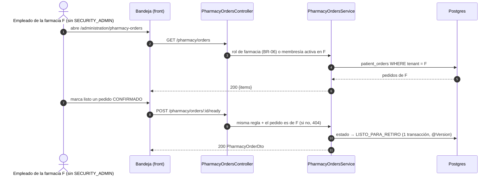

# TASK PROMPT: BR-24 — Farmacia (sin delivery): mostrador, campañas, ficha de la empresa y fixtures

> **MODO DE EJECUCIÓN:** este prompt se ejecuta en **Modo Planificación (Planning Mode)**.
> El desarrollador o el agente arranca investigando, sin tocar código fuente. Con eso escribe un
> `implementation_plan.md` detallado y espera la aprobación explícita del usuario. Después
> ejecuta los cambios en commits atómicos, verifica con pruebas unitarias y de integración, y
> **contra la API viva levantada**. El resultado queda documentado en `walkthrough.md`.

| Campo | Valor |
|---|---|
| **Cierra** | AG-32, AG-34, AG-40 (anexo C) · CV-15 (anexo E) · TX-26 (anexo D) |
| **Severidad máxima** | Alta (AG-32: el personal de la farmacia recibe 403 en toda la bandeja; TX-26). AG-32 pasa a bloqueante de demo si se entra con un usuario de farmacia que no sea admin |
| **Repo(s)** | `mantra-core-health-redesa-api` (autorización del mostrador y de las altas) · `mantra-core-health` (bandeja, ficha, campañas, mock y fixtures) |
| **Toca el modelo** | No. El vínculo campaña ↔ producto de farmacia **no existe en el modelo**: si producto quiere campañas reales, se abre como pedido aparte al modelo (ver §5) |
| **Depende de** | **BR-06** para el rol runtime de farmacia (lo siembra BR-06; acá se usa). Blanda: BR-01 (demos apagadas por defecto: AG-40 comparte el cambio de `environment.ts`) |
| **Decisión previa** | Ninguna de README §8. La autorización del mostrador se **coordina con BR-06** (ver §5) |

---

## 1. Contexto de negocio y justificación técnica

### A. Por qué importa
La farmacia es un actor de la demo: recibe el pedido de retiro del paciente, lo revisa, lo
confirma, lo marca listo y lo entrega. Contra la API real **todo el mostrador da 403** a quien
atiende, porque las seis rutas exigen `SECURITY_ADMIN`. Y la farmacia se ve «completa» en
`mockup` porque la ficha de la empresa, sus documentos, su gente y sus campañas son **datos de
ejemplo pintados siempre**, algunos incluso en el build de producción. Al apagar el mock, o se
ven datos falsos o se ve un 403.

### B. Estado del frontend (`mantra-core-health`, rama `mockup`)
- **AG-32:** `administration/pharmacy-orders` (`app.routes.ts:214-217`) y su hija `:orderId`
  (`:492-497`) dan acceso por membresía con `seccionRolesGuard`. La pantalla llama
  `pedidosDeFarmacia()` (`features/organization/pharmacy-inbox/pharmacy-inbox.ts:202,361`),
  `abrirRevision` (`inbox-order.ts:354`) y `marcarListo` (`inbox-order.ts:437`).
- **AG-34:** `core/data-access/pharmacy/pharmacy.client.ts:69` manda
  `params.set('products', …)` (correcto). El mock lee `texto(query, 'productIds')`
  (`core/mock/handlers/pharmacy.handlers.ts:288`, verificado) y cruza por
  `medicationConceptId`: en `mockup` la lista pedida llega **siempre vacía**.
- **AG-40:** `core/data-access/pharmacy-campaigns/pharmacy-campaigns.client.ts:36-72` «sin
  backend y con gate de demo»: siembra `CAMPANAS_SEMBRADAS` (`:111`) y sincroniza por
  `BroadcastChannel` (`:267`). El gate `activo = environment.campaignsDemo` (`:82`) vale
  **`true` en producción** (`environments/environment.ts:58`: `?? true`); sólo
  `environment.real-api.ts:45` lo apaga. `features/account/promotions/promotions.fixtures.ts` y
  la ruta pública `/promotions/:campaignId` reutilizan esos fixtures.
- **TX-26 / CV-15 (fixtures sin interruptor):**
  - `features/organization/pharmacy-profile/pharmacy-profile.ts:28-31,172-188`:
    `EMPRESA_DE_EJEMPLO`, `DOCUMENTOS_DE_EJEMPLO`, `GENTE_DE_EJEMPLO` cargados como `ready(...)`
    **siempre**.
  - `features/organization/pharmacy-inbox/pharmacy-inbox.ts:41,138`: `NOTA_DE_DATOS_DE_EJEMPLO`.
  - `features/account/medical-record/where-to-buy/where-to-buy.ts:55,338`: «aprobados por el
    seguro de ejemplo».
  - `features/account/pharmacy-orders/order-invoice/order-invoice.fixtures.ts`: **sí** está
    detrás de `mockBackend` y completa pago y factura, que el contrato no publica
    (`pharmacy-orders.adapter.ts:95-98`). Es **pasarela de pago**: fuera de alcance, sólo se
    verifica que siga apagado sin mock.
  - `core/data-access/pharmacy/pharmacy.fixtures.ts` declara «sólo los usan las pruebas»: correcto.
- **CV-15:** sin UI para `POST /pharmacies`, `…/:id/sites|products|price-lists` ni
  `GET /pharmacy-inventory/sites/:siteId/stock`. **Corrección al anexo:** la ficha del pedido
  **ya** lee `GET /pharmacy/orders/:id` (`pharmacy-orders.client.ts:74-84` → `order-detail.ts:307`,
  `inbox-order.ts:351`); el inventario no lo vio porque la URL se arma con `orderUrl(id)`.

### C. Estado de la API (`mantra-core-health-redesa-api`, rama `dev`)
- **AG-32:** `pharmacy_inventory/controllers/pharmacy-orders.controller.ts`: `@Roles('SECURITY_ADMIN')`
  en `GET /` (`:59-60`), `:id/review` (`:161-162`), `:id/confirm` (`:177-178`), `:id/reject`
  (`:232-233`), `:id/ready` (`:253-254`) y `:id/dispense` (`:273-274`). El JSDoc (`:52-57`) dice
  que es **provisional**: «no existe todavía un rol runtime de farmacia». En el servicio,
  `STAFF_READ_ROLES = ['SECURITY_ADMIN']` (`services/pharmacy-orders.service.ts:199`).
  **Precedente útil:** `GET :id` (`:126`) ya autoriza en el servicio al titular, al staff **o a
  un OWNER/ADMIN activo del tenant** vía `tenantAdministration.canAdminister`
  (`pharmacy-orders.service.ts:540-551`). El filtro por tenant en el WHERE ya existe.
  `REGISTRO-DEFECTOS.md:453` lo confirma.
- **CV-15:** las altas de farmacia existen pero **también son `SECURITY_ADMIN`**
  (`pharmacy/controllers/pharmacy.controller.ts:48-49`: `@Roles` a nivel de clase sobre
  `POST /pharmacies`, `:pharmacyId/sites`, `products`, `price-lists`…). Las lecturas
  (`pharmacy-read.controller.ts:38-87`) no tienen `@Roles`; `GET
  /pharmacy-inventory/sites/:siteId/stock` existe (`pharmacy-inventory-read.controller.ts:38`).
- **AG-34:** la API lee `products` (`pharmacy-inventory-read.controller.ts:56-80`,
  `pharmacy-inventory-read.service.ts:172-281`) y cruza por `productId`. El front está bien; el
  mock está mal.
- **AG-40:** `promotions` publica sólo escrituras (`promotions.controller.ts:41-112`:
  `POST /promotions`, `coupons/batch`, `coupons/validate`, `redemptions`…) y `marketing` 13
  `POST`. **No hay ningún GET de campañas** y nada vincula campaña con `pharmacy.pharmacy_products`
  (`discount_rules.target_filter_json` no se lee, según el propio cliente del front; el modelo no
  se verificó más allá).

### D. Aislamiento
- **Fuera de alcance:** **delivery** (`DELIVERY_MODES` `DOMICILIO`/`TRABAJO` en
  `pharmacy-orders.dto.ts:41`; el cliente sólo admite `RETIRO`) y **pasarela de pago**
  (`estaPagado`/`pago` en `pharmacy-orders.client.ts:238`, `order-payment`, `order-receipt`,
  `order-invoice`, `POST checkout/:orderId/apply-discount`). No se tocan.
- No cambia el contrato de los pedidos del paciente (`POST /pharmacy/orders`, `me`, `cancel`,
  `accept-substitutions`, `prefer-original`), verificado OK en el anexo C.
- El menú de farmacia visible para cualquier organización (CV-16) y la siembra del rol son
  **BR-06**. Los alias muertos `mark-ready`/`keep-original` del mock (AG-33) son **BR-02**.

---

## 2. Flujo de Git y entrega

```bash
cd mantra-core-health-redesa-api && git status && git fetch origin
git checkout -b <dev>/fix-farmacia-mostrador-autorizacion origin/dev
cd ../mantra-core-health && git status && git fetch origin
git checkout -b <dev>/fix-farmacia-fixtures-y-campanas origin/mockup
```

- Commits atómicos, por ejemplo: `fix(pharmacy-orders): el mostrador se autoriza por membresía
  de la farmacia`, `fix(pharmacy): altas de sede, producto y lista de precios para el dueño`,
  `fix(mock): disponibilidad lee products y cruza por productId`, `fix(env): campaignsDemo
  apagada por defecto`, `fix(pharmacy-profile): la ficha lee la farmacia real`.
- PRs: API `gh pr create --base dev --reviewer jsaldias39,PabloArauzCaballero`; front
  `gh pr create --base mockup --reviewer jsaldias39,PabloArauzCaballero`. **El merge exige
  revisión humana.** El flujo termina en abrir los PR.

---

## 3. Diagrama



---

## 4. Archivos a modificar o crear

**API (`mantra-core-health-redesa-api`)**
- `[MODIFICAR]` `src/modules/pharmacy_inventory/controllers/pharmacy-orders.controller.ts`: las 6
  rutas del mostrador dejan `SECURITY_ADMIN` como único rol; admiten el rol de farmacia que
  defina BR-06 **o** delegan en el servicio la membresía activa (como ya hace `GET :id`).
- `[MODIFICAR]` `src/modules/pharmacy_inventory/services/pharmacy-orders.service.ts`:
  `STAFF_READ_ROLES` con el rol nuevo; bandeja y transiciones exigen que el pedido sea de la
  farmacia del actor (404 si no).
- `[MODIFICAR]` `src/modules/pharmacy/controllers/pharmacy.controller.ts`: sedes, productos y
  listas de precios admiten al OWNER/ADMIN de la farmacia (acotado a su `pharmacyId`); el alta
  de la farmacia en sí puede quedar en plataforma (decidir en el plan).
- `[CREAR]` int-spec `test/integration/pharmacy-orders-counter.int-spec.ts`: empleado de F → 200;
  empleado de G sobre pedido de F → 404; paciente → 403.

**Front (`mantra-core-health`)**
- `[MODIFICAR]` `src/app/core/mock/handlers/pharmacy.handlers.ts:288`: lee `products`, cruza por
  `productId`; `[CREAR]` `pharmacy.handlers.spec.ts` que falle si el parámetro diverge del cliente.
- `[MODIFICAR]` `src/environments/environment.ts:58` (`campaignsDemo ?? false`) y
  `scripts/generate-env.mjs`; **coordinar con BR-01**, que cambia los mismos respaldos.
- `[MODIFICAR]` `src/app/features/organization/pharmacy-profile/pharmacy-profile.ts` y sus
  subcomponentes: la empresa sale de `GET /pharmacy/pharmacies/:id`; documentos y gente, de una
  lectura real si existe o **estado vacío** (S1/S2) si no. Los `*_DE_EJEMPLO` sólo con
  `mockBackend`.
- `[MODIFICAR]` `features/organization/pharmacy-inbox/pharmacy-inbox.ts` y
  `features/account/medical-record/where-to-buy/where-to-buy.ts`: la nota y el «seguro de
  ejemplo» sólo con `mockBackend`.
- `[VERIFICAR]` `features/account/pharmacy-orders/order-detail/order-detail.ts:307`: ya usa
  `GET /pharmacy/orders/:id`; sólo se confirma en runtime (CV-15).
- `[CREAR]` pantallas mínimas de catálogo de la farmacia (sedes, productos, precios) contra
  `pharmacy` **sólo si** producto las prioriza para la demo; si no, se anotan.
- `[CREAR]` `docs/fixtures-fuera-del-mock.md` (o sección en `docs/operations/`): inventario de los
  11 `*.fixtures.ts` fuera de `core/mock`, clasificados sólo-test / catálogo con procedencia /
  demo detrás de flag / reemplazar por lectura real (TX-26).

---

## 5. Reglas de implementación

- **Coordinación con BR-06 (paso 1 del plan):** BR-06 elige el rol runtime de farmacia (nombre
  sin confirmar: `PHARMACIST`/`PHARMACY_STAFF`) o la autorización por membresía. Opciones para
  este prompt:
  - *A — rol sembrado por BR-06:* `@Roles(<rol>)` + filtro por tenant. Pro: explícito, auditable,
    se ve en el token. Contra: depende de que BR-06 siembre y emita el rol.
  - *B — membresía activa:* reutilizar `tenantAdministration.canAdminister` (ya probado en
    `GET :id`). Pro: no espera a BR-06. Contra: sólo cubre OWNER/ADMIN; un empleado raso
    necesitaría otro nivel de membresía (sin confirmar que exista).
  - Recomendado: B ya, y A cuando BR-06 lo publique, sin reescribir.
- **Campañas (AG-40):** el plan decide entre usar `POST /promotions` (y pedir al modelo el vínculo
  con productos y las lecturas `GET` propias y públicas) o **retirar** las campañas de la demo
  real. Sin vínculo en el modelo **no se inventa** una columna ni un endpoint de lectura.
- **Autorización real en la API**: ocultar el menú no es seguridad. 404 (no 403) cuando el pedido
  es de otra farmacia, igual que `GET :id`.
- Un caso de uso = una transacción; `row_version` → `@Version()`; estados por `*_concept_id`.
- **Fixtures:** ningún dato de ejemplo se pinta con `mockBackend=false`; sin dato, estado vacío.
  No debilitar pruebas: si un spec fija el fixture, se reescribe su contrato.
- Mock honesto: mismo nombre de parámetro que la API y misma regla de cruce.

---

## 6. Criterios de aceptación (Gherkin)

```gherkin
Escenario: El empleado de la farmacia ve su bandeja
  Dado un empleado con membresía activa en la farmacia F y sin SECURITY_ADMIN
  Cuando hace GET /pharmacy/orders
  Entonces recibe 200 sólo con los pedidos de F

Escenario: Marcar listo
  Dado el mismo empleado y un pedido CONFIRMADO de F
  Cuando hace POST /pharmacy/orders/{id}/ready
  Entonces el pedido pasa a LISTO_PARA_RETIRO y sigue así al recargar la bandeja

Escenario: Otra farmacia
  Dado un empleado de la farmacia G
  Cuando hace POST /pharmacy/orders/{idDeF}/ready
  Entonces recibe 404

Escenario: Disponibilidad en la maqueta
  Dada una receta con dos productos
  Cuando "Dónde comprar" consulta la disponibilidad en mockup
  Entonces requestedProductIds trae los dos ids
  Y una sede sin stock figura con complete=false y el id en missingProductIds

Escenario: Producción sin campañas sembradas
  Dado un build de producción sin variables
  Cuando un paciente abre la ficha de una farmacia
  Entonces no ve ninguna campaña sembrada

Escenario: La ficha de la farmacia muestra sus datos reales
  Dado una farmacia registrada y la API real
  Cuando su administrador abre el perfil de la empresa
  Entonces ve su razón social y no la de la empresa de ejemplo
  Y si no tiene documentos cargados ve el estado vacío

Escenario: Ficha del pedido del paciente contra la API
  Dado un pedido de retiro del paciente y la API real
  Cuando abre su detalle
  Entonces la petición es GET /pharmacy/orders/:id y la ficha no muestra pago ni factura inventados
```

---

## 7. Definition of Done

- [ ] `implementation_plan.md` aprobado, con la opción A/B del mostrador acordada con BR-06 y la
      decisión sobre campañas escritas.
- [ ] Las 6 rutas del mostrador sin `SECURITY_ADMIN` como único rol; int-spec F/G/paciente en verde.
- [ ] Mock de disponibilidad alineado, con spec que protege el nombre del parámetro.
- [ ] `campaignsDemo` en `false` por defecto; ningún `*_DE_EJEMPLO` con `mockBackend=false`
      (verificado con `grep` en `dist/**/browser` del build real).
- [ ] Inventario de fixtures fuera de `core/mock` escrito y clasificado.
- [ ] API: `corepack yarn lint`, `typecheck`, `test`, `test:integration
      --testPathPatterns=pharmacy-orders-counter`. Front: `lint`, `typecheck`, `build`,
      `test --watch=false`, `check-*.mjs` a mano.
- [ ] **Evidencia de runtime contra la API viva** (`UI → request → response → persistencia →
      recarga → UI`): login de un empleado de farmacia sin `SECURITY_ADMIN` (credenciales de seed),
      bandeja con pedidos, «Marcar listo» → request/response → `SELECT` del estado en
      `pharmacy_inventory.patient_orders` → recarga; perfil de la empresa con datos reales o vacío.
- [ ] PRs abiertos con revisores `jsaldias39` y `PabloArauzCaballero`, `walkthrough.md` con la
      evidencia.

---

## 8. Plan de QA

### A. Pruebas automatizadas
```bash
corepack yarn test --testPathPatterns="pharmacy-orders|pharmacy.controller"          # API
corepack yarn test:integration --testPathPatterns=pharmacy-orders-counter
corepack yarn test --watch=false --include=src/app/core/mock/handlers/pharmacy*       # front
corepack yarn test --watch=false --include=src/app/features/organization/**
corepack yarn test --watch=false --include=src/environments/**
```
- Spec del servicio: `STAFF_READ_ROLES`/membresía; pedido de otra farmacia → 404.
- Spec de la ficha: con `mockBackend=false` no hay `EMPRESA_DE_EJEMPLO` en el DOM.

### B. Integración (API viva)
1. Stack de la API con seeds; un usuario con membresía en una farmacia sembrada.
2. Paciente: pedido de retiro → farmacia: revisar → confirmar → listo → entregar → paciente: ve
   el estado final.
3. Empleado de otra farmacia intenta el mismo pedido: 404.

### C. Verificación manual y logs
- `grep -r "EMPRESA_DE_EJEMPLO\|CAMPANAS_SEMBRADAS" dist/**/browser` en el build real: el texto
  sembrado no aparece renderizado (el símbolo puede existir si queda detrás del gate; documentar).
- Log de la API: ningún 403 en `/pharmacy/orders*` para el empleado.
