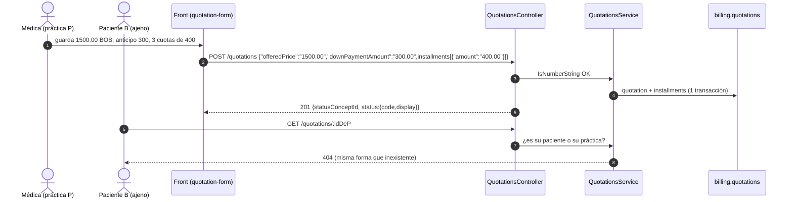

# TASK PROMPT: BR-25 — Cotizaciones y contabilidad del médico

> **MODO DE EJECUCIÓN:** este prompt se ejecuta en **Modo Planificación (Planning Mode)**.
> El desarrollador o el agente arranca investigando, sin tocar código fuente. Con eso escribe un
> `implementation_plan.md` detallado y espera la aprobación explícita del usuario. Después
> ejecuta los cambios en commits atómicos, verifica con pruebas unitarias y de integración, y
> **contra la API viva levantada**. El resultado queda documentado en `walkthrough.md`.

| Campo | Valor |
|---|---|
| **Cierra** | AG-35, AG-36, AG-37, AG-38, AG-39, AG-45 (anexo C) |
| **Severidad máxima** | **Bloqueante demo** (AG-35: ninguna cotización se guarda contra la API real). AG-37 es una **fuga de datos** entre pacientes y prácticas |
| **Repo(s)** | `mantra-core-health` (front y mock) · `mantra-core-health-redesa-api` (autorización y respuesta) |
| **Toca el modelo** | No. P35 (plan de pagos flexible) está cerrado en el modelo y en el DTO: el desalineado es el front |
| **Depende de** | Nada para AG-35 (front puro). **BR-06** también lista AG-37 y AG-39: acá se hace el filtrado por titularidad y el ocultamiento en la UI; BR-06 sólo siembra y emite roles. Coordinar para no duplicar |
| **Decisión previa** | Ninguna de README §8. **Decisión local** que el plan pide: de qué lado se acomoda el cockpit contable (AG-38, opciones a/b) |

---

## 1. Contexto de negocio y justificación técnica

### A. Por qué importa
El médico cotiza un tratamiento con plan de pagos flexible y lleva su contabilidad desde el
cockpit y el resumen («Cobrado/Pagado»). En `mockup` todo funciona porque el mock acepta
cualquier body. Contra la API real: **ninguna cotización se guarda** (los importes viajan como
`number` y la API exige texto), el listado muestra un badge vacío, **cualquier usuario con sesión
puede leer la cotización de cualquier paciente**, y las acciones contables mandan bodies que la
API rechaza o que sólo puede ejecutar un `SECURITY_ADMIN`. El cockpit además revienta con
`TypeError` al compensar.

### B. Estado del frontend (`mantra-core-health`, rama `mockup`)
- **AG-35:** `core/data-access/quotations/quotations.types.ts` tipa como `number`
  `Installment.amount` (`:19`), `NewQuotation.offeredPrice` (`:35`) y `downPaymentAmount`
  (`:39`). `features/quotations/quotation-form/quotation-form.ts` los arma como número en
  **dos** lugares (`:621-622`, `Number(this.precioOfrecido()) || 0`, y `:690-695`);
  `toInstallments` igual. También leen importes `features/quotations/flexible-payment-plan.ts` y
  `features/clinical-record/consultation/payment-plan-panel/payment-plan-panel.ts`. El mock
  (`core/mock/handlers/finance.handlers.ts:1137-1165`) acepta números y esconde el 400.
- **AG-36:** `quotations.types.ts:72,84` espera `status: QuotationStatus`;
  `features/quotations/quotation-list/quotation-list.html:65` hace
  `<app-badge [value]="cotizacion.status">`: contra la API queda vacío. El mock inventa
  `status:'DRAFT'` y `patientName` (`finance.handlers.ts:1158,1171`).
- **AG-37:** `quotations.client.ts` (`listQuotationsByPatient`, `getQuotation`), consumidos por
  `payment-plan-panel.ts:195-201` y `quotation-list.ts:152`.
- **AG-38:** `core/data-access/accounting/accounting.client.ts`:

  | Método | Body que manda | Respuesta que espera |
  | --- | --- | --- |
  | `runDepreciation` (`:359`) | `{ practiceId }` | `RunResult {amount, periodName, assets, transactionNumber}` |
  | `runAccruals` (`:371`) | `{ practiceId }` | `RunResult {…, objects}` |
  | `clearOpenItems` (`:304`) | `{ openItemIds }` | `ClearingResult {clearingDocumentId, clearedItems, clearedAmount}` |
  | `lockFiscalPeriod` (`:289`) | `{}` | `FiscalPeriod` |

  Los llaman `features/accounting/cockpit/cockpit.ts:335,361,388,411` y
  `features/accounting/resumen/resumen.ts:484` (el «Cobrado/Pagado» del médico).
  `cockpit.ts:417` hace `r.clearingDocumentId.slice(0, 8)`: con la respuesta real, `TypeError`.
  El mock (`finance.handlers.ts:627,686,780,848`) acepta esos bodies.
- **AG-39:** `features/accounting/accounting.ts:217-221,894-898` sí filtra `postJournal` por
  `SECURITY_ADMIN`; `cockpit.ts` **no tiene ningún filtro de roles** y ofrece amortizar,
  devengar, cerrar período, compensar y `advanceWorkflow` (`approve`, `post`, `reverse`,
  `:312`). `resumen.ts:484` (compensar) es la vista del médico.
- **AG-45:** `accounting.client.ts:289-294` tipa `lockFiscalPeriod` como `Observable<FiscalPeriod>`;
  `cockpit.ts:335` relee después (sin confirmar si lee campos del resultado).

### C. Estado de la API (`mantra-core-health-redesa-api`, rama `dev`)
- **AG-35:** `quotations/dto/create-quotation.dto.ts` pone `@IsNumberString()` en
  `installments[].amount` (`:63`), `offeredPrice` (`:122`) y `downPaymentAmount` (`:151`), con el
  mismo criterio que `billing/dto/service-catalog.dto.ts` (`:31`). Un `number` JSON falla
  `IsNumberString`; `enableImplicitConversion` no convierte a string un valor declarado string
  (comportamiento documentado de class-transformer; **sin confirmar en runtime**: es lo primero
  que se reproduce).
- **AG-36:** `quotations/dto/quotation-response.dto.ts:114` devuelve `statusConceptId` (uuid) y
  `createdAt`; `GET /quotations` devuelve `QuotationResponseDto[]` completos, sin `patientName`.
- **AG-37:** `quotations/controllers/quotations.controller.ts`: `POST` tiene
  `@Roles('PRACTITIONER','CLINICIAN')` (`:50-51`); **`GET` (`:67`) y `GET :id` (`:87`) no tienen
  `@Roles`**. `services/quotations.service.ts:165-191` busca por id o por paciente **sin filtrar
  por práctica, paciente ni actor**. `billing.quotations` (`database/SQL/17_billing/02_tables.sql:
  374-396`) tiene `practice_id`, `patient_profile_id` y `created_by_practitioner_profile_id` y
  **no tiene `tenant_id`**: la RLS por tenant (`patches/2026-08-05_tenant_rls.sql`) no puede
  cubrirla si se basa en esa columna (sin confirmar cómo decide qué tablas cubre). Además
  `listQuotationsByPatient` hace una consulta de cuotas **por cotización** (N+1).
- **AG-38:** `RunDepreciationDto` (`accounting/dto/asset.dto.ts:123`) exige `practiceId`,
  `fiscalPeriodId`, `depreciationExpenseAccountId` y responde `{depreciatedAssets,
  transactionIds}`; `RunAccrualsDto` (`dto/accrual.dto.ts:134`) exige `accrualObjectId`,
  `fiscalPeriodId`, `practiceId`, `postingDate` y responde `{postedLines, transactionIds}`;
  `CreateClearingDto` (`dto/subledger.dto.ts:127`) exige `tenantId`, `practiceId`, `bankAccountId`,
  `clearingDate`, `items[{openItemId, clearedAmount…}]` (no `openItemIds` → **400** por whitelist)
  y responde `{id, clearingNumber, transactionId}`.
- **AG-39:** `@Roles('SECURITY_ADMIN')` en `depreciation/run` (`accounting-asset.controller.ts:38`),
  `accruals/run` (`accounting-accrual.controller.ts:38`), `clearing-documents`
  (`accounting-subledger.controller.ts:38`), `fiscal-periods/:id/lock`
  (`accounting-fiscal.controller.ts:46`), `journal-transactions/:id/post` y `/reverse`
  (`accounting-ledger.controller.ts:251-252,279-280`); `:id/approve` admite `SECURITY_ADMIN` o
  `ACCOUNTING_APPROVER` (`:238-239`). Las lecturas del cockpit sí incluyen `PRACTITIONER`
  (`accounting-cockpit.controller.ts:38,54,69`).
- **AG-45:** `fiscal-periods/:id/lock` devuelve `AccountingStatusDto {ok, id?}`
  (`dto/journal.dto.ts:411`) y acepta `LockPeriodDto {reason?}` (`dto/fiscal.dto.ts:91`).

### D. Aislamiento
- **Fuera de alcance:** la **pasarela de pago** (cobrar la cuota, `payment-state`, checkout). La
  cotización es una propuesta: guardarla no cobra nada.
- No se cambia el modelo contable ni el plan de cuentas; sólo contratos y autorización de las
  operaciones listadas. Las lecturas contables verificadas OK en el anexo C no se tocan.

---

## 2. Flujo de Git y entrega

```bash
cd mantra-core-health && git status && git fetch origin
git checkout -b <dev>/fix-cotizaciones-y-cockpit-contable origin/mockup
cd ../mantra-core-health-redesa-api && git status && git fetch origin
git checkout -b <dev>/fix-cotizaciones-autorizacion origin/dev
```

- Commits atómicos, por ejemplo: `fix(quotations): los importes viajan como texto con dos
  decimales`, `fix(mock): cotizaciones validan importes como la API`, `fix(quotations): el
  estado se muestra en palabras`, `fix(quotations): leer una cotización exige ser su médico o su
  paciente`, `fix(accounting): el cockpit manda los campos obligatorios y lee la respuesta real`,
  `fix(accounting): el cockpit ofrece sólo lo que el rol puede hacer`.
- PRs: front `gh pr create --base mockup --reviewer jsaldias39,PabloArauzCaballero`; API
  `gh pr create --base dev --reviewer jsaldias39,PabloArauzCaballero`. **El merge exige revisión
  humana.** El flujo termina en abrir los PR. El PR del front (AG-35) no espera al de la API.

---

## 3. Diagrama



---

## 4. Archivos a modificar o crear

**Front (`mantra-core-health`)**
- `[MODIFICAR]` `src/app/core/data-access/quotations/quotations.types.ts`: `amount`,
  `offeredPrice` y `downPaymentAmount` como `string`; `status` según la respuesta real (`{code,
  display}` si la API lo agrega, o `statusConceptId` + resolución de concepto); sin `patientName`
  si la API no lo trae.
- `[MODIFICAR]` `src/app/features/quotations/quotation-form/quotation-form.ts` (`:621-622`,
  `:690-698`, `toInstallments`), `features/quotations/flexible-payment-plan.ts` y
  `features/clinical-record/consultation/payment-plan-panel/payment-plan-panel.ts`: los cálculos
  siguen en número (o decimal seguro) y **se serializan** a texto con dos decimales al armar el
  body; la suma anticipo + cuotas = precio se valida sobre el valor serializado.
- `[MODIFICAR]` `src/app/features/quotations/quotation-list/quotation-list.html` y `.ts`: badge
  con el estado en palabras.
- `[MODIFICAR]` `src/app/core/data-access/accounting/accounting.client.ts` y `accounting.types.ts`
  (`RunResult`, `ClearingResult`, respuesta de `lock`): según la opción de AG-38.
- `[MODIFICAR]` `src/app/features/accounting/cockpit/cockpit.ts` + `.html` y
  `features/accounting/resumen/resumen.ts`: acciones visibles según `auth.roles()` (patrón de
  `accounting.ts:217-221`); sin `.slice` sobre campos que la API no devuelve.
- `[MODIFICAR]` `src/app/core/mock/handlers/finance.handlers.ts` (`:627,686,780,848,1137-1171`):
  400 con importes numéricos, 400 con `openItemIds`, respuestas con la forma de la API, sin
  `status` literal ni `patientName`.

**API (`mantra-core-health-redesa-api`)**
- `[MODIFICAR]` `src/modules/quotations/controllers/quotations.controller.ts`:
  `@Roles('PRACTITIONER','CLINICIAN','PATIENT')` en los dos `GET`.
- `[MODIFICAR]` `src/modules/quotations/services/quotations.service.ts` y `repositories/*`:
  profesional → sólo cotizaciones de su práctica; paciente → sólo las de su `patientProfileId`;
  si no le pertenece, **404**. Cuotas en lote (sin N+1).
- `[MODIFICAR]` `src/modules/quotations/dto/quotation-response.dto.ts`: `status: {code, display}`
  resuelto (patrón `InventoryConceptDto`), manteniendo `statusConceptId`.
- `[MODIFICAR]` (opción a de AG-38) `accounting-asset.controller.ts`,
  `accounting-accrual.controller.ts`, `accounting-subledger.controller.ts` + DTOs: variantes «de
  práctica» que resuelven período, cuentas y banco por defecto. Si el médico puede saldar su
  partida, `PRACTITIONER` en `clearing-documents` acotado a su práctica.
- `[CREAR]` `test/integration/quotations-authorization.int-spec.ts` (paciente A no ve a B; médico
  de P no ve la de Q; médico de P ve la de su paciente).

---

## 5. Reglas de implementación

- **Paso 1 del plan — AG-38 (decisión local):**
  - *Opción a — la API se acomoda:* endpoints «de práctica» que resuelven período abierto,
    cuentas por defecto y banco. Pro: el cockpit del médico queda simple. Contra: la API decide
    cuentas por defecto (hay que saber de dónde salen; no inventarlas).
  - *Opción b — el front se acomoda:* pide período, cuenta de gasto, banco y fecha, y mapea las
    respuestas reales. Pro: cero API. Contra: formularios contables para un médico.
  - En los dos casos, el mock se alinea al contrato elegido.
- **Importes como texto en todo el repo** (regla ya vigente en seguros, farmacia y catálogo):
  nunca `number` en el cable, nunca coma flotante para sumar dinero en la validación.
- **Autorización real en la API** (AG-37): ocultar botones no es seguridad. 404, no 403, para lo
  ajeno. Los roles los emite BR-06; si todavía no existe `ACCOUNTING_APPROVER` sembrado, se anota.
- Un caso de uso = una transacción (cotización + cuotas); `row_version` → `@Version()`; estados
  por `*_concept_id`. El listado de cotizaciones es por paciente: si crece, cursor (M34), no página.
- No debilitar pruebas: los specs que fijan importes numéricos se reescriben con texto.

---

## 6. Criterios de aceptación (Gherkin)

```gherkin
Escenario: Guardar una cotización contra la API real
  Dado un servicio de 1500.00 BOB, anticipo 300 y 3 cuotas de 400
  Cuando la médica guarda la cotización
  Entonces el body lleva "offeredPrice":"1500.00" y la API responde 201
  Y al recargar el listado la cotización sigue ahí

Escenario: El mock rechaza importes numéricos
  Dado un body con offeredPrice: 1500 (número)
  Cuando llega al mock o a la API
  Entonces los dos responden 400

Escenario: Estado en palabras
  Dada una cotización recién creada
  Cuando se lista
  Entonces el badge muestra "Borrador", no vacío ni un uuid

Escenario: Cotización ajena
  Dado el paciente A
  Cuando pide GET /quotations?patientProfileId=<B> o GET /quotations/<id de B>
  Entonces recibe 404 o una lista vacía
  Y el médico M de la práctica P recibe 404 al pedir una cotización de la práctica Q

Escenario: Cockpit del médico
  Dado un PRACTITIONER
  Cuando abre el cockpit
  Entonces no ve "Amortizar", "Devengar", "Cerrar período" ni "Postear/Revertir"

Escenario: Compensar una partida
  Dada una partida abierta por cobrar de la práctica del médico
  Cuando pulsa "Cobrado" (si se habilita para PRACTITIONER)
  Entonces se crea un documento de compensación, la partida sale del listado y no hay TypeError

Escenario: Cierre de período
  Dado un período abierto
  Cuando el aprobador lo cierra
  Entonces la pantalla relee el ejercicio y lo muestra "Cerrado"
```

---

## 7. Definition of Done

- [ ] `implementation_plan.md` aprobado, con la opción de AG-38 escrita y el reparto con BR-06.
- [ ] **400 reproducido primero** contra la API viva con el body actual (evidencia del «antes»).
- [ ] Importes como texto en tipos, formulario, plan flexible y panel; mock con la misma regla.
- [ ] `GET /quotations*` con rol y titularidad; int-spec de autorización en verde; sin N+1.
- [ ] Respuesta con `status` legible; listado sin campos inexistentes.
- [ ] Cockpit y resumen: acciones por rol, bodies y respuestas reales, sin `TypeError`.
- [ ] API: `corepack yarn lint`, `typecheck`, `test`, `test:integration
      --testPathPatterns=quotations-authorization`. Front: `lint`, `typecheck`, `build`,
      `test --watch=false`, `check-*.mjs` a mano.
- [ ] **Evidencia de runtime contra la API viva** (`UI → request → response → persistencia →
      recarga → UI`): cotización guardada (request con importes texto, 201, `SELECT` de
      `billing.quotations` y `quotation_installments`, recarga del listado con el badge);
      `curl` de un paciente ajeno → 404; cockpit como `PRACTITIONER` (captura sin acciones
      reservadas) y como `SECURITY_ADMIN` (amortización real con toast sin «undefined»).
- [ ] PRs abiertos con revisores `jsaldias39` y `PabloArauzCaballero`, `walkthrough.md` con la
      evidencia.

---

## 8. Plan de QA

### A. Pruebas automatizadas
```bash
corepack yarn test --watch=false --include=src/app/features/quotations/**                 # front
corepack yarn test --watch=false --include=src/app/features/accounting/**
corepack yarn test --watch=false --include=src/app/core/mock/handlers/finance*
corepack yarn test --testPathPatterns="quotations|accounting-(asset|accrual|subledger)"   # API
corepack yarn test:integration --testPathPatterns=quotations-authorization
```
- Spec del formulario: el body serializado tiene los tres importes como string con 2 decimales.
- Spec del cockpit: con roles `['PRACTITIONER']` no se renderizan las acciones reservadas.

### B. Integración (API viva)
1. Stack de la API con seeds; médica y dos pacientes de seed.
2. Consulta → plan de pagos → guardar cotización → listado → recargar.
3. Con el token del paciente B, pedir la cotización del paciente A (`curl`): 404.
4. Cockpit como `SECURITY_ADMIN`: amortizar, devengar, compensar, cerrar período.

### C. Verificación manual y logs
- Log de la API: ningún `offeredPrice must be a number string`.
- Consola del navegador: ningún `TypeError` en el cockpit.
