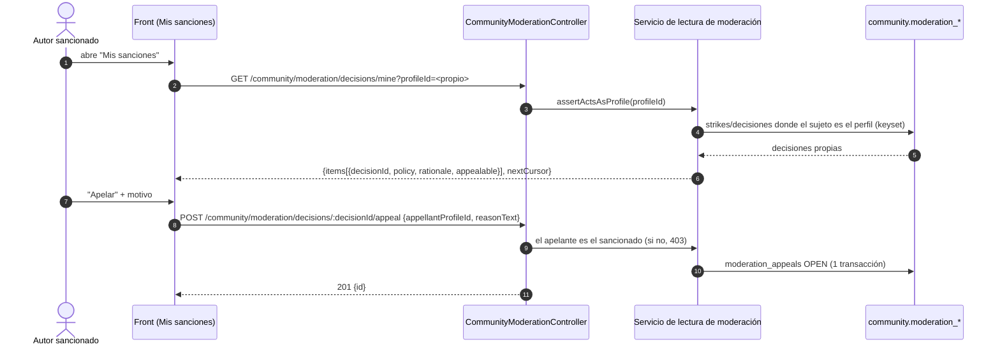

# TASK PROMPT: BR-27 — Comunidad: apelación del sancionado y funciones de la API sin UI (incluye grupos médicos)

> **MODO DE EJECUCIÓN:** este prompt se ejecuta en **Modo Planificación (Planning Mode)**.
> El desarrollador o el agente arranca investigando, sin tocar código fuente. Con eso escribe un
> `implementation_plan.md` detallado y espera la aprobación explícita del usuario. Después
> ejecuta los cambios en commits atómicos, verifica con pruebas unitarias y de integración, y
> **contra la API viva levantada**. El resultado queda documentado en `walkthrough.md`.

| Campo | Valor |
|---|---|
| **Cierra** | AG-18, AG-23 (anexo C) · CV-26 (anexo E) |
| **Severidad máxima** | Media |
| **Repo(s)** | `mantra-core-health-redesa-api` (una lectura nueva de moderación) · `mantra-core-health` (pantallas y cliente) |
| **Toca el modelo** | No. Las tablas existen: `community.moderation_*`, `social_follows`, `user_blocks`, `review_responses`, `polls`, `poll_options`, `poll_votes`, y `medical_groups.groups`/`group_members` (`diagram_66_medical_groups.puml`) |
| **Depende de** | Nada. Blanda: BR-22 (si «Mis sanciones» se abre desde una notificación, su destino se mapea allá) |
| **Decisión previa** | Ninguna de README §8. **Decisión local de producto** que el plan pide: qué funciones de AG-23 entran en la demo y si CV-26 (grupos médicos) entra |

---

## 1. Contexto de negocio y justificación técnica

### A. Por qué importa
La red social de la plataforma tiene en la API funciones que el usuario nunca ve: el autor
sancionado **no puede apelar** (la API tiene la escritura pero él no puede leer la decisión que
necesita apelar), el profesional **no puede contestar una reseña**, nadie puede seguir,
bloquear, crear una encuesta ni votar. Y un módulo entero, **grupos médicos** (equipo alrededor
de un servicio del catálogo con roster, cargos e invitaciones), tiene 8 rutas y cero pantallas.
Para una demo de comunidad y de profesionales, «Seguir» y «Responder reseña» son lo mínimo.

### B. Estado del frontend (`mantra-core-health`, rama `mockup`)
- **AG-18:** `core/data-access/community/community.client.ts:730` (`appealDecision`) **no tiene
  ningún consumidor** en `features/` (verificado). La moderación
  (`features/admin/moderation/moderation.ts`) está detrás de `roles:['SECURITY_ADMIN']`
  (`core/navigation/navigation.map.ts:853-866`).
- **AG-23:** métodos del cliente sin consumidor (verificado con `grep` en `features/`, sin specs):
  `readReactions` (`:387`), `follow`/`unfollow` (`:407`/`:425`), `block`/`unblock`
  (`:473`/`:490`), `listFollows` (`:504`), `listBookmarks` (`:521`), `listBlocks` (`:540`),
  `listReviews` (`:596`), `publishReview` (`:774`), `respondToReview` (`:814`), `readPoll`
  (`:1235`). No hay métodos para **crear encuesta** ni **votar**.
- **CV-26:** ningún archivo del front menciona `medical-groups`; `medical_groups` 8/8 rutas sin UI.
- Ya existen `features/public-profile/*` (ficha pública `/{p,o,f,l,s}/:slug`), `features/feed`,
  `features/groups` (grupos de la comunidad, **no** grupos médicos) y
  `features/admin/moderation`.

### C. Estado de la API (`mantra-core-health-redesa-api`, rama `dev`)
- **AG-18:** `community/controllers/community-moderation.controller.ts`:
  `POST reports` (`:54`), `POST moderation/decisions/:decisionId/appeal` (`:78`, **sin
  `@Roles`**), y `GET moderation/queue` (`:109-110`), `GET moderation/decisions` (`:119-120`) y
  `GET moderation/appeals` (`:132-133`) con **`@Roles('SECURITY_ADMIN')`**. El autor nunca
  conoce el `decisionId`. El servicio de apelación sólo comprueba que el actor actúe como el
  perfil apelante (`services/community-moderation.service.ts:192-194`,
  `visibility.assertActsAsProfile`): **sin confirmar** que verifique que ese perfil sea el
  sancionado.
- Modelo (`database/SQL/19_community/02_tables.sql`): `moderation_queue` (`:489`,
  `content_type_concept_id`, `content_ref_id`), `moderation_decisions` (`:509`,
  `moderation_queue_id`, `decision_concept_id`, `policy_concept_id`, `rationale_text`),
  `moderation_strikes` (`:526`, **`subject_profile_id`**, `moderation_decision_id`) y
  `moderation_appeals` (`:542`, `appellant_profile_id`, `reason_text NOT NULL`). El vínculo
  autor → decisión sale del strike o del contenido referido por la cola.
- **AG-23:** `community-social.controller.ts` (follows, blocks, bookmarks),
  `community-reviews.controller.ts:50,67,87` (`POST|GET :profileId/reviews`,
  **`POST :profileId/reviews/:reviewId/responses`**), `community-polls.controller.ts:40,52,64`
  (`POST posts/:postId/polls`, `POST polls/:pollId/votes`, `GET polls/:pollId`; DTO
  `dto/poll.dto.ts:20-72`). Contratos verificados OK en el anexo C (follows, bookmarks, blocks).
- **CV-26:** `medical_groups/controllers/medical-groups.controller.ts` con
  `@Roles('PRACTITIONER','CLINICIAN')` a nivel de clase (`:44-45`): `GET /medical-groups`
  (`:50`, pestañas `historico|enviadas|recibidas`), `GET patients/:patientProfileId/conditions`
  (`:73`), `GET :id` (`:84`), `POST` (`:96`), `POST :id/members/:memberId/respond` (`:107`),
  `POST :id/reschedule-requests` (`:121`) y `/respond` (`:132`), `PATCH :id/exercise-notes`
  (`:143`). Ciclo `PENDING_TEAM → SCHEDULED → RESCHEDULE_PENDING → CLOSED`; notas sólo después de
  la cita y dentro de 7 días (luego 422). Módulo 66 en `schemas.catalog.ts:46`.

### D. Aislamiento
- Fuera de alcance: **pasarela de pago** (el «pago acordado por cargo» de grupos médicos se
  muestra, no se cobra) y **delivery**.
- No se toca la cola de moderación del `SECURITY_ADMIN` ni su contrato. El chat F4 es BR-22.
- Tendencias del muro (P38) son BR-23.

---

## 2. Flujo de Git y entrega

```bash
cd mantra-core-health-redesa-api && git status && git fetch origin
git checkout -b <dev>/feat-moderacion-mis-sanciones origin/dev
cd ../mantra-core-health && git status && git fetch origin
git checkout -b <dev>/feat-comunidad-funciones-sin-ui origin/mockup
```

- Commits atómicos, por ejemplo: `feat(community): el autor lee sus propias decisiones de
  moderación`, `fix(community): sólo el sancionado apela`, `feat(community): mis sanciones y
  apelar`, `feat(public-profile): seguir y responder reseña`, `feat(feed): encuestas en
  publicaciones`, `feat(medical-groups): grupos médicos del profesional`.
- PRs: API `gh pr create --base dev --reviewer jsaldias39,PabloArauzCaballero`; front
  `gh pr create --base mockup --reviewer jsaldias39,PabloArauzCaballero`. **El merge exige
  revisión humana.** El flujo termina en abrir los PR.

---

## 3. Diagrama



---

## 4. Archivos a modificar o crear

**API (`mantra-core-health-redesa-api`)**
- `[MODIFICAR]` `src/modules/community/controllers/community-moderation.controller.ts`: `[CREAR]`
  `GET moderation/decisions/mine?profileId=&cursor=` (con sesión, sin `SECURITY_ADMIN`).
  **Declararla antes** de cualquier `moderation/decisions/:id` para que no la capture.
- `[CREAR]` `src/modules/community/services/community-moderation-read.service.ts` (o ampliar el
  existente): decisiones propias por `moderation_strikes.subject_profile_id` y, si una decisión no
  genera strike, por el autor del contenido referido por `moderation_queue.content_ref_id`
  (confirmar en el plan cuál cubre todos los casos). Paginación por cursor.
- `[CREAR]` `src/modules/community/dto/*`: DTO de la lectura propia (sin datos del denunciante ni
  del moderador: sólo política, motivo, acción, fecha y si admite apelación).
- `[MODIFICAR]` `src/modules/community/services/community-moderation.service.ts` (`appeal`): el
  apelante debe ser el sancionado; si no, 403. Una apelación abierta por decisión.
- `[CREAR]` int-spec `test/integration/community-moderation-appeal.int-spec.ts`.

**Front (`mantra-core-health`)**
- `[MODIFICAR]` `src/app/core/data-access/community/community.client.ts` + `community.types.ts`:
  `listMyModerationDecisions`, `createPoll`, `votePoll`.
- `[CREAR]` `src/app/features/account/moderation/my-sanctions/*` (por `ng generate`): «Mis
  sanciones» con «Apelar»; ruta hija de «Mi cuenta» sin guard de rol especial.
- `[MODIFICAR]` `src/app/features/public-profile/*`: «Seguir/Dejar de seguir» (con el estado desde
  `listFollows`) y, en la ficha del profesional, «Responder» debajo de cada reseña (sólo el dueño
  del perfil).
- `[MODIFICAR]` `src/app/features/feed/*`: crear encuesta al publicar y votar (si producto la
  prioriza); bloquear desde el menú de un autor.
- `[CREAR]` (si CV-26 entra) `src/app/core/data-access/medical-groups/*` y
  `src/app/features/medical-groups/*`: listado por pestaña, alta del grupo sobre un servicio del
  catálogo, invitación por cargo, responder invitación, proponer y resolver cambio de horario,
  notas del procedimiento.
- `[MODIFICAR]` `src/app/core/mock/handlers/community.handlers.ts` (y uno nuevo
  `medical-groups.handlers.ts` si CV-26 entra): mismas rutas y respuestas que la API.
- `[MODIFICAR]` `core/navigation/navigation.map.ts`: entradas nuevas con los roles que la API
  exige (grupos médicos: `PRACTITIONER`/`CLINICIAN`).

---

## 5. Reglas de implementación

- **Paso 1 del plan (decisión local):** qué entra en la demo, con estas opciones:
  - *Mínimo:* «Mis sanciones + Apelar», «Seguir» en la ficha pública y «Responder reseña».
    Pro: cierra AG-18 y lo más visible de AG-23 con poco. Contra: encuestas, bloqueos y grupos
    médicos siguen sin UI.
  - *Comunidad completa:* lo anterior + encuestas + bloquear + listas de seguidos/guardados.
  - *Con grupos médicos (CV-26):* confirmar primero si el módulo REDESA está en el alcance de la
    demo; es una feature entera (formulario, ciclo de vida, ventana de 7 días).
- **Privacidad de la moderación:** el autor ve **su** decisión, nunca quién lo denunció ni notas
  internas del moderador. Un tercero que pide las decisiones de otro perfil recibe 403.
- **Autorización en la API:** ocultar un botón no es seguridad. «Responder reseña» lo valida la
  API (dueño del perfil); si hoy no lo valida, se anota y se corrige en el mismo PR.
- **Datos clínicos en grupos médicos:** `GET /medical-groups/patients/:id/conditions` expone
  diagnósticos: la pantalla sólo lo pide con un paciente vinculado al médico (verificar en el
  plan qué control aplica el servicio; si no aplica ninguno, anotarlo como hallazgo).
- Un caso de uso = una transacción; `moderation_appeals` y decisiones no se editan (tratar como
  append-only); estados por `*_concept_id`; paginación por cursor (M34).
- Mobile-first, estados M34 y copy en castellano del producto; nada de «undefined» en pantalla.

---

## 6. Criterios de aceptación (Gherkin)

```gherkin
Escenario: El autor ve sus decisiones
  Dado un autor con una publicación REMOVED por moderación
  Cuando abre "Mis sanciones"
  Entonces ve su decisión con la política y el motivo, y no ve las de otros perfiles

Escenario: Apelar
  Dado ese autor
  Cuando apela con su appellantProfileId y un motivo
  Entonces recibe 201 y la apelación queda OPEN en la cola del SECURITY_ADMIN

Escenario: Un tercero no apela ni lee
  Dado otro usuario
  Cuando pide las decisiones de un perfil ajeno o apela una decisión que no es suya
  Entonces recibe 403

Escenario: Responder una reseña
  Dado un profesional con una reseña recibida
  Cuando escribe su respuesta
  Entonces la ficha pública la muestra debajo de la reseña, también al recargar

Escenario: Seguir un perfil
  Dado un paciente en una ficha pública
  Cuando toca "Seguir"
  Entonces GET /community/follows la incluye y el botón pasa a "Dejar de seguir"

Escenario: Grupo médico (si entra en la demo)
  Dado un médico que arma un grupo sobre un servicio del catálogo
  Cuando invita a un colega por cargo
  Entonces el colega ve la invitación en "recibidas" y puede aceptarla
  Y el grupo pasa a SCHEDULED cuando el equipo aceptó
```

---

## 7. Definition of Done

- [ ] `implementation_plan.md` aprobado, con el alcance de AG-23 y de CV-26 escrito.
- [ ] Lectura `decisions/mine` con cursor y titularidad; apelación restringida al sancionado;
      int-spec de apelación en verde.
- [ ] **Ruta nueva mapeada:** `node dist/src/main.js` + `grep "Mapped {/community/moderation/decisions/mine"`
      en el log; el `*.module.spec.ts` de community exige `CommunityModerationController`.
- [ ] Front: «Mis sanciones», «Seguir», «Responder reseña» (y lo que el plan haya sumado); mock
      alineado.
- [ ] API: `corepack yarn lint`, `typecheck`, `test`, `test:integration
      --testPathPatterns=community-moderation-appeal`. Front: `lint`, `typecheck`, `build`,
      `test --watch=false`, `check-*.mjs` a mano.
- [ ] **Evidencia de runtime contra la API viva** (`UI → request → response → persistencia →
      recarga → UI`):
  - moderador (`SECURITY_ADMIN`) retira un post → el autor abre «Mis sanciones» → apela →
    `SELECT` en `community.moderation_appeals` → el moderador ve la apelación → recarga;
  - «Responder reseña»: request, fila en `community.review_responses`, `curl` de la ficha pública
    con la respuesta;
  - «Seguir»: fila en `community.social_follows` y estado del botón tras recargar;
  - grupos médicos (si entra): alta → invitación → aceptación con dos médicos de seed.
- [ ] PRs abiertos con revisores `jsaldias39` y `PabloArauzCaballero`, `walkthrough.md` con la
      evidencia.

---

## 8. Plan de QA

### A. Pruebas automatizadas
```bash
corepack yarn test --testPathPatterns="community-moderation|community-reviews|community-polls"   # API
corepack yarn test:integration --testPathPatterns=community-moderation-appeal
corepack yarn test --watch=false --include=src/app/features/account/moderation/**                # front
corepack yarn test --watch=false --include=src/app/features/public-profile/**
corepack yarn test --watch=false --include=src/app/core/data-access/community/**
```
- Spec del servicio de lectura: nunca devuelve el denunciante ni `decided_by_user_id`.
- Spec del componente: «Apelar» deshabilitado si ya hay una apelación abierta.

### B. Integración (API viva)
1. Stack de la API con seeds; tres usuarios: autor, tercero y `SECURITY_ADMIN`.
2. Reporte → decisión → «Mis sanciones» → apelación → resolución.
3. Ficha pública de un profesional: reseña del paciente → respuesta del profesional → seguir.
4. Con el token del tercero: `curl` a `decisions/mine?profileId=<autor>` → 403.

### C. Verificación manual y logs
- Log de la API: ningún 403 inesperado en `decisions/mine` para el dueño.
- Revisión visual en móvil de «Mis sanciones» y de la respuesta bajo la reseña.
