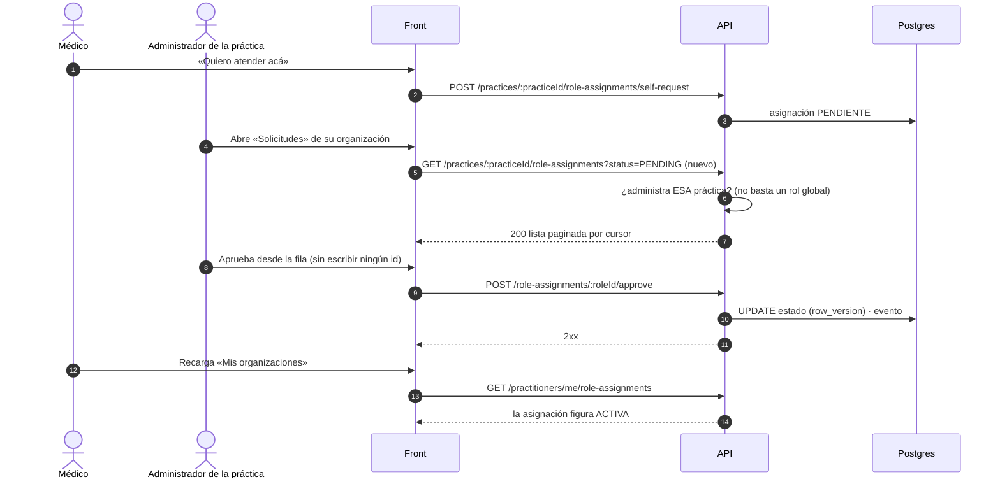

# TASK PROMPT: BR-28 — Organización: aprobar médicos, miembros, hubs de administración con listados y verificación de matrícula

> **MODO DE EJECUCIÓN:** este prompt se ejecuta en **Modo Planificación (Planning Mode)**.
> El desarrollador o el agente arranca investigando, sin tocar código fuente. Con eso escribe un
> `implementation_plan.md` detallado y espera la aprobación explícita del usuario. Después
> ejecuta los cambios en commits atómicos, verifica con pruebas unitarias y de integración, y
> **contra la API viva**. El resultado queda documentado en `walkthrough.md`.

| Campo | Valor |
|---|---|
| **Cierra** | CV-13, CV-14, CV-20 (anexo E) · ID-19 (anexo A) |
| **Severidad máxima** | Media |
| **Repo(s)** | `mantra-core-health-api` (clon `mantra-core-health-redesa-api`) y `mantra-core-health` (front) |
| **Toca el modelo** | No. Todas las lecturas nuevas son sobre tablas que ya existen (`delegated_access`, `auth_providers`, `health_context`, `practice`, `directory`, `profiles`) |
| **Depende de** | **BR-06** para que existan quienes usan estos hubs: `IDENTITY_ADMIN`, `SOURCE_ADMIN`, `CONTEXT_CURATOR`, `QUALITY_REVIEWER` y `PLATFORM_ADMIN` no se siembran (ID-18). Hasta entonces se prueba con `SUPERADMIN` (comodín de `roles.guard.ts:29`) o `SECURITY_ADMIN` |
| **Decisión previa** | Ninguna de README §8. Tiene **tres decisiones propias** (D-BR28-1…3, sección 5), que se piden en el paso 1. **Fuera de alcance:** trips, pings y geocercas de `geo` (delivery) |

---

## 1. Contexto de negocio y justificación técnica

### A. Por qué importa
Una organización tiene que poder **decidir quién atiende en ella** y **administrar a su gente**.
Hoy el médico pide vincularse a una práctica y nadie puede aprobarlo desde la UI; la ficha de la
organización no deja cambiar el rol de un miembro ni darlo de baja; y cinco hubs de
administración son menús de formularios que **piden identificadores pegados a mano** porque la
API no expone listados. Además, el médico carga su matrícula y su título y la plataforma no tiene
una bandeja para verificarlos. Todo esto es operación diaria: sin listados, el administrador no
puede ver lo que ya existe.

### B. Estado del frontend (`mantra-core-health`, `origin/mockup` @ `95472903`)
- **Dos caminos de «el médico pide entrar a una organización»** (el anexo E sólo nombra uno):
  1. **Afiliación por tenant (TP-2), ya con UI.** `core/data-access/directory/directory.client.ts:318-356`
     llama `GET /tenants/:tenantId/practitioner-requests` y `POST …/:affiliationId/approve|reject`.
     La pantalla es `features/organization/organization-panel.ts:235-295`. **Falta `revoke`**
     (`POST …/:affiliationId/revoke` existe en la API y no tiene cliente).
  2. **Asignación de rol en una práctica (Carril 18), sin aprobación.**
     `features/organizations/my-organizations.ts:204` llama `selfRequestAffiliation` →
     `POST /practices/:practiceId/role-assignments/self-request`
     (`core/data-access/practice-sites/practice-sites.client.ts:81-94`). El médico ve el estado
     con `GET /practitioners/me/role-assignments` (`:67-78`). **Nadie la aprueba desde la UI** (CV-14).
- **Miembros:** el cliente ya lista (`GET /tenants/:id/memberships`, `directory.client.ts:205-223`)
  e incorpora (`POST …/memberships`, `:148-156`), pero **no** transfiere, cambia el rol ni da de
  baja (UC-04-07/08/09).
- **Hubs sin listados** (CV-13). Rutas `administration/*` en `src/app/app.routes.ts:253-269` y
  `:944-981`; menú en `core/navigation/navigation.map.ts:783-949`:
  - `delegated-access` (`SECURITY_ADMIN`): 12 pantallas de operación en `features/delegated-access/`.
    `practitioner-delegate-form.ts:28-33` y `:70-76`: las tres referencias obligatorias «se pegan
    como UUID» porque «el backend no expone todavía ni listados ni búsqueda» (ID-19).
  - `identity-providers` (`IDENTITY_ADMIN`): 15 pantallas en `features/auth-providers/`, todas
    de escritura.
  - `identity-assurance` (`SECURITY_ADMIN`): **este hub SÍ tiene lectura** —
    `features/identity-assurance/case-queue/case-queue.ts` usa `listCaseQueue`
    (`core/data-access/identity/identity-admin.client.ts:155-170`) y está enrutado en
    `app.routes.ts:1690`—. **Discrepancia con CV-13**, que lo cuenta con 0 lecturas. Le faltan
    los listados de autoridades y políticas.
  - `health-context` (roles de `HealthContextController`): 8 formularios en
    `features/health-context/`; la única lectura es `contexts/resolve`.
  - `geolocation` (`SECURITY_ADMIN`): 10 formularios en `features/geo/`; la mayoría son de
    delivery (CV-25).
- **Verificación:** el médico pide la verificación de su matrícula con
  `POST /identity/me/practitioner/license-verification` (`core/data-access/identity/identity.client.ts:86-91`).
  No hay cliente para `POST /profiles/credentials/:credentialId/verify` (CV-20).

### C. Estado de la API (`origin/dev` @ `7541797c`)
- **Afiliación por tenant** (`src/modules/profiles/controllers/tenant-practitioner-requests.controller.ts`):
  `GET :tenantId/practitioner-requests` (`:54`), `approve` (`:69`), `reject` (`:81`), `revoke`
  (`:104`). **Sin `@Roles`** a propósito (`:36-40`): exige membresía administrativa **en ese
  tenant**, no un rol global.
- **Asignación de rol en una práctica** (`src/modules/practice/controllers/role-assignments.controller.ts`):
  `POST :roleId/approve|reject|suspend|end|support-assignments`, **todas
  `@Roles('SECURITY_ADMIN')`** (`:39-94`). En `practices.controller.ts` hay `GET` de prácticas,
  organización y sedes (`:90`, `:124`, `:147`) pero **ningún `GET` de las asignaciones pendientes
  de una práctica**. El dueño de la práctica no puede listar ni decidir.
- **Miembros** (`src/modules/directory/controllers/tenants.controller.ts`):
  `POST :tenantId/memberships/:membershipId/transfer` (`:266`), `PATCH …/role` (`:279`),
  `POST …/offboard` (`:297`). **Sin `@Roles`**: la autorización está en el servicio (sin
  confirmar que exija administrador del tenant; leer `membershipsService` en el plan).
- **`delegated_access`**: 12 rutas, **todas `POST`/`PATCH`**, todas `SECURITY_ADMIN`
  (`src/modules/delegated_access/controllers/*`). **Ningún `GET`.** Tablas del modelo
  (`mantra-core-health-model/SQL/29_delegated_access/02_tables.sql`):
  `organization_user_assignments` (con `tenant_membership_id`), `delegated_permission_sets`
  (con `tenant_id`), `delegated_permission_set_items`, `practitioner_delegate_assignments`,
  `delegated_access_grants`, `delegated_access_approval_requests`, `delegation_events`.
- **`auth_providers`** (`auth-providers.controller.ts`): 13 rutas `POST`/`PUT`, **ningún `GET`**,
  roles `IDENTITY_ADMIN`/`AUTH_SERVICE`. En el modelo, `provider_protocol_configs.client_secret_ref`
  y `provider_signing_keys` (sólo `public_key` y `certificate`) conviven en las mismas tablas.
- **`identity_assurance`**: `GET /identity/verification-cases` (`identity-cases.controller.ts:66`,
  `SECURITY_ADMIN`) y el autoservicio `GET /identity/me/verification-cases(/:caseId)`. Sin `GET`
  de autoridades ni de políticas.
- **`health_context`** (`health-context.controller.ts`): 11 `POST` y un solo `GET`
  (`contexts/resolve`, `:250`). Roles `SOURCE_ADMIN`, `CONTEXT_CURATOR`, `QUALITY_REVIEWER`,
  `CONTEXT_CONSUMER`, `PLATFORM_ADMIN`: ninguno sembrado (ID-18).
- **`geo`**: todo `SECURITY_ADMIN`. Excluido por delivery: `trips`, `pings`, `geofences` y
  `geofence-events`. Queda, sin delivery: `tracked-subjects` (alta, `last-position`,
  `revoke-consent`) y `tracking-sessions`. **Sin confirmar** que tengan un caso de uso fuera de
  delivery (CV-25).
- **Verificación de matrícula y título (CV-20):**
  - **Matrícula:** se verifica por un caso de `identity_assurance`. El médico lo abre con
    `POST /identity/me/practitioner/license-verification`; el revisor decide en
    `POST /identity/manual-review/:id/decision`; el efecto pasa la matrícula de `AUTH_PENDING` a
    `AUTH_ACTIVE` (`identity_assurance/services/identity-verification-effects.service.ts:188`). La
    cola **ya existe** (`GET /identity/verification-cases`) y tiene pantalla: hace falta filtrarla
    por tipo `PRACTITIONER_LICENSE` y mostrar la matrícula y su PDF en el detalle.
  - **Título:** `POST /profiles/credentials/:credentialId/verify` (`SECURITY_ADMIN`,
    `profiles-practitioners.controller.ts:546` en `dev`). **No hay `GET` de credenciales
    pendientes** para armar la cola.

### D. Aislamiento
- Todas las rutas nuevas son **lecturas** (`GET`) o reutilizan decisiones que ya existen. No
  cambia ningún contrato de escritura.
- Front: hubs `administration/*`, ficha de la organización y panel de solicitudes.
- No toca el alta ni el perfil del médico (BR-07), ni los roles sembrados (BR-06), ni el acceso
  clínico del paciente (BR-20).

---

## 2. Flujo de Git y entrega

```bash
cd mantra-core-health-redesa-api && git status && git fetch origin
git switch -c <dev>/feat-listados-admin-y-aprobacion-de-practica origin/dev
cd ../mantra-core-health && git status && git fetch origin
git switch -c <dev>/feat-hubs-admin-con-listados origin/mockup
```
- Commits sugeridos (API), uno por capacidad para poder mergear por partes:
  - `feat(practice): listar las asignaciones pendientes de una práctica`
  - `feat(practice): el administrador de la práctica decide sus asignaciones` (según D-BR28-1)
  - `feat(delegated-access): listados de delegaciones, asignaciones y sets de permisos`
  - `feat(auth-providers): listado y ficha de proveedores sin secretos`
  - `feat(identity): listados de autoridades y políticas; filtro por tipo de caso`
  - `feat(health-context): listados de fuentes, agentes, contextos y corridas`
  - `feat(profiles): cola de credenciales pendientes de verificación`
- Commits sugeridos (front):
  - `feat(organizacion): aprobar, rechazar y revocar médicos de la práctica`
  - `feat(organizacion): cambiar rol, transferir y dar de baja a un miembro`
  - `feat(acceso-delegado): el hub lista y actúa por fila, sin UUID a mano`
  - `feat(proveedores-identidad): listado de proveedores`
  - `feat(salud-contexto): listados del hub`
  - `feat(verificacion): cola de matrículas y títulos`
  - `chore(geo): …` (según D-BR28-3)
- PR API: `gh pr create --base dev --reviewer jsaldias39,PabloArauzCaballero`.
- PR front: `gh pr create --base mockup --reviewer jsaldias39,PabloArauzCaballero`.
- **El flujo termina en abrir los PR.** El merge exige revisión humana.

---

## 3. Diagrama



---

## 4. Archivos a modificar o crear

**API (`mantra-core-health-api`):**
- `[MODIFICAR]` `src/modules/practice/controllers/practices.controller.ts`:
  `@Get(':practiceId/role-assignments')` con filtro de estado y paginación por cursor.
- `[MODIFICAR]` `src/modules/practice/controllers/role-assignments.controller.ts` y su servicio:
  aceptar al administrador de la práctica además de `SECURITY_ADMIN`, con el mismo criterio que
  `tenant-practitioner-requests.controller.ts:36-40` (membresía administrativa en ese tenant),
  si D-BR28-1 lo decide así.
- `[CREAR]` `src/modules/delegated_access/controllers/*` (o `GET` en los existentes):
  `GET /practitioner-delegates`, `GET /org/user-assignments`, `GET /delegated-permission-sets`
  (+ `/:id/items`), `GET /access-requests`, todos acotados al tenant del actor.
- `[MODIFICAR]` `src/modules/auth_providers/controllers/auth-providers.controller.ts`:
  `GET identity-providers` y `GET identity-providers/:id` (con protocolos, llaves públicas,
  mapeos, vínculos y reglas) **sin** `client_secret_ref` ni nada privado.
- `[MODIFICAR]` `src/modules/identity_assurance/controllers/identity-authorities.controller.ts` e
  `identity-policies.controller.ts`: `GET` de listado. `identity-cases.controller.ts:66`: filtro por
  tipo de caso (si no lo tiene; sin confirmar).
- `[MODIFICAR]` `src/modules/health_context/controllers/health-context.controller.ts`: `GET` de
  `sources`, `agents`, `schedules`, `contexts` (+ `/:id/versions`) y `collection-runs`.
- `[MODIFICAR]` `src/modules/profiles/controllers/profiles-practitioners.controller.ts`:
  `GET credentials?state=PENDING` para la cola de títulos (`SECURITY_ADMIN`).
- `[CREAR]` DTO de respuesta de cada listado (`items` + `nextCursor`), con `@ApiProperty` y sin
  campos sensibles.
- `[CREAR]` `*.module.spec.ts` para cada módulo tocado que no lo tenga
  (`practice`, `delegated_access`, `auth_providers`, `health_context`, `profiles`,
  `identity_assurance`): exigen sus controladores en `controllers`.
- `[CREAR]` `test/integration/admin-listados.int-spec.ts`: aislamiento entre tenants y ausencia de
  secretos, por HTTP real.
- `[MODIFICAR]` `openapi/openapi.json|yaml` en las operaciones nuevas.

**Front (`mantra-core-health`):**
- `[MODIFICAR]` `core/data-access/practice-sites/practice-sites.client.ts` y
  `directory.client.ts`: listar y decidir asignaciones; `revokePractitionerRequest`;
  `transferMembership`, `changeMembershipRole`, `offboardMembership`.
- `[MODIFICAR]` `features/organization/organization-panel.ts` (y `.html`): bandeja de
  solicitudes con los dos orígenes (según D-BR28-1) y acciones por miembro, con confirmación
  (`DialogService.confirm`) antes de dar de baja.
- `[MODIFICAR]` `core/data-access/delegated-access/delegated-access.client.ts`,
  `auth-providers.client.ts`, `identity-admin.client.ts` y el cliente de `health-context`: los
  `GET` nuevos.
- `[MODIFICAR]` las pantallas `*-home` de cada hub (`delegated-access-home`,
  `auth-providers-home`, `identity-admin-home`, `health-context-home`): pasan de menú de
  formularios a **listado con acciones por fila**, usando `DataTable` con cursor y
  `view-state-host` (estados M34).
- `[MODIFICAR]` `features/delegated-access/practitioner-delegate-form/practitioner-delegate-form.ts`
  y los demás formularios que piden UUID: selectores alimentados por los listados.
- `[MODIFICAR]` `features/identity-assurance/case-queue/case-queue.ts` (o una vista nueva): la
  cola de matrículas (filtro `PRACTITIONER_LICENSE`) y la de títulos, con el PDF por
  `GET /common/files/:id/content` (depende de BR-05 para la descarga autenticada).
- `[MODIFICAR]` `core/navigation/navigation.map.ts` y `app.routes.ts`: `geolocation` según D-BR28-3.
- `[MODIFICAR]` `core/mock/handlers/*`: los `GET` nuevos con la forma de la API (sin inventar
  campos) y 403 donde la API da 403.

---

## 5. Reglas de implementación

**Decisiones del paso 1 (pedirlas con opciones antes de escribir código):**

| # | Decisión | Opciones | Pros / contras |
|---|---|---|---|
| D-BR28-1 | Dos caminos para «el médico pide entrar» | **A.** Mantener los dos y mostrar ambos en la bandeja. **B.** Unificar en la afiliación por tenant (TP-2), que ya tiene UI, y dejar `self-request` de práctica para la sede. **C.** Unificar en la asignación de práctica | A no rompe nada pero duplica la decisión del administrador. B reutiliza lo hecho; hay que ver qué da acceso a la agenda (la asignación de práctica es la que ata sedes, ver FX-2 en #453). C obliga a migrar la pantalla existente |
| D-BR28-2 | Quién aprueba la asignación de práctica | **A.** Administrador del tenant de esa práctica (membresía, como TP-2). **B.** Sólo `SECURITY_ADMIN` (hoy) | A es lo que pide CV-14. B deja la aprobación en manos de la plataforma |
| D-BR28-3 | Hub de geolocalización (CV-25) | **A.** Ocultarlo del menú y congelarlo (delivery excluido). **B.** Mantener sólo `tracked-subjects` y `revoke-consent` con un caso de uso no-delivery escrito | A sigue la exclusión pedida. B necesita que producto nombre el caso de uso; sin eso, no se invierte |

**Reglas de la API:**
- **Acotado al tenant.** Todo listado filtra por el tenant del actor (`requireTenantId()` o
  membresía administrativa en el tenant de la ruta). El administrador de la clínica A **nunca** ve
  filas de B: 403 o 404, probado en integración. `practitioner_delegate_assignments` no tiene
  `tenant_id`: el filtro va por `organization_user_assignments.tenant_membership_id →
  directory.tenant_memberships` (confirmar el join en el plan).
- **Sin secretos.** Ningún `GET` de `auth_providers` devuelve `client_secret_ref` ni material
  privado. Test que lo exija leyendo la respuesta.
- **Paginación por cursor** (`nextCursor`), no por página: el contrato M34 del front lo exige.
- Las decisiones existentes no cambian de contrato; si cambia el rol exigido (D-BR28-2), el
  cambio se documenta en el PR y en OpenAPI.
- `row_version` → `@Version()` en cada decisión; un caso de uso = una transacción.
- `LOG`/`APPEND_ONLY` (`delegation_events`, historia de casos): sólo lectura.
- No editar la base ni `database/SQL`. Nada de esto necesita modelo; si aparece la necesidad, se
  va por las 4 capas y se para a pedir decisión.
- Rutas nuevas: declarar las literales antes de las `/:id`.

**Reglas del front:**
- **Ningún formulario pide un UUID** si existe el listado del que elegirlo.
- Acciones destructivas (baja de miembro, revocar médico, revocar delegación) con confirmación.
- Los 9 estados de `ViewState<T>` (M34): vacío, cargando, error, sin permiso, desactualizado…
- `NO_TEST_WEAKENING`. Un recorrido verde en `mockup` **no es evidencia**.

---

## 6. Criterios de aceptación (Gherkin)

```gherkin
Escenario: El administrador de la práctica aprueba a un médico
  Dado un médico que pidió vincularse a una práctica
  Cuando el administrador de esa práctica abre «Solicitudes» y aprueba la fila
  Entonces la asignación pasa a activa en la API
  Y el médico ve la práctica activa en «Mis organizaciones» al recargar

Escenario: Aislamiento entre organizaciones
  Dado el administrador de la clínica A
  Cuando pide las solicitudes de una práctica de la clínica B
  Entonces recibe 403 o 404 y ninguna fila

Escenario: Revocar a un médico ya aprobado
  Dado un médico aprobado por la organización
  Cuando el administrador lo revoca desde su fila y confirma
  Entonces "POST /tenants/:id/practitioner-requests/:affiliationId/revoke" responde 2xx
  Y al recargar figura revocado

Escenario: Cambiar el rol de un miembro
  Dado un miembro de la organización
  Cuando el administrador le cambia el rol desde la ficha
  Entonces "PATCH /tenants/:id/memberships/:mid/role" responde 200 y el rol nuevo figura al recargar

Escenario: El hub de acceso delegado lista
  Dado un administrador en /administration/delegated-access
  Cuando abre la sección
  Entonces ve la lista de delegaciones vigentes leída de la API
  Y puede revocar una desde su fila sin escribir su identificador

Escenario: Proveedores sin secretos
  Cuando un administrador de identidad pide "GET /auth-providers/identity-providers/:id"
  Entonces la respuesta no contiene client_secret_ref ni ninguna llave privada

Escenario: Verificar una matrícula
  Dado un médico con un caso PRACTITIONER_LICENSE abierto
  Cuando un verificador de la plataforma lo aprueba desde la cola
  Entonces la matrícula queda AUTH_ACTIVE
  Y figura verificada en la ficha pública del médico

Escenario: Verificar un título
  Dado un título pendiente en la cola
  Cuando el verificador lo aprueba
  Entonces "POST /profiles/credentials/:id/verify" responde 2xx y el título figura verificado

Escenario: Geolocalización sin delivery
  Dado el alcance de lanzamiento sin delivery
  Cuando se revisa el menú de administración
  Entonces Geolocalización está oculta o justificada por un caso de uso no-delivery
```

---

## 7. Definition of Done

- [ ] `implementation_plan.md` aprobado con D-BR28-1…3 resueltas por escrito.
- [ ] Cada `GET` nuevo responde en runtime: `node dist/src/main.js` arrancado y el log muestra
      `Mapped {/practices/:practiceId/role-assignments, GET}`, `Mapped {/practitioner-delegates, GET}`,
      `Mapped {/auth-providers/identity-providers, GET}` y los demás. Salida del `grep` pegada.
- [ ] `*.module.spec.ts` que exige cada controlador en `controllers`.
- [ ] Integración con HTTP real: aislamiento entre tenants (dos tenants, dos administradores) y
      ausencia de secretos, con `corepack yarn test:integration` (`ORM_SCHEMA_SYNC=off`).
- [ ] Ningún formulario de los hubs tocados pide un UUID a mano.
- [ ] Geolocalización resuelta según D-BR28-3.
- [ ] API: `corepack yarn typecheck`, `lint`, `test` y `build` en verde. Front: `typecheck`,
      `build` y `test --watch=false` en verde.
- [ ] **Evidencia de runtime pegada en los PR** (UI → request → response → persistencia →
      recarga → UI): aprobación de un médico y su vista en «Mis organizaciones»; cambio de rol y
      baja de un miembro; revocación de una delegación desde su fila; verificación de una
      matrícula de punta a punta; `SELECT` de cada fila antes y después.
- [ ] PR abiertos con revisores `jsaldias39` y `PabloArauzCaballero`, y `walkthrough.md`.

---

## 8. Plan de QA

### A. Pruebas automatizadas
```bash
# API
corepack yarn test src/modules/practice src/modules/delegated_access src/modules/auth_providers \
  src/modules/identity_assurance src/modules/health_context src/modules/profiles --runInBand
corepack yarn test:integration test/integration/admin-listados.int-spec.ts --runInBand
corepack yarn test:integration --testPathPatterns=identity-verification-cycle --runInBand
corepack yarn typecheck && corepack yarn lint && corepack yarn build
# Front
corepack yarn test --watch=false --include=src/app/features/organization/**
corepack yarn test --watch=false --include=src/app/features/delegated-access/**
corepack yarn test --watch=false --include=src/app/features/auth-providers/**
corepack yarn test --watch=false --include=src/app/features/identity-assurance/**
corepack yarn test --watch=false --include=src/app/features/health-context/**
corepack yarn typecheck
```
- Spec de servicio por listado: filtro por tenant, cursor, orden estable.
- Spec de `auth_providers`: la respuesta serializada no tiene `clientSecretRef`.

### B. Integración (API viva)
1. Stack de la API con seeds; `node dist/src/main.js` con `ORM_SCHEMA_SYNC=off`.
2. Dos organizaciones con un administrador cada una, y un médico que pide a la primera.
3. Front en `real-api` (o `production-api` si BR-01 está hecho). Recorrer: solicitud del médico →
   aprobación → vista del médico; cambio de rol y baja; hubs con listados; cola de verificación.
4. Mientras BR-06 no esté mergeado, usar `SUPERADMIN` para los hubs cuyos roles no se siembran, y
   anotarlo en el PR.

### C. Verificación manual y logs
- `psql`: estado de la asignación de práctica y de la membresía antes y después de cada decisión.
- `psql`: `state_concept_id` de `profiles.jurisdiction_authorizations` tras aprobar el caso.
- Red del navegador: ninguna respuesta de `auth-providers` con claves de secreto.
- Consola del navegador sin `[mock]`.
