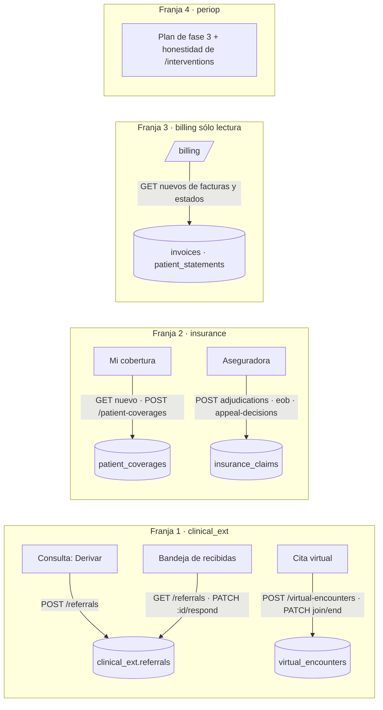

# TASK PROMPT: BR-29 — Clínica extendida: derivaciones, teleconsulta, cobertura de seguros, lecturas de facturación y perioperatorio

> **MODO DE EJECUCIÓN:** este prompt se ejecuta en **Modo Planificación (Planning Mode)**.
> El desarrollador o el agente arranca investigando, sin tocar código fuente. Con eso escribe un
> `implementation_plan.md` detallado y espera la aprobación explícita del usuario. Después
> ejecuta los cambios en commits atómicos, verifica con pruebas unitarias y de integración, y
> **contra la API viva**. El resultado queda documentado en `walkthrough.md`.

| Campo | Valor |
|---|---|
| **Cierra** | CV-10, CV-11, CV-12, CV-23 (anexo E: hallazgos y TAREA B, «Categoría 1») |
| **Severidad máxima** | Alta (CV-10) |
| **Repo(s)** | `mantra-core-health` (pantallas) · `mantra-core-health-redesa-api` (lecturas que faltan y roles del paciente) |
| **Toca el modelo** | No. `clinical_ext`, `insurance`, `billing` y `procedures_perioperative` ya declaran las tablas |
| **Depende de** | Nada para empezar. **BR-06** si hay que sumar roles (`BILLING`, `FINANCE`, `BILLING_OPERATOR` no se emiten a nadie hoy: sin confirmar). CV-23 cruza con CL-54 (lectura quirúrgica por paciente, BR-06) |
| **Decisión previa** | Ninguna del README §8. Decisiones locales en §5: si `/billing` entra a la demo o sale del menú, y quién registra la cobertura del paciente |

> **Fuera de alcance, por pedido:** pasarela de pago y delivery. En facturación, este prompt hace
> **sólo lecturas y estado de cuenta**: nada de cobrar, aplicar pagos, ejecutar pagos, planes de
> pago, conciliación, cobranza (`dunning`) ni emisión de facturas o notas de crédito. `payments/*`
> y `PUT|GET /scheduling/bookings/:id/payment-state` no se tocan.

---

## 1. Contexto de negocio y justificación técnica

### A. Por qué importa
Cuatro superficies del producto tienen API y no tienen pantalla: **derivar** a un paciente y
recibir derivaciones, **teleconsulta**, la **cobertura de seguro** del paciente y el ciclo del
reclamo del lado aseguradora, y **facturación**, que es la única sección placeholder del menú. El
perioperatorio (fase 3) sólo gestiona el equipo quirúrgico. Son franjas independientes: el prompt
se entrega en **cuatro PR**, uno por franja, cada uno mergeable solo.

### B. Estado del frontend (`mantra-core-health`, `origin/mockup`)
- **Derivaciones y teleconsulta (CV-10):** ningún archivo de `src/app` menciona `referrals` ni
  `virtual-encounters` (grep vacío). UC-18-07 y UC-18-12 sin pantalla.
- **Seguros (CV-11):** `core/data-access/insurance/insurance.client.ts` cubre catálogo,
  aseguradoras, corredores, planes/beneficios/prima, `GET /insurance-claims(/:id)` y disputas;
  pantallas en `features/insurance/` (catálogo, corredores, analítica). **No** hay «Mi cobertura»
  del paciente, elegibilidad, autorización previa, adjudicación, EOB, reversa ni decisión de
  apelación.
- **Facturación (CV-12):** `core/navigation/navigation.map.ts:1038-1047` (`path: 'billing'`,
  `availability: 'planificada'`, roles `BILLING`/`FINANCE`/`CASHIER`/`PAYMENTS_ADMIN`, resumen
  «Emití comprobantes y seguí los cobros») cae en `SectionPlaceholder`
  (`app.routes.ts`, entrada `facturacion: '/billing'` en `:1144`).
- **Perioperatorio (CV-23):** `features/interventions/` consume 5 endpoints (listar casos, detalle,
  equipo, aceptar, responder). `navigation.map.ts:475-479` la limita a roles quirúrgicos.

### C. Estado de la API (`mantra-core-health-redesa-api`, `origin/dev` @ `7541797c`)
- **`clinical_ext` (CV-10):**
  - `referrals.controller.ts` (`@Roles('CLINICIAN','PRACTITIONER')`, `:29`): `POST /referrals`
    (`:40`), `PATCH /referrals/:id/respond` (`:51`, `decision: 'ACCEPT'|'REJECT'`),
    `GET /referrals` (`:67`). `CreateReferralDto`: `patientProfileId`, `sourceEncounterId?`,
    `targetProfileId?`, `targetTenantId?`, `specialtyConceptId?`, `reasonConceptId?`,
    `reasonText?`, `priorityConceptId?`, `validUntil?`. **El paciente no tiene lectura** de sus
    derivaciones.
  - `virtual-encounters.controller.ts` (`CLINICIAN`/`PRACTITIONER`, `:26`): `POST` (`:39`,
    `encounterId`, `platformConceptId?`, `meetingUrl?`, `meetingId?`), `PATCH :id/join` (`:50`),
    `PATCH :id/end` (`:61`, `recordingFileId?`). **No hay `GET`** ni rol de paciente: el paciente
    no puede unirse por la API. No hay integración con un proveedor de video: la API guarda el
    enlace que se le pasa.
- **`insurance` (CV-11):**
  - `coverage.controller.ts` (`@Roles('BILLING','FINANCE')`, `:19`): `POST /patient-coverages`
    (`:30`, `insurancePlanId`, `patientProfileId`, `memberIdentifier`, `dependents[]`…),
    `POST /coverage-eligibility-requests` (`:41`), `POST /coordination-of-benefits` (`:52`).
    **Ningún `GET` de cobertura**; el paciente no puede registrar ni leer la suya.
  - `claims.controller.ts` (`@Roles('BILLING','FINANCE')`, `:36`): `POST /insurance-claims`,
    `…/:id/adjudications`, `…/eob`, `…/reversals` con `@Roles()` vacío (= sin rol exigido; el
    servicio valida membresía, `roles.guard.ts:30`); `…/:id/disputes` `BILLING_OPERATOR`.
    `claims-read.controller.ts:47-83`: `GET /insurance-claims(/:id)` `BILLING_OPERATOR`/`SECURITY_ADMIN`.
  - `appeals.controller.ts:32` (`POST /claim-disputes/:id/appeal-decisions`),
    `prior-auth.controller.ts:37,49`.
  - Entidades con datos del paciente sin lectura: `patient_coverages`, `coverage_dependents`,
    `coverage_eligibility_responses`, `patient_explanations_of_benefit`.
- **`billing` (CV-12):** **no hay ningún `GET` de documentos**. Sólo lee `GET
  /billing/service-catalog` (y `procedures`, `procedure-specialties`). Todas las escrituras son
  `SECURITY_ADMIN`: `invoices:issue-from-encounter`, `invoices/:id:credit-note`,
  `payments-received:apply`, `reimbursements:link`, **`patient-statements:generate`** (UC-17-09,
  `billing-receivables.controller.ts:112-121`), `payment-plans`, `bills`, `payments-made:execute`,
  `reconciliation:clear`, `documents/:id:post-to-ledger`, `dunning-runs:execute`,
  `kpi-snapshots:compute`. Entidades: `invoices`, `invoice_lines`, `patient_statements`,
  `payments_received`…
- **`procedures_perioperative` (CV-23):** 23/32 rutas sin UI; sólo 3 `GET` contra 24 escrituras
  (REGISTRO-DEFECTOS B-15). Sin lecturas de valoración preoperatoria, plan anestésico, PACU ni
  implantes.
- Validación global `whitelist + forbidNonWhitelisted + transform`; `PreconditionFailedException`
  = 422.

### D. Aislamiento
- Cada franja es un PR propio. Ninguna toca el modelo ni otra franja.
- Facturación: **sólo** lectura de facturas y estado de cuenta (más, si §5 lo aprueba, generar el
  estado de cuenta, que no mueve dinero). Todo lo demás de `billing` queda afuera y anotado.
- Teleconsulta: no se integra un proveedor de video; se registra y se muestra el enlace.

---

## 2. Flujo de Git y entrega

Una rama y un PR **por franja** en cada repo que toque:

```bash
cd mantra-core-health-redesa-api && git status && git fetch origin
git checkout -b <dev>/feat-lecturas-derivacion-y-teleconsulta origin/dev     # franja 1
git checkout -b <dev>/feat-cobertura-del-paciente origin/dev                 # franja 2
git checkout -b <dev>/feat-lecturas-facturacion origin/dev                   # franja 3

cd mantra-core-health && git status && git fetch origin
git checkout -b <dev>/feat-derivaciones-y-teleconsulta origin/mockup         # franja 1
git checkout -b <dev>/feat-mi-cobertura-y-reclamos origin/mockup             # franja 2
git checkout -b <dev>/feat-facturacion-lecturas origin/mockup                # franja 3
git checkout -b <dev>/docs-perioperatorio-fase-3 origin/mockup               # franja 4
```

- Commits sugeridos: `feat(clinical-ext): lectura de derivaciones del paciente` ·
  `feat(clinical-ext): GET de teleconsulta por encuentro y unión del paciente` ·
  `feat(insurance): el paciente lee y registra su cobertura` ·
  `feat(billing): GET de facturas y estados de cuenta` ·
  `feat(consulta): derivar y bandeja de derivaciones` · `feat(agenda): teleconsulta desde la cita` ·
  `feat(cuenta): Mi cobertura` · `feat(aseguradora): adjudicar, EOB y apelación` ·
  `feat(billing): facturas y estado de cuenta en lugar del placeholder`.
- API: `gh pr create --base dev --reviewer jsaldias39,PabloArauzCaballero`.
- Front: `gh pr create --base mockup --reviewer jsaldias39,PabloArauzCaballero`.
- **El flujo termina en abrir los PR.**

---

## 3. Diagrama



---

## 4. Archivos a modificar o crear

**Franja 1 — derivaciones y teleconsulta (CV-10)**
- API `[MODIFICAR]` `src/modules/clinical_ext/controllers/referrals.controller.ts`: lectura del
  paciente de sus derivaciones (ruta `me`, `@Roles('PATIENT')`, titularidad por
  `person_account_links`) y filtros de `GET /referrals` por recibidas/emitidas si no existen.
- API `[MODIFICAR]` `virtual-encounters.controller.ts`: `GET` por encuentro (médico y paciente) y
  `join` del paciente titular; specs y `clinical_ext.module.spec.ts`.
- Front `[CREAR]` `core/data-access/clinical-ext/referrals.client.ts` y
  `virtual-encounters.client.ts`; acción «Derivar» en la rejilla de la consulta; bandeja de
  derivaciones recibidas (aceptar/rechazar); botón «Unirse» en la cita virtual (médico y paciente).

**Franja 2 — cobertura y reclamos (CV-11)**
- API `[MODIFICAR]` `src/modules/insurance/controllers/coverage.controller.ts` (o un controlador
  `me`): `GET` de las coberturas del paciente titular; registro de la propia cobertura por el
  paciente **si §5 lo aprueba** (con validación de titularidad), si no, sólo lectura.
- Front `[CREAR]` «Mi cobertura» en `features/account/` (lista, alta de cobertura y dependientes,
  EOB si hay lectura); `[MODIFICAR]` `features/insurance/`: adjudicar, emitir EOB, reversa y
  decisión de apelación sobre `GET /insurance-claims/:id` (lado aseguradora).

**Franja 3 — facturación, sólo lectura (CV-12)**
- API `[CREAR]` lecturas en `src/modules/billing/controllers/` (p. ej. `billing-read.controller.ts`):
  `GET /billing/invoices`, `GET /billing/invoices/:id`, `GET /billing/patient-statements(/:id)`,
  acotadas al tenant; y, si §5 lo aprueba, exponer `patient-statements:generate` al rol de
  facturación de la organización. DTO de respuesta, specs y `billing.module.spec.ts`.
- Front `[CREAR]` `core/data-access/billing/billing.client.ts` y la sección `/billing` real
  (listado de facturas con paginación por cursor, detalle con líneas, estado de cuenta del
  paciente); `[MODIFICAR]` `navigation.map.ts:1038-1047` (resumen sin «cobros»; `availability`).
  **Si §5 decide que no entra:** sacar la entrada del menú en vez de mostrar el placeholder.

**Franja 4 — perioperatorio (CV-23)**
- `[DOCUMENTAR]` plan de fase 3 (programar el caso, checklist OMS por fases, plan anestésico,
  PACU) contra las 23 rutas sin UI y las lecturas que faltan (B-15), en `docs/` del front.
- `[MODIFICAR]` `features/interventions/`: la sección dice qué hace hoy (equipo quirúrgico) y no
  promete lo demás. Sin escrituras nuevas en este prompt.

---

## 5. Reglas de implementación

- **Paso 1 del plan: decisiones locales, con opciones.**
  1. **`/billing` en la demo.** (a) Entra con lecturas y estado de cuenta. Pro: se va el único
     placeholder. Contra: hay que crear `GET` en la API y definir quién tiene el rol. (b) Sale del
     menú hasta fase 2. Pro: cero riesgo. Contra: la organización no ve lo que factura.
  2. **Cobertura del paciente.** (a) El paciente registra la suya. Pro: «Mi cobertura» completo.
     Contra: hay que abrir `POST /patient-coverages` al titular (hoy `BILLING`/`FINANCE`). (b) La
     registra el personal de facturación y el paciente sólo la lee.
  3. **Rol de facturación y de aseguradora:** qué rol real reciben (hoy nadie emite `BILLING`,
     `FINANCE`, `BILLING_OPERATOR`: sin confirmar). Si falta, se coordina con BR-06; no se abre
     una ruta a cualquiera para destrabar la pantalla.
- **Fuera de alcance, sin excepciones:** cobrar, aplicar o ejecutar pagos, planes de pago,
  conciliación, cobranza, emitir facturas o notas de crédito, `payments/*`, `payment-state`,
  delivery.
- **Lecturas del paciente con titularidad:** se resuelve la persona por la cuenta, nunca por un id
  del query; otro paciente → 404 sin filtrar existencia.
- **Registros de reclamo y adjudicación son históricos:** una reversa o una apelación es un
  registro nuevo, nunca un UPDATE de lo adjudicado.
- **Un caso de uso = una transacción** en toda ruta nueva.
- Listados de dominio con **cursor** (contrato M34), nunca paginación por páginas.
- Front: estados M34 completos; fichas y formularios **centrados, a lo ancho y en una tarjeta con
  pestañas** (`docs/components/composition-rules.md` §5); las maquetas de la bóveda mandan donde
  existan (hoy no hay HTML para V17, V18, V26 ni V53: seguir sus `Vistas.md`).
- `forbidNonWhitelisted` (campo extra = 400); conceptos por `*_concept_id`.
- Rutas nuevas: `node dist/src/main.js` + grep de `Mapped {<ruta>` + `*.module.spec.ts`.

---

## 6. Criterios de aceptación (Gherkin)

```gherkin
Escenario: Derivar desde la consulta
  Dado un médico en una consulta
  Cuando deriva al paciente a otro profesional con un motivo
  Entonces POST /referrals responde 201
  Y el destinatario la ve en su bandeja y puede aceptarla o rechazarla
  Y el paciente la ve en su historia al recargar

Escenario: Teleconsulta
  Dado una cita virtual con enlace registrado
  Cuando el médico y el paciente pulsan «Unirse»
  Entonces cada uno abre el enlace y la API registra la unión
  Y al terminar el médico la cierra y el estado queda «finalizada»

Escenario: Mi cobertura
  Dado un paciente con una aseguradora del catálogo
  Cuando registra su cobertura y la de un dependiente (o la registra facturación, según §5)
  Entonces POST /patient-coverages responde 201 y ambas figuran al recargar «Mi cobertura»

Escenario: Adjudicar un reclamo
  Dado un reclamo enviado
  Cuando la aseguradora lo adjudica y emite el EOB
  Entonces la adjudicación y el EOB quedan registrados y el reclamo muestra su nuevo estado

Escenario: Facturación sin placeholder
  Dado una organización con facturas emitidas
  Cuando facturación abre /billing
  Entonces ve el listado con cursor y el detalle con sus líneas
  Y no ve ninguna acción de cobro

Escenario: Lectura ajena
  Dado el paciente B
  Cuando pide las coberturas o derivaciones por la lectura del paciente
  Entonces nunca recibe las del paciente A

Escenario: Perioperatorio honesto
  Dado un cirujano en /interventions
  Cuando abre la sección
  Entonces ve lo que la sección hace hoy y no un flujo que no existe
```

---

## 7. Definition of Done

- [ ] `implementation_plan.md` aprobado, con las tres decisiones de §5 escritas y la lista
      explícita de lo excluido de `billing`.
- [ ] Un PR por franja; cada uno con `corepack yarn lint`, `corepack yarn typecheck` y
      `corepack yarn test` (API) / `corepack yarn test --watch=false` + `check-*.mjs` (front) en
      verde.
- [ ] Rutas nuevas en el log de `node dist/src/main.js` y exigidas por su `*.module.spec.ts`.
- [ ] **Evidencia de runtime contra la API viva** por franja (`UI → request → response →
      persistencia → recarga → UI`), pegada en su PR: una derivación emitida y aceptada con su
      fila; una teleconsulta unida y cerrada; una cobertura registrada y releída; una
      adjudicación con EOB; `/billing` con facturas sembradas y su detalle.
- [ ] Ninguna ruta de pago ni de delivery tocada (grep del diff).
- [ ] PR abiertos con revisores `jsaldias39` y `PabloArauzCaballero`, y `walkthrough.md`.

---

## 8. Plan de QA

### A. Pruebas automatizadas
```bash
# API
corepack yarn test src/modules/clinical_ext src/modules/insurance src/modules/billing
# Front
corepack yarn test --watch=false --include=src/app/core/data-access/clinical-ext/**
corepack yarn test --watch=false --include=src/app/features/insurance/**
corepack yarn test --watch=false --include=src/app/features/account/**
node scripts/check-client-prefixes.mjs && node scripts/check-route-prefixes.mjs
```
- Specs de titularidad en cada lectura `me`.
- Spec de navegación: `/billing` ya no cae en `SectionPlaceholder` (o no está en el menú).

### B. Integración (API viva)
1. Stack con seeds; API con `corepack yarn build && node dist/src/main.js`.
2. Franja 1: médico A deriva a médico B; B acepta; el paciente la ve. Cita virtual: crear, unir,
   cerrar.
3. Franja 2: cobertura del paciente; reclamo → adjudicación → EOB → disputa → decisión.
4. Franja 3: facturas sembradas (o emitidas por un administrador con la ruta existente) visibles
   en `/billing`; estado de cuenta del paciente.

### C. Verificación manual y logs
- Log de la API: ningún 400 por clave extra ni 403 inesperado en las rutas nuevas.
- Consola del navegador: ningún `[mock]` en la configuración `real-api`.
- `SELECT` de `clinical_ext.referrals`, `insurance.patient_coverages` y `billing.invoices` antes y
  después.
