# TASK PROMPT: BR-30 — Contrato y calidad: OpenAPI regenerado, tipos generados, CI, suite real con SSR, N+1, request-id, docs y residuos del portal admin

> **MODO DE EJECUCIÓN:** este prompt se ejecuta en **Modo Planificación (Planning Mode)**.
> El desarrollador o el agente arranca investigando, sin tocar código fuente. Con eso escribe un
> `implementation_plan.md` detallado y espera la aprobación explícita del usuario. Después
> ejecuta los cambios en commits atómicos, verifica con pruebas unitarias y de integración, y
> **contra el artefacto real levantado**. El resultado queda documentado en `walkthrough.md`.

| Campo | Valor |
|---|---|
| **Cierra** | TX-14, TX-23, TX-24, TX-25, TX-27 (anexo D) · CV-21, CV-25 (anexo E) · AG-44 (anexo C) |
| **Severidad máxima** | Alta (TX-24: sin CI efectivo, cada ola reabre las brechas de la anterior) |
| **Repo(s)** | `mantra-core-health` (front): `.github/workflows/ci.yml`, `scripts/`, `cypress/e2e/real`, `core/http`, 5 pantallas N+1, docs de estado, `core/navigation` (geo). `mantra-core-health-api` (clon `mantra-core-health-redesa-api`): `src/logging`, `common/filters`, `openapi/`, `.github/workflows/docs.yml`, lecturas en lote. Infra: `deploy/api-proxy.conf` |
| **Toca el modelo** | Sólo AG-44 residuo 2: promover a `.puml` los DDL escritos a mano de `data_catalog` y `qa_execution`. Se puede separar en un PR del modelo |
| **Depende de** | Nada para empezar. Corre **en todas las olas**: integra los chequeos que crean BR-01 (`check-real-api-config`), BR-02 (`check-mock-vs-api`) y BR-03 (`check-client-prefixes`). La suite real contra SSR usa el artefacto de BR-01 |
| **Decisión previa** | Ninguna del README §8. Decisiones internas del plan: dónde corre el runner del front, y si los tipos del front se **generan** del OpenAPI o se protegen con pruebas de contrato |

---

## 1. Contexto de negocio y justificación técnica

### A. Por qué importa
Los otros 29 prompts cierran brechas; éste impide que se vuelvan a abrir. Hoy **ningún CI
bloquea nada**: el del front está encolado sin runner y el de la API lleva semanas en rojo. El
contrato publicado (`openapi.json`) tiene cinco días de atraso y el front escribe sus tipos a
mano. La suite que habla con la API real existe pero corre sin SSR, fuera del CI y con el límite
de tasa apagado. Cuando algo falla en producción, el ID que ve la persona es un contador que se
repite en cada reinicio. Y los documentos de estado siguen diciendo «nada está simulado».

### B. Estado del frontend (`mantra-core-health`, `mockup` @ `9b3e0101`, verificado)
- **CI (TX-24):** `.github/workflows/ci.yml:45,181,269` usa `runs-on: [self-hosted, linux, x64]`;
  el `CLAUDE.md` del repo dice «El CI propio está caído; los `check-*.mjs` se corren a mano» y el
  anexo D registra 5 corridas `queued` hasta 40 min. El workflow corre `check-api-prefixes` (l. 114)
  y `check-route-prefixes` (l. 120), **no** `check-client-prefixes` ni `check-real-api-config`.
- **Contrato (TX-23):** no hay `openapi-typescript`/`orval` en `package.json`.
  `scripts/check-api-contract-drift.mjs:25` compara contra `docs/integrations/backend-api.md`, no
  contra el OpenAPI; el anexo D lo midió: 78 operaciones llamadas y no documentadas + 10 al revés.
- **Suite real (TX-25):** `cypress/e2e/real/` tiene 12 specs (`01-administrador` … `12-foto-profesional`).
  `scripts/run-recorrido-real.mjs:111` levanta `ng serve --configuration e2e-real` (sin SSR) y
  exige `RATE_LIMIT_DISABLED=true` (l. 30, 91). Playwright: 8 archivos mencionan API real
  (**sin confirmar** si corren sin mock). Nada de esto está en el CI.
- **Request-id (TX-14):** `core/http/error-to-view-state.ts:219` usa
  `body?.correlationId ?? error.headers.get('x-request-id') ?? 'sin-id'`; la cabecera nunca llega
  → `'sin-id'` en todo error sin cuerpo (502 de nginx). `deploy/api-proxy.conf` no fija
  `X-Request-Id` (sólo `Host`, `X-Real-IP`, `X-Forwarded-*`).
- **N+1 (TX-27), verificado:** `forkJoin(lista.map(…))` en
  `features/account/access-requests/access-requests.ts:73`,
  `features/account/medical-record/medical-record.ts:348` (`forms.getMyInstance` por ítem),
  `features/account/my-profile/medical-articles/medical-articles.ts:201` (`community.readPost` por
  publicación), `features/clinical-record/consultation/payment-plan-panel/payment-plan-panel.ts:201`
  (`getQuotation` por cotización) y `features/dashboard/consultas-resumen/consultas-resumen.ts:154`
  (`searchBookings(limit:500)` por recurso). Con 300 req/min globales por IP, una página de 20
  artículos consume 21.
- **Docs (CV-21):** `ESTADO-FRONTEND.md:12` «la API: nada está simulado» contra
  `environment.ts:65` `mockBackend: true`; `ROUTE_HEALTH_MATRIX.md` (15/08) y
  `INFORME_AVANCE_GLOBAL_Y_PROXIMOS_PASOS.md` (12/09) desactualizados; `yarn pw:rutas` existe
  (`package.json:38`).
- **Geo (CV-25):** `app.routes.ts:270,1801-1846`: 11 pantallas de rastreo, geocercas y viajes,
  construidas para delivery, que está **fuera de alcance**.
- **Portal admin (AG-44):** `core/data-access/admin-portal/data-catalog.types.ts:304`
  `AnnotationPatch` no declara `processSupported`, `producers` ni `sourceOfTruth`, que
  `UpsertAnnotationDto` acepta: la UI no puede editarlos (no da 400). Las demás rutas del portal
  (`/admin/catalog|analytics|qa|ops`) ya existen y coinciden campo a campo (anexo C).

### C. Estado de la API (`dev` @ `7541797c`, verificado)
- **Request-id (TX-14):** `src/common/filters/all-exceptions.filter.ts:158`
  `request.id ?? request.headers['x-request-id']` (el anexo lo ubicaba en `common/errors/`).
  `src/logging/pino-options.ts:60-81` configura `pinoHttp` **sin `genReqId`** → `req.id` es un
  contador por proceso (1, 2, 3…), se repite tras cada reinicio y entre réplicas. La API **no**
  escribe `X-Request-Id` en la respuesta (grep: sólo el worker lo usa, `worker/system-api-client.service.ts:257`).
  El `mixin` de `pino-options.ts:74` ya agrega `trace_id` de OpenTelemetry y el comentario
  (l. 69-72) prohíbe tomarlo del cliente.
- **OpenAPI (TX-23):** `openapi/openapi.json`, último commit `a5753dc7` del 19/09; ~1 306–1 308
  operaciones contra 1 358 del código → **52 rutas ausentes** (`/admin/catalog/*` 21, `/admin/qa/*`
  e `/internal/qa/plans/run-next` 17, `/admin/analytics/*` 8, `/admin/ops/*` 7,
  `/internal/catalog/scans/run-next`).
- **CI (TX-24):** `.github/workflows/docs.yml` (en `pull_request` a `master` y `dev`) ya regenera
  el contrato (l. 279) y hace `git diff --exit-code` sobre `openapi/*`, `docs/modules`,
  `docs/data`, `docs/postman` (l. 448-457). Además corre `check-breaking` (l. 404-430). **Corrección
  al `CLAUDE.md` de la raíz:** desde MCH-026 el workflow corre `yarn test:integration --ci`
  completo (l. 389), no sólo `postgres-privileges` (l. 334). Que el `openapi.json` esté atrasado
  prueba que ese CI **no se está haciendo cumplir** (corridas en `failure` desde agosto, anexo D);
  **sin confirmar** si hay reglas de protección de rama que lo exijan.
- **Portal admin (AG-44):** `database/SQL/patches/2026-09-18_v4219_data_catalog.sql` y
  `2026-09-18_v4220_qa_execution.sql` escritos a mano, sin `.puml` (desvío declarado en
  `docs/adr/ADR-0024-portal-admin-catalogo-de-datos.md`). En el modelo existe
  `diagram_34_portal_catalog.puml`; **sin confirmar** si cubre `data_catalog`. `worker-data_catalog`
  no está entre los 4 workers de `docker-compose.coolify.yml:641-655`: los escaneos quedan `QUEUED`.

### D. Aislamiento
Es infraestructura de calidad y observabilidad. **No** cambia pantallas salvo las 5 del N+1 (misma
UI, menos peticiones), el formulario de anotación del catálogo y el menú de geo. En la API sólo se
agregan: el generador de id, una cabecera de respuesta y las lecturas en lote que el plan acuerde.
Pago y delivery quedan fuera: geo se congela, no se amplía.

---

## 2. Flujo de Git y entrega

```bash
cd mantra-core-health-redesa-api && git status && git fetch origin && git checkout -b <dev>/feat-request-id-y-contrato origin/dev
cd ../mantra-core-health && git status && git fetch origin && git checkout -b <dev>/ci-contrato-y-suite-real origin/mockup
cd ../mantra-core-health-model && git checkout -b <dev>/feat-puml-data-catalog-qa-execution origin/<rama base>  # sólo AG-44
```

- PR del front `--base mockup`; de la API `--base dev`; del modelo según su flujo, revisado por quien
  lo mantiene. Revisores `jsaldias39,PabloArauzCaballero`. Cada PR se puede mergear solo.
- Commits atómicos, por ejemplo:
  - API: `feat(logging): genReqId UUID y X-Request-Id`, `docs(openapi): regenerar (52 rutas)`,
    `feat(<módulo>): lectura en lote para <pantalla>`
  - Front: `ci: todos los check-*.mjs obligatorios`, `ci: e2e-real contra production-api + nginx`,
    `build(contract): tipos desde openapi.json`, `fix(<pantalla>): lectura en lote`,
    `feat(admin-portal): 3 campos de la anotación`, `fix(nav): geo congelado`, `docs: estado vigente`
  - Infra: `fix(nginx): X-Request-Id $request_id hacia la API`
  - Modelo: `feat(model): diagram_67_data_catalog y qa_execution` → `gen_ddl.py` → `SQL/` →
    `yarn db:vendor` en la API (`yarn db:vendor:check` en verde).
- **El merge exige revisión humana.** El flujo termina en abrir los PR.

---

## 3. Diagrama

```mermaid
flowchart TD
    subgraph PR del front
      L[lint · typecheck · test] --> CK[check-client-prefixes · check-api-prefixes · check-route-prefixes<br/>check-real-api-config · check-mock-vs-api]
      CK --> CT[contrato: tipos generados o specs de contrato<br/>contra openapi.json de la API]
      CT --> B[build production-api]
      B --> E2E[e2e-real: nginx + SSR + API mantra-redesa<br/>límite de tasa encendido]
    end
    subgraph PR de la API
      A1[build · lint · test · test:integration] --> A2[generate-openapi + git diff --exit-code]
      A2 --> A3[check-breaking contra la rama destino]
    end
    subgraph Petición en producción
      U[Navegador] --> N[nginx: X-Request-Id = $request_id]
      N --> API[API: genReqId toma el de nginx o crea UUID<br/>log con req.id + trace_id]
      API -->|error| R[cuerpo correlationId + cabecera X-Request-Id]
      R --> S9[Pantalla S9 muestra el ID que aparece en el log]
    end
```



---

## 4. Archivos a modificar o crear

**API**
- `[MODIFICAR]` `src/logging/pino-options.ts`: `genReqId` que usa `X-Request-Id` **sólo** si viene
  de nginx (confianza por `TRUST_PROXY_HOPS`; si no, UUID v4) y lo escribe con
  `res.setHeader('X-Request-Id', id)`. No reemplaza el `trace_id` del `mixin`.
- `[MODIFICAR]` `src/common/filters/all-exceptions.filter.ts`: `correlationId` = el mismo `req.id`.
- `[CREAR]` `src/logging/request-id.spec.ts`: id UUID, eco en la cabecera, id entrante respetado
  detrás del proxy.
- `[MODIFICAR]` `openapi/*` regenerado con `node tools/openapi/generate-openapi.mjs`.
- `[CREAR]` lecturas en lote que el plan acuerde para el N+1, **sin inventar campos**: cada una
  devuelve lo que ya devuelve la lectura individual. Candidatas: `GET /quotations?ids=` (o la lista
  con el detalle), `GET /community/posts?ids=`, `GET /forms/me/instances` con valores,
  `GET /scheduling/bookings` con `resourceIds[]`. Si una no se acuerda, queda TODO con la cifra
  medida.
- `[DOCUMENTAR]` `docs/api/conventions.md`: request-id y convención de paginación única (cursor;
  `PaginationQueryDto` como legado, observación de la §4 del anexo D).

**Infra**
- `[MODIFICAR]` `mantra-core-health/deploy/api-proxy.conf`: `proxy_set_header X-Request-Id $request_id;`
  y `$request_id` en el `log_format` de `deploy/nginx.conf`.

**Front**
- `[MODIFICAR]` `.github/workflows/ci.yml`: sumar `check-client-prefixes`, `check-real-api-config`,
  `check-mock-vs-api` (BR-02) y el chequeo de contrato; job `e2e-real` (en PR con etiqueta o
  nocturno) que levanta el compose de la API y el artefacto `production-api` detrás de nginx.
- `[MODIFICAR]` `scripts/run-recorrido-real.mjs`: modo `--artifact` que apunta al contenedor de BR-01
  (SSR + nginx) en vez de `ng serve`; `RATE_LIMIT_DISABLED` sólo para las altas de actores, no global.
- `[MODIFICAR]` `scripts/check-api-contract-drift.mjs`: comparar contra `openapi.json` de la API
  (snapshot versionado como en BR-02), no contra `backend-api.md`.
- `[CREAR]` según la decisión: `scripts/gen-api-types.mjs` + `src/app/core/data-access/_generated/api.d.ts`
  (con `openapi-typescript`), o `*.contract.spec.ts` por cliente que validan request y response
  contra el esquema.
- `[MODIFICAR]` las 5 pantallas N+1 para usar la lectura en lote; spec que cuenta peticiones.
- `[MODIFICAR]` `core/data-access/admin-portal/data-catalog.types.ts:304` y la pantalla de anotación
  en `features/admin/*`: `processSupported`, `producers`, `sourceOfTruth` (AG-44).
- `[MODIFICAR]` `core/navigation/navigation.map.ts`: geo fuera del menú de lanzamiento salvo caso de
  uso no-delivery escrito (CV-25); las rutas siguen existiendo detrás de `canMatch`.
- `[MODIFICAR]` `ESTADO-FRONTEND.md` (fechado como histórico y con el estado vigente: maqueta vs
  API, recorrido del paciente), `ROUTE_HEALTH_MATRIX.md` regenerado con `corepack yarn pw:rutas`
  midiendo contenido, `INFORME_AVANCE_GLOBAL_Y_PROXIMOS_PASOS.md` con el propósito central (CV-21).

**Modelo (sólo AG-44 residuo 2)**
- `[CREAR]` `Mantra Core Health Context/modules/diagram_67_data_catalog.puml` y el de
  `qa_execution` (número siguiente libre), **transcribiendo** las tablas de los patches v4219/v4220;
  `gen_ddl.py` → `SQL/` → `yarn db:vendor` en la API; el patch manual se retira cuando el DDL
  generado sea byte-equivalente. Runbook: desplegar `worker-data_catalog`.

---

## 5. Reglas de implementación

- **Un chequeo que no bloquea no es un chequeo.** Cada script entra al CI como paso obligatorio y se
  prueba rompiéndolo a propósito. Si el runner self-hosted no vuelve, el plan decide entre un runner
  de GitHub y uno propio operativo; «encolado» no cuenta como verde.
- **El OpenAPI sale del código**, nunca se edita a mano. El `git diff --exit-code` ya existe: lo que
  falta es que el PR no se pueda mergear con ese paso en rojo.
- **Request-id:** un id por petición, el mismo en el log, en `correlationId` y en `X-Request-Id`.
  Un id elegido por el cliente sólo se acepta si lo puso nginx; nunca reemplaza `trace_id`.
- **Suite real = artefacto real:** SSR, nginx, `production-api`, límite de tasa encendido. Un verde
  con `ng serve` y `RATE_LIMIT_DISABLED` global no se reporta como evidencia de producción.
- **N+1:** no inventar campos ni contratos; la lectura en lote devuelve lo mismo que la individual.
  Medir antes y después (número de peticiones por pantalla).
- **Modelo por las 4 capas** para AG-44: `.puml` en `mantra-core-health-model` → `gen_ddl.py` →
  `SQL/` del modelo → `yarn db:vendor` (`yarn db:vendor:check`). Nunca editar la base ni
  `database/SQL` a mano; el `SQL/` de la raíz del workspace está viejo.
- **Docs:** cada afirmación enlaza evidencia o dice «no ejecutado». Geo: congelar, no borrar.

---

## 6. Criterios de aceptación (Gherkin)

```gherkin
Escenario: El ID de S9 encuentra la línea de log
  Dado un error 500 en producción
  Cuando la persona copia el ID de la pantalla
  Entonces ese ID aparece exactamente una vez en los logs de la API y en el access.log de nginx

Escenario: Error sin cuerpo
  Dado un 502 de nginx
  Cuando la pantalla lo recibe
  Entonces muestra el X-Request-Id de nginx, no "sin-id"

Escenario: OpenAPI al día
  Dado un PR de la API que agrega una ruta
  Cuando corre el CI
  Entonces falla si openapi.json no incluye la ruta, y el PR no se puede mergear

Escenario: Un PR con prefijo sin rutear no se fusiona
  Dado un PR del front que agrega una llamada a un prefijo nuevo
  Cuando corre el CI
  Entonces check-client-prefixes falla y bloquea el merge

Escenario: Cliente que diverge del contrato
  Dado un cliente del front que manda un campo que el DTO no declara
  Cuando corre el chequeo de contrato
  Entonces falla nombrando el cliente, la operación y el campo

Escenario: Recorrido real contra el artefacto
  Dado el stack completo de producción levantado localmente con SSR y nginx
  Cuando se corre la suite cypress/e2e/real
  Entonces los 12 specs pasan sin RATE_LIMIT_DISABLED global

Escenario: Lista de artículos en una petición
  Dado una médica con 20 artículos
  Cuando abre "Mis artículos"
  Entonces la pantalla hace como máximo 2 peticiones a la API

Escenario: Fuente de verdad de un objeto del catálogo
  Dado un objeto del catálogo de datos
  Cuando el gobernador de datos completa "Fuente de verdad" y guarda
  Entonces PUT …/annotation lo guarda y el historial lo muestra al recargar

Escenario: Catálogo en base limpia
  Dada una base reconstruida desde cero con el DDL generado desde el .puml
  Cuando se pide GET /admin/catalog/coverage
  Entonces responde 200

Escenario: Geo fuera del lanzamiento
  Dado el alcance de lanzamiento sin delivery
  Cuando se revisa el menú de administración
  Entonces Geolocalización está oculta o justificada por un caso de uso no-delivery

Escenario: Documento de estado vigente
  Dado el repositorio front
  Cuando se lee el documento de estado
  Entonces declara si la superficie usa mock o API y el estado del recorrido del paciente
```

---

## 7. Definition of Done

- [ ] `implementation_plan.md` aprobado con las dos decisiones internas (runner y tipos generados vs
      specs de contrato) y la lista de lecturas en lote acordadas.
- [ ] CI del front **corriendo** (no encolado) con todos los `check-*.mjs` obligatorios; cada uno
      probado rompiéndolo. Enlace a una corrida verde y a una roja a propósito.
- [ ] CI de la API en verde en `dev`; `openapi.json` regenerado con las 52 rutas; protección de rama
      que exige el workflow (o la decisión escrita de por qué no).
- [ ] Request-id de punta a punta: `curl -si` contra nginx muestra `X-Request-Id`; el mismo id en el
      cuerpo de error, en el log de la API y en el `access.log`.
- [ ] N+1: tabla antes/después de peticiones por pantalla, medida en la pestaña Red contra la API viva.
- [ ] Suite `cypress/e2e/real` pasando contra el artefacto `production-api` + nginx con límite de tasa
      (o la lista de specs que fallan, cada una con su prompt).
- [ ] AG-44: los 3 campos editables con recorrido UI → request → response → persistencia → recarga →
      UI; `.puml` + DDL generado + `yarn db:vendor:check` en verde (o el PR del modelo abierto).
- [ ] Docs de estado al día; geo fuera del menú de lanzamiento.
- [ ] API: `corepack yarn build`, `typecheck`, `lint --max-warnings=0`, `test`, `test:integration`.
      Si se crean rutas en lote: `node dist/src/main.js` + `Mapped {<ruta>, GET}` + el
      `*.module.spec.ts` que exige el controlador en `controllers`.
- [ ] Front: `corepack yarn lint`, `typecheck`, `build --configuration=production-api`,
      `test --watch=false`.
- [ ] PR abiertos con revisores `jsaldias39` y `PabloArauzCaballero`, y `walkthrough.md`.

---

## 8. Plan de QA

### A. Pruebas automatizadas
```bash
corepack yarn test src/logging src/common/filters && corepack yarn test:integration --ci   # API
node tools/openapi/generate-openapi.mjs && git diff --stat -- openapi/                       # API
for s in client-prefixes api-prefixes route-prefixes real-api-config mock-vs-api api-contract-drift; do node scripts/check-$s.mjs || exit 1; done
corepack yarn test --watch=false --include=src/app/core/http/**
```
- Spec por pantalla N+1 que cuenta las peticiones con `HttpTestingController`.

### B. Integración (artefacto real)
1. `mantra-redesa` + seeds; front `production-api` detrás de `deploy/nginx.conf`.
2. `node scripts/run-recorrido-real.mjs --artifact` con el límite de tasa encendido.
3. Forzar un 500 (ruta de prueba o dependencia caída) y seguir el ID de la pantalla al log.
4. Abrir las 5 pantallas N+1 y anotar las peticiones.

### C. Verificación manual y logs
- `gh run list` en los dos repos: corridas con estado final, no `queued`. Log de la API: `req.id`
  UUID, sin repetidos tras un reinicio. Catálogo: el escaneo sale de `QUEUED` con `worker-data_catalog`.
