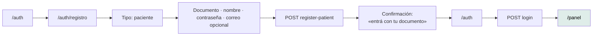
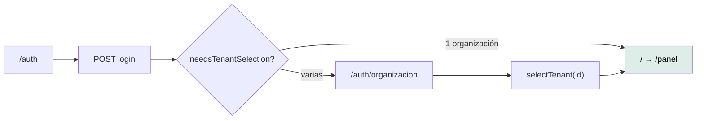
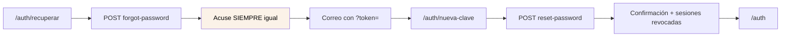
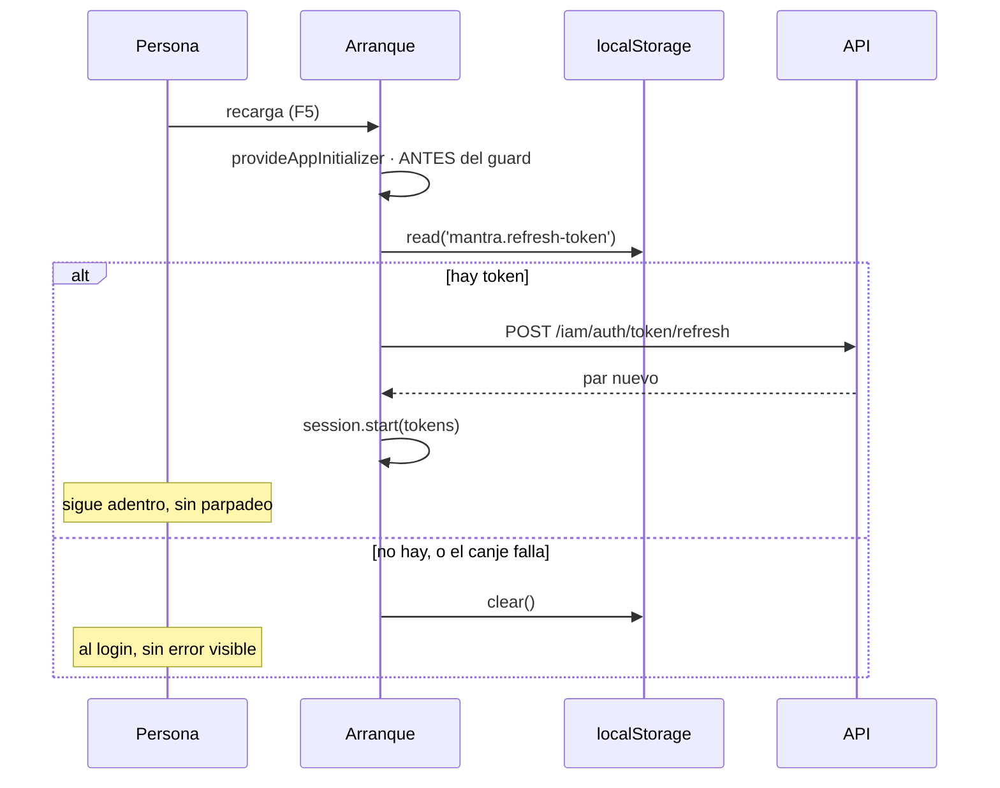

# Recorridos de usuario

Cinco journeys críticos, verificados contra el código y —los cinco— contra la API
viva a mano por el equipo. **Ninguno tiene prueba E2E.**

---

## J1 · Registrarse y entrar (paciente)

**Actor.** Paciente · **Entrada.** `/auth` → «Creá una con tu documento»

| Aspecto | Detalle |
|---|---|
| Precondición | Ninguna |
| Validaciones | Documento ≥ 4 y `[A-Za-z0-9.-]+` · contraseña ≥ 8 · correo con formato |
| Datos | `userId`, `personId`, `patientProfileId`, `patientCode`, `emailVerificationSent` |
| Estados | S2 al enviar · S4 si el backend rechaza · S8/S9 |
| **No abre sesión** | Los endpoints devuelven identificadores, no tokens |
| Sin correo | `emailVerificationSent: false` — **no es un fallo** |
| Accesibilidad | ⚠️ La confirmación **no se anuncia** |
| Pruebas | Componente ✅ · **E2E ❌** |

## J2 · Registrarse como profesional

Mismo recorrido, **otro formulario**: correo obligatorio, matrícula y número de
colegio obligatorios, y **no se encola verificación de correo**.

> *«Los campos obligatorios no se solapan y mezclarlos obligaría a validar
> "obligatorio si el tipo es…", que es de donde salen los formularios que
> mienten.»*

El reclamo de la columna de marca cambia con el tipo elegido: prometerle
«Potenciá tu práctica médica» a un paciente sería hablarle de otra cosa.

## J3 · Iniciar sesión con varias organizaciones

**Actor.** Cualquiera con más de un `tenant` en el token.

| Aspecto | Detalle |
|---|---|
| Por qué es una pantalla propia | *«la elección **cambia qué datos se ven**: mezclarla con las credenciales invita a pasarla por alto»* |
| Los nombres | Del claim `tenantNames`; sin él, cae al identificador |
| Hasta que elija | **`X-Tenant-Id` no se manda** |
| Validación | `selectTenant` ignora un id que no esté en el token |
| **Fricción conocida** | La elección **no se persiste**: se repite en cada recarga |
| Pruebas | Componente ✅ · **E2E ❌** |

## J4 · Recuperar la contraseña

**Actor.** Cualquiera · **Entrada.** `/auth` → «¿Olvidaste tu contraseña?»

| Aspecto | Detalle |
|---|---|
| **El acuse es idéntico** exista o no la cuenta | Decir lo contrario permitiría enumerar cuentas |
| Identificador | Correo **o** documento, un solo campo |
| Token | Un solo uso, por query string |
| Se muestra `revokedSessions` | *«si cambió la clave porque sospechaba de un acceso ajeno, saber que se cerraron tres sesiones le confirma que sirvió»* |
| Cruza el correo | **Imposible de cubrir con pruebas unitarias** |
| Accesibilidad | ⚠️ **El acuse no se anuncia** — es la brecha `HIGH` A11Y-01 |
| Pruebas | Componente ✅ · **E2E ❌** |

## J5 · Volver con la sesión abierta

**El journey que más fácil se rompe y que ninguna prueba cubre de punta a
punta.**

| Aspecto | Detalle |
|---|---|
| Por qué corre antes del guard | *«alguien con sesión válida vería un parpadeo al login mientras el canje está en vuelo»* |
| Si el canje falla | El token **se descarta** — *«no reintentar en cada arranque contra el límite»* |
| Un token muerto **no es un error** | *«es simplemente no haber iniciado sesión»* |
| Con almacenamiento bloqueado | La sesión dura la pestaña. **Degradación deliberada** |
| Con varias organizaciones | **Vuelve al selector** en cada recarga |
| Pruebas | `auth.service.spec.ts` cubre la lógica · **la integración con el arranque y el guard, no** |

**Un cambio en el orden de los `provideAppInitializer` rompería esto sin que
ninguna prueba se entere.** Es el argumento más concreto para las E2E.

## J6 · Verificar el correo

**Entrada.** El enlace del correo, con `?token=`.

Cuatro estados: `verificando`, `verificado`, `sin-token`, `invalido`.

> *«**Verificar el correo no desbloquea nada**: la cuenta ya está activa desde el
> registro. Sólo deja constancia de que la dirección es alcanzable por su
> titular. Por eso, cuando el token no sirve, el mensaje no es alarmante.»*

Todos los fallos se cuentan igual: distinguirlos no le cambia nada a quien mira
la pantalla, **y decir «este token ya se usó» revelaría algo sobre tokens
ajenos**.

## Estados transversales

Los seis journeys comparten el mismo vocabulario:

| Estado | Cuándo |
|---|---|
| S2 `loading` | Toda petición en vuelo |
| S4 `validation` | Datos rechazados, conflicto o límite de peticiones |
| S8 `offline` | La petición no llegó |
| S9 `error` | Fallo del servidor, **con código de soporte** |

**Ninguna pantalla escribe una línea sobre manejo de errores.**

## Trazabilidad

| Journey | Rutas | API | Componente | **E2E** |
|---|---|---|---|---|
| J1 Registro paciente | 3 | 2 | ✅ | **❌** |
| J2 Registro profesional | 3 | 2 | ✅ | **❌** |
| J3 Login multi-organización | 3 | 1 | ✅ | **❌** |
| J4 Recuperación | 3 | 2 | ✅ | **❌** |
| J5 Sesión persistente | — | 1 | ⚠️ parcial | **❌** |
| J6 Verificar correo | 2 | 1 | ✅ | **❌** |

**Los seis fueron verificados a mano contra la API viva** (`ESTADO-FRONTEND.md`
§«El recorrido que se verificó en un navegador real»). Funcionaron. **Y nada
garantiza que sigan funcionando.**

La excepción formal por la ausencia de E2E está declarada en
[la matriz de trazabilidad](../governance/traceability-matrix.md).
