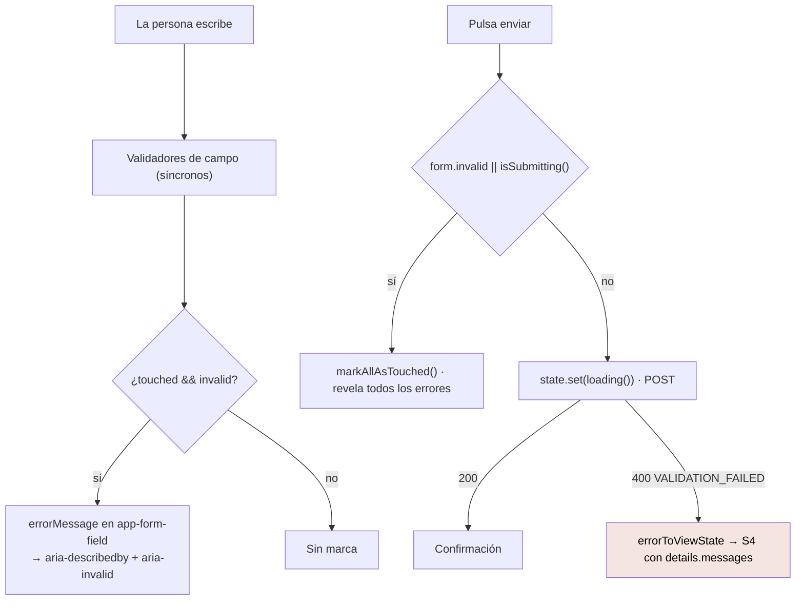

# Formularios y validación

Reactive Forms, seis formularios, y una regla: **la validación de cliente es
comodidad, no autoridad**.

Para la parte de componentes, ver [formularios](../components/forms.md). Esta
página es la del flujo de datos.

---

## Los seis formularios

| Pantalla | Grupo | Campos |
|---|---|---|
| Login | `form` | `identifier`, `password`, `mfaCode` |
| Registro | `formPaciente` | `nationalId`, `displayName`, `password`, `email` |
| Registro | `formProfesional` | `displayName`, `email`, `password`, `licenseNumber`, `credentialNumber`, `professionalTitle`, `phone` |
| Recuperar | `form` | `identifier` |
| Nueva contraseña | `form` | `newPassword` |

Todos con `nonNullable: true`, así que `getRawValue()` devuelve tipos no nulos.

## Las validaciones espejan al backend

| Regla | Valor | De dónde |
|---|---|---|
| Contraseña mínima | 8 | `ResetPasswordDto`, `RegisterDto` |
| Documento mínimo | 4 | `RegisterPatientDto` |
| Documento admitido | `/^[A-Za-z0-9.-]+$/` | El mismo `@Matches` del backend |
| Correo | `Validators.email` | |

**Son una comodidad**: evitan un viaje. No evitan nada más — el backend valida
igual y su respuesta se traduce a S4. Un cliente modificado manda lo que quiera.

## El ciclo de validación



### `touched && invalid` evita marcar lo que nadie tocó

```ts
[errorMessage]="
  form.controls.identifier.touched && form.controls.identifier.invalid
    ? 'Ingresá tu correo o tu documento.'
    : ''
"
```

Un formulario que se abre en rojo es un formulario que acusa antes de que pase
nada.

### `markAllAsTouched()` revela de golpe

Al intentar enviar, todos los errores aparecen a la vez. Lo contrario —que la
persona los descubra de a uno— es de las peores experiencias de formulario.

### `isSubmitting()` previene el envío duplicado

```ts
readonly isSubmitting = computed(() => this.state().status === 'loading');
```

**Deriva del estado**, no es una bandera aparte. Una bandera aparte se
desincroniza; una derivada no puede.

## Los errores del servidor vuelven como S4

```ts
function issuesOf(body: ApiErrorBody): readonly ViewStateIssue[] {
  const messages = body.details?.['messages'];

  if (Array.isArray(messages) && messages.length > 0) {
    return messages
      .filter((item): item is string => typeof item === 'string')
      .map((message) => ({ message, code: body.code }));
  }

  return [{ message: body.message, code: body.code }];
}
```

El backend manda la lista en `details.messages` cuando el fallo viene del
`ValidationPipe`. Si no está, el mensaje general es lo único que hay.

`ViewStateIssue` admite un `field`, y `ViewStateHost` lo pinta en negrita delante
del mensaje:

```html
@if (issue.field) { <strong>{{ issue.field }}:</strong> }
{{ issue.message }}
```

**Pero ningún camino lo rellena hoy**: `issuesOf` no mapea `details` a campos
concretos, así que los errores del servidor se muestran como una lista sin
anclar. El soporte existe en el tipo y en la plantilla; falta el mapeo.

Brecha `MEDIUM` en [el análisis de brechas](../reports/documentation-gap-analysis.md).

## Cuatro estados de S4 que no son de campo

`errorToViewState` manda a S4 códigos que no tienen nada que ver con un campo
inválido, y cada uno con su matiz:

| Código | Mensaje |
|---|---|
| `CONFLICT` | El del servidor |
| `CONCURRENCY_CONFLICT` | «Otra persona modificó este dato mientras lo editabas.» |
| `PRECONDITION_FAILED` | El del servidor |
| `PAYLOAD_TOO_LARGE` | «El archivo es demasiado grande.» |
| `RATE_LIMITED` | El del servidor **+ `retryAfterSeconds`** de la cabecera `Retry-After` |

Los cinco comparten forma —decir qué pasó y ofrecer corregir o reintentar— y por
eso comparten estado.

## Lo que se manda y lo que no

```ts
...(correo === '' ? {} : { email: correo })
```

Una cadena vacía **no es lo mismo que la ausencia del campo**, y el backend
valida con `forbidNonWhitelisted`: un opcional presente en `undefined` viaja como
clave declarada y vuelve 400.

`ProfilesClient` lo generaliza:

```ts
function stripUndefined<T extends object>(source: T): Record<string, unknown> {
  return Object.fromEntries(Object.entries(source).filter(([, value]) => value !== undefined));
}
```

Y `TerminologyClient` hace lo mismo con `HttpParams`, parámetro a parámetro, por
la misma razón.

## Lo que no hay

| Elemento | Estado | Impacto |
|---|---|---|
| Aviso al salir con cambios sin guardar | No hay `canDeactivate` | Alto en formularios largos |
| Errores del servidor anclados al campo | El tipo lo admite, nada lo rellena | Medio |
| Validación asíncrona | No existe | **Correcto**: preguntar «¿este correo existe?» revelaría qué cuentas existen |
| Validadores cruzados (confirmar contraseña) | No existe; ningún formulario pide confirmación | Bajo |
| Catálogo centralizado de mensajes | No existe: están en las plantillas | Bajo hoy, medio a escala |
| Guardado de borradores | No existe | Bajo |
| Máscaras de entrada | No existe | Bajo |
