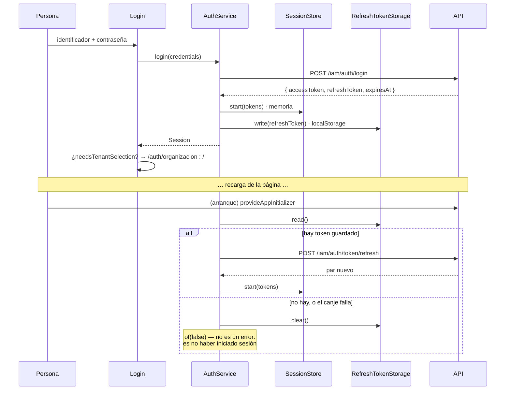

# Autenticación

JWT en el cuerpo, refresh token en `localStorage`, access token en memoria. Sin
cookies.

---

## El ciclo completo



## Dónde vive cada credencial

| Credencial | Dónde | Por qué |
|---|---|---|
| Access token | **Memoria** (`SessionStore`) | Dura minutos. Guardarlo sería exponer de más sin ganar nada |
| Refresh token | `localStorage` (`mantra.refresh-token`) | Es lo que hace que la sesión sobreviva a la recarga |

**No hay cookies.** La API entrega el refresh token en el cuerpo del login, así
que el frontend no puede convertirlo en `HttpOnly`: es una decisión del backend.

## El token es la única fuente de verdad sobre el usuario

**No hay `/me`**, y no hace falta:

```ts
export interface AccessTokenClaims {
  readonly sub: string;                                   // obligatorio
  readonly sid?: string;                                  // sesión, para cerrarla del lado del servidor
  readonly roles: readonly string[];
  readonly tenants: readonly string[];
  readonly name?: string;
  readonly tenantNames?: Readonly<Record<string, string>>;
  readonly exp?: number;
}
```

### La firma **no** se verifica en el cliente

```ts
/**
 * Verificarla en el cliente no aportaría nada: la clave es del servidor y quien
 * pueda alterar el token también puede alterar el código que lo comprueba. La
 * autoridad sigue siendo la API, que valida en cada petición.
 */
```

Es correcto y conviene entenderlo: el token se lee **solo para saber qué ofrecer
en pantalla**. Un token manipulado engañaría a la interfaz y sería rechazado por
la API en la primera petición.

### Solo `sub` es obligatorio

```ts
/**
 * `sid` y `tenants` están declarados opcionales en `jwt-payload.interface.ts`
 * del backend y, aunque hoy la firma siempre los emite, **exigirlos acá sería
 * ser más estricto que el contrato**: un token sin `sid` se leería como
 * ilegible y sacaría al login a alguien con sesión válida, sin explicación.
 */
```

Es un ejemplo de disciplina de contrato: **el cliente no puede ser más estricto
que el servidor.**

### La decodificación devuelve `null`, no lanza

Ante formato inválido, base64 corrupta, JSON ilegible o claims del tipo
equivocado. *«Un token ilegible es una sesión que no sirve, y eso lo resuelve
quien llama cerrando sesión, no un `try/catch` en cada punto de uso.»*

`decodeBase64Url` restituye el alfabeto y el relleno, y pasa por `TextDecoder`
para que un nombre con acentos no se rompa. **Ambos existen en el navegador y en
Node**, así que funciona bajo SSR — y `test-setup.ts` falla ruidosamente si el
entorno de pruebas dejara de exponerlos.

## Las cabeceras

```http
Authorization: Bearer <access token>
X-Tenant-Id: <organización activa>     ← solo si está resuelta
```

`X-Tenant-Id` **se omite** cuando el token trae varias organizaciones y ninguna
fue elegida: adivinar podría mostrar datos de la organización equivocada.

## Rutas públicas

Verificadas una por una contra `iam-auth.controller.ts`:

```text
/iam/auth/login                  /iam/auth/verify-email
/iam/auth/token/refresh          /iam/auth/activate
/iam/auth/register-patient       /public/…  (cualquier ruta bajo el prefijo)
/iam/auth/register-organization
/iam/auth/register-practitioner
```

El motivo no es que mandarles un token rompa algo:

> *«intentar refrescar cuando una de ellas responde 401 sí: el 401 de un login
> son credenciales inválidas, y reaccionar con un refresco sería un bucle contra
> el límite de 10 intentos por minuto.»*

`isPublic` compara **solo la ruta**, porque `apiBaseUrl` puede estar vacío en
desarrollo o ser una raíz absoluta en producción.

### Dos observaciones sobre esa lista

- **`/iam/auth/register-organization` no la llama nadie.** Es una previsión.
- **`/iam/auth/forgot-password` y `/iam/auth/reset-password` NO están.** No lo
  necesitan (quien las usa no tiene sesión), pero si alguien con sesión abierta
  usara el enlace del correo, su 401 dispararía un refresco. Caso de borde sin
  consecuencia observada; brecha `LOW`.

## El refresco: uno solo en vuelo

Ver [caché §lo único que sí deduplica](../data-and-state/caching.md#lo-único-que-sí-deduplica)
y [flujo de datos](../architecture/data-flow.md#flujo-del-refresco-de-token).

Y **el reintento no recursa**: si la petición reintentada vuelve a dar 401, el
error sube y la sesión se cierra.

## Autorización en la interfaz

**No existe autorización en el frontend, y está bien dicho en el código:**

> *«Esconder un ítem no protege nada —la autoridad es la API, que valida en cada
> petición—; es no ofrecer una puerta que va a estar cerrada. Quien escriba la
> URL a mano se topa con el guard primero y con un 403 después.»*

| Mecanismo | Qué hace |
|---|---|
| `authGuard` | Sesión y organización. **No mira roles** |
| Menú lateral | Dos ítems fijos. No filtra por rol todavía |
| `X-Tenant-Id` | Le dice a la API en qué contexto responder |
| Cualquier permiso real | **La API** |

## Lo que no hay

| Elemento | Estado |
|---|---|
| Guard por rol | No existe |
| Cookies `HttpOnly` | No. La API entrega el token en el cuerpo |
| Refresco proactivo antes de expirar | No. Se refresca **reactivamente**, tras un 401 |
| `isAccessTokenExpired` en uso | **La función existe y nadie la llama.** Ver abajo |
| Cierre de sesión por inactividad | No existe |
| Cierre de sesión en todas las pestañas | No existe |
| `logout-all` | El cliente usa `logout`, a propósito: `logout-all` cierra todos los dispositivos, que es otra intención |
| MFA condicional | El campo está siempre visible: el backend no señala cuándo hace falta |

### `isAccessTokenExpired` sin consumidor

```ts
export function isAccessTokenExpired(claims, now = new Date(), skewSeconds = 10): boolean
```

Está escrita, probada y **nadie la llama**. El refresco es reactivo: se espera al
401 en vez de anticiparse mirando `exp`.

Funciona, pero significa que **cada expiración cuesta una petición fallida**.
Usarla para refrescar antes de mandar una petición condenada es una mejora clara.
Registrada como brecha `MEDIUM` en
[el análisis de brechas](../reports/documentation-gap-analysis.md).
