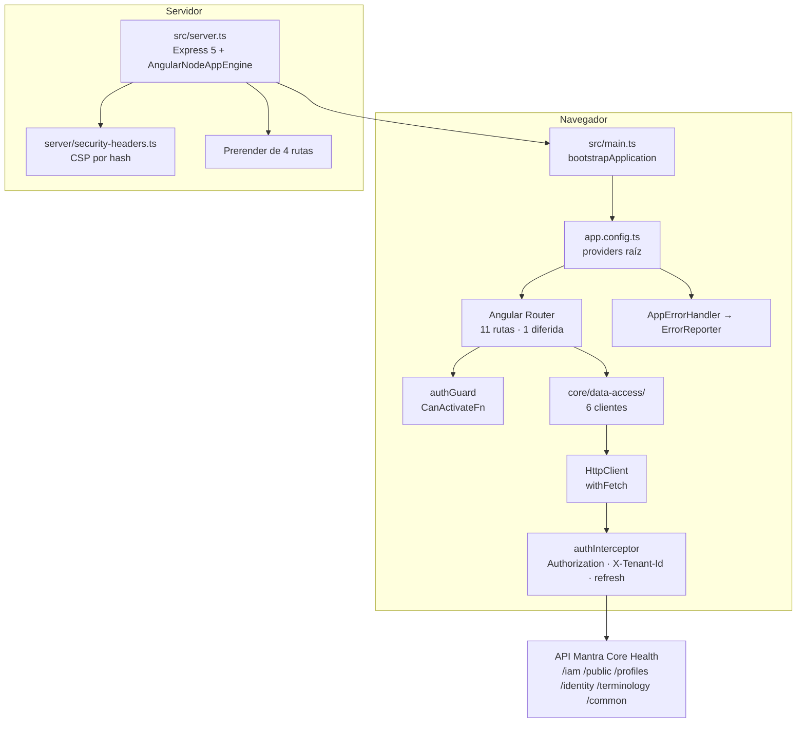

# Auditoría del estado actual · Angular

Lo que hay antes de tocar nada. Se escribe primero porque cada decisión de las
fases siguientes depende de un hecho de esta página, y porque la mitad de las
recetas de OpenTelemetry para Angular que circulan asumen cosas que **este
proyecto no tiene** —Zone.js, `NgModule`, `HttpClientModule`, NgRx— y aplicarlas
a ciegas rompería el arranque.

Medido sobre `ced38e8`, rama `dev`.

---

## 1 · Qué es este proyecto

| Elemento | Valor detectado | De dónde |
|---|---|---|
| Angular | **21.2.18** | `yarn.lock` (`@angular/core@npm:^21.2.0` → 21.2.18) |
| TypeScript | 5.9.x, `strict` | `package.json`, `tsconfig.json` |
| RxJS | 7.8.x | `package.json` |
| Node | tipos de v20 | `@types/node@^20.17.19` |
| Gestor de paquetes | **Yarn 4.18.0 en modo PnP** | `packageManager`, `.pnp.cjs` |
| Modelo de componentes | **Standalone**, sin un solo `NgModule` | `main.ts`, `app.config.ts` |
| Arranque | `bootstrapApplication(App, appConfig)` | `src/main.ts` |
| Detección de cambios | **Zoneless** | no existe `zone.js` en `package.json` ni en `yarn.lock`; `angular.json` no declara polyfills |
| Renderizado | **SSR + prerender selectivo + CSR** (híbrido) | `outputMode: "server"`, `app.routes.server.ts` |
| Hidratación | `provideClientHydration(withEventReplay())` | `app.config.ts` |
| Cliente HTTP | `provideHttpClient(withFetch(), withInterceptors([...]))` | `app.config.ts` |
| Estado global | **No hay** — signals y servicios | ADR-0003 |
| Formularios | Reactive Forms tipados | `login.ts`, `register-patient.ts`, … |
| Pruebas | **Vitest** vía `@angular/build:unit-test` + jsdom | `angular.json`, `vitest.config.ts` |
| Service Worker / PWA | **No existe** | sin `ngsw-config.json`, sin `provideServiceWorker` |
| WebSockets / SSE | **No existen** | sin `WebSocket` ni `EventSource` en `src/` |
| CI/CD | **No existe** | sin `.github/workflows` |
| Despliegue | Docker (desarrollo) + servidor Express propio | `Dockerfile.dev`, `src/server.ts` |

### El hecho que más condiciona todo: es zoneless

No hay Zone.js. Ni como dependencia, ni en los polyfills, ni en la configuración
de pruebas. Angular 21 arranca sin él y la detección de cambios corre por
señales.

**Consecuencia directa:** `@opentelemetry/context-zone` queda descartado. Es el
gestor de contexto que casi toda la documentación de OpenTelemetry para Angular
recomienda, y agregarlo obligaría a reintroducir Zone.js —235 kB, detección de
cambios distinta, y una decisión de arquitectura que no es de este trabajo—.

La estrategia de contexto asíncrono es entonces **propagación explícita**, y se
detalla en [03-async-context-strategy.md](03-async-context-strategy.md).

---

## 2 · Arquitectura detectada



### Modelo de arranque

`src/main.ts` es de cuatro líneas y no tiene ningún gancho previo. Es el único
punto donde algo puede correr **antes** de que Angular exista, y por eso es
donde entra la telemetría (fase 6).

`app.config.ts` ya tiene **tres** `provideAppInitializer` (tema, restauración de
sesión, oyente de cierre en otras pestañas). El segundo **bloquea** el arranque
a propósito: espera el canje del refresh token. Cualquier inicializador de
telemetría que se agregue tiene que ser **no bloqueante**, o se suma a esa
espera.

### Modelo de renderizado

Tres modos conviven, y la instrumentación tiene que distinguirlos:

| Ruta | Modo | Qué implica para las trazas |
|---|---|---|
| `/auth`, `/auth/registro`, `/auth/recuperar`, `/design-system` | **Prerender** | El HTML sale del build. No hay petición que trazar en el servidor; la traza empieza en el navegador. |
| `/auth/verificar`, `/auth/nueva-clave`, `/auth/organizacion`, `/**` | **Client** | El servidor manda el cascarón; la traza del servidor es corta y la del navegador es la interesante. |
| Estáticos | Express | Los sirve `express.static`, no el motor de Angular. |

`angular.rendering.mode` no puede ser un valor fijo del artefacto: se resuelve
en ejecución, y para el navegador vale `ssr` cuando encuentra estado hidratable
y `csr` cuando no.

### Modelo de detección de cambios

Zoneless. Las pantallas usan `ChangeDetectionStrategy.OnPush` y `signal()`.
No hay `NgZone.runOutsideAngular` en el código, y no hace falta: sin Zone.js no
existe la contaminación de zona que obliga a usarlo. Los temporizadores del
exportador OTLP no provocan detección de cambios.

---

## 3 · Puntos de instrumentación reales

Lo que existe y se puede instrumentar sin inventar nada:

| Punto | Archivo | Estado |
|---|---|---|
| Arranque | `src/main.ts` | Sin instrumentar |
| Navegación | Router de `app.config.ts` | Sin instrumentar |
| Ruta diferida | `app.routes.ts` (`design-system`) | Tiene `catch` propio hacia `ErrorRecovery` |
| Guard | `core/auth/auth.guard.ts` | Decide en memoria, sin red |
| Resolvers | **No hay ninguno** | Fase 13 queda sin objeto |
| HTTP | `core/http/auth.interceptor.ts` | Único interceptor registrado |
| Refresco de sesión | `core/http/token-refresh.service.ts` | Reintento único, no recursivo |
| Clientes de API | `core/data-access/**` (6) | `iam`, `identity`, `profiles`, `terminology`, `files`, `public` |
| Errores | `core/errors/app-error-handler.ts` → `error-reporter.ts` | **Ya existe el punto de enchufe**: `ErrorReporter.report()` |
| Formularios | 6 pantallas de `features/auth/` + registro | Reactive Forms |
| Subida de archivos | `core/data-access/files/files.client.ts` | `multipart/form-data` |
| Servidor | `src/server.ts` | Sin instrumentar |

**`ErrorReporter` ya está escrito esperando esto.** Su propio comentario lo dice:
*«un punto único al que enchufar el destino el día que se elija»*. No hay que
crear un manejador nuevo; hay que conectar el que hay.

### Flujos críticos

1. **Inicio de sesión** — `Login` → `AuthService.login` → `IamClient` → `POST /iam/auth/login` → guarda tokens → navega.
2. **Restauración de sesión al arrancar** — `provideAppInitializer` → refresh token → `POST /iam/auth/token/refresh`. **Bloquea el arranque.**
3. **Refresco reactivo ante 401** — interceptor → `TokenRefreshService` → reintento único.
4. **Registro de paciente** — formulario largo con validación → `POST /iam/auth/register-patient`.
5. **Fragmento diferido caído** — `design-system` con `catch` → `ErrorRecovery`.
6. **Selección de organización** — guard redirige a `/auth/organizacion`.

---

## 4 · Datos sensibles presentes en el frontend

Es un sistema de salud. La lista no es teórica: cada elemento existe hoy en el
código y **no puede** viajar en un span.

| Dato | Dónde vive | Riesgo si se instrumenta mal |
|---|---|---|
| Contraseña | `login.form`, `register-patient.form`, `reset-password.form` | Captura de `form.value` |
| Código MFA | `login.form.mfaCode` | Captura de `form.value` |
| Access token | `SessionStore` en memoria, cabecera `Authorization` | Captura de cabeceras |
| Refresh token | `localStorage` (`refresh-token.storage.ts`) | Captura de almacenamiento |
| Claims del JWT (`sub`, `sid`, tenants) | `SessionStore.claims()` | Atributos de usuario |
| `X-Tenant-Id` | Cabecera de cada petición | Identifica la organización |
| Correo, documento de identidad | Formularios de login y registro | Captura de campos |
| Token de verificación / de nueva clave | **Query string** de `/auth/verificar?token=…` y `/auth/nueva-clave?token=…` | **Captura de URL** |
| Archivos marcados `PHI` | `files.client.ts` (`sensitivity: 'PHI'`) | Nombre de archivo, contenido |
| Ruta visitada | Router | La sección visitada **ya es información de salud** |

> El último renglón es el que la documentación existente ya había marcado:
> *«un servicio de terceros vería la ruta que cada persona visita, y la sección
> visitada ya es información de salud»* (`error-reporter.ts`).
>
> Es la razón de que el destino de la telemetría sea **de mismo origen** y no un
> proveedor externo. Ver [06-data-privacy-policy.md](06-data-privacy-policy.md).

**Las dos rutas con token en query string obligan a normalizar la URL antes de
que toque un span.** No es una precaución general: son dos rutas concretas de
este repositorio donde el enlace del correo lleva la credencial en la dirección.

---

## 5 · Restricciones del repositorio que hay que respetar

Estas no son preferencias: hay verificadores que fallan si se rompen.

| Regla | Quién la hace cumplir | Qué implica |
|---|---|---|
| Sin dependencias circulares | `scripts/check-architecture.mjs` | El grafo de la telemetría tiene que ser acíclico |
| Capas en una dirección: `features → shared → core` | ídem | Todo lo nuevo vive en `core/observability/` y no importa de `shared/` ni de `features/` |
| La red vive solo en `core/data-access/` | ídem (busca `fetch(`, `this.http.`) | El exportador OTLP no puede escribir `fetch(` en código propio |
| Todo servicio inyectable se nombra en `docs/` | `scripts/check-doc-coverage.mjs` | Cada `@Injectable` nuevo necesita mención documental |
| Cero marcadores provisionales en `docs/` | ídem | Nada de secciones a medias |
| Enlaces internos válidos | `scripts/check-doc-links.mjs` | Las páginas nuevas se enlazan entre sí correctamente |
| Cobertura ≥ 80 % en `core/**` | `vitest.config.ts` (bloqueante) | **El código nuevo de `core/observability/` necesita pruebas o la orden falla** |
| CSP sin `unsafe-*` en `script-src` | `src/server/security-headers.ts` | El endpoint de telemetría tiene que caber en `connect-src 'self'` |
| Nada con forma de secreto en el entorno público | `scripts/generate-env.mjs` | La configuración de telemetría pasa por el manifiesto, sin claves |

La de cobertura es la más restrictiva y define el orden del trabajo: cada
archivo nuevo de `core/observability/` va con su prueba en la misma fase.

---

## 6 · Línea base de rendimiento

Build de producción sobre `ced38e8`, sin ningún cambio:

```
Initial chunk files   Raw size    Transferencia estimada
chunk-JSE4WQB7.js     250.66 kB   57.92 kB
chunk-FLW4DDV2.js     204.37 kB   60.09 kB
main-66DH2NRE.js       70.92 kB   16.18 kB
styles-6L4QBXT4.css    14.54 kB    2.60 kB
chunk-X2N7GK2E.js       1.28 kB   531 B
──────────────────────────────────────────
Initial total         541.77 kB  137.32 kB

Diferidos             design-system-sample 173.10 kB · toast-dev-panel 2.98 kB
Servidor              server.mjs 817.43 kB · main.server.mjs 511.97 kB
Build                 5.25 s · 4 rutas prerenderizadas
```

```
▲ bundle initial exceeded maximum budget.
  Budget 500.00 kB was not met by 41.77 kB with a total of 541.77 kB.
```

**El presupuesto inicial ya está excedido en 41,77 kB antes de agregar nada.**

Este es el dato que decide la arquitectura de la fase 6. El SDK web de
OpenTelemetry más el exportador OTLP pesan del orden de 150–200 kB en crudo: si
entraran al paquete inicial, el aviso de 500 kB pasaría a ser un **error** de
1 MB en el horizonte y la primera pantalla cargaría más lento para todo el
mundo, incluida la gente que nunca genera una traza porque el muestreo la
descartó.

Por eso el SDK se carga **en un fragmento aparte**, y la instrumentación que
corre antes de que ese fragmento llegue no se pierde: se registra con marcas de
tiempo y se emite cuando el SDK está listo. El diseño está en
[01-architecture-design.md](01-architecture-design.md).

---

## 7 · Riesgos identificados

| # | Riesgo | Gravedad | Mitigación planificada |
|---|---|---|---|
| R1 | Zoneless: el contexto no se propaga solo a través de `await` ni de operadores RxJS | **Alta** | Propagación explícita con `context.with`; spans manuales bien delimitados; fase 8 |
| R2 | El paquete inicial ya excede el presupuesto | **Alta** | Fragmento diferido + emisión retardada; fase 6 y 41 |
| R3 | Tokens en el query string de dos rutas | **Alta** | Normalización de ruta a plantilla antes de cualquier atributo; fases 10 y 36 |
| R4 | El interceptor de refresco puede duplicar spans del reintento | Media | Un span por petición lógica con evento `http.retry`; fase 14 y 23 |
| R5 | El inicializador de sesión bloquea el arranque | Media | La telemetría no agrega ningún `provideAppInitializer` bloqueante |
| R6 | Instrumentación automática de `fetch` trazaría la propia exportación | Media | No se instala instrumentación automática; el interceptor es la única fuente de spans HTTP |
| R7 | La CSP bloquearía un endpoint de otro origen | Media | Endpoint de mismo origen `/otel/v1/traces`; `connect-src 'self'` intacto |
| R8 | La instrumentación del servidor no puede parchear módulos empaquetados por esbuild | Media | Instrumentación **manual** en el servidor, sin `auto-instrumentations-node`; fase 25 |
| R9 | La cobertura bloqueante rechaza código nuevo sin pruebas | Media | Prueba por archivo, en la misma fase |
| R10 | El Collector caído no debe afectar a la aplicación | Media | Exportación con reintento acotado y fallo silencioso; fases 7 y 38 |
| R11 | Yarn PnP es estricto con las dependencias no declaradas | Baja | Se declaran explícitamente todos los paquetes que se importan |
| R12 | Los paquetes de Node podrían acabar en el paquete del navegador | Baja | Separación por carpeta (`src/server/telemetry/`) y verificación en el build |

---

## 8 · Plan adaptado a este proyecto

Del plan general, esto es lo que **aplica** y lo que **no**, con el motivo.

### Aplica

Arranque, carga del documento, Router, ruta diferida, guard, `HttpClient` e
interceptores, propagación al backend, servicio central de tracing, RxJS,
signals (solo operaciones de negocio), formularios, interacciones críticas,
errores globales, autenticación, archivos, SSR, hidratación, CORS, CSP,
gateway, Collector, muestreo, privacidad, pruebas y medición.

### No aplica, y por qué

| Fase | Motivo |
|---|---|
| `NgModule` / `platformBrowserDynamic` | No existen: el proyecto es standalone |
| `ZoneContextManager` | No hay Zone.js |
| Interceptores de clase, `withInterceptorsFromDi` | Solo hay un interceptor funcional |
| Resolvers (fase 13) | **No hay ninguno** en `app.routes.ts` |
| NgRx / NGXS / Akita (fase 19) | No hay estado global; ADR-0003 lo decidió |
| Signal Forms | No existen en el proyecto |
| Service Worker / PWA (fase 27) | No hay `ngsw-config.json` ni registro |
| WebSockets / SSE (fase 28) | No hay ninguno en `src/` |
| Bloques `@defer` | No se usa ninguno; la única carga diferida es de ruta |
| Cypress / Playwright (fase 39) | No hay corredor E2E instalado; agregarlo es una decisión aparte |

Lo que no aplica no se escribe «por si acaso». Un archivo de instrumentación de
WebSockets en un proyecto sin WebSockets es código muerto que alguien va a
mantener.

---

## 9 · Archivos que se van a tocar

### Se crean

```
src/app/core/observability/**        instrumentación del navegador
src/server/telemetry/**              instrumentación del servidor
infra/otel-collector/**              configuración del Collector y compose
scripts/verify-angular-tracing.mjs   verificación de extremo a extremo
docs/observability/angular/**        esta documentación
```

### Se modifican, y lo mínimo

| Archivo | Cambio |
|---|---|
| `src/main.ts` | Una llamada no bloqueante antes de `bootstrapApplication` |
| `src/app/app.config.ts` | Interceptor de trazas y un inicializador no bloqueante |
| `src/app/core/errors/error-reporter.ts` | Enchufe al destino que ya estaba previsto |
| `src/environments/environment.types.ts` | Campos públicos de telemetría |
| `src/environments/environment*.ts` | Valores por defecto |
| `scripts/generate-env.mjs` | Entradas nuevas del manifiesto |
| `src/server.ts` | Middleware de traza y proxy `/otel/v1/traces` |
| `src/server/security-headers.ts` | Sin cambios de política; se verifica que `connect-src 'self'` alcanza |
| `package.json` | Dependencias y órdenes nuevas |
| `mkdocs.yml` | Navegación de las páginas nuevas |

### No se tocan

`src/app/shared/**` (el sistema de diseño entero), `src/app/features/**` salvo
para spans de negocio explícitos y acotados, `src/app/core/auth/session.store.ts`,
`refresh-token.storage.ts`, `access-token.ts`, y cualquier contrato con la API.

**Ninguna pantalla cambia de aspecto y ningún contrato con la API cambia.**

---

## 10 · Criterio de aceptación de esta fase

- [x] Versión de Angular, TypeScript, RxJS y gestor de paquetes confirmadas en el `yarn.lock`.
- [x] Modelo de arranque, renderizado y detección de cambios confirmados en el código.
- [x] Inventario de puntos de instrumentación con archivo y estado.
- [x] Inventario de datos sensibles con su ubicación real.
- [x] Línea base de tamaño de paquete medida con un build real.
- [x] Riesgos con mitigación asignada a una fase.
- [x] Alcance recortado a lo que el repositorio tiene.
- [x] **Ninguna dependencia instalada todavía.**

Siguiente: [01-architecture-design.md](01-architecture-design.md).
