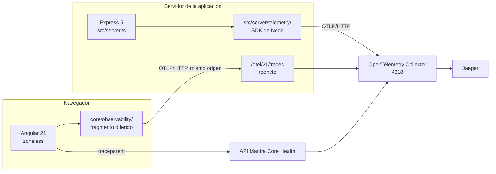
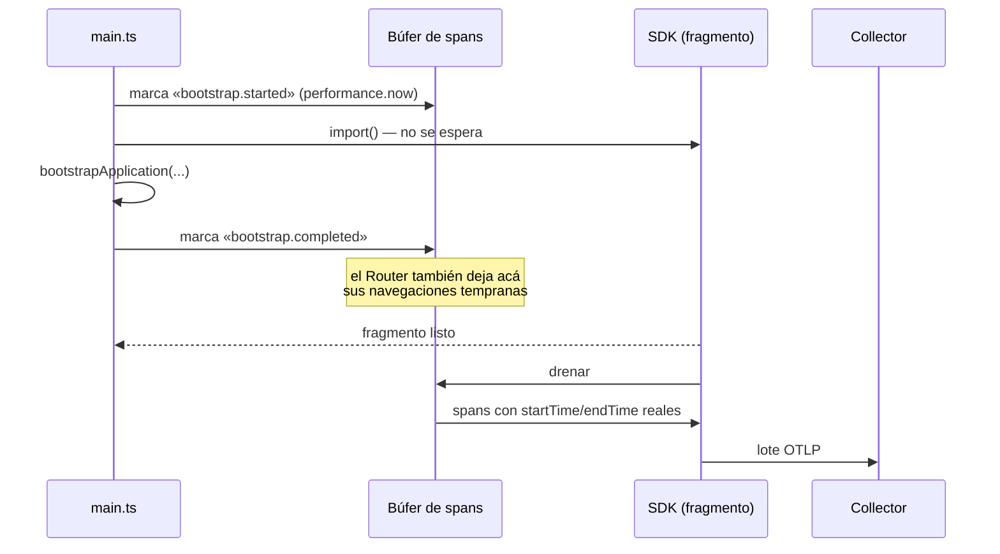

# Diseño de la arquitectura de trazas

Las decisiones, con su motivo y su alternativa descartada. Se apoya en los
hechos de [00-current-state-audit.md](00-current-state-audit.md); si alguno de
esos hechos cambia —sobre todo *zoneless* y el presupuesto de paquete— hay
decisiones de acá que hay que revisar.

---

## 1 · La forma general



Tres emisores, un solo Collector, un solo Jaeger. El navegador **nunca** habla
con el Collector ni con Jaeger de forma directa: manda al mismo origen desde el
que se sirvió, y el servidor de la aplicación reenvía.

### Por qué de mismo origen y no directo al Collector

Cuatro motivos, en orden de peso:

1. **La CSP no se toca.** `connect-src 'self'` sigue valiendo. Un endpoint en
   otro origen obligaría a abrirla, y `src/server/security-headers.ts` es una
   pieza que el proyecto se tomó el trabajo de cerrar bien.
2. **No hay preflight.** Mismo origen, sin CORS que negociar y sin una petición
   `OPTIONS` extra por cada lote de spans.
3. **El Collector no se publica.** Exponerlo a internet lo convierte en un
   sumidero abierto: cualquiera puede mandarle spans falsos, y no tiene forma de
   distinguirlos.
4. **La ruta que visita cada persona es información de salud.** Mandarla a un
   dominio de terceros es una decisión de privacidad que este proyecto ya había
   rechazado por escrito en `core/errors/error-reporter.ts`.

---

## 2 · Decisiones

| # | Decisión | Elegido | Alternativa descartada | Motivo |
|---|---|---|---|---|
| D1 | SDK del navegador | `@opentelemetry/sdk-trace-web` 2.x | Ninguna | Es el único SDK de trazas para navegador que mantiene el proyecto OpenTelemetry |
| D2 | Gestor de contexto | `StackContextManager` (el que trae el SDK) | `ZoneContextManager` | No hay Zone.js. Reintroducirlo cuesta 235 kB y cambia la detección de cambios |
| D3 | Instrumentaciones automáticas | **Ninguna** | `instrumentation-fetch`, `-xml-http-request`, `-document-load`, `-user-interaction` | Ver §3 |
| D4 | Estrategia HTTP | **B** — el interceptor de Angular es el único dueño del span | A — auto-instrumentación de `fetch` + interceptor de contexto | Ver §3 |
| D5 | Carga del SDK | Fragmento diferido con `import()` dinámico | Importación estática en `main.ts` | El paquete inicial ya excede el presupuesto en 41,77 kB |
| D6 | Instrumentación anterior a que el SDK esté listo | Registro con marcas de tiempo y emisión retardada | Perder esos spans / generar IDs a mano | Generar un `trace_id` propio está prohibido; perder el arranque haría inútil la fase 9 |
| D7 | Exportador | `exporter-trace-otlp-http` (protobuf sobre HTTP) | OTLP/gRPC, Zipkin, exportador propio | gRPC no existe en el navegador; OTLP/HTTP es lo que el Collector recibe nativo |
| D8 | Endpoint del navegador | `/otel/v1/traces` (mismo origen) | `http://collector:4318`, subdominio | §1 |
| D9 | Envío al cerrar la pestaña | `sendBeacon` en `pagehide`, con vuelta a `fetch` con `keepalive` | Solo `fetch` | Un `fetch` normal se cancela al descargar la página y se pierde el último lote, que es justo el del error |
| D10 | Propagador | `W3CTraceContextPropagator` (`traceparent`, `tracestate`) | `baggage` | El `baggage` no tiene ninguna necesidad aprobada y es un vector directo de fuga de datos personales |
| D11 | Destinos a los que se propaga | Lista blanca de prefijos de la API | Todo destino | Sin lista blanca, una petición a un CDN llevaría el identificador de traza a un tercero |
| D12 | Muestreo | `ParentBasedSampler` sobre `TraceIdRatioBased`, ratio por entorno | Ratio fijo en el código | Producción no puede ir al 100 % y desarrollo no puede ir al 1 % |
| D13 | Router | Un servicio que escucha los eventos del Router y abre un span por navegación | `withDebugTracing()` | `withDebugTracing` escribe en consola, no exporta, y está prohibido en producción |
| D14 | Errores | Enchufe en `ErrorReporter.report()`, que ya existía para esto | Un `ErrorHandler` nuevo | El proyecto ya tiene el punto único; duplicarlo produciría el error dos veces |
| D15 | Servidor | `sdk-trace-node` con spans **manuales** | `sdk-node` + `auto-instrumentations-node` | El SSR se empaqueta con esbuild: el parcheo por `require` no encuentra los módulos |
| D16 | Nombre del servicio | `mantra-angular-web` y `mantra-angular-ssr`, distintos | El mismo para los dos | Jaeger agrupa por `service.name`; con el mismo nombre, navegador y servidor serían indistinguibles |
| D17 | Identidad del artefacto | `BUILD_INFO` (versión + commit), que ya existe | Un valor nuevo | Ya responde «qué código está corriendo» y lo usa el reporte de errores |
| D18 | Configuración | Manifiesto de `scripts/generate-env.mjs`, con validación | Un JSON de runtime nuevo | El proyecto ya tiene un puente auditado hacia el entorno público |
| D19 | Source maps | No se suben a ningún servicio | Subida a un servicio de errores | No hay servicio de errores, y el `stack` no se exporta (§7) |
| D20 | Pruebas | `InMemorySpanExporter` de `sdk-trace-base` | Un Collector en las pruebas | Una prueba unitaria que necesita red no es una prueba unitaria |

---

## 3 · La decisión que más cambia el resultado: sin instrumentación automática

El plan general propone instalar `instrumentation-fetch`,
`instrumentation-xml-http-request`, `instrumentation-document-load` y quizá
`instrumentation-user-interaction`. **Acá no se instala ninguna.** Los motivos
son concretos de este repositorio:

**`instrumentation-fetch` trazaría su propia exportación.** El exportador OTLP
manda los spans con `fetch`. Instrumentar `fetch` globalmente hace que cada
envío de spans genere un span, que se envía, que genera otro. Se puede filtrar
por URL, pero es un lazo que hay que atar y que se desata solo en cuanto alguien
cambia el endpoint.

**Instrumentaría también lo que no es de la aplicación.** Todo `fetch` de la
página, venga de donde venga. La lista blanca de propagación se puede
configurar, pero la creación de spans no distingue.

**Duplicaría con el interceptor.** El proyecto tiene un interceptor que ya sabe
cosas que `fetch` no sabe: si la ruta es pública, si hubo refresco de token, si
el reintento es el mismo intento lógico. Con las dos fuentes activas, cada
petición produce un span de `fetch` y otro del interceptor, con el mismo
significado y distinta duración —justo la jerarquía que el plan prohíbe—.

**`instrumentation-document-load` genera un span por recurso.** Con 5 archivos
iniciales y las tipografías autoalojadas, son decenas de spans por carga que
dicen lo que `PerformanceNavigationTiming` dice en un span.

**Y todas pesan.** Cada instrumentación arrastra `@opentelemetry/instrumentation`
y su maquinaria de parcheo. Con el presupuesto ya excedido, es un coste que hay
que justificar recurso por recurso.

En su lugar:

| Lo que la instrumentación automática daba | Cómo se obtiene acá |
|---|---|
| Spans de `fetch`/XHR | `tracingInterceptor`, que además conoce el dominio de la API |
| Propagación de `traceparent` | El mismo interceptor, con lista blanca explícita |
| Span de carga del documento | Un span construido con la API de *Navigation Timing*, con tiempos reales |
| Spans de interacción | Spans de negocio manuales en los seis flujos que importan |

El coste de esta decisión está escrito y es real: **una petición hecha con
`fetch` directo, fuera de `HttpClient`, no se traza**. Hoy no existe ninguna
—`scripts/check-architecture.mjs` lo hace cumplir— y si alguien la agrega, ese
verificador falla antes de que llegue a producción.

---

## 4 · Arranque y emisión retardada

El problema: el SDK vive en un fragmento diferido (D5), y lo primero que hay que
medir —el arranque— ocurre antes de que ese fragmento llegue.

La solución, en tres piezas:



1. **Marcas, no spans.** Antes de que el SDK exista se guardan descripciones
   completas —nombre, atributos, eventos, inicio, fin— en un búfer acotado.
2. **Emisión con tiempos explícitos.** OpenTelemetry admite `startTime` en las
   opciones del span y `endTime` en `end()`. Los spans emitidos al drenar tienen
   la duración real, no la del momento en que se emitieron.
3. **Solo spans raíz.** Un span del búfer no tiene padre, y en el navegador el
   arranque y una navegación **son** raíces. Lo que sí se pierde es el enlace de
   una petición HTTP que ocurriera en esa ventana: se documenta como límite, y
   la ventana es anterior al primer pintado.

El búfer está acotado (32 entradas) y caduca (10 s). Si el fragmento no llega
—red caída, bloqueador— el búfer se descarta y no queda nada creciendo en
memoria.

### Idempotencia

`startBrowserTelemetry()` puede llamarse muchas veces y solo actúa la primera.
Hace falta por tres motivos reales: la recarga en caliente del servidor de
desarrollo, las pruebas que arrancan la aplicación varias veces en el mismo
proceso, y el propio SSR, donde el módulo se evalúa por petición.

---

## 5 · Contexto asíncrono sin Zone.js

Resumen; el desarrollo está en [03-async-context-strategy.md](03-async-context-strategy.md).

`StackContextManager` mantiene el contexto de forma **síncrona**. Cruzando un
`await`, un `setTimeout` o un operador de RxJS, el contexto activo se pierde.

La respuesta es no depender de que se propague solo:

- El interceptor abre el span y **envuelve la suscripción** con `context.with`,
  de modo que el `traceparent` se inyecta con el contexto correcto.
- `TracingService.traceObservable` usa `defer` para crear el span **al
  suscribirse**, no al construir, y `finalize` para cerrarlo una sola vez.
- Los spans de negocio reciben el padre de forma explícita cuando hace falta,
  en vez de confiar en el contexto ambiental.

---

## 6 · Muestreo

`ParentBased(TraceIdRatioBased(ratio))`. La decisión del padre manda: si el
navegador decide muestrear una traza, el backend la conserva entera, y al revés.

| Entorno | Ratio | Motivo |
|---|---|---|
| Desarrollo | 1.00 | Se está mirando lo que se acaba de hacer |
| Pruebas | 0.00 (exportador en memoria) | Ninguna prueba manda nada a ninguna parte |
| Preproducción | 1.00 | Volumen bajo; es donde se valida |
| Producción | 0.10 inicial | Punto de partida, a ajustar con volumen medido |

El ratio **no está en el código**: es `PUBLIC_TELEMETRY_SAMPLE_RATIO`, y se
valida entre 0 y 1 al generarlo. El muestreo por cola vive en el Collector,
descrito en `infra/otel-collector/otel-collector.angular.yml`.

Lo que nunca se descarta en el navegador, aunque el ratio lo diga: nada. El
muestreo por cabeza no sabe todavía si la traza va a fallar. Conservar los
errores es trabajo del Collector, que ve la traza completa.

---

## 7 · Privacidad, en una línea por regla

La política entera está en
[06-data-privacy-policy.md](06-data-privacy-policy.md). El diseño la hace
cumplir así:

| Regla | Cómo se hace cumplir en el diseño |
|---|---|
| Sin query string | La URL pasa por `sanitizeUrl` antes de tocar un atributo; se conserva el `path`, se descarta todo lo demás |
| Sin identificadores en el nombre | La ruta se convierte a plantilla contra la configuración del Router (`/customers/:id`) |
| Sin cuerpos ni cabeceras | El interceptor no lee `request.body` ni `request.headers`; solo método, host, esquema y estado |
| Sin `stack` | El sanitizador conserva `error.type` y un mensaje recortado; la traza de pila no viaja |
| Sin valores de formulario | Los spans de formulario llevan nombre, cantidad de errores y resultado; nunca el valor |
| Sin nombres de archivo | Extensión, tipo MIME y **cubeta** de tamaño |
| Sin datos de sesión | Ni `sub`, ni `sid`, ni tenant, ni correo |
| Doble red | El Collector vuelve a borrar atributos por si algo escapa del cliente |

---

## 8 · Matriz de compatibilidad (fase 3)

Versiones consultadas en el registro el 2026-08-01 y contrastadas con las
`peerDependencies` publicadas.

| Componente | Versión detectada | Versión seleccionada | Compatibilidad |
|---|---|---|---|
| Angular | 21.2.18 | — | No se modifica |
| TypeScript | 5.9.x | — | No se modifica |
| RxJS | 7.8.x | — | No se modifica |
| Node | 20.x (tipos) | — | No se modifica |
| Zone.js | ausente | **sigue ausente** | Decisión D2 |
| `@opentelemetry/api` | — | **1.9.1** | `peerDependency` de todo el SDK 2.x: `>=1.0.0 <1.10.0` ✔ |
| `@opentelemetry/core` | — | 2.10.0 | Requiere `api` en el mismo rango ✔ |
| `@opentelemetry/resources` | — | 2.10.0 | ✔ |
| `@opentelemetry/semantic-conventions` | — | 1.43.0 | Sin dependencias de ejecución ✔ |
| `@opentelemetry/sdk-trace-base` | — | 2.10.0 | ✔ |
| `@opentelemetry/sdk-trace-web` | — | 2.10.0 | ✔ |
| `@opentelemetry/sdk-trace-node` | — | 2.10.0 | Solo servidor ✔ |
| `@opentelemetry/exporter-trace-otlp-http` | — | 0.221.0 | La serie `0.2xx` acompaña a la `2.x` del SDK ✔ |
| Vitest | 4.x | — | El exportador en memoria vive en `sdk-trace-base`, sin corredor propio ✔ |
| `@angular/build` | 21.2.11 | — | esbuild; condiciona D15 |

**Una sola versión de `@opentelemetry/api`.** Es la regla que más se rompe en la
práctica: dos copias en el árbol de dependencias producen dos registros globales
y los spans dejan de anidarse sin que nada falle de forma visible. Se verifica
con `yarn why @opentelemetry/api`.

Lo que **no** se instala, y a propósito: `@opentelemetry/context-zone` (D2),
`@opentelemetry/instrumentation*` (D3), `@opentelemetry/sdk-node` y
`@opentelemetry/auto-instrumentations-node` (D15).

---

## 9 · Estructura de archivos

```
src/app/core/observability/
├── config/          telemetry.types · telemetry.config · telemetry-config.validator · telemetry.token
├── browser/         bootstrap · resource · exporter · sampling · lifecycle · pending-spans
├── tracing/         tracing.service · tracer-provider · tracing.constants · tracing.types
├── routing/         router-tracing · route-template
├── http/            tracing.interceptor · propagation-allowlist
├── errors/          error-sanitizer · error-deduplicator
└── privacy/         sanitize-url

src/server/telemetry/
├── server-telemetry.ts       arranque del SDK de Node
└── server-tracing.middleware.ts  span por petición SSR

infra/otel-collector/
├── otel-collector.angular.yml
└── docker-compose.observability.yml
```

Cada archivo por debajo de 300 líneas, cada uno con su `.spec.ts` en la misma
carpeta —que es lo que pide el umbral bloqueante del 80 % en `core/**`—.

---

## 10 · Lo que este diseño no resuelve

Se escribe acá para que no se descubra en producción:

1. **Una petición HTTP anterior a que cargue el fragmento del SDK pierde su
   padre.** Ventana de unos milisegundos, antes del primer pintado.
2. **El contexto no cruza un `await` por sí solo.** Cada punto que lo necesita lo
   propaga a mano; si alguien agrega uno nuevo y se olvida, el span queda como
   raíz en vez de como hijo. No rompe nada, pero la traza queda partida.
3. **El servidor no traza sus dependencias.** Los spans del SSR son manuales: la
   petición entrante y el render. Una llamada saliente del servidor no aparece
   sola.
4. **El prerender no produce trazas.** Ocurre en el build, donde no hay Collector.
5. **No hay pruebas de extremo a extremo automatizadas.** No hay corredor E2E
   instalado; `scripts/verify-angular-tracing.mjs` cubre la verificación manual
   contra un entorno levantado.

Siguiente: [02-naming-conventions.md](02-naming-conventions.md).
