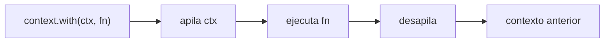

# Contexto asíncrono sin Zone.js

La decisión técnica que más condiciona esta implementación, y la que más se
aparta de lo que dice la documentación de OpenTelemetry para Angular.

---

## 1 · El hecho de partida

**Este proyecto no tiene Zone.js.** Ni como dependencia en `package.json`, ni en
`yarn.lock`, ni en los polyfills de `angular.json`. Angular 21 arranca sin él y
la detección de cambios corre por señales.

Casi toda la documentación de OpenTelemetry para Angular recomienda
`@opentelemetry/context-zone`. Ese paquete **necesita** Zone.js: lo que hace es
enganchar el contexto de OpenTelemetry a las zonas de Angular.

Instalarlo aquí significaría reintroducir Zone.js. Eso son unos 235 kB en un
paquete que ya excede su presupuesto, un modelo de detección de cambios
distinto, y una decisión de arquitectura que no es de un trabajo de
observabilidad. Descartado.

---

## 2 · Qué se usa en su lugar

`StackContextManager`, el gestor que trae `@opentelemetry/sdk-trace-web`. Lo
registra `browser/telemetry-browser.bootstrap.ts`.

Mantiene el contexto activo en una pila **síncrona**. Funciona así:



Todo lo que ocurra **dentro** de `fn`, de forma síncrona, ve el contexto. Lo que
ocurra después —en otro tick, en otro microtask— no.

### La tabla que hay que tener en la cabeza

| Cruza el límite | ¿Se conserva el contexto? |
|---|---|
| Llamada a función síncrona | Sí |
| `context.with(...)` explícito | Sí |
| Suscripción a un Observable frío, dentro de `context.with` | Sí |
| `await` | **No** |
| `.then()` | **No** |
| `setTimeout` / `setInterval` | **No** |
| Emisión posterior de un `Subject` | **No** |
| `catchError` que reacciona a un error asíncrono | **No** |
| Manejador de evento del DOM | **No** |

En Node es distinto: `sdk-trace-node` instala un gestor basado en
`AsyncLocalStorage`, que **sí** cruza los `await`. Por eso el middleware del
servidor puede confiar en el contexto y el navegador no.

---

## 3 · La respuesta: propagación explícita

La regla es no depender nunca de que el contexto se propague solo. Los tres
sitios donde importa lo hacen a mano.

### El interceptor HTTP

```ts
const span = tracing.startSpan(SPAN_NAMES.httpRequest, attributesOf(request), SpanKind.CLIENT);
const active = trace.setSpan(context.active(), span);

return new Observable<HttpEvent<unknown>>((subscriber) =>
  context.with(active, () => next(outgoing).subscribe(subscriber)),
);
```

El detalle que hace que funcione es **dónde** está el `context.with`: envuelve
la **suscripción**, no la construcción del Observable. Con un Observable frío
—y el de `HttpClient` lo es— el trabajo empieza al suscribirse. Envolver solo la
construcción daría contexto a un momento en el que todavía no pasa nada.

Es el error más fácil de cometer, y el síntoma es sutil: todo compila, los spans
salen, y simplemente aparecen como raíces sueltas en vez de anidados.

### `TracingService.traceObservable`

El mismo patrón, y por el mismo motivo. Ver
[04-rxjs-tracing-guidelines.md](04-rxjs-tracing-guidelines.md).

### `runInSpan`

Usa `tracer.startActiveSpan`, que hace el `context.with` por dentro. Es el caso
fácil: la operación es síncrona y el contexto le llega entero.

### `runInChildSpan`

Para cuando el padre se conoce pero no está activo — típicamente después de un
`await`. Se pasa el `Span` y él se encarga:

```ts
tracing.runInChildSpan(padre, 'nombre', {}, () => { … });
```

---

## 4 · Lo que no funciona, dicho claro

### Un span abierto después de un `await` no es hijo

```ts
await tracing.runInAsyncSpan('padre', {}, async (span) => {
  await algoLento();
  // Acá el contexto YA se perdió: este span sale como raíz, no como hijo.
  tracing.runInSpan('hijo', {}, () => { … });
});
```

Lo correcto:

```ts
await tracing.runInAsyncSpan('padre', {}, async (span) => {
  await algoLento();
  tracing.runInChildSpan(span, 'hijo', {}, () => { … });
});
```

### El refresco de sesión sale como traza aparte

Cuando `authInterceptor` recibe un 401 y llama a `TokenRefreshService`, esa
llamada ocurre dentro de un `catchError` que reacciona a un error **asíncrono**.
Para entonces el contexto del span original ya no está activo, así que el span
del refresco es una raíz nueva.

No se corrige forzándolo: hacerlo exigiría que el interceptor de autenticación
—que no es de observabilidad— cargara con el contexto. La traza queda partida en
dos, las dos partes existen, y las dos llevan la ruta y el instante que permiten
relacionarlas. Es un coste aceptado, no un descuido.

### Los eventos del Router no corren en el contexto de su navegación

`RouterTracing` abre el span de navegación y lo guarda en un mapa por
identificador, en vez de dejarlo activo: los eventos posteriores del Router
llegan en otro tick. Por eso el span de carga de fragmento se cuelga con
`context.with` explícito sobre el span guardado.

---

## 5 · Cómo se comprobó

No por lectura. Cada punto tiene una prueba que lo fija:

| Qué | Dónde |
|---|---|
| Un span dentro de otro queda anidado | `tracing.service.spec.ts` — «deja el span activo» |
| La suscripción corre en contexto | `tracing.interceptor.spec.ts` — el `traceparent` sale con el `trace_id` del span |
| Una promesa cierra su span | `tracing.service.spec.ts` — `runInAsyncSpan` |
| El Observable no abre span sin suscripción | `tracing.service.spec.ts` — «NO abre span si nadie se suscribe» |
| La desuscripción cierra el span | `tracing.service.spec.ts` y `tracing.interceptor.spec.ts` |
| La navegación produce un span cerrado | `router-tracing.spec.ts` |

Y en el navegador, contra Jaeger real: la traza emitida por
`scripts/verify-angular-tracing.mjs` a través del endpoint de la aplicación
llega completa y con el saneado aplicado.

---

## 6 · Si alguien reintroduce Zone.js

No hay que deshacer nada de esto. La propagación explícita sigue siendo
correcta con Zone.js —solo deja de ser imprescindible—. Lo que sí habría que
hacer:

1. Evaluar `ZoneContextManager` y medir su efecto en la detección de cambios.
2. Cambiar `angular.change_detection.mode` en
   `browser/telemetry-browser.resource.ts`, que hoy es `zoneless` fijo. Está
   escrito ahí precisamente para que las trazas de antes y las de después se
   puedan separar.
3. Revisar si el exportador por lotes provoca detección de cambios innecesaria
   —con Zone.js sus temporizadores sí la disparan— y, si la provoca, arrancarlo
   dentro de `NgZone.runOutsideAngular`.

Siguiente: [04-rxjs-tracing-guidelines.md](04-rxjs-tracing-guidelines.md).
