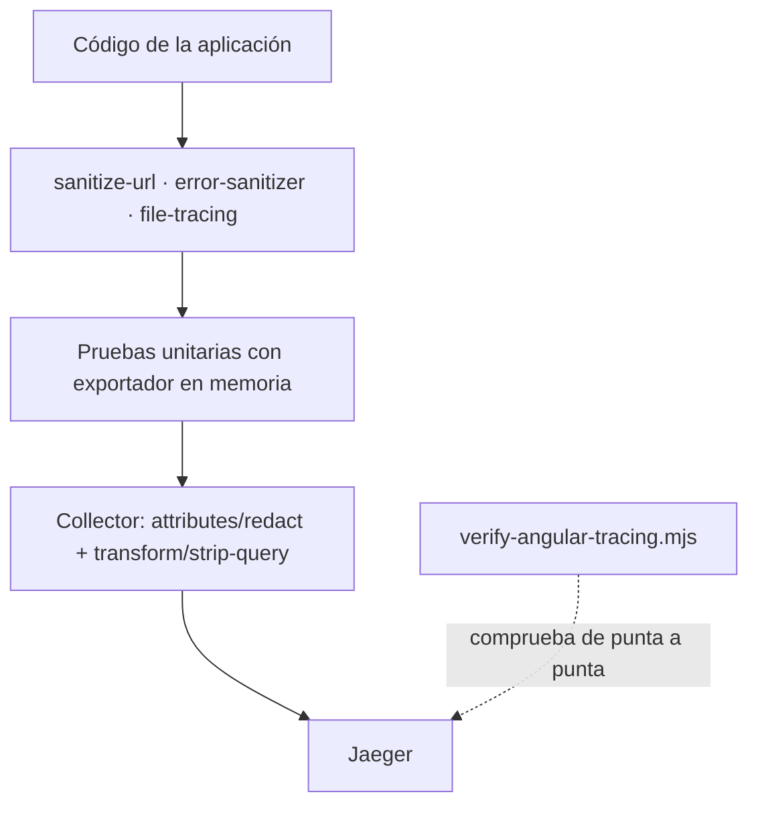

# Política de datos de la telemetría

Esto es un sistema de salud. La regla no es «tener cuidado con los atributos»:
es que **lo que no se puede demostrar que no lleva datos de salud, no viaja**.

Es la misma frase que ya estaba escrita en `core/errors/error-reporter.ts` antes
de que existiera ninguna telemetría. Esta página la desarrolla y dice quién la
hace cumplir en cada punto.

---

## 1 · Qué puede viajar

Todo lo permitido cae en una de tres formas: **una categoría de una lista
cerrada**, **un número**, o **una plantilla de ruta**.

| Categoría | Ejemplos | Por qué es seguro |
|---|---|---|
| Identidad del artefacto | `service.name`, `service.version`, `app.build.id` | Describe el código, no a nadie |
| Entorno | `deployment.environment.name`, `angular.rendering.mode` | Ídem |
| Plantilla de ruta | `/auth/verificar`, `/pacientes/:pacienteId` | Sin query, sin identificadores |
| Método y estado HTTP | `GET`, `200`, `500` | No describe contenido |
| Clase de error | `TypeError`, `ChunkLoadError`, `network_error` | Agrupa sin identificar |
| Resultado | `success`, `error`, `cancelled`, `denied` | Lista cerrada |
| Categoría de fallo de auth | `invalid_credentials`, `rate_limited` | Lista cerrada de siete |
| Recuentos | `validation.error.count` | Un número |
| Cubetas de tamaño | `0-1MB`, `5-20MB` | Ver §4 |
| Nombre de formulario | `login`, `register-patient` | Fijo en el código |
| Nombre de guard | `authGuard` | Ídem |
| Extensión de archivo | `pdf`, `dcm` | **Solo de lista blanca**; ver §4 |
| Código de soporte | `E-abc1234-007` | Ya se muestra a la persona; no la identifica |

---

## 2 · Qué no puede viajar, nunca

Contraseñas · códigos MFA · access token · refresh token · cookies · cabecera
`Authorization` · cabecera `X-Tenant-Id` · claims del JWT (`sub`, `sid`,
tenants) · correos · teléfonos · documentos de identidad · nombres de persona ·
direcciones · diagnósticos · historias clínicas · datos bancarios · tarjetas ·
comentarios · mensajes privados · cuerpos de petición · cuerpos de respuesta ·
HTML · valores de formulario · `form.value` · `getRawValue()` · valores de
signals · estado global · trazas de pila · query strings · URLs firmadas ·
nombres de archivo · contenido de archivos · metadatos EXIF · pulsaciones de
teclado · texto copiado o pegado · geolocalización · huella del dispositivo.

---

## 3 · Los tres casos concretos de este repositorio

No son ejemplos de manual. Son las tres cosas que en este código habrían
filtrado datos si nadie hubiera mirado.

### 3.1 · El token del correo va en el query string

```
/auth/verificar?token=eyJhbGciOiJIUzI1NiJ9…
/auth/nueva-clave?token=…
```

Si la URL entrara entera en un atributo, **esa credencial quedaría guardada en
Jaeger**, legible por quien tenga acceso al panel, durante todo el tiempo de
retención — y seguiría sirviendo para verificar el correo o cambiar la
contraseña de esa persona.

**Quién lo impide:** `privacy/sanitize-url.ts` descarta el query string entero.
No hay lista de parámetros permitidos, porque una lista así envejece mal: el
parámetro que alguien agregue mañana no estará en ella.

**Segunda red:** el Collector borra `url.full`, `url.query` y `http.url`, y
recorta cualquier `?` que sobreviva en `url.path` o `app.route.template`.

**Prueba que lo fija:** `sanitize-url.spec.ts` y `tracing.interceptor.spec.ts`.
Y en la cadena real, `scripts/verify-angular-tracing.mjs` manda un atributo
envenenado a propósito y comprueba que Jaeger no lo tiene.

### 3.2 · El nombre del archivo lleva el diagnóstico

En este sistema la gente sube archivos llamados
`analisis-ana-perez-marzo.pdf` o `receta-diabetes.jpg`. Ese solo texto contiene
un nombre completo y un diagnóstico.

**Quién lo impide:** `business/file-tracing.ts` no devuelve el nombre. Ni
recortado, ni convertido a hash — un hash es reversible contra una lista de
nombres probables, y aunque no lo fuera permitiría reconocer que el mismo
archivo se subió dos veces, que ya es información.

**Y una lección aprendida durante esta implementación:** la primera versión
tomaba lo que hubiera después del último punto. Una prueba la tumbó con
`informe.de.ana.perez`, que daba `perez` como «extensión» — un apellido
publicado en un span. Ahora hay lista blanca, y lo que no está en ella sale como
`otra`.

### 3.3 · La traza de pila lleva valores de plantilla

Una traza de pila de Angular contiene valores interpolados de plantillas,
argumentos de funciones y, en un formulario, lo que la persona escribió.

**Quién lo impide:** `errors/error-sanitizer.ts`, y una decisión explícita de
**no usar `span.recordException`** —que es lo que recomienda la documentación de
OpenTelemetry— porque registra `exception.stacktrace`. Del error salen dos
cosas: la clase y un mensaje saneado y recortado.

`ErrorTelemetry` es quien aplica esto; `ErrorDeduplicator` evita además que el
mismo fallo se cuente cinco veces por llegar por cinco caminos.

---

## 4 · Por qué cubetas y no valores exactos

Un tamaño de archivo exacto es casi un identificador: cruzado con la hora,
distingue una subida concreta entre miles. La cubeta (`0-1MB`, `1-5MB`, …)
responde igual de bien la única pregunta que interesa —«¿fallan los grandes?»—
sin señalar a nadie.

El mismo razonamiento vale para `validation.error.count`: saber que fallaron
tres campos detecta un formulario que la gente no consigue completar; saber
**cuáles** empieza a describir a quien lo estaba rellenando.

---

## 5 · Quién lo hace cumplir, en orden



1. **El código no recoge lo prohibido.** Es la única defensa que evita que el
   dato exista.
2. **Las pruebas lo fijan.** Nueve especificaciones afirman explícitamente qué
   *no* aparece.
3. **El Collector vuelve a borrar.** No por desconfianza del cliente: un paquete
   desplegado vive en los navegadores durante días después de corregir un error,
   y aquí el arreglo entra en el siguiente reinicio.
4. **La verificación de extremo a extremo lo comprueba.** Con un atributo
   envenenado a propósito.

---

## 6 · Retención, acceso y consentimiento

Las tres cosas que este repositorio **no** puede decidir solo, y que hay que
fijar antes de encender esto en producción:

| Punto | Estado | Quién decide |
|---|---|---|
| Retención en Jaeger | Sin definir | Operación. Recomendación: 7 días en producción |
| Acceso al panel de Jaeger | Sin definir | Seguridad. En desarrollo no hay autenticación |
| Base legal / consentimiento | Sin definir | Legal, junto al resto del tratamiento |
| Auditoría de accesos al panel | Sin definir | Operación |

Lo que sí está resuelto y es la razón de que este trabajo se pudiera hacer:
**los datos no salen de la organización.** El navegador manda al mismo origen,
el servidor de la aplicación reenvía a un Collector propio y de ahí van a un
Jaeger propio. Ningún proveedor externo ve nada, que era exactamente el reparo
escrito en `error-reporter.ts` cuando se decidió no elegir destino remoto.

---

## 7 · Ante un incidente de privacidad

Si se descubre que un atributo con datos personales está llegando a Jaeger:

1. **Cortarlo en el Collector**, que es lo único que se arregla en minutos:
   añadir el atributo a `attributes/redact` y reiniciar. El paquete desplegado
   seguirá emitiéndolo durante días; el Collector deja de guardarlo hoy.
2. **Borrar lo guardado.** Con almacenamiento en memoria, reiniciar Jaeger
   basta. Con un almacenamiento real, hay que borrar por rango de tiempo.
3. **Corregir el origen** en el código y desplegar.
4. **Añadir la prueba** que lo habría detectado. Sin ella, el arreglo se
   deshace en el siguiente cambio.
5. **Registrarlo** siguiendo `docs/security/incident-response.md`.

Siguiente: [07-operations-runbook.md](07-operations-runbook.md).
