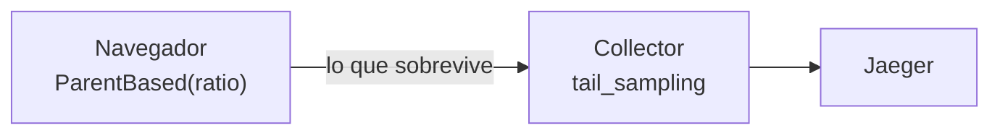

# Runbook de la telemetría

Cómo se enciende, cómo se apaga, y qué hacer cuando algo no aparece.

---

## 1 · Encenderla en local

```bash
docker compose -f infra/otel-collector/docker-compose.observability.yml up -d
echo 'PUBLIC_TELEMETRY_ENABLED=true' >> .env
yarn start
```

Jaeger queda en <http://localhost:16686>. El servicio a buscar es
`mantra-angular-web`.

Para incluir el servidor de renderizado:

```bash
OTEL_SSR_ENABLED=true \
OTEL_EXPORTER_OTLP_ENDPOINT=http://localhost:4318 \
node dist/mantra-core-health/server/server.mjs
```

Y para comprobar que la cadena entera funciona sin abrir el navegador:

```bash
node scripts/verify-angular-tracing.mjs
```

Comprueba que Jaeger y el Collector responden, manda un lote OTLP real, espera a
que atraviese la tubería, confirma que la traza llegó y **verifica que el
saneado funcionó** —manda un atributo con un token en el query string a
propósito y comprueba que Jaeger no lo tiene—.

---

## 2 · Apagarla

`PUBLIC_TELEMETRY_ENABLED=false`, que es el valor por defecto. Eso significa,
literalmente:

- El fragmento del SDK **no se descarga**.
- No se abre ni un span.
- No sale ni una petición de telemetría.
- El interceptor devuelve `next(request)` sin tocar nada.
- `provideObservability()` no engancha el Router ni la estabilidad.
- `ErrorTelemetry.report()` sale en la primera línea.

Para el servidor, `OTEL_SSR_ENABLED=false`: además de no trazar, **el endpoint
`/otel/v1/traces` deja de existir**.

---

## 3 · Variables

### Del navegador (públicas, se empaquetan)

| Variable | Por defecto | Qué hace |
|---|---|---|
| `PUBLIC_TELEMETRY_ENABLED` | `false` | El interruptor |
| `PUBLIC_TELEMETRY_TRACES_ENDPOINT` | `/otel/v1/traces` | A dónde manda el navegador |
| `PUBLIC_TELEMETRY_SAMPLE_RATIO` | `0.1` prod · `1` dev | Proporción conservada |
| `PUBLIC_TELEMETRY_SERVICE_NAME` | `mantra-angular-web` | Cómo aparece en Jaeger |
| `PUBLIC_TELEMETRY_NAMESPACE` | `mantra` | Agrupación |
| `PUBLIC_TELEMETRY_ENVIRONMENT` | `production` / `development` | `deployment.environment.name` |

Todas se empaquetan en el JavaScript que descarga cualquiera. **Ninguna es un
secreto y ninguna puede serlo**: `scripts/generate-env.mjs` rechaza los nombres
y valores con forma de credencial.

### Del servidor (no se empaquetan)

| Variable | Por defecto | Qué hace |
|---|---|---|
| `OTEL_SSR_ENABLED` | `false` | El interruptor del servidor |
| `OTEL_EXPORTER_OTLP_ENDPOINT` | `http://localhost:4318` | Raíz del Collector |
| `OTEL_SSR_SAMPLE_RATIO` | `0.1` | Proporción del servidor |
| `OTEL_SSR_SERVICE_NAME` | `mantra-angular-ssr` | Distinto del navegador, a propósito |

---

## 4 · Qué hay que hacer distinto en producción

El compose de `infra/otel-collector/` **es de desarrollo**. Jaeger guarda en
memoria, no hay autenticación y no hay TLS. Antes de encender esto en
producción:

| Punto | Qué hacer |
|---|---|
| Publicación del Collector | **No publicarlo.** Red interna; el único que le habla es el servidor de la aplicación |
| Almacenamiento de Jaeger | Uno real (Elasticsearch, Cassandra o el que use la organización) |
| Acceso al panel de Jaeger | Detrás de autenticación. Contiene rutas visitadas, y la sección visitada ya es información de salud |
| Retención | Definirla. Recomendación de partida: 7 días |
| Límite de tasa en `/otel/v1/traces` | En el balanceador o el WAF. El endpoint no está autenticado y no puede estarlo |
| TLS | Extremo a extremo |
| `PUBLIC_TELEMETRY_SAMPLE_RATIO` | Empezar en `0.1` y ajustar con volumen medido |

El endpoint ya rechaza barato lo que puede: método distinto de POST (405), tipo
de contenido que no sea JSON (415) y cuerpos de más de 512 kB (413), contando
los bytes que llegan de verdad y no fiándose de `Content-Length`.

---

## 5 · Diagnóstico

### No veo ninguna traza en Jaeger

En este orden, que es el de menor a mayor esfuerzo:

1. **¿Está encendida?** `PUBLIC_TELEMETRY_ENABLED=true` en el `.env` **y**
   `yarn start` reejecutado — el valor se compila dentro del paquete.
2. **¿Se descargó el fragmento?** En la pestaña de red, buscar
   `telemetry-browser-bootstrap`. Si no aparece, la telemetría está apagada o un
   bloqueador de contenido lo cortó.
3. **¿Sale el lote?** Un `POST` a `/otel/v1/traces` cada cinco segundos. Un 404
   significa que el servidor no registró el endpoint (`OTEL_SSR_ENABLED`), o que
   se está usando `ng serve` sin la entrada de proxy — comprobar
   `proxy.conf.json`.
4. **¿Llega al Collector?** `docker logs mantra-otel-collector`.
5. **¿Lo descartó el muestreo?** Es la causa más frecuente y la menos evidente.
   Ver §6.
6. **¿Llega a Jaeger?** `node scripts/verify-angular-tracing.mjs` aísla el tramo
   que falla.

### Veo trazas del servidor pero no del navegador

El servidor y el navegador son dos servicios distintos con dos interruptores
distintos. `OTEL_SSR_ENABLED` no enciende el navegador.

### La traza aparece partida en dos

Casi siempre es una de dos cosas, y las dos están documentadas:

- **Un refresco de sesión.** Ocurre dentro de un `catchError` asíncrono, donde
  el contexto ya no está activo. Ver
  [03-async-context-strategy.md](03-async-context-strategy.md), §4.
- **Un span abierto después de un `await`.** Mismo motivo. La solución es
  `runInChildSpan`.

### El backend no continúa la traza

1. Comprobar que la petición lleva `traceparent`. Si no, el destino no está en
   la lista blanca de `http/propagation-allowlist.ts`.
2. Comprobar el CORS del backend: tiene que permitir `traceparent` y
   `tracestate` en `Access-Control-Allow-Headers`. Con la API en el mismo origen
   —lo recomendado— no hay preflight y esto no aplica.
3. Comprobar que el backend usa propagación W3C, no B3.

### El navegador bloquea el envío

Si `connect-src` de la política de seguridad de contenido no permite el destino.
Con el endpoint de mismo origen —el valor por defecto— `connect-src 'self'`
alcanza y no hay nada que tocar. Solo apuntando a otro origen hay que abrirla en
`src/server/security-headers.ts`; el generador de entorno avisa por consola
cuando se configura así.

---

## 6 · El muestreo, que es lo que más confunde

Hay **dos** filtros, y una traza tiene que pasar los dos:



1. **En el navegador**, por cabeza: se decide al empezar la traza, sin saber
   todavía si va a fallar. Con `PUBLIC_TELEMETRY_SAMPLE_RATIO=0.1`, nueve de
   cada diez trazas no llegan a existir.
2. **En el Collector**, por cola: ya ve la traza completa. Conserva **siempre**
   los errores, lo que pasa de dos segundos y los fallos de carga de fragmento;
   del resto, un 10 %.

La consecuencia práctica: **una operación rápida y correcta tiene pocas
probabilidades de aparecer.** Es el diseño, no un fallo. Para depurar algo
concreto, subir `PUBLIC_TELEMETRY_SAMPLE_RATIO` a 1 en local.

Es también el motivo de que `scripts/verify-angular-tracing.mjs` emita un span
de tres segundos: cae en la política de latencia y se conserva siempre. Con un
span rápido, la verificación fallaría nueve de cada diez veces sin que nada
estuviera roto, y una comprobación intermitente es peor que ninguna.

---

## 7 · Qué hacer si la telemetría causa un problema

Está diseñada para no poder causarlo —el Collector caído no produce nada
visible, el fragmento que no baja tampoco— pero si aparece algo:

1. **`PUBLIC_TELEMETRY_ENABLED=false` y desplegar.** Vuelve al comportamiento
   anterior por completo.
2. Si no se puede desplegar rápido, **apagar el Collector**. La aplicación sigue
   funcionando: los lotes fallan en silencio y la cola se descarta al llegar a
   256 spans.
3. `OTEL_SSR_ENABLED=false` y reiniciar el servidor, que además retira el
   endpoint.

---

## 8 · Lo que esta implementación no cubre

Escrito acá para que no se descubra en un incidente:

| Qué | Estado |
|---|---|
| Web Vitals (LCP, INP, CLS) | No se recogen. Ver [05-web-vitals-strategy.md](05-web-vitals-strategy.md) |
| Service Worker / PWA | No aplica: el proyecto no tiene |
| WebSockets / SSE | No aplican: el proyecto no tiene |
| Resolvers | No aplican: no hay ninguno declarado |
| Estado global (NgRx) | No aplica: el proyecto no lo usa |
| Pruebas E2E automatizadas | No hay corredor instalado. La verificación es `scripts/verify-angular-tracing.mjs` |
| Llamadas salientes del SSR | El span del render no las desglosa: la instrumentación del servidor es manual |
| Prerenderizado | No produce trazas: ocurre en el build |
| Formularios distintos de `login` | Emiten `auth.*` desde el servicio, pero todavía no `angular.form.submit`. La receta está en [04-rxjs-tracing-guidelines.md](04-rxjs-tracing-guidelines.md), §6 |
