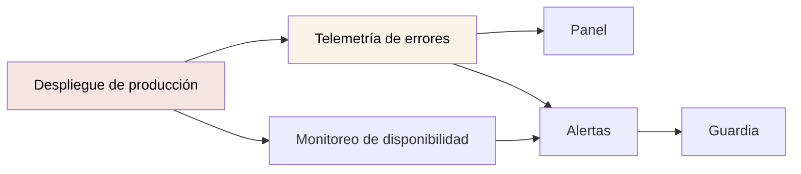

# Paneles y alertas

**No existen.** Y no pueden existir todavía: no hay ni telemetría que mostrar ni
despliegue que vigilar.

---

## Estado

| Elemento | Estado | Bloqueado por |
|---|---|---|
| Panel de métricas | No existe | Falta telemetría |
| Alertas | No existe | Falta telemetría |
| Monitoreo de disponibilidad | No existe | **Falta despliegue** |
| Página de estado | No existe | Ídem |
| Guardia | No definida | — |

## La cadena de dependencias

**Nada de lo de la derecha tiene sentido sin lo de la izquierda.** Por eso el
despliegue es `BLOCKER` y esto es `HIGH` dependiente.

## Lo que habría que vigilar, cuando se pueda

### Disponibilidad — lo primero, y no necesita telemetría

Un monitor externo que pida `/auth` cada minuto ya diría si la aplicación está en
pie. **No requiere instrumentar nada**: solo que exista una URL.

| Alerta | Umbral |
|---|---|
| La aplicación no responde | 2 fallos consecutivos |
| Respuesta > 3 s | 5 minutos sostenidos |

### Errores — el mayor valor por unidad de esfuerzo

| Alerta | Umbral propuesto | Qué significa |
|---|---|---|
| **Pico de S8** | > línea base × 3 en 15 min | **La API no responde para los usuarios** |
| Pico de S9 | > línea base × 3 en 15 min | Fallo del servidor o contrato roto |
| Pantallas en blanco | Cualquiera | Fallo de render: hoy invisible |
| `chunk_fallido` | > 5 en 15 min | Despliegue con clientes en caché vieja |
| Pico de S4 en el login | > línea base × 5 | Posible ataque de fuerza bruta, o un cambio de contrato |

**El pico de S8 es la alerta más importante de la lista**, y hoy es exactamente
lo que nadie detecta.

### Rendimiento

| Alerta | Umbral |
|---|---|
| LCP p75 | > 2,5 s |
| INP p75 | > 200 ms |
| CLS p75 | > 0,1 |

**A fijar con datos, no antes.** Copiar los umbrales de Google sin haber medido
produce alertas que nadie cree.

### Build y entrega

| Alerta | Umbral | Ya medible |
|---|---|---|
| Paquete inicial | > 550 kB | **Sí**, en cada build |
| Tiempo de build | > 30 s | Sí (~5–10 s hoy) |
| Tiempo de pruebas | > 60 s | Sí (~10–19 s hoy) |
| Despliegue fallido | Cualquiera | No hay despliegue |

Las tres primeras **se pueden vigilar hoy** en cuanto exista un pipeline, sin
nada más.

## Panel propuesto

Cuatro secciones, en orden de lo que se mira primero:

| Sección | Contenido |
|---|---|
| **Salud** | ¿Responde? Errores por minuto por código del M34 |
| **Uso** | Sesiones activas, inicios de sesión, registros |
| **Rendimiento** | LCP / INP / CLS p75, tamaño del paquete por versión |
| **Calidad** | Cobertura, resultado de la última batería, hallazgos de accesibilidad abiertos |

La cuarta sección no es de observabilidad en sentido estricto, pero es la que
conecta el panel con
[las métricas de calidad](../governance/documentation-policy.md#métricas) y hace
que alguien las mire.

## Guardia

**No hay dueño de guardia definido.** [Propiedad](../governance/ownership.md)
registra que tampoco hay `CODEOWNERS`.

Antes de que las alertas sirvan hay que responder:

1. ¿Quién las recibe?
2. ¿En qué horario?
3. ¿Qué severidad justifica despertar a alguien?
4. ¿Cuál es la ruta de escalamiento al equipo de la API? La mitad de los
   incidentes del frontend van a ser del backend.

La cuarta es la más concreta: **un pico de S8 es un incidente de la API**, y la
alerta debería llegarle a quien pueda arreglarlo.

## Orden recomendado

1. **Monitoreo externo de disponibilidad.** No necesita instrumentar nada; solo
   una URL.
2. **Telemetría de errores** — ver
   [reporte de errores](error-reporting.md).
3. **Alertas de S8 y S9.**
4. **Presupuestos y tiempos en el pipeline.** Ya son medibles.
5. **Web Vitals de campo**, después de la decisión de privacidad.
6. **Panel**, cuando haya datos que mostrar.

El 1 y el 4 se pueden hacer sin ninguna decisión previa.

## Estado

`HIGH`, dependiente del `BLOCKER` de
[despliegue](../operations/deployment.md). Registrado en
[el análisis de brechas](../reports/documentation-gap-analysis.md).
