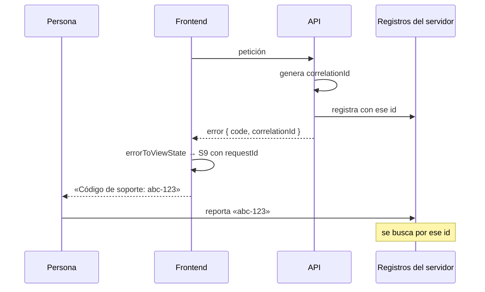

# Trazabilidad y correlación

No hay trazado distribuido. Hay **una** pieza de correlación, y está bien
resuelta: el identificador de petición.

---

## Lo que existe

```ts
/** El identificador que conecta el reporte de la persona con los registros. */
function correlationOf(error: HttpErrorResponse, body: ApiErrorBody | null): string {
  return body?.correlationId ?? error.headers.get('x-request-id') ?? 'sin-id';
}
```

Tres fuentes, en orden de preferencia:

| Fuente | De dónde |
|---|---|
| `body.correlationId` | El cuerpo de error del contrato de la API |
| Cabecera `x-request-id` | Cuando el cuerpo no lo trae |
| `'sin-id'` | Cuando no hay ninguno — y aun así el estado se puede construir |

### El tipo lo hace obligatorio

```ts
export interface UnexpectedErrorViewState {
  readonly status: 'error';
  readonly requestId: string;   // ← no opcional
  readonly message?: string;
}
```

> *«El identificador es obligatorio: sin él, quien reporta el problema y quien lo
> busca en los registros no tienen cómo encontrarse.»*

**Un S9 sin identificador no compila.** Y en desarrollo hay además un aviso si
llegara vacío por otra vía.

### Y se muestra, copiable

```html
Código de soporte: <code class="tabular-nums">{{ fallo.requestId }}</code>
<button app-button size="sm" variant="outline" (clicked)="copyRequestId()">Copiar código</button>
```

Con degradación pensada:

> *«Si el navegador no deja [copiar] (contexto no seguro), el id sigue visible y
> seleccionable: copiar es comodidad, verlo es el requisito.»*

Y `.tabular-nums` para que las cifras se lean bien al dictarlo por teléfono.

## El flujo de correlación completo



**El eslabón humano es intencional**: la persona lleva el identificador. Funciona,
y es lo que hay hasta que exista telemetría.

## Lo que no hay

| Elemento | Estado |
|---|---|
| Trazado distribuido (OpenTelemetry, W3C `traceparent`) | No existe |
| Identificador generado en el cliente | **No.** Siempre viene del servidor |
| Correlación entre navegación y peticiones | No existe |
| Identificador de sesión en las peticiones | El token trae `sid`, pero **no se envía como cabecera propia** |
| Envío del identificador a un servicio de errores | No existe: no hay servicio |
| Correlación de un fallo de render | **Imposible**: no hubo petición |

### El límite estructural

**Un fallo que no es de red no tiene identificador.** Una pantalla en blanco por
una excepción en un `computed` no produce ninguno, porque nunca hubo una petición
que numerar.

Es la otra cara de
[error boundaries](../architecture/error-boundaries.md#el-código-de-soporte):
`AppErrorHandler` genera un identificador de cliente —`E-<commit>-<n>`— justo
para esos casos.

## Propuesta

### 1 · Identificador de cliente para los fallos sin petición

Un identificador generado en el cliente, mostrado en la pantalla de recuperación,
y enviado con el error cuando exista telemetría. Cierra el único hueco
estructural de la correlación actual.

### 2 · Propagar `traceparent`

Si la API adopta W3C Trace Context, el interceptor podría propagar la cabecera y
la traza cubriría el frontend además del backend.

**Hoy no aplica:** la API no lo pide, y añadir una cabecera que nadie lee no
aporta nada.

### 3 · Enviar el `sid` como contexto

El token ya trae `sid` (identificador de sesión, *«para poder cerrarla del lado
del servidor»*). Como contexto de un registro de error sería útil para agrupar
todo lo que le pasó a una misma sesión.

**No como cabecera de cada petición**: el servidor ya lo tiene en el token.

## Estado

**No es una brecha bloqueante.** La correlación de errores de API está resuelta y
bien; lo que falta —trazado distribuido, correlación de fallos de render— depende
de decisiones que no son de este repositorio (que la API adopte OTel) o de que
exista telemetría.

Registrado como `MEDIUM` en
[el análisis de brechas](../reports/documentation-gap-analysis.md).
