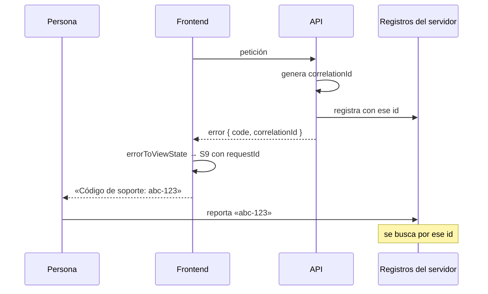
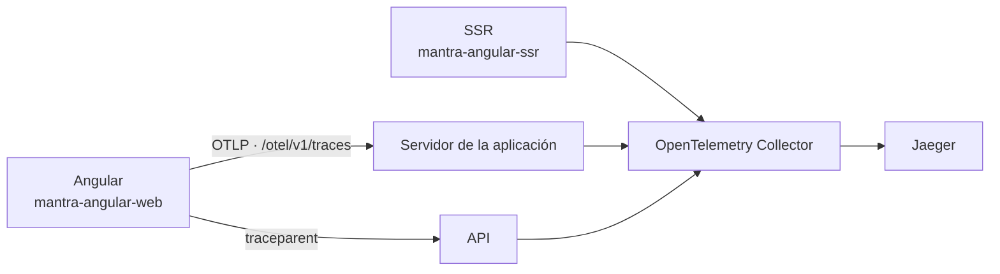

# Trazabilidad y correlación

Dos piezas, y se complementan: el **identificador de petición** que la persona
puede dictar por teléfono, y el **trazado distribuido** que reconstruye qué pasó
por dentro.

La primera es la que existía y sigue mandando en lo que se le muestra a la
gente. La segunda es la que cierra el hueco que esta misma página tenía marcado
como estructural — un fallo de render no tenía identificador porque nunca hubo
una petición que numerar—.

---

## Lo que existe

```ts
/** El identificador que conecta el reporte de la persona con los registros. */
function correlationOf(error: HttpErrorResponse, body: ApiErrorBody | null): string {
  return body?.correlationId ?? error.headers.get('x-request-id') ?? 'sin-id';
}
```

Tres fuentes, en orden de preferencia:

| Fuente | De dónde |
|---|---|
| `body.correlationId` | El cuerpo de error del contrato de la API |
| Cabecera `x-request-id` | Cuando el cuerpo no lo trae |
| `'sin-id'` | Cuando no hay ninguno — y aun así el estado se puede construir |

### El tipo lo hace obligatorio

```ts
export interface UnexpectedErrorViewState {
  readonly status: 'error';
  readonly requestId: string;   // ← no opcional
  readonly message?: string;
}
```

> *«El identificador es obligatorio: sin él, quien reporta el problema y quien lo
> busca en los registros no tienen cómo encontrarse.»*

**Un S9 sin identificador no compila.** Y en desarrollo hay además un aviso si
llegara vacío por otra vía.

### Y se muestra, copiable

```html
Código de soporte: <code class="tabular-nums">{{ fallo.requestId }}</code>
<button app-button size="sm" variant="outline" (clicked)="copyRequestId()">Copiar código</button>
```

Con degradación pensada:

> *«Si el navegador no deja [copiar] (contexto no seguro), el id sigue visible y
> seleccionable: copiar es comodidad, verlo es el requisito.»*

Y `.tabular-nums` para que las cifras se lean bien al dictarlo por teléfono.

## El flujo de correlación completo



**El eslabón humano es intencional**: la persona lleva el identificador. Funciona,
y es lo que hay hasta que exista telemetría.

## Trazado distribuido: ahora existe

El eslabón humano descrito arriba sigue funcionando y no se ha tocado. Lo que se
añadió es lo que faltaba debajo: **OpenTelemetry en el navegador y en el
servidor de renderizado, exportando por OTLP a un Collector propio y de ahí a
Jaeger.**



| Elemento | Estado |
|---|---|
| Trazado distribuido (OpenTelemetry, W3C `traceparent`) | **Existe** |
| Identificador generado en el cliente | **No.** Lo genera el SDK; nunca se arma a mano |
| Correlación entre navegación y peticiones | **Existe**: `angular.navigation` es padre de `angular.http.request` |
| Correlación de un fallo de render | **Existe**: `angular.error`, con el código de soporte como atributo |
| Envío a un servicio de errores | Destino **propio**, del mismo origen. Ningún tercero |
| Identificador de sesión en las peticiones | Sigue sin enviarse, y a propósito |

### El hueco estructural quedó cerrado

Lo que esta página describía como *«imposible: no hubo petición»* —un fallo de
render sin identificador de correlación— tiene ahora respuesta.
`ErrorTelemetry` abre una traza propia cuando no hay ninguna activa y le pone el
mismo código de soporte (`E-<commit>-<n>`) que `ErrorReporter` muestra a la
persona. Quien recibe la llamada busca ese código y encuentra qué pasó.

`ErrorDeduplicator` evita además que el mismo fallo se cuente cinco veces por
llegar por cinco caminos distintos.

### Qué se instrumentó

| Punto | Span | Servicio |
|---|---|---|
| Arranque | `angular.bootstrap` | — |
| Carga del documento | `angular.document.load` | — |
| Navegación, guards y fragmentos diferidos | `angular.navigation`, `angular.guard.evaluate`, `angular.lazy-route.load` | `RouterTracing` |
| Estabilidad e hidratación | `angular.hydration` | `AppStabilityTracing` |
| Peticiones de `HttpClient` | `angular.http.request` | `tracingInterceptor` |
| Envío de formulario | `angular.form.submit` | `FormTracing` |
| Operaciones de negocio | `auth.login`, `document.upload` | `TracingService` |
| Render en el servidor | `ssr.render` | Middleware de Express |

### Lo que sigue valiendo de esta página

**El `correlationId` de la API no se sustituye.** Sigue siendo la fuente
preferida del código de soporte que ve la persona, y el interceptor de trazas
**no lee el cuerpo de la respuesta** —podría citar el valor que falló—, así que
las dos piezas conviven sin pisarse.

### Documentación completa

La decisión de arquitectura, las convenciones de nombres, la estrategia de
contexto sin Zone.js, la política de datos y el runbook están en
[la sección de trazas distribuidas](angular/00-current-state-audit.md).

## Lo que sigue sin haber

| Elemento | Estado |
|---|---|
| Web Vitals (LCP, INP, CLS) | No se recogen: exigen métricas, no trazas |
| Pruebas E2E automatizadas de la traza | No hay corredor instalado; hay `scripts/verify-angular-tracing.mjs` |
| Desglose de llamadas salientes del SSR | La instrumentación del servidor es manual |
| Retención y control de acceso de Jaeger | Decisión de operación, sin fijar |

## Historial — el diagnóstico anterior

Lo que sigue **describe el estado previo** a la implementación y se conserva
porque explica de dónde salió cada decisión: qué faltaba, qué se propuso y por
qué se eligió lo que se eligió. Las tres propuestas del final están hoy
resueltas.

> **Nada de esta sección describe el estado actual.** Para eso, lo de arriba.

## Lo que no había

| Elemento | Estado |
|---|---|
| Trazado distribuido (OpenTelemetry, W3C `traceparent`) | No existe |
| Identificador generado en el cliente | **No.** Siempre viene del servidor |
| Correlación entre navegación y peticiones | No existe |
| Identificador de sesión en las peticiones | El token trae `sid`, pero **no se envía como cabecera propia** |
| Envío del identificador a un servicio de errores | No existe: no hay servicio |
| Correlación de un fallo de render | **Imposible**: no hubo petición |

### El límite estructural

**Un fallo que no es de red no tiene identificador.** Una pantalla en blanco por
una excepción en un `computed` no produce ninguno, porque nunca hubo una petición
que numerar.

Es la otra cara de
[error boundaries](../architecture/error-boundaries.md#el-código-de-soporte):
`AppErrorHandler` genera un identificador de cliente —`E-<commit>-<n>`— justo
para esos casos.

## Propuesta

### 1 · Identificador de cliente para los fallos sin petición

Un identificador generado en el cliente, mostrado en la pantalla de recuperación,
y enviado con el error cuando exista telemetría. Cierra el único hueco
estructural de la correlación actual.

### 2 · Propagar `traceparent`

Si la API adopta W3C Trace Context, el interceptor podría propagar la cabecera y
la traza cubriría el frontend además del backend.

**Hoy no aplica:** la API no lo pide, y añadir una cabecera que nadie lee no
aporta nada.

### 3 · Enviar el `sid` como contexto

El token ya trae `sid` (identificador de sesión, *«para poder cerrarla del lado
del servidor»*). Como contexto de un registro de error sería útil para agrupar
todo lo que le pasó a una misma sesión.

**No como cabecera de cada petición**: el servidor ya lo tiene en el token.

## Estado de entonces, y qué pasó con él

Se registró como `MEDIUM`: *«no es una brecha bloqueante»*, porque cerrarla
dependía de decisiones que no eran de este repositorio.

Resultó que dos de las tres sí lo eran. El identificador de cliente existe
(`E-<commit>-<n>`, y ahora viaja como atributo de la traza). El `traceparent` se
propaga, con lista blanca de destinos, sin esperar a que la API lo pidiera: la
cabecera es inocua para quien no la lee, y el día que la API adopte OTel la
traza se une sola. Solo la tercera —mandar el `sid`— sigue descartada, y por la
misma razón de siempre: es un identificador de sesión y no tiene por qué estar
en un panel de observabilidad.

Registrado como `MEDIUM` en
[el análisis de brechas](../reports/documentation-gap-analysis.md).
