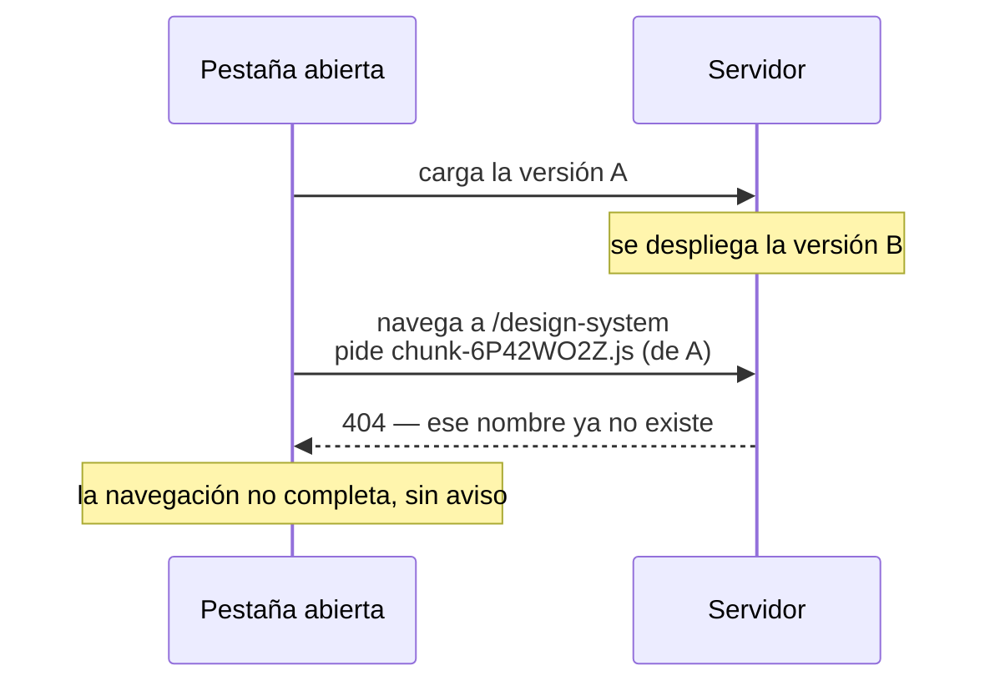

# Runbook 3 · Chunks desactualizados o fallidos

**Síntoma.** La navegación a `/design-system` no completa, o la consola muestra
`Failed to fetch dynamically imported module` / un 404 de un `.js`.

**Impacto.** Parcial. Afecta a quien tenía una pestaña abierta antes del
despliegue.
**Severidad.** S2.

---

## Por qué pasa, y por qué es seguro que pase

```json
"outputHashing": "all"
```

Cada archivo lleva su hash en el nombre. Un despliegue produce **nombres
nuevos**, y los viejos dejan de existir.



**No es un fallo: es la consecuencia esperada de tener hashes.** Lo que falta es
manejarlo.

Afecta a los dos fragmentos diferidos:

| Fragmento | Cuándo se pide |
|---|---|
| `design-system-sample` | Al entrar a `/design-system` |
| `toast-dev-panel` | Nunca: no está montado |

En la práctica, **solo `/design-system`**.

## Diagnóstico

### 1 · Confirmar el 404

```text
F12 → Red → filtrar por .js → buscar el 404
```

El nombre del archivo con hash **no coincide** con ninguno de los que hay en el
servidor.

### 2 · ¿Coincide con un despliegue?

```bash
ls -la dist/mantra-core-health/browser/*.js
```

Si el hash del 404 no está en la lista, es exactamente este caso.

### 3 · Descartar lo demás

| Alternativa | Cómo se distingue |
|---|---|
| El artefacto no se copió entero | Faltarían **todos** los chunks, no uno |
| Ruta base mal | Fallarían también los iniciales → [runbook 7](assets-no-disponibles.md) |
| CDN sin actualizar | El 404 vendría del borde, no del origen |

## Mitigación inmediata

**Recargar la página** (`Ctrl/Cmd+Shift+R`). Baja el `index.html` nuevo, que
apunta a los chunks nuevos.

Es la respuesta correcta y la única disponible hoy: **la aplicación no lo detecta
ni lo ofrece.**

## Mitigación de fondo

### 1 · Conservar los artefactos anteriores

Servir la unión de las dos últimas versiones. Un chunk viejo sigue existiendo, y
quien tenga la pestaña abierta termina su navegación sin ruptura.

Es la mitigación más efectiva y no toca el código.

### 2 · Detectar el fallo y ofrecer recargar

```ts
// PROPUESTA, no implementada
{
  path: 'design-system',
  loadComponent: () =>
    import('./features/design-system-sample/design-system-sample')
      .then((m) => m.DesignSystemSample)
      .catch(() => { /* mostrar «hay una versión nueva, recargá» */ }),
}
```

Convierte una navegación muerta en un mensaje accionable.

### 3 · Avisar de la versión nueva

Un mecanismo que compare la versión cargada con la desplegada y ofrezca recargar.
**Requiere que el artefacto tenga versión**, y hoy `version: "0.0.0"` sin
identificador de build.

## Evidencia

- [ ] El nombre exacto del archivo con 404
- [ ] Cuándo se cargó la pestaña vs. cuándo fue el despliegue
- [ ] `ls` de los chunks del servidor
- [ ] ¿Se resuelve recargando? (confirma el diagnóstico)

## Escalamiento

Frontend. **No es de la API.**

## Prevención

| # | Qué | Estado |
|---|---|---|
| 1 | Conservar los artefactos de las dos últimas versiones | No implementado |
| 2 | Manejar el fallo de `loadComponent` | No implementado |
| 3 | Versionar el artefacto | **No existe** (`HIGH`) |
| 4 | Telemetría del evento `chunk_fallido` | No existe |

Las cuatro están en
[el análisis de brechas](../../reports/documentation-gap-analysis.md). La 1 es
operativa y no toca código; la 2 son pocas líneas.
