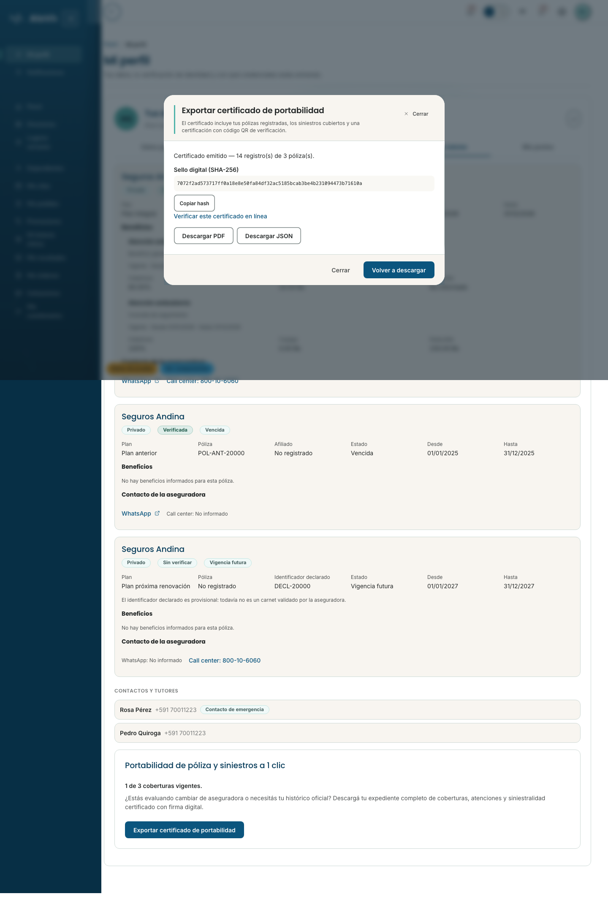
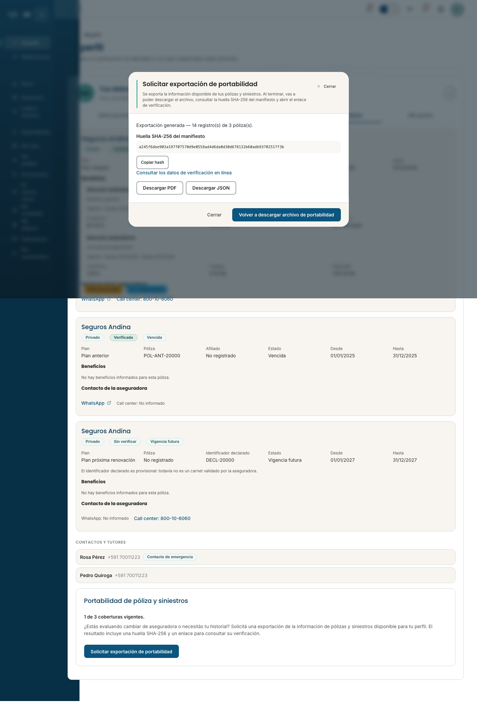
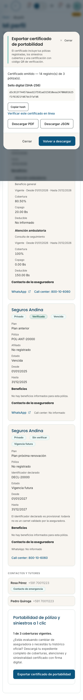
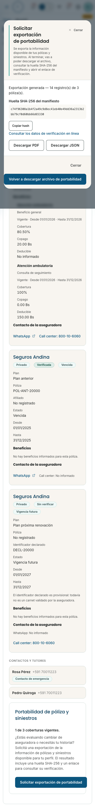

# Paciente–Aseguradora H6 — evidencia de portabilidad

Fuente funcional: `06_METAPROMPT_ASEGURADORA.md`, ID `RP-ASEG-L0503`. Este informe cubre solo la presentación de portabilidad en Paciente. No acredita exportación real, permisos de servidor, cobertura íntegra del expediente ni certificación legal.

Base `mockup`: `b11dfdd382dd787fab33d5894979ccc2c4d5a96a`. Rama de trabajo: `codex/patient-insurance-portability-20260924`.

La tarjeta y el diálogo ya no anuncian un expediente “completo”, “oficial” ni “con firma digital”. Describen la exportación de la información disponible, la huella SHA-256 del manifiesto y los datos disponibles para verificarla. El formato existente PDF con QR de verificación se conserva. No se modificaron API, modelo, CSS, `.env` ni `proxy.conf.json`.

## Capturas

Las cuatro capturas proceden de `playwright/carril-insurance-portability.spec.ts` en la misma base y con el mismo escenario simulado, antes y después del cambio.

| Viewport | Antes | Después |
|---|---|---|
| 1440×900 |  |  |
| 390×844 |  |  |

## Verificación

- `corepack yarn test --watch=false` — base: 583 archivos, 7.375 pruebas pasadas; cambio: 583 archivos, 7.377 pruebas pasadas.
- Tests dirigidos de tarjeta y diálogo — 19/19 pasaron.
- `corepack yarn pw playwright/carril-insurance-portability.spec.ts --workers=1 --reporter=list` — 8/8 pasaron; descarga PDF/JSON, consulta de verificación, teclado y reflow a 1440×900 y 390×844.
- `corepack yarn typecheck` — pasó.
- `corepack yarn build` — pasó; avisos existentes de prerender/CommonJS.
- ESLint de los archivos TypeScript tocados — pasó.
- `corepack yarn lint` — no pasa en la base completa: 246 errores `prefer-on-push-component-change-detection` en archivos ajenos al diff.
- `playwright/carril-19-route-health.spec.ts` — no ejecutado; `localhost:3005/health` rechazó conexión.

La primera repetición del E2E midió una vez 39 px para el selector frente a 40 px en escritorio. La misma prueba pasó 8/8 en la base limpia, tres repeticiones de escritorio pasaron 3/3 y la repetición final completa pasó 8/8. No se alteró CSS ni se redujo el umbral.

No existe una ficha 31–40 asignada a este plan; no se eligió el carril 34 porque ya tiene rama y worktree propios. Por eso no se ejecutó `scripts/corr-evidencia.sh NN` ni se escribió en `lane-34`. Estas capturas y este informe son evidencia específica de H6, no un cierre de carril.

## Pendiente

Las decisiones por prestación, motivos emitidos por la aseguradora, persistencia/recarga, aislamiento entre titulares, origen de los datos del archivo y validez jurídica requieren contratos, API o revisión del propietario. Permanecen fuera de esta rama y el plan completo sigue **A MEDIAS**.
