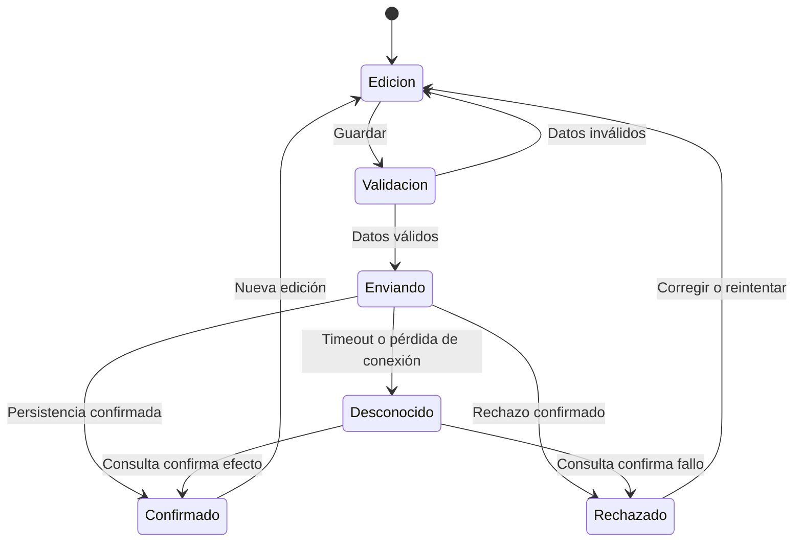

# Estados de producto e interacción completa

## Separar dimensiones

Un estado visual no reemplaza el estado de la operación. “Hover”, “focus” y “pressed” describen interacción; “loading”, “success” y “error” describen actividad; “selected”, “disabled” y “read-only” describen condiciones. Pueden combinarse. Un control enfocado y ocupado necesita una representación coherente, no estilos que se anulen accidentalmente.

## Modelo mínimo de lectura

| Estado | Qué ve la persona | Acción disponible | Invariante |
|---|---|---|---|
| Inicial | Contexto y espacio reservado apropiado | Navegar o cancelar si corresponde | No mostrar cifras inventadas |
| Cargando | Progreso proporcional a lo conocido | Conservar interacción no dependiente | No desplazar bruscamente contenido existente |
| Listo con datos | Contenido y herramientas | Actuar sobre datos reales | Metadatos y alcance comprensibles |
| Vacío inicial | Qué falta y cómo empezar | Crear o importar si tiene permiso | No confundir con error de API |
| Sin resultados | Filtros activos y explicación | Limpiar o modificar filtros | No afirmar que no existen datos |
| Error | Qué no pudo cargarse y recuperación | Reintentar o salir | No borrar silenciosamente datos útiles |
| Actualizando | Datos anteriores marcados según política | Usar datos si es seguro | Diferenciar estado fresco y obsoleto |
| Acceso restringido | Explicación apropiada al producto | Solicitar acceso si existe ese flujo | Backend mantiene autorización |

## Modelo de escritura

El diagrama no presupone que el backend soporte consulta de estado o idempotencia. Si no las ofrece, documentar la limitación, conservar el borrador y evitar un reintento automático que pueda duplicar efectos. Un cliente no puede garantizar exactamente una ejecución mediante un botón deshabilitado.

## Tabla de decisiones para escritura

| Situación | Respuesta correcta | Evitar |
|---|---|---|
| Falta un campo obligatorio | Error asociado y datos conservados | Borrar formulario o toast genérico |
| Operación en curso | Mensaje ocupado y prevención de duplicación local | Spinner infinito sin explicación |
| Confirmación real | Éxito contextual y siguiente paso | Mostrar éxito antes de confirmación |
| Timeout | Resultado no confirmado y recuperación segura | Tratarlo automáticamente como “no guardado” |
| Conflicto de versión | Comparar/revisar cambios y política de resolución | Sobrescribir silenciosamente a otra persona |
| Sesión vencida | Reautenticar con retorno y preservación permitida | Perder todo el trabajo sin advertencia |
| Permiso retirado | Detener acción y explicar alternativas | Confiar en que ocultar el botón autoriza backend |
| Error parcial de lote | Resumen de éxitos/fallos y reintento delimitado | Reenviar todo sin saber qué se ejecutó |

## Contratos de componentes relevantes

**Button:** nombre específico, semántica de acción, foco visible, `type` explícito dentro de formularios y respuesta ocupada. Decidir si ocupado conserva foco con `aria-disabled` y bloqueo lógico o usa `disabled`; documentar consecuencias. `aria-disabled` por sí solo no impide ejecutar eventos.

**FormField:** etiqueta visible, ID estable, ayuda y error asociados. No depende del placeholder. La UI muestra errores del cliente y del servidor en el lugar correcto. El valor se mantiene al fallar.

**SearchField:** alcance visible; política de búsqueda al enviar o durante escritura; control de solicitudes obsoletas. El debounce es un detalle de interacción, no una garantía de consistencia. Al limpiar, restituir el estado esperado y conservar el foco.

**Dialog:** título y propósito, decisión inicial de foco, contenido de fondo no interactivo, cierre acorde al riesgo y retorno al disparador o destino lógico. Si el disparador desaparece, elegir un destino estable. Un modal anidado requiere justificar su complejidad.

**Table:** encabezados semánticos, orden anunciado, selección explícita, acciones por fila y reglas de paginación. Aclarar si “seleccionar todo” significa página o universo filtrado. En móvil no ocultar columnas decisivas sin otra forma de consultarlas.

**Toast:** complemento breve; nunca único lugar para explicar un fallo que requiere corregir datos. Mensajes con acción no desaparecen antes de que puedan usarse razonablemente. Evitar anuncios duplicados en lector de pantalla.

## Microcopy

Usar verbo y objeto: “Guardar cambios”, “Eliminar borrador”, “Exportar resultados”. En errores comunicar problema y siguiente acción sin culpar al usuario. “No pudimos confirmar el guardado. Conservamos tus cambios” solo se usa si la conservación es real.

Para eliminación, indicar qué se elimina y si puede recuperarse. Para operaciones largas, mostrar progreso numérico solo si representa avance real; de lo contrario indicar el estado conocido. Una confirmación redundante en cada acción banal crea fatiga y debe evitarse.

## Datos y contenido extremo

Probar nombres de 1 y 200 caracteres, campos opcionales ausentes, cero resultados, una fila, muchas filas, números grandes y negativos válidos, fechas con zona horaria y traducciones extensas. Distinguir valor cero de dato no disponible. No usar `0` como reemplazo de un error de carga.

## Aceptación

Crear la matriz ruta × rol × estado aplicable. Marcar cada casilla implementada, probada, excluida o bloqueada. No exigir combinaciones imposibles, pero documentar por qué. Los escenarios críticos comprueban resultado persistido, no solo un mensaje de éxito.
