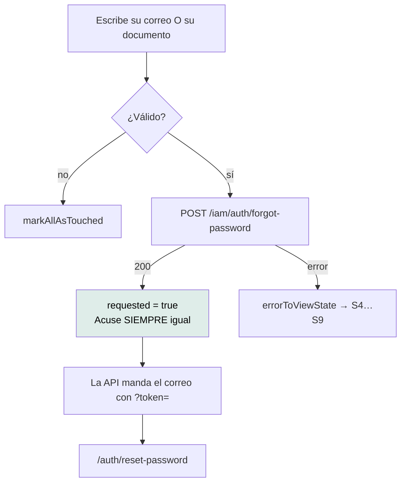

# `/auth/forgot-password` — Recuperar contraseña

`src/app/features/auth/forgot-password/forgot-password.ts` · `ForgotPassword` ·
`app-forgot-password`

---

## 1 · Propósito

Pedir el correo de recuperación. Es la primera mitad del flujo; la segunda es
[`/auth/reset-password`](auth-reset-password.md).

## 2 · Acceso y permisos

| Aspecto | Valor |
|---|---|
| Guard | Ninguno |
| Sesión | No requiere — quien olvidó su contraseña justamente no puede entrar |
| Render | **Prerender** |
| Título | «Mantra Core Health - Recuperar contraseña» |
| Se llega desde | El enlace «¿Olvidaste tu contraseña?» del login |

## 3 · Flujo



### Un solo campo, igual que en el login

El backend expone un único campo `identifier`, que acepta correo **o** documento.
La pantalla no intenta adivinar cuál es: lo manda tal cual, recortado.

## 4 · Estados de interfaz

| Estado | Cuándo | Qué se ve |
|---|---|---|
| Formulario | Al entrar | Un campo y un botón |
| S2 `loading` | Enviando | Botón en modo carga |
| Acuse (`requested`) | Tras un 200 | Reemplaza el formulario. **Mismo texto exista o no la cuenta** |
| S4 `validation` | Datos rechazados | `app-alert` |
| S8 / S9 | Red o servidor | Mensajes propios |

### El acuse es idéntico exista o no la cuenta

Es intencional del backend y hay que respetarlo en la interfaz. Decir «ese correo
no está registrado» convertiría esta pantalla en una forma de averiguar quién
tiene cuenta probando direcciones — una enumeración de usuarios.

El tipo lo refleja: `PasswordResetRequested` trae **solo** un `message`, sin
ningún indicio de si se encontró la cuenta.

## 5 · Contratos de datos

### `POST /iam/auth/forgot-password`

```jsonc
// petición
{ "identifier": "correo@ejemplo.com" }   // o el documento

// respuesta — siempre la misma
{ "message": "…" }
```

Ruta pública en el interceptor.

## 6 · Componentes

`AppButton` · `Input` · `Link` · `FormField` · `Alert` · `ReactiveFormsModule` ·
`RouterLink`

**No usa `AuthSplit`** — a diferencia del login y el registro, esta pantalla no
tiene la columna de marca. Es una inconsistencia visual entre pantallas del mismo
flujo; anotada como brecha `LOW`.

## 7 · Analítica

**Ninguna.** No se sabe cuántas recuperaciones se piden ni cuántas se completan.

## 8 · Accesibilidad

| Aspecto | Estado |
|---|---|
| `autocomplete` | `username` en el campo de identificador |
| Nombre accesible | Vía `FORM_CONTROL_CONTEXT` |
| `novalidate` | Sí |
| Acuse anunciado | **No.** Reemplaza el formulario sin mover el foco ni usar `aria-live` |

La última fila es la más relevante acá: el acuse es *toda* la respuesta que
recibe la persona, y un lector de pantalla puede no anunciarlo. Brecha `MEDIUM`.

## 9 · Pruebas

`forgot-password.spec.ts` — existe y pasa.

**Sin prueba E2E.** El flujo completo (pedido → correo → nueva clave) fue
verificado a mano contra la API viva por el equipo
(`PENDIENTES-BACKEND.md` §«La recuperación de contraseña llegó»), pero no hay
nada automatizado que lo cuide.

## 10 · Notas operativas

- **Prerenderizada**: un cambio exige `yarn build`.
- **El límite de peticiones es del backend.** Si alguien insiste, la API
  responde `RATE_LIMITED` y la pantalla muestra S4 con los segundos de espera
  (`retryAfterSeconds`, leído de la cabecera `Retry-After`).
- **El correo lo manda la API.** Que llegue o no es responsabilidad del otro
  repositorio; desde acá el acuse se muestra igual.
